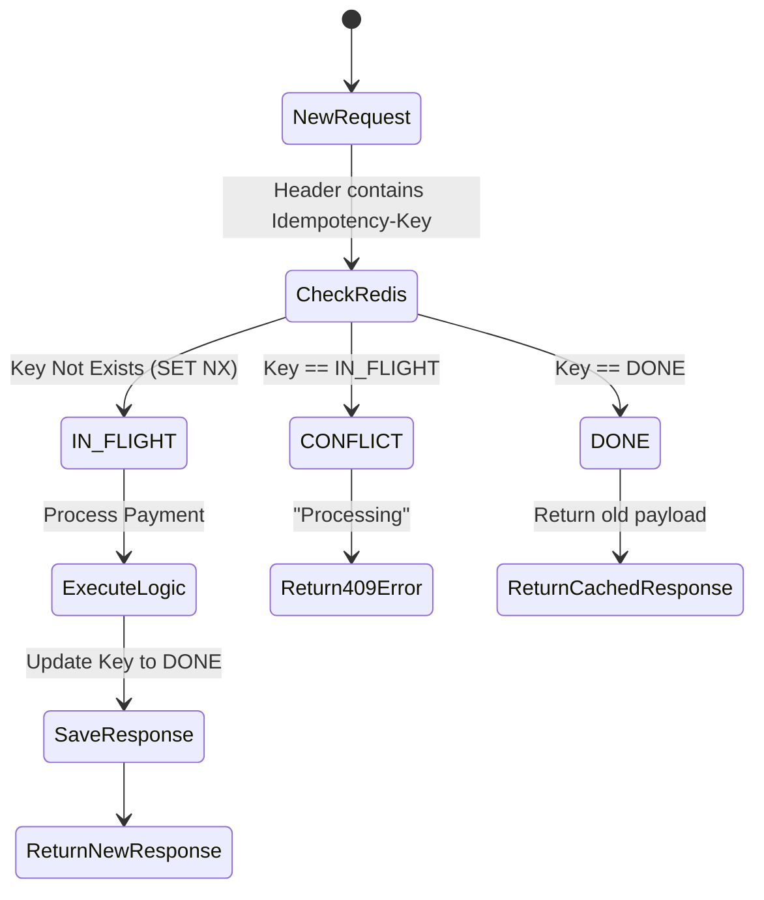

---
title: "Chapter 7: Designing Idempotency APIs for Payment Systems"
date: 2026-06-09T10:30:00+07:00
lastmod: 2026-06-09T10:30:00+07:00
draft: false
series: ["Mastering High-Concurrency Systems in Production"]
series_order: 7
tags: ["golang", "idempotency", "redis", "api design"]
mermaid: true
slug: "idempotency-api-design-payments"
description: "Prevent double-charging customers by implementing robust Idempotency Keys and Atomic Redis locks in your HTTP POST transactions."
ShowToc: true
TocOpen: true
cover:
  image: "/images/posts/realtime-inventory-cover.png"
  alt: "High Concurrency Systems Masterclass series: queues, caches, and distributed B2B commerce"
  relative: false
---
[← Previous](/series/high-concurrency-systems/api-gateway-vs-service-mesh/) | [Series hub](/series/high-concurrency-systems/) | [Next →](/series/high-concurrency-systems/distributed-locking-redlock-zookeeper/)

# Chapter 7: Fortifying Payment Systems with Idempotent APIs

In E-commerce or Fintech, the ultimate nightmare is not a system crash, but **charging a customer twice for a single order**. This is usually caused by network lag, an impatient user double-clicking "Pay", or automated app retry logic.

The mandatory solution for any transactional API (Payment/Order) is **Idempotency**.

## 1. What is Idempotency?

**Answer-first:** An operation is idempotent if executing it once or N times yields the exact same system state and outcome. While GET and PUT are natively idempotent, POST requires explicit engineering.

With HTTP REST APIs:
- `GET`, `PUT`, `DELETE`: Inherently idempotent. (Deleting a user 10 times results in the same state: the user is gone).
- `POST`: **Not idempotent**. Calling POST `/charge` 10 times will execute 10 financial deductions.

## 2. Idempotency-Key and the Request Lifecycle

**Answer-first:** Clients must attach a unique `Idempotency-Key` UUID to their requests. The server validates this key against Redis to determine if the transaction is new, processing, or already completed.

To enforce idempotency on a POST API, the Client (Mobile/Web) must generate a Unique ID (typically a UUID v4) and attach it to the Request Header: `Idempotency-Key: 123e4567...`

The Golang server handles this via 3 strict states:

1. **State 1 (New Key):** 
   - The server registers the Key in Redis with an `IN_FLIGHT` state.
   - It executes the business logic (calling payment gateways, deducting balances).
   - Upon completion, it updates the Key to `DONE` and **stores the entire Response Payload** in Redis. It returns the result to the Client.
   
2. **State 2 (Key is IN_FLIGHT):**
   - The user double-clicks. Request 2 arrives while Request 1 is still processing.
   - The server checks Redis, sees `IN_FLIGHT`, instantly blocks Request 2, and returns an `HTTP 409 Conflict` (or 423 Locked) error.

3. **State 3 (Key is DONE):**
   - The user drops connection after Request 1 finishes, missing the response. The user retries the request with the identical Key.
   - The server checks Redis, sees `DONE`. The server **DOES NOT** re-run the deduction logic. Instead, it pulls the cached Response Payload from Redis and returns it immediately. The user receives the exact success payload they missed.

## 3. The Race Condition Risk & Atomic Operations

**Answer-first:** Checking and setting the `IN_FLIGHT` flag must be atomic. Use Redis `SET key value NX` to guarantee that only the very first concurrent request acquires the processing lock.

How do we safely check and set `IN_FLIGHT`? If two identical requests hit the server milliseconds apart, Go might read Redis `GET key` (both receive Null), then `SET key IN_FLIGHT` (both succeed). This results in a catastrophic double-charge.

You must utilize Atomic operations via Redis: the `SET key value NX EX ttl` command.
The `NX` (Set if Not Exists) parameter guarantees that only 1 thread successfully inserts the Key. The 2nd thread will receive `false` from Redis, immediately identifying it as a duplicate.

## 4. High-Security Edge Case: Payload Hashing

**Answer-first:** Malicious clients can exploit idempotency by reusing an old Key with a new, expensive payload. Counter this by storing a SHA256 Hash of the Request Body alongside the Idempotency Key.

A common exploit involves a malicious client reusing an old `DONE` `Idempotency-Key` but transmitting a new payload (e.g., purchasing an expensive TV). If the system only checks the Key, it will return the old success response (for a cheap item) while ignoring the new payload entirely!

**The Defense:** Hash (e.g., SHA256) the entire Request Body. Store this Hash value alongside the `Idempotency-Key` in Redis. If a duplicate Key arrives but the Body Hash differs, block it instantly and return `HTTP 400 Bad Request`.

*(YMYL Note: In Core Banking, Idempotency keys are not just stored in Redis; they are modeled as `UNIQUE CONSTRAINT` columns within the SQL Database to leverage the absolute safety of ACID Transactions).*
