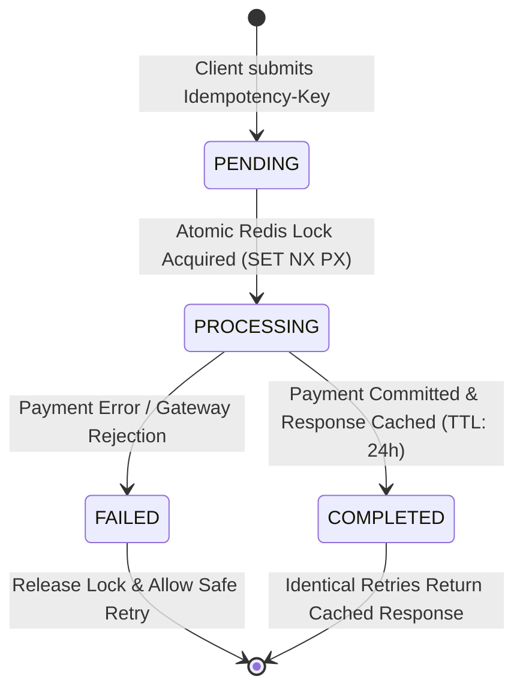
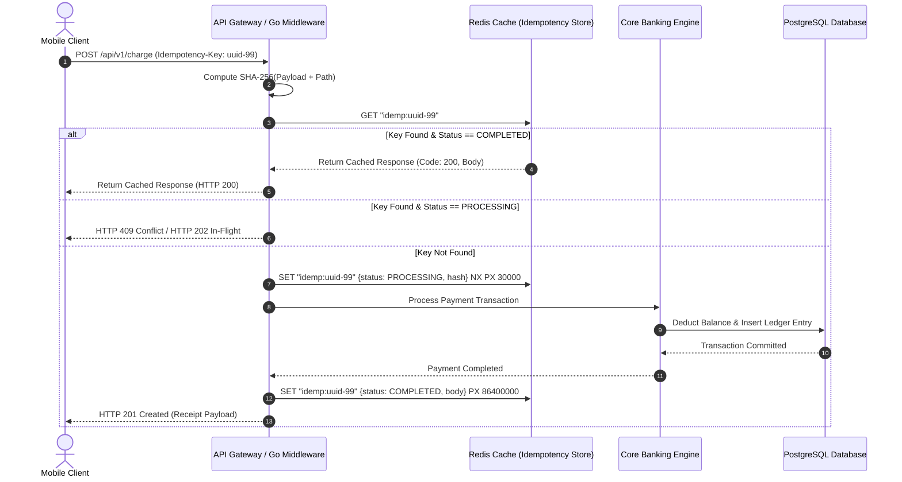

> **Multi-Language Edition:** This chapter is also available in Vietnamese at [Chương 7: Thiết Kế Idempotency APIs Dành Cho Hệ Thống Thanh Toán (learn.tanhdev.com)](https://learn.tanhdev.com/series/high-concurrency-systems/idempotency-api-design-payments/).

[Previous: Chapter 6 — API Gateway vs Service Mesh](/series/high-concurrency-systems/api-gateway-vs-service-mesh/) | [Series Hub](/series/high-concurrency-systems/) | [Next: Chapter 8 — Distributed Locking: Redlock vs ZooKeeper](/series/high-concurrency-systems/distributed-locking-redlock-zookeeper/)

---

> **Answer-First:** In payment and financial settlement APIs, network timeouts and client retries make duplicate requests inevitable. Guaranteeing idempotency requires adhering to the **IETF Idempotency-Key HTTP Specification** backed by an **Atomic Three-State Machine (PENDING, PROCESSING, COMPLETED)**. Using an atomic Redis lease lock (`SET key value NX PX 30000`) with SHA-256 payload tampering validation, the server ensures that a payment is executed exactly once, while duplicate retries immediately receive the cached authoritative HTTP response without re-invoking payment gateways.

---

## 1. The Financial Danger of Non-Idempotent POST APIs

In standard HTTP semantics, `GET`, `PUT`, and `DELETE` are naturally idempotent, while `POST` is not. In mobile commerce, if a user taps "Pay Now" and experiences an intermittent 4G connection timeout, the mobile app automatically retries the request. Without an idempotency layer, this results in **double charging the customer**.


```mermaid
stateDiagram-v2
    [*] --> PENDING: Client submits Idempotency-Key
    PENDING --> PROCESSING: Atomic Redis Lock Acquired (SET NX PX)
    PROCESSING --> COMPLETED: Payment Committed & Response Cached (TTL: 24h)
    PROCESSING --> FAILED: Payment Error / Gateway Rejection
    FAILED --> [*]: Release Lock & Allow Safe Retry
    COMPLETED --> [*]: Identical Retries Return Cached Response
```

---

## 2. End-to-End Idempotent Request Execution Pipeline

When a mutating financial request arrives, the application must execute a strict multi-step validation pipeline:


```mermaid
sequenceDiagram
    autonumber
    actor Client as Mobile Client
    participant GW as API Gateway / Go Middleware
    participant Redis as Redis Cache (Idempotency Store)
    participant Core as Core Banking Engine
    participant DB as PostgreSQL Database

    Client->>GW: POST /api/v1/charge (Idempotency-Key: uuid-99)
    GW->>GW: Compute SHA-256(Payload + Path)
    GW->>Redis: GET "idemp:uuid-99"
    alt Key Found & Status == COMPLETED
        Redis-->>GW: Return Cached Response (Code: 200, Body)
        GW-->>Client: Return Cached Response (HTTP 200)
    else Key Found & Status == PROCESSING
        GW-->>Client: HTTP 409 Conflict / HTTP 202 In-Flight
    else Key Not Found
        GW->>Redis: SET "idemp:uuid-99" {status: PROCESSING, hash} NX PX 30000
        GW->>Core: Process Payment Transaction
        Core->>DB: Deduct Balance & Insert Ledger Entry
        DB-->>Core: Transaction Committed
        Core-->>GW: Payment Completed
        GW->>Redis: SET "idemp:uuid-99" {status: COMPLETED, body} PX 86400000
        GW-->>Client: HTTP 201 Created (Receipt Payload)
    end
```

### Go Idempotency Middleware Implementation

```go
package middleware

import (
	"context"
	"crypto/sha256"
	"encoding/hex"
	"encoding/json"
	"net/http"
	"time"

	"github.com/gin-gonic/gin"
	"github.com/redis/go-redis/v9"
)

type IdempotencyRecord struct {
	Status      string `json:"status"` // PROCESSING, COMPLETED
	PayloadHash string `json:"payload_hash"`
	StatusCode  int    `json:"status_code"`
	Body        string `json:"body"`
}

func IdempotencyMiddleware(rdb redis.UniversalClient) gin.HandlerFunc {
	return func(c *gin.Context) {
		key := c.GetHeader("Idempotency-Key")
		if key == "" {
			c.Next()
			return
		}

		redisKey := "idemp:" + key
		ctx := c.Request.Context()

		// 1. Read request body and hash it
		bodyBytes, _ := c.GetRawData()
		hash := sha256.Sum256(bodyBytes)
		hashStr := hex.EncodeToString(hash[:])

		// 2. Atomic acquire lease
		acquired, err := rdb.SetNX(ctx, redisKey, "PROCESSING:"+hashStr, 30*time.Second).Result()
		if err != nil {
			c.AbortWithStatusJSON(http.StatusInternalServerError, gin.H{"error": "idempotency store error"})
			return
		}

		if !acquired {
			// Key already exists: fetch current state
			val, _ := rdb.Get(ctx, redisKey).Result()
			var record IdempotencyRecord
			if err := json.Unmarshal([]byte(val), &record); err == nil && record.Status == "COMPLETED" {
				if record.PayloadHash != hashStr {
					c.AbortWithStatusJSON(http.StatusUnprocessableEntity, gin.H{"error": "payload mismatch for idempotency key"})
					return
				}
				c.Data(record.StatusCode, "application/json", []byte(record.Body))
				c.Abort()
				return
			}

			c.AbortWithStatusJSON(http.StatusConflict, gin.H{"error": "request currently in progress"})
			return
		}

		// Proceed to handler
		c.Next()
	}
}
```

---

## 3. Defense-in-Depth: Database Unique Constraints

In-memory Redis locks can theoretically expire if a downstream payment gateway takes longer than 30 seconds to answer. To provide mathematical 100% safety, the database must enforce a unique composite constraint:

```sql
CREATE TABLE payments (
    id UUID PRIMARY KEY DEFAULT gen_random_uuid(),
    account_id UUID NOT NULL,
    idempotency_key VARCHAR(128) NOT NULL,
    amount NUMERIC(18, 4) NOT NULL,
    status VARCHAR(32) NOT NULL,
    CONSTRAINT uq_account_idempotency UNIQUE (account_id, idempotency_key)
);
```

If a duplicate transaction slips past the cache layer due to lock expiration, PostgreSQL will abort the transaction with a `23505 unique_violation` error, guaranteeing that double charges are **physically impossible**.

---

## Frequently Asked Questions (FAQ)


According to the IETF Idempotency-Key draft specification, the server should return **HTTP 409 Conflict** with an error message indicating that a mutation with that idempotency key is actively executing. Alternatively, in asynchronous payment environments, the server can return **HTTP 202 Accepted** with a polling status endpoint URL (`Location: /api/v1/payments/uuid-99/status`).



Payload tampering occurs when an attacker or buggy client submits a request with an existing `Idempotency-Key`, but changes the payment amount from \$10 to \$1,000. By storing a cryptographic SHA-256 hash of the request body alongside the idempotency record, the server immediately detects any payload discrepancy and returns **HTTP 422 Unprocessable Entity**, rejecting the compromised request.



For financial transactions, the recommended TTL in fast memory (Redis) is **24 to 48 hours**, covering the vast majority of mobile client retries. For compliance and dispute resolution, the database record linking the `idempotency_key` with the resulting transaction ledger ID is retained **permanently** in cold storage for regulatory audits.


---

## Next Steps

Proceed to [Chapter 8: Distributed Locking — Redlock vs ZooKeeper](/series/high-concurrency-systems/distributed-locking-redlock-zookeeper/) to master distributed consensus and synchronization primitives.
