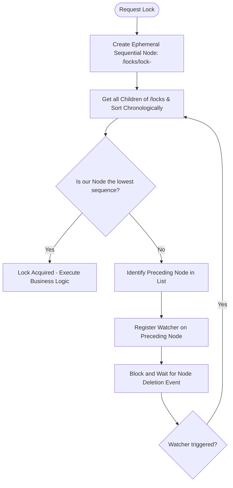
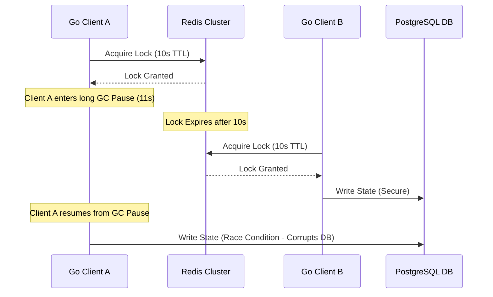

> **Prerequisite:** Before reading this chapter, please ensure you have read the previous article in this series: [Chapter 7: Fortifying Payment Systems with Idempotent APIs]().

In a standalone Go application, preventing two Goroutines from overwriting the same data (Race Condition) is achieved via `sync.Mutex`. However, when your system scales out to 10 servers behind a Load Balancer, `sync.Mutex` is useless because it only locks local RAM. You need a **Distributed Lock**.

---

## 1. Basic Redis Locks

A basic Redis lock utilizes `SET resource id NX PX ttl`. It works for simple caching but suffers from Single Point of Failure vulnerabilities if the Redis Master crashes before syncing.

The simplest distributed lock uses a single Redis node with an atomic command:
`SET resource_name my_unique_id NX PX 30000`

- **`NX`**: Ensures only the first requester succeeds (acquires the lock).
- **`PX 30000`**: The lock auto-expires after 30 seconds (Lease Expiration) preventing Deadlocks if the lock-holding server crashes.

**The Flaw:** What if this Redis node crashes right after granting the lock to Server A, but before replicating to the Slave? The Slave promotes itself to Master without knowing Server A holds the lock. Server B requests a lock, and the new Master grants it. Two servers now hold the lock simultaneously, leading to data corruption.

---

## 2. The Redlock Algorithm

Redlock eliminates Redis Single Point of Failure by querying multiple independent Redis Masters. A lock is only acquired if a quorum (majority) of nodes grant it successfully.

To resolve Redis replication flaws, Salvatore Sanfilippo (creator of Redis) introduced the **Redlock** algorithm. Redlock utilizes a cluster of $N$ (usually 5) independent Redis Masters.

To acquire a lock, your Go Server must:
1. Retrieve the current time in milliseconds.
2. Sequentially request the lock on all 5 nodes using the same key, value, and a small acquisition timeout. The acquisition timeout prevents locking up the client if a Redis node is down.
3. Calculate the time elapsed to acquire the lock. If it successfully acquires the lock on a majority (**Quorum**: $\ge 3/5$ nodes) **AND** the elapsed time is less than the lock validity time, the lock is officially granted.
4. If the lock is acquired, its validity time is the original validity time minus the elapsed acquisition time.
5. If it fails the quorum or times out, it must rapidly execute a delete (via Lua script) across all 5 nodes to clean up partial states.

---

## 3. ZooKeeper / etcd Locks: The Performance Trade-off

While Redlock is fast, it is vulnerable to Clock Drift. Financial systems requiring absolute Strong Consistency use Apache ZooKeeper or etcd for reliable, event-driven locking.

Despite Redlock's popularity, distributed systems experts (like Martin Kleppmann) note its heavy reliance on synchronized physical clocks. If a server experiences Clock Drift, locks can expire unpredictably.

For Core Banking systems demanding absolute Strong Consistency, engineers deploy **Apache ZooKeeper** or **etcd** (which uses the Raft consensus algorithm).

### ZooKeeper Ephemeral Sequential Lock Watcher Flowchart

The following flowchart illustrates the step-by-step process of ZooKeeper's lock acquisition, showing how it leverages ephemeral sequential nodes to avoid CPU-wasting polling loops:



In ZooKeeper:
- **Ephemeral Nodes**: Automatically deleted if the client session terminates (e.g. if the client crashes), preventing deadlocks.
- **Sequential Nodes**: ZK appends a monotonic sequence number to the node name, ensuring fair lock queueing.
- **Watchers**: Eliminates network loops. Clients do not poll; they block until ZooKeeper pushes a deletion event for the preceding node.

---

## 4. The Hidden Threat: Clock Drift & Garbage Collection (GC) Pauses

A major challenge with distributed locks is the interaction between leases (TTLs) and client-side processing pauses.

### Martin Kleppmann's Critique: The GC Pause Problem
Suppose Server A acquires a Redis lock with a 10-second TTL. Immediately after acquiring the lock, Server A enters a long Garbage Collection (GC) pause or experiences hypervisor CPU starvation lasting 11 seconds.

During this pause, Server A's execution is halted. The Redis lock TTL expires. Redis deletes the key. Server B requests and successfully acquires the lock. Server B starts writing to the database.

Server A's GC pause ends. Server A awakens, unaware that the lock expired, and executes its pending write to the database. Both servers write concurrently, violating the mutual exclusion invariant and corrupting the database.



### The Solution: Fencing Tokens
To solve the GC lease expiration problem, you must implement **Fencing Tokens**.

A fencing token is a monotonically increasing number generated by the lock manager (like ZooKeeper's `zxid` or etcd's `revision`) every time a lock is acquired.
1. When Client A acquires the lock, it receives fencing token `33`.
2. When Client B acquires the lock, it receives fencing token `34`.
3. Client B writes to the database first, passing token `34`. The database records the highest seen token as `34`.
4. When Client A awakens and attempts to write passing token `33`, the database checks the token:
   $$\text{If } \text{token}_{\text{incoming}} < \text{token}_{\text{db\_max}} \implies \text{Reject Transaction}$$
   Since `33 < 34`, the database rejects Client A's write, preventing data corruption.

---

## Go Implementation: Redlock Client with Automated Lease Renewal (Watchdog)

The following Go code implements a distributed lock client utilizing the `github.com/go-redsync/redsync/v4` library. It includes an automated background **Watchdog** routine that dynamically extends the Redis lock lease while the processing thread is active, preventing premature lock loss during unexpected latency spikes.

```go
package main

import (
	"context"
	"fmt"
	"sync"
	"time"

	"github.com/go-redsync/redsync/v4"
	"github.com/go-redsync/redsync/v4/redis/goredis/v8"
	goredislib "github.com/go-redis/redis/v8"
)

type RedlockManager struct {
	rs *redsync.Redsync
}

func NewRedlockManager(addrs []string) *RedlockManager {
	var pools []redsync.Pool
	for _, addr := range addrs {
		client := goredislib.NewClient(&goredislib.Options{
			Addr: addr,
		})
		pools = append(pools, goredis.NewPool(client))
	}
	
	// Initialize redsync wrapping the multi-node connection pools
	return &RedlockManager{
		rs: redsync.New(pools...),
	}
}

// ExecuteWithLock runs the task under a distributed lock with a background watchdog.
func (rm *RedlockManager) ExecuteWithLock(ctx context.Context, resource string, leaseDuration time.Duration, task func() error) error {
	mutex := rm.rs.NewMutex(resource, redsync.WithExpiry(leaseDuration))

	// 1. Acquire the distributed lock
	if err := mutex.LockContext(ctx); err != nil {
		return fmt.Errorf("failed to acquire lock for %s: %w", resource, err)
	}

	// Ensure lock is released upon exit
	defer func() {
		if _, err := mutex.UnlockContext(context.Background()); err != nil {
			fmt.Printf("Error releasing lock: %v\n", err)
		}
	}()

	// 2. Spin up the background Watchdog goroutine
	watchdogCtx, cancelWatchdog := context.WithCancel(ctx)
	defer cancelWatchdog()
	
	var wg sync.WaitGroup
	wg.Add(1)
	go func() {
		defer wg.Done()
		// Ticker to renew at 50% of the lease duration to guarantee safety margin
		ticker := time.NewTicker(leaseDuration / 2)
		defer ticker.Stop()

		for {
			select {
			case <-watchdogCtx.Done():
				return
			case <-ticker.C:
				ok, err := mutex.ExtendContext(watchdogCtx)
				if err != nil || !ok {
					fmt.Printf("[Watchdog Warning] Failed to extend lock: %v (extend_success=%t)\n", err, ok)
					return // Stop watchdog if lock is lost
				}
				fmt.Printf("[Watchdog] Extended lease for key: %s\n", resource)
			}
		}
	}()

	// 3. Execute the business task
	err := task()
	
	// Terminate watchdog before defer triggers lock release
	cancelWatchdog()
	wg.Wait()

	return err
}

func main() {
	// Connect to 3 independent Redis instances for Redlock consensus
	redisAddresses := []string{
		"localhost:6379",
		"localhost:6380",
		"localhost:6381",
	}

	manager := NewRedlockManager(redisAddresses)
	ctx := context.Background()

	err := manager.ExecuteWithLock(ctx, "inventory_lock_sku_772", 4*time.Second, func() error {
		// Simulate a slow database inventory update
		fmt.Println("Lock acquired! Processing database update...")
		time.Sleep(7 * time.Second) // Intentionally longer than the 4s lease duration
		fmt.Println("Database update completed.")
		return nil
	})

	if err != nil {
		fmt.Printf("Lock execution failed: %v\n", err)
	} else {
		fmt.Println("Distributed transaction executed safely.")
	}
}
```

This watchdog implementation ensures that your distributed lock lease is dynamically extended while processing is ongoing, protecting your system from race conditions during unexpected latency spikes.

---

## 🎯 Architecture Review & Consulting (Hire Me)

If your enterprise e-commerce or B2B platform is struggling with slow database queries, checkout timeouts, or scaling bottlenecks, don't let it jeopardize your business revenue.

👉 **[Book a 1:1 Architecture Consultation this week](/hire/)** with Lê Tuấn Anh (Vesviet) to identify bottlenecks and implement proven scaling strategies.

---

🔗 **Next Step:** [Chapter 9: Database Sharding & Read/Write Splitting]()

