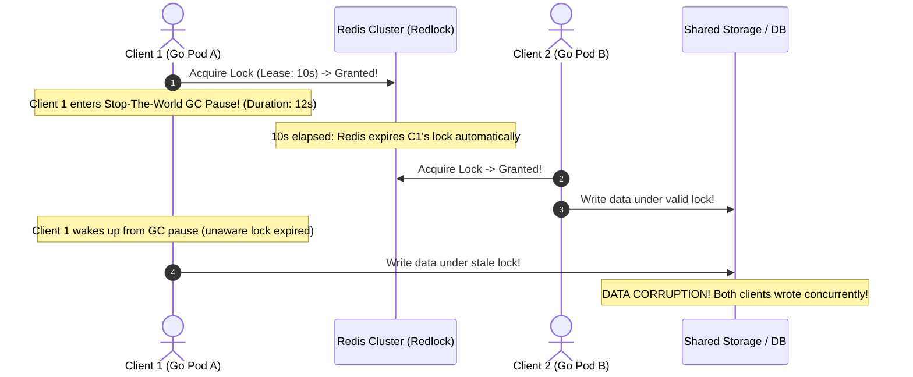
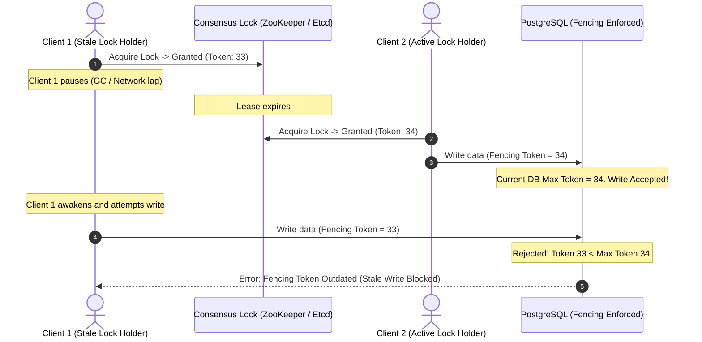

> **Multi-Language Edition:** This chapter is also available in Vietnamese at [Chương 8: Distributed Locking Xử Lý Tranh Chấp Race Conditions: Redlock Đấu Với ZooKeeper (learn.tanhdev.com)](https://learn.tanhdev.com/series/high-concurrency-systems/distributed-locking-redlock-zookeeper/).

[Previous: Chapter 7 — Designing Idempotency APIs for Payment Systems](/series/high-concurrency-systems/idempotency-api-design-payments/) | [Series Hub](/series/high-concurrency-systems/) | [Next: Chapter 9 — Database Sharding & Read/Write Splitting](/series/high-concurrency-systems/database-sharding-read-write-splitting/)

---

> **Answer-First:** When coordinating concurrent operations across distributed nodes, choosing between Redis **Redlock** and consensus-backed systems (**Apache ZooKeeper** or **Etcd**) comes down to the fundamental trade-off between **Latency vs. Correctness**: (1) Redis Redlock is high-throughput and sub-millisecond, making it ideal for non-critical efficiency locks (e.g., preventing duplicate background job execution); (2) However, as proven by distributed systems researcher Martin Kleppmann, Redlock is mathematically unsafe for mutual exclusion when processes experience GC pauses or system clock drifts. For financial ledger mutations and correctness-critical resources, architectures must use consensus-backed locks (ZooKeeper ZAB or Etcd Raft) paired with **Monotonic Fencing Tokens**, or eliminate locks entirely using database-level **Optimistic Concurrency Control (OCC)**.

---

## 1. Martin Kleppmann's Critique: Why Redlock Fails Under Real-World Failures

A common assumption among backend developers is that setting a Redis lease (`SET lock_key client_id NX PX 10000`) guarantees mutual exclusion.

However, in real-world distributed systems, processes experience **Stop-The-World (STW) Garbage Collection pauses**, asynchronous I/O delays, and OS page swapping. If Client 1 acquires a 10-second lock, undergoes an 11-second GC pause, its lock expires in Redis. Client 2 acquires the new lock. When Client 1 resumes, **both clients believe they own the lock simultaneously**, corrupting shared storage!


```mermaid
sequenceDiagram
    autonumber
    actor C1 as Client 1 (Go Pod A)
    participant Redis as Redis Cluster (Redlock)
    actor C2 as Client 2 (Go Pod B)
    participant Storage as Shared Storage / DB

    C1->>Redis: Acquire Lock (Lease: 10s) -> Granted!
    Note over C1: Client 1 enters Stop-The-World GC Pause! (Duration: 12s)
    Note over Redis: 10s elapsed: Redis expires C1's lock automatically
    C2->>Redis: Acquire Lock -> Granted!
    C2->>Storage: Write data under valid lock!
    Note over C1: Client 1 wakes up from GC pause (unaware lock expired)
    C1->>Storage: Write data under stale lock!
    Note over Storage: DATA CORRUPTION! Both clients wrote concurrently!
```

---

## 2. The Universal Remedy: Monotonic Fencing Tokens

To guarantee absolute safety against stale lock holders, every lock grant must return a strictly increasing **Fencing Token** (monotonically incrementing integer).

When a client writes to the underlying storage engine, the storage layer rejects any write whose fencing token is smaller than the highest token previously processed.


```mermaid
sequenceDiagram
    autonumber
    actor C1 as Client 1 (Stale Lock Holder)
    participant LockSvc as Consensus Lock (ZooKeeper / Etcd)
    actor C2 as Client 2 (Active Lock Holder)
    participant DB as PostgreSQL (Fencing Enforced)

    C1->>LockSvc: Acquire Lock -> Granted (Token: 33)
    Note over C1: Client 1 pauses (GC / Network lag)
    Note over LockSvc: Lease expires
    C2->>LockSvc: Acquire Lock -> Granted (Token: 34)
    C2->>DB: Write data (Fencing Token = 34)
    Note over DB: Current DB Max Token = 34. Write Accepted!
    Note over C1: Client 1 awakens and attempts write
    C1->>DB: Write data (Fencing Token = 33)
    Note over DB: Rejected! Token 33 < Max Token 34!
    DB-->>C1: Error: Fencing Token Outdated (Stale Write Blocked)
```

---

## 3. ZooKeeper Ephemeral Sequential Nodes

Apache ZooKeeper achieves rock-solid distributed mutual exclusion via **ZAB (ZooKeeper Atomic Broadcast)** consensus:
1. Each client attempts to create an ephemeral sequential znode under `/locks/resource_name/lock-`.
2. ZooKeeper appends a strictly increasing monotonic sequence number (e.g., `lock-00000001`, `lock-00000002`).
3. The client with the lowest sequence number owns the lock.
4. All other clients place a **Watcher** only on the sequence node directly preceding their own, preventing the **Thundering Herd** problem when a lock is released.

### Go Implementation with Optimistic Concurrency Control (Lock-Free Alternative)

In high-concurrency e-commerce systems, avoiding distributed locks entirely yields 10x higher throughput:

```go
package inventory

import (
	"context"
	"errors"
	"gorm.io/gorm"
)

var ErrStockInsufficientOrConcurrentConflict = errors.New("insufficient stock or version conflict")

// DeductStockOCC executes atomic deduction without distributed locks
func DeductStockOCC(ctx context.Context, db *gorm.DB, skuID int64, qty int, currentVersion int) error {
	result := db.WithContext(ctx).Exec(`
		UPDATE inventory
		SET stock = stock - ?,
		    version = version + 1
		WHERE sku_id = ?
		  AND stock >= ?
		  AND version = ?
	`, qty, skuID, qty, currentVersion)

	if result.Error != nil {
		return result.Error
	}

	if result.RowsAffected == 0 {
		return ErrStockInsufficientOrConcurrentConflict
	}

	return nil
}
```

---

## Frequently Asked Questions (FAQ)


Redis Redlock is suitable for **efficiency optimization** rather than **correctness-critical transactions**. Examples include preventing two background workers from generating the same daily analytical report, or deduplicating outgoing non-critical emails. In these scenarios, a rare lock violation merely wastes compute resources; it does not corrupt financial account balances or legal audit records.



Etcd and ZooKeeper rely on formal consensus algorithms (**Raft** and **ZAB**) that maintain a strongly consistent, replicated state machine with quorum-based lease renewal and monotonic term/revision numbers. In contrast, Redis Redlock relies on unsynchronized local system clocks across independent master nodes. If system clocks drift or an NTP synchronization jump occurs, Redlock's timeout validity calculations break down completely.



Acquiring and releasing a distributed lock requires at least two network round trips per request, serializing thousands of concurrent purchase attempts into a single-file queue. In contrast, database OCC uses atomic SQL conditional decrements (`WHERE stock >= qty AND version = current_version`). Transactions execute in parallel; winners succeed immediately, and losers fail fast or retry with jitter, sustaining tens of thousands of purchases per second.


---

## Next Steps

Proceed to [Chapter 9: Database Sharding & Read/Write Splitting](/series/high-concurrency-systems/database-sharding-read-write-splitting/) to scale relational databases horizontally across billions of records.
