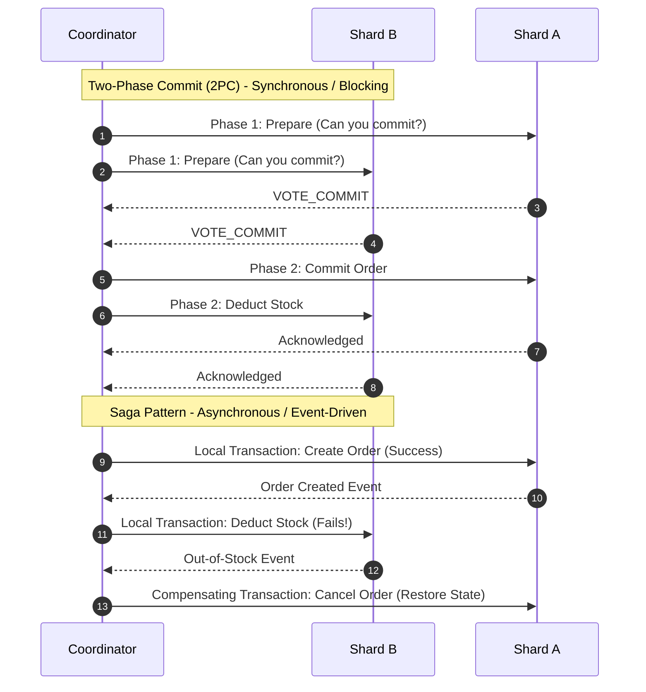

> **Prerequisite:** Before reading this chapter, please ensure you have read the previous article in this series: [Chapter 8: Distributed Locking — Redlock vs ZooKeeper]().

When your application reaches tens of millions of users, the Database becomes the ultimate bottleneck. CPU maxes out at 100%, RAM depletes, and queries take seconds instead of milliseconds. This is the stage where you must deploy distributed database strategies.

---

## 1. Read/Write Splitting

Because 80% of traffic is Read-only, separate your DB into a Write Master and Read Slaves. Use GORM's `dbresolver` plugin to route queries automatically without altering business logic.

In typical applications, Read operations (Select) account for 80-90% of traffic, while Writes (Insert/Update) are merely 10-20%. Cramming all of this into a single DB causes heavy Select queries to lock tables, paralyzing the Write pipeline.

**The Architecture:**
Deploy a **Master** node (strictly for WRITING) alongside multiple **Slave/Replica** nodes (strictly for READING). The Master continuously replicates its data asynchronously to the Slaves.

**Implementing in Golang:**
Do not write messy `if-else` blocks to manually switch DB connections. Utilize the `dbresolver` plugin from GORM:
```go
import "gorm.io/plugin/dbresolver"

db.Use(dbresolver.Register(dbresolver.Config{
    Sources:  []gorm.Dialector{mysql.Open("master_dsn")},
    Replicas: []gorm.Dialector{mysql.Open("slave1_dsn"), mysql.Open("slave2_dsn")},
    Policy:   dbresolver.RandomPolicy{},
}))
```
GORM intelligently parses your code: `db.Create()` is routed to the Master, while `db.Find()` is load-balanced across Slaves. Read scalability is now virtually infinite.

**Replication Lag Warning:**
Because Master-to-Slave replication takes a few milliseconds, if a user updates their profile (Write to Master) and immediately refreshes the page (Read from Slave), they might see old data. *Solution:* Flag the user session upon mutation, forcing all their read requests to target the Master for the next 3 seconds.

---

## 2. Database Sharding

When a single table hits billions of rows, splitting reads isn't enough. Sharding horizontally slices the table across multiple physical servers. Consistent Hashing is the preferred strategy to avoid massive data migrations during cluster resizing.

When data swells to billions of records (e.g., Transaction History), the Master's hard drive fills up, and indexing overhead crushes Write performance. Read/Write splitting becomes useless. You must \"slice\" the database into smaller fragments.

### A. Horizontal vs Vertical Sharding
- **Vertical Sharding:** Splitting columns of a table into separate tables or databases. For example, moving large TEXT/BLOB profile bios into a `profile_details` table while keeping the hot `user_id` and `email` columns in the primary table. This reduces disk page footprint and speeds up index scans.
- **Horizontal Sharding:** Slicing rows of a table across multiple database engines. The table schema remains identical across all database shards, but each database contains only a subset of the rows.

### B. Sharding Key Selection
Choosing the correct Sharding Key is the most critical decision in database partition architecture:
- **`user_id` Key:** Grouping all data (orders, profiles) belonging to a single user on the same shard.
  - *Pros:* High performance. User-specific transactions can be executed on a single database node without cross-network locks.
  - *Cons:* Hyper-active merchants or power users can overload a specific database shard, causing hotspots.
- **`order_id` Key:** Splitting orders randomly or sequentially.
  - *Pros:* Perfect uniform distribution.
  - *Cons:* Executing a scatter-gather query. If a user wants to view their historical order list, the application must query all database shards and merge the results in user space, degrading performance.

---

## 3. The Pain of Cross-Shard Joins

In a monolithic database, joining tables is a simple operation handled by the DB engine's optimizer. Once data is sharded across multiple physical servers, executing a standard SQL `JOIN` across shard boundaries becomes impossible.

For example, running `SELECT * FROM orders JOIN users ON orders.user_id = users.id` when orders and users are partitioned on different shards requires:
1. Fetching all matching order records from Shard A.
2. Querying all user records from Shard B.
3. Fetching and joining the rows inside the application memory.

This consumes massive application heap memory and increases network transit times.

### Strategies to Avoid Cross-Shard Joins
- **Data Denormalization:** Duplicating read-only reference data (like product names or email addresses) directly inside the child tables (e.g. `order_items`), accepting write anomalies in exchange for single-query read performance.
- **Global Reference Tables:** Maintaining small, read-heavy lookup tables (e.g., currency codes, countries) as duplicates on EVERY database shard. Write operations must write to all shards, but reads execute locally with fast index scans.
- **Application-Level Joins:** Resolving relationships sequentially inside your Go routines using batch lookups (e.g., `SELECT * FROM users WHERE id IN (...)`).

---

## 4. Distributed Transactions: 2PC vs Sagas

When processing transactional writes across multiple independent database shards, you must guarantee atomic consistency.



### Two-Phase Commit (2PC)
A synchronous, blocking protocol to coordinate transactions across nodes:
- **Phase 1 (Prepare):** The coordinator node asks all database shards if they are ready to commit their local writes. Each node locks local resources and votes (commit/abort).
- **Phase 2 (Commit):** If all nodes vote commit, the coordinator instructs them to make the changes permanent. If any node votes abort, the coordinator orders a global rollback.
- *Trade-off:* Highly vulnerable to deadlock and resource blockages. If a network split isolates the coordinator mid-transaction, all shards remain locked, freezing database access.

### Saga Pattern
An event-driven architectural pattern that splits a distributed transaction into a sequence of independent local transactions. Each local transaction updates the database on a single shard and publishes an event. Sibling services react by executing their local transaction.

If a step fails, the coordinator publishes a compensating transaction event to run rollback actions (e.g., restoring stock) in reverse order.
- *Trade-off:* Saga guarantees scalability and low latency because it avoids global locking, but developers must accept eventual consistency.

---

## Go Implementation: Consistent Hashing Ring

The following Go code implements a consistent hashing key ring designed to distribute keys across a dynamic set of database shards while minimizing re-sharding overhead.

```go
package main

import (
	"fmt"
	"hash/crc32"
	"sort"
	"strconv"
)

// HashRing maps keys to virtual database shard nodes.
type HashRing struct {
	virtualNodes int               // Number of virtual nodes per physical node
	ring         []uint32          // Sorted list of virtual node hashes
	nodeMap      map[uint32]string // Maps hash values to physical node name
}

// NewHashRing creates a new hashing ring.
func NewHashRing(virtualNodes int) *HashRing {
	return &HashRing{
		virtualNodes: virtualNodes,
		nodeMap:      make(map[uint32]string),
	}
}

// hash calculates the CRC32 checksum of a string key.
func (h *HashRing) hash(key string) uint32 {
	return crc32.ChecksumIEEE([]byte(key))
}

// AddNode registers a physical database shard.
func (h *HashRing) AddNode(node string) {
	for i := 0; i < h.virtualNodes; i++ {
		// Generate unique key for virtual node
		vNodeKey := node + "#" + strconv.Itoa(i)
		vNodeHash := h.hash(vNodeKey)
		
		h.ring = append(h.ring, vNodeHash)
		h.nodeMap[vNodeHash] = node
	}
	// Sort the ring to enable binary search (clockwise traversal)
	sort.Slice(h.ring, func(i, j int) bool {
		return h.ring[i] < h.ring[j]
	})
}

// GetNode maps a data key to its assigned physical database node.
func (h *HashRing) GetNode(key string) string {
	if len(h.ring) == 0 {
		return ""
	}

	keyHash := h.hash(key)

	// Binary search to find the nearest virtual node clockwise
	idx := sort.Search(len(h.ring), func(i int) bool {
		return h.ring[i] >= keyHash
	})

	// If hash is beyond the highest virtual node, wrap around to 0
	if idx == len(h.ring) {
		idx = 0
	}

	return h.nodeMap[h.ring[idx]]
}

func main() {
	// Initialize ring with 10 virtual nodes per database shard
	ring := NewHashRing(10)

	// Add physical database shards
	ring.AddNode("db-shard-01.internal")
	ring.AddNode("db-shard-02.internal")
	ring.AddNode("db-shard-03.internal")

	// Map sample keys (order UUIDs) to database nodes
	orders := []string{
		"order_8829-1a",
		"order_3810-9b",
		"order_1128-4c",
		"order_9981-6d",
	}

	for _, order := range orders {
		node := ring.GetNode(order)
		fmt.Printf("Order ID: %s -> Routed to: %s\n", order, node)
	}
}
```

Consistent hashing distributes data uniformly across your database nodes, ensuring horizontal scalability.

---

## 🎯 Architecture Review & Consulting (Hire Me)

If your enterprise e-commerce or B2B platform is struggling with slow database queries, checkout timeouts, or scaling bottlenecks, don't let it jeopardize your business revenue.

👉 **[Book a 1:1 Architecture Consultation this week](/hire/)** with Lê Tuấn Anh (Vesviet) to identify bottlenecks and implement proven scaling strategies.

---

[← Previous]() | [Series hub]()

