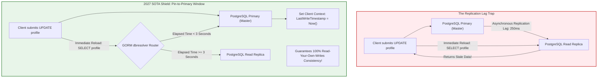
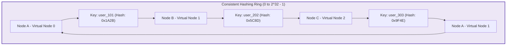

> **Multi-Language Edition:** This chapter is also available in Vietnamese at [Chương 9: Database Sharding & Read/Write Splitting Dành Cho Các Bảng Dữ Liệu Hàng Tỷ Bản Ghi (learn.tanhdev.com)](https://learn.tanhdev.com/series/high-concurrency-systems/database-sharding-read-write-splitting/).

[Previous: Chapter 8 — Distributed Locking: Redlock vs ZooKeeper](/series/high-concurrency-systems/distributed-locking-redlock-zookeeper/) | [Series Hub](/series/high-concurrency-systems/)

---

> **Answer-First:** Scaling relational databases beyond hundreds of millions of rows requires a progressive two-stage strategy: (1) **Read/Write Splitting** routing mutating queries to the Primary and read queries to Replicas via GORM `dbresolver`, protected by a **Pin-to-Primary (Read-Your-Own-Writes)** shield to insulate users from replication lag; (2) **Horizontal Sharding** using a **Consistent Hashing Ring with 256 Virtual Nodes** per physical database shard, distributed 64-bit monotonically increasing IDs (**Snowflake / TSID**), and sharding middleware (Vitess or Distributed SQL engines like TiDB/CockroachDB) to eliminate cross-shard two-phase commit bottlenecks.

---

## 1. Stage 1: Read/Write Splitting & The Replication Lag Trap

Before splitting tables horizontally across separate physical clusters, the first scaling step is separating reads from writes. In e-commerce, read operations typically outnumber write operations by 10:1 to 50:1.

However, standard asynchronous replication introduces **Replication Lag**: If a user updates their profile and the subsequent profile reload reads from a replica that is 200ms behind, the user will see stale data, prompting confused repeat clicks and support tickets.


```mermaid
flowchart TD
    subgraph ReadWriteLag ["The Replication Lag Trap"]
        U1["Client submits UPDATE profile"] --> M1["PostgreSQL Primary (Master)"]
        M1 -->|Asynchronous Replication Lag: 250ms| R1["PostgreSQL Read Replica"]
        U1 -->|Immediate Reload: SELECT profile| R1
        R1 -->|Returns Stale Data!| U1
    end

    subgraph PinToPrimary ["2027 SOTA Shield: Pin-to-Primary Window"]
        U2["Client submits UPDATE profile"] --> M2["PostgreSQL Primary (Master)"]
        M2 --> S2["Set Client Context: LastWriteTimestamp = Now()"]
        U2 -->|Immediate Reload: SELECT profile| Router{"GORM dbresolver Router"}
        Router -->|Elapsed Time < 3 Seconds| M2
        Router -->|Elapsed Time >= 3 Seconds| R2["PostgreSQL Read Replica"]
        NoteA["Guarantees 100% Read-Your-Own-Writes Consistency!"]
    end

    classDef danger fill:#ffebee,stroke:#c62828,stroke-width:2px;
    classDef safe fill:#e8f5e9,stroke:#2e7d32,stroke-width:2px;
    class ReadWriteLag danger;
    class PinToPrimary safe;
```

---

## 2. Stage 2: Horizontal Sharding via Consistent Hashing

When a database table exceeds 100 million rows, single-node B-tree indexes exceed physical RAM capacity, causing random NVMe disk thrashing. The database must be partitioned horizontally across independent physical nodes.

Naive modulo sharding (`hash(user_id) % N`) is disastrous in production: adding a new database server requires migrating nearly $100\%$ of all records. In contrast, **Consistent Hashing** with virtual nodes restricts data movement to only $1/N$ of records when a shard is added or removed.


```mermaid
flowchart TD
    subgraph Ring ["Consistent Hashing Ring (0 to 2^32 - 1)"]
        V1["Node A - Virtual Node 0"] --> K1["Key: user_101 (Hash: 0x1A2B)"]
        K1 --> V2["Node B - Virtual Node 1"]
        V2 --> K2["Key: user_202 (Hash: 0x5C8D)"]
        K2 --> V3["Node C - Virtual Node 2"]
        V3 --> K3["Key: user_303 (Hash: 0x9F4E)"]
        K3 --> V4["Node A - Virtual Node 1"]
        V4 --> V1
    end

    classDef ring fill:#ede7f6,stroke:#512da8,stroke-width:2px;
    class Ring ring;
```

### Production Go Implementation with GORM `dbresolver`

```go
package database

import (
	"context"
	"time"

	"gorm.io/driver/postgres"
	"gorm.io/gorm"
	"gorm.io/plugin/dbresolver"
)

func SetupReadWriteSplitting(primaryDSN string, replicaDSNs []string) (*gorm.DB, error) {
	db, err := gorm.Open(postgres.Open(primaryDSN), &gorm.Config{})
	if err != nil {
		return nil, err
	}

	var replicas []gorm.Dialector
	for _, dsn := range replicaDSNs {
		replicas = append(replicas, postgres.Open(dsn))
	}

	err = db.Use(dbresolver.Register(dbresolver.Config{
		Sources:  []gorm.Dialector{postgres.Open(primaryDSN)},
		Replicas: replicas,
		Policy:   dbresolver.RandomPolicy{},
	}).
		SetConnMaxIdleTime(time.Minute).
		SetConnMaxLifetime(time.Hour).
		SetMaxIdleConns(50).
		SetMaxOpenConns(50))

	return db, err
}

// ReadYourOwnWrites forces read queries to Primary within a grace window
func ReadUserProfile(ctx context.Context, db *gorm.DB, userID string, recentlyUpdated bool) (*User, error) {
	var user User
	tx := db.WithContext(ctx)

	if recentlyUpdated {
		// Pin read to Primary to bypass replication lag
		tx = tx.Clauses(dbresolver.Write)
	}

	err := tx.First(&user, "id = ?", userID).Error
	return &user, err
}
```

---

## 3. Distributed ID Generation: Snowflake & TSID

In a horizontally sharded database cluster, traditional database auto-increment IDs (`BIGSERIAL`) fail because shards operate independently.

The 2027 standard relies on **64-bit Twitter Snowflake or Time-Sorted Unique Identifiers (TSID)**:
- **1 bit:** Unused sign bit (always 0).
- **41 bits:** Millisecond timestamp (69 years of lifespan).
- **10 bits:** Node / Worker Machine ID (supports 1,024 independent database shards).
- **12 bits:** Monotonic Sequence Counter (4,096 IDs per millisecond per node).

Because Snowflake IDs are monotonically increasing, new row insertions maintain perfect **B-tree index page locality**, preventing page splits and fragmentation.

---

## Frequently Asked Questions (FAQ)


Queries that omit the sharding key must execute a **Scatter-Gather** operation: the application or sharding middleware (e.g., Vitess VTGate) dispatches the query in parallel to all $N$ shards and merges the results in memory. For heavy analytical queries, secondary index lookups, or full-text searches, best practice dictates replicating data asynchronously via CDC to an external search engine (Elasticsearch, Meilisearch) or data warehouse (ClickHouse, BigQuery) rather than burdening transactional OLTP shards.



Two-Phase Commit (2PC / XA transactions) across multiple database shards forces all participating nodes to hold row locks until all participants vote and commit. If a single network packet is delayed or one shard is slow, locks remain held, causing latency spikes and cascading thread exhaustion. High-concurrency systems avoid cross-shard 2PC by aligning related entities under the same sharding key (e.g., co-locating `orders` and `order_items` by `user_id`), or by using asynchronous **Saga patterns**.



Manual application-level sharding introduces massive development overhead: manual resharding scripts, complex query routing, and schema migration coordination. Teams should adopt Distributed SQL (such as TiDB or CockroachDB) when table sizes exceed 5 Terabytes and the operational cost of managing sharding logic in application code exceeds the cost of running a distributed consensus storage engine (Raft/Multi-Raft).


---

## Congratulations on Completing the Masterclass!

You have completed the entire 10-chapter **Masterclass: High Concurrency Systems & B2B Commerce**. Explore our companion masterclasses to deepen your expertise:
- **[Distributed Core Banking Architecture](/series/core-banking-architecture/)**
- **[Realtime Ride-Hailing Architecture](/series/ride-hailing-realtime-architecture/)**
- **[Shopee High-Concurrency Architecture](/series/shopee-architecture/)**
