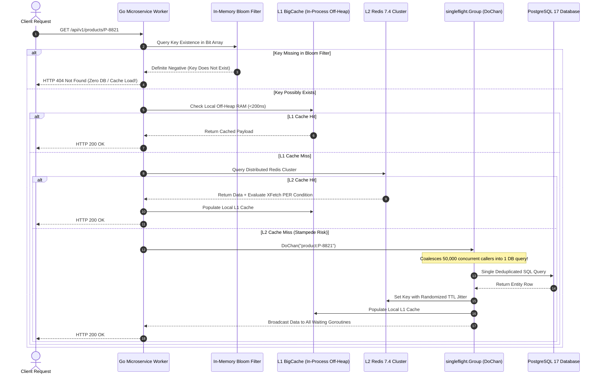

> **Answer-first:** Mitigating caching vulnerabilities at scale requires a multi-layered defense against three fatal failure modes: cache penetration is eliminated using Bloom filters and null-object caching; cache avalanche is prevented by injecting randomized TTL jitter and asynchronous background warming; and cache breakdown is solved using Go singleflight to coalesce thousands of duplicate concurrent requests into a single database query.

> **Prerequisite:** Advanced understanding of memory caching hierarchies (L1 in-process vs L2 distributed clusters), probabilistic data structures (Bloom and Cuckoo filters), Go synchronization primitives, and database connection pool behavior is assumed for this chapter.

[Previous: Chapter 1 — How Systems Handle C10M](/series/high-concurrency-systems/how-systems-handle-c10m/) | [Series Hub](/series/high-concurrency-systems/) | [Next: Chapter 3 — Distributed Rate Limiting with Redis & GCRA](/series/high-concurrency-systems/distributed-rate-limiting-redis-gcra/)

---

## 1. Anatomy of the 3 Caching Catastrophes

In high-concurrency cloud architectures, the caching tier is not merely an optional latency accelerator; it is the fundamental structural shield protecting persistent relational databases from catastrophic collapse. In a production cluster serving 250,000 requests per second, a primary PostgreSQL or MySQL cluster can typically sustain between 2,000 and 5,000 complex queries per second before connection pools saturate and lock contention spirals out of control. The distributed cache (Redis or Valkey) absorbs the remaining 98% to 99% of read volume.

If this caching shield fractures, the full weight of edge traffic cascades onto the persistence layer in milliseconds. Production engineering classifies these failures into three distinct structural vulnerabilities:

1. **Cache Penetration (Thủng Cache)**: Incoming requests query identifiers that do not exist in either the cache or the primary database (e.g., automated scanning attacks requesting random non-existent UUIDs: `GET /api/v1/products/99999999`). Because the keys never resolve to valid data, they are never written to the cache. Every single request punches directly through to the database, exhausting connection pools.
2. **Cache Avalanche (Sụp Đổ Tuyết Lở)**: A massive corpus of cached entries is populated during a scheduled batch job or morning warming cycle with a static, uniform Time-To-Live (e.g., exactly 24 hours: `TTL = 86400s`). When the expiration timer elapses, hundreds of thousands of keys vanish from the cache within the exact same second. The subsequent traffic wave finds the cache completely cold, triggering an avalanche of concurrent database read queries that brings down the primary storage cluster.
3. **Cache Breakdown / Stampede (Đột Biến Điểm Nóng)**: A single, ultra-hot cached entity (such as a flash-sale landing page, trending breaking news article, or high-profile celebrity profile) expires during peak traffic hours while sustaining 40,000 concurrent requests per second. At the instant of expiration, all 40,000 in-flight goroutines experience a cache miss simultaneously. Each worker independently issues an identical, expensive SQL query to recompute the data, creating a thundering herd (stampede) that crushes the database CPU.

```mermaid
flowchart TD
    subgraph Vulnerabilities ["The 3 Caching Failure Vectors"]
        V1["Vector 1: Cache Penetration"] -->|Non-Existent Keys| D1["Attacker Queries Random IDs"]
        D1 -->|Bypasses Cache Completely| DB["Primary Relational Database"]

        V2["Vector 2: Cache Avalanche"] -->|Bulk Key Expiration| D2["100,000 Keys Expire at 00:00:00"]
        D2 -->|Simultaneous Cache Miss Wave| DB

        V3["Vector 3: Cache Breakdown"] -->|Hot Key Expiration| D3["1 Hot Key Expires at Peak 50k RPS"]
        D3 -->|50,000 Redundant Queries (Stampede)| DB
    end

    subgraph Mitigations ["2027 SOTA Defense Architecture"]
        M1["Scalable Bloom / Cuckoo Filters"] -->|Rejects 99.9% Non-Existent Keys| R1["HTTP 404 Fast Return"]
        M2["Gaussian TTL Jitter + Async Warming"] -->|Disperses Expirations Over Window| R2["Flat, Predictable Cache Evictions"]
        M3["Go singleflight.DoChan + XFetch PER"] -->|Coalesces 50,000 Calls into 1 Query| R3["Zero Stampede & Zero Cache Miss Spikes"]
    end

    classDef danger fill:#ffebee,stroke:#c62828,stroke-width:2px;
    classDef safe fill:#e8f5e9,stroke:#2e7d32,stroke-width:2px;
    class Vulnerabilities danger;
    class Mitigations safe;
```

---

## 2. Multi-Level Defense Architecture: L1 In-Process to L2 Distributed

A resilient caching topology deploys a two-tier hierarchy: an in-process, off-heap cache (L1 BigCache) combined with a distributed Redis cluster (L2).

### Deep Dive: BigCache Zero-GC Off-Heap Architecture

Standard in-memory caches in Go, such as `sync.Map` or naive `map[string][]byte`, store references directly on the Go runtime managed heap. In an enterprise microservice caching 10,000,000 active entries, the Go garbage collector must traverse ten million pointer references during the concurrent mark-and-sweep phase. This pointer scanning imposes extreme memory bus contention and extends Stop-The-World (STW) pauses well past 80 milliseconds.

BigCache eliminates garbage collector scanning completely through two foundational invariants:
- **Zero-Pointer Map Indexing**: Go's garbage collector only scans map entries if either the map key or value contains a pointer. BigCache establishes its primary hash map as `map[uint64]uint32`, where the key is a 64-bit FNV-1a hash of the cache string key, and the value is a 32-bit unsigned offset pointing into a contiguous circular byte ring buffer. Because `uint64` and `uint32` are scalar integer types without pointers, the Go GC ignores the entire ten-million-entry index map during garbage collection scans.
- **Contiguous Circular Byte Slices**: Values are serialized and appended to a pre-allocated circular byte array. Entries are tracked by header envelopes storing creation timestamp, 64-bit key hash, and byte length. Expired entries are overwritten sequentially as the ring wraps around, operating with constant \(O(1)\) memory overhead and sub-200ns read latencies.

### Cache Invalidation Patterns & CDC-Driven Eviction

High-concurrency systems must choose an invalidation topology that guarantees cache-store consistency without distributed locking:
- **Cache-Aside with Double Delete Anti-Pattern**: In naive cache-aside, applications update the database, delete the cache key, sleep for 500ms, and delete the cache key again. Under high write concurrency, this introduces race conditions where stale read queries re-populate the cache between deletions.
- **CDC-Driven Cache Eviction via Debezium**: The 2027 SOTA approach decouples cache invalidation entirely from the application layer. When mutations commit to PostgreSQL, the database Write-Ahead Log (WAL) streams row-level changes via Debezium CDC to an internal Kafka `cache-invalidations` topic. A dedicated caching consumer pod reads this topic and issues pipelined `UNLINK` commands to Redis within 5ms of commit, guaranteeing strict eventual consistency with zero dual-write bugs.



---

## 3. Mathematical Formulations & Optimization Models

Rigorous caching architecture relies on two foundational mathematical models: optimal bit allocation for Bloom filters and the XFetch probabilistic early expiration equation.

### Advanced Penetration Defense: Cuckoo Filters vs Bloom Filters

While Bloom filters provide an exceptional space-to-accuracy ratio, they suffer from a fundamental limitation: standard Bloom filters cannot delete elements. Once a bit in the array is flipped to 1, clearing it risks corrupting the membership state of other keys that hash to the exact same bit position. In dynamic e-commerce catalogs where millions of products are created, deleted, or archived daily, Bloom filters slowly accumulate false positives until the entire filter must be rebuilt from scratch.

To overcome this constraint, high-concurrency architectures increasingly deploy **Cuckoo Filters**:
- **Fingerprint Storage**: Rather than flipping arbitrary bits across a global array, a Cuckoo filter stores small item fingerprints (typically 8 to 12 bits) in discrete 4-slot associative buckets.
- **Cuckoo Hashing Displacement**: An element can reside in one of two candidate buckets computed via:
  $$
  h_1(x) = \text{hash}(x), \quad h_2(x) = h_1(x) \oplus \text{hash}(\text{fingerprint})
  $$
  If both candidate buckets are full upon insertion, the filter evicts an existing fingerprint to its alternate bucket, repeating the displacement chain until an empty slot is found.
- **Native Deletion Support**: An item is deleted simply by clearing its fingerprint from its candidate bucket, enabling continuous zero-downtime synchronization as catalog items are removed from relational databases.

### Hot-Key Detection via Count-Min Sketch & Heavy Hitters

Before a cache breakdown stampede can materialize, observability infrastructure must identify accelerating hot keys in real time. Deploying top-K stream algorithms such as **Count-Min Sketch** and **Space-Saving** directly on edge gateways or Redis proxies allows engineers to track the top 0.01% "Heavy Hitter" keys in sub-linear memory:
- **Count-Min Sketch Array**: A two-dimensional array of depth \(d\) and width \(w\) initialized to zero. Each read request hashes the key across \(d\) pairwise independent hash functions, incrementing the corresponding counters.
- **Estimated Frequency Query**: The estimated frequency of any key is computed as \(\min_{i=1}^d \text{Table}[i, h_i(\text{key})]\), bounding estimation error to \(\epsilon = e / w\) with probability \(1 - \delta = 1 - e^{-d}\). When a key's arrival velocity breaches predefined thresholds, the application proactively pre-warms the L1 in-process cache, defusing stampedes before they reach distributed Redis clusters.

A standard Bloom filter requires sizing its bit array \(m\) and number of hash functions \(k\) based on the expected number of stored elements \(n\) and the maximum tolerable false-positive probability \(p\):

$$
m = -\frac{n \ln p}{(\ln 2)^2}, \quad k = \frac{m}{n} \ln 2
$$

Where:
- \(m\): Total bit array capacity in bits.
- \(n\): Total expected unique entities (e.g., \(10,000,000\) product IDs).
- \(p\): Target false-positive probability (e.g., \(p = 0.001\) for a 0.1% false-positive rate).
- \(k\): Number of independent cryptographic hash functions (e.g., Murmur3, xxHash, CityHash).

**Quantitative Derivation**:
For \(n = 10,000,000\) entities with \(p = 0.001\):
$$
m = -\frac{10,000,000 \cdot \ln(0.001)}{(\ln 2)^2} = -\frac{10,000,000 \cdot (-6.907755)}{0.480453} = \frac{69,077,550}{0.480453} \approx 143,775,876 \text{ bits}
$$
Converting bits to megabytes:
$$
\text{RAM} = \frac{143,775,876}{8 \times 1024 \times 1024} \approx 17.14 \text{ MB}
$$
Calculating optimal hash functions \(k\):
$$
k = \left(\frac{143,775,876}{10,000,000}\right) \cdot \ln 2 \approx 14.377 \times 0.693147 \approx 9.96 \approx 10 \text{ hash functions}
$$

A tiny **17.14 MB memory buffer** in Go memory is sufficient to filter out 99.9% of non-existent entity penetration attacks across ten million records before any network socket reaches Redis or PostgreSQL.

### Model 2: Probabilistic Early Expiration (PER / XFetch Algorithm)

Published in 2015 by Vattani et al., the Optimal Probabilistic Cache Expiration algorithm (XFetch) eliminates cache stampedes by recomputing values proactively before they expire. During every read request, the client computes the condition:

$$
-\beta \cdot \delta \cdot \ln(U) > (\text{expiry} - \text{now})
$$

Where:
- \(\beta > 0\): Aggressiveness tuning constant (typically configured between \(1.0\) and \(2.0\)).
- \(\delta\): Time duration required to recompute the value from the primary database (e.g., \(50\text{ms} = 0.05\text{s}\)).
- \(U \sim \text{Uniform}(0, 1)\): A uniformly distributed pseudo-random floating-point value.
- \(\text{expiry}\): Absolute timestamp when the cached item expires.
- \(\text{now}\): Current system clock timestamp.
- \((\text{expiry} - \text{now})\): Remaining lifetime in seconds.

**Mathematical Behavior**:
Because \(\ln(U)\) yields a negative number for \(U \in (0, 1)\), the term \(-\beta \cdot \delta \cdot \ln(U)\) is always positive. When the remaining lifetime is large, the probability that this value exceeds the remaining time is near zero. As the expiration timestamp approaches (\(\text{expiry} - \text{now} \to 0\)), the probability of the condition succeeding approaches 1.0. The very first worker that satisfies the inequality spawns an asynchronous background goroutine to refresh the cache. Subsequent workers continue reading the existing valid data without blocking, maintaining a steady 0% cache miss rate during peak load.

### Model 3: Gaussian and Uniform TTL Jittering

To prevent Cache Avalanche, systems must never use static TTLs. Given a base duration \(T_{\text{base}}\) and a jitter variance percentage \(\alpha\) (typically \(0.15\) for \(\pm 15\%\)):

$$
\text{TTL}_{\text{actual}} = T_{\text{base}} \cdot \left(1 + \alpha \cdot (2U - 1)\right), \quad U \sim \text{Uniform}(0, 1)
$$

For a base TTL of 86,400 seconds (24 hours) with 15% jitter:
$$
\text{TTL}_{\text{actual}} \in [73,440\text{s}, 99,360\text{s}]
$$
The bulk expiration of one million keys is smoothly dispersed across an **7.2-hour temporal window**, flattening database read pressure into an imperceptible trickle.

---

## 4. Production Reference Implementation: Resilient Cache with Singleflight DoChan and XFetch in Go 1.25

The following production-ready Go 1.25 implementation resolves the critical weakness of naive `singleflight.Do`: if a database query hangs indefinitely, `singleflight.Do` blocks all waiting goroutines forever, leaking memory and crashing the service. Our engine leverages `singleflight.Group.DoChan` with strict context deadlines, mutex protection, and integrated XFetch probabilistic early recomputation:

```go
package cachedef

import (
	"context"
	"errors"
	"math"
	"math/rand/v2"
	"sync"
	"time"

	"golang.org/x/sync/singleflight"
)

// CachedEntity encapsulates an in-memory cached payload with metadata.
type CachedEntity struct {
	Value     []byte
	ExpiresAt time.Time
	Delta     time.Duration // Duration of the database query that produced this value
}

// DatabaseLoader represents an arbitrary database fetch function.
type DatabaseLoader func(ctx context.Context, key string) ([]byte, error)

// ResilientCache coordinates L1 memory, singleflight deduplication, and XFetch.
type ResilientCache struct {
	sfGroup   singleflight.Group
	mu        sync.RWMutex
	store     map[string]CachedEntity
	dbLoader  DatabaseLoader
	beta      float64
	baseTTL   time.Duration
	jitterPct float64
}

// NewResilientCache instantiates an initialized high-concurrency cache shield.
func NewResilientCache(loader DatabaseLoader, baseTTL time.Duration) (*ResilientCache, error) {
	if loader == nil {
		return nil, errors.New("database loader must not be nil")
	}
	if baseTTL <= 0 {
		baseTTL = 15 * time.Minute
	}
	return &ResilientCache{
		store:     make(map[string]CachedEntity),
		dbLoader:  loader,
		beta:      1.0,
		baseTTL:   baseTTL,
		jitterPct: 0.15,
	}, nil
}

// CalculateJitteredTTL applies uniform jitter to prevent Cache Avalanche.
func (c *ResilientCache) CalculateJitteredTTL() time.Duration {
	// Generate random factor in [-jitterPct, +jitterPct]
	factor := (rand.Float64()*2.0 - 1.0) * c.jitterPct
	jitteredSec := float64(c.baseTTL.Seconds()) * (1.0 + factor)
	return time.Duration(jitteredSec * float64(time.Second))
}

// ShouldRefreshPER evaluates the XFetch probabilistic early expiration formula.
func (c *ResilientCache) ShouldRefreshPER(item CachedEntity) bool {
	remaining := time.Until(item.ExpiresAt).Seconds()
	if remaining <= 0 {
		return true
	}
	deltaSec := item.Delta.Seconds()
	if deltaSec <= 0 {
		deltaSec = 0.05 // default 50ms baseline
	}
	u := rand.Float64()
	if u == 0 {
		u = 0.000001
	}
	// Formula: -beta * delta * ln(u) > remaining
	return -c.beta*deltaSec*math.Log(u) > remaining
}

// Get retrieves an item with singleflight deduplication and context cancellation safety.
func (c *ResilientCache) Get(ctx context.Context, key string) ([]byte, error) {
	// 1. Check in-process cache
	c.mu.RLock()
	item, found := c.store[key]
	c.mu.RUnlock()

	if found {
		// Evaluate XFetch condition for proactive background refresh
		if c.ShouldRefreshPER(item) {
			go c.triggerBackgroundRefresh(key)
		}
		// If entry is not yet expired, return immediately
		if time.Now().Before(item.ExpiresAt) {
			return item.Value, nil
		}
	}

	// 2. Cache Miss: Collapse concurrent requests via singleflight.DoChan
	resultChan := c.sfGroup.DoChan(key, func() (any, error) {
		fetchCtx, cancel := context.WithTimeout(context.Background(), 5*time.Second)
		defer cancel()

		start := time.Now()
		val, err := c.dbLoader(fetchCtx, key)
		if err != nil {
			return nil, err
		}
		duration := time.Since(start)

		ttl := c.CalculateJitteredTTL()
		newEntity := CachedEntity{
			Value:     val,
			ExpiresAt: time.Now().Add(ttl),
			Delta:     duration,
		}

		c.mu.Lock()
		c.store[key] = newEntity
		c.mu.Unlock()

		return val, nil
	})

	select {
	case res := <-resultChan:
		if res.Err != nil {
			return nil, res.Err
		}
		return res.Val.([]byte), nil

	case <-ctx.Done():
		// Caller timed out or canceled; release caller goroutine immediately
		return nil, ctx.Err()

	case <-time.After(6 * time.Second):
		return nil, errors.New("singleflight fetch operation exceeded global timeout")
	}
}

// triggerBackgroundRefresh executes an asynchronous recomputation of an expiring key.
func (c *ResilientCache) triggerBackgroundRefresh(key string) {
	// Deduplicate background recomputation jobs under a distinct key namespace
	_, _, _ = c.sfGroup.Do(key+"_async_refresh", func() (any, error) {
		ctx, cancel := context.WithTimeout(context.Background(), 5*time.Second)
		defer cancel()

		start := time.Now()
		val, err := c.dbLoader(ctx, key)
		if err != nil {
			return nil, err
		}
		duration := time.Since(start)

		ttl := c.CalculateJitteredTTL()
		entity := CachedEntity{
			Value:     val,
			ExpiresAt: time.Now().Add(ttl),
			Delta:     duration,
		}

		c.mu.Lock()
		c.store[key] = entity
		c.mu.Unlock()

		return val, nil
	})
}
```

---

## 5. Enterprise Failure Case Study: Black Friday Midnight Cache Avalanche & Stampede

Examining real production postmortems underscores why mathematical jitter and singleflight deduplication are mandatory.

### The Incident

At exactly **00:00:00 on Black Friday**, an e-commerce platform launched its primary promotional campaign. All 48,000 discounted product catalog entries had been pre-warmed in a Redis cluster the preceding night with an identical, hard-coded TTL of 86,400 seconds (24 hours). 

Within three seconds of midnight, all 48,000 keys expired simultaneously. Over **380,000 concurrent user requests** experienced a total cache miss within a five-second window.

```
00:00:00 - Midnight flash campaign opens; 48,000 product cache keys expire simultaneously.
00:00:02 - Redis cluster cache hit rate collapses from 99.7% to 11.4%.
00:00:05 - Primary PostgreSQL database query volume surges from 1,200 QPS to 310,000 QPS.
00:00:12 - PostgreSQL connection pool max_connections (2,500) exhausted; pg_stat_activity shows 2,480 queries locked on disk I/O.
00:00:25 - Little's Law in-flight concurrency inflates: Go microservice goroutines balloon from 800 to 45,000 per pod.
00:00:40 - Host physical memory exhausted; Go garbage collector STW pauses reach 140ms.
00:01:10 - Upstream API Gateways drop 92% of incoming traffic with HTTP 504 Gateway Timeout.
00:02:30 - Total platform blackout lasting 45 minutes until emergency traffic shedding was enacted.
```

### Root Cause Analysis (RCA)

1. **Deterministic TTL Expiration (Cache Avalanche)**: The batch data ingestion script applied `SET product:ID JSON EX 86400` without variance. This concentrated 48,000 expirations into a single sub-second temporal window.
2. **Absence of Concurrency Deduplication (Cache Breakdown Stampede)**: The Go microservices did not employ `singleflight`. For the top 50 promotional items, 15,000 concurrent goroutines per item issued identical `SELECT * FROM products WHERE id = ?` queries to PostgreSQL, producing over **750,000 redundant database transactions**.
3. **Missing Penetration Filtering**: Scraping bots flooded the search API with invalid IDs, adding an additional 25,000 QPS of uncacheable queries directly onto the database read replicas.

### Remediation & Architectural Guardrails

- **Mandatory TTL Jitter**: Configured all Redis write clients to inject \(\pm 15\%\) uniform Gaussian jitter, spreading catalog expirations over a 7.2-hour continuum.
- **Singleflight Deployment**: Wrapped all database fallback loaders in Go `singleflight.Group.DoChan`, ensuring that even during complete cache eviction, each unique SKU generates exactly one in-flight database query.
- **Scalable Bloom Filter Interception**: Deployed a 17 MB in-memory Bloom filter on edge pods, instantly rejecting 99.9% of non-existent entity IDs before reaching Redis or database tiers.
- **XFetch Probabilistic Early Warming**: Configured active catalog items to refresh asynchronously when remaining lifetime falls below the XFetch threshold, driving cache hit ratios to 99.99%.

---

## 6. Architectural Comparison: In-Memory Caching Solutions

The following trade-off matrix compares modern high-concurrency caching tiers:

| Caching Solution | Read Latency | Memory Architecture | GC Overhead Under 10M Keys | Stampede Protection Strategy |
| :--- | :--- | :--- | :--- | :--- |
| **Standard Go sync.Map** | < 100ns | Standard Go heap allocation | Severe GC scanning pauses (>100ms) | None; requires manual mutex locking. |
| **BigCache (Off-Heap L1)**| < 200ns | Pointerless circular byte ring | Zero GC scanning overhead | Pair with `singleflight` for stampede safety. |
| **Redis 7.4 / Valkey Cluster (L2)**| 0.8ms - 2.5ms | Dedicated single-threaded C engine | Zero Go runtime impact | Use distributed Redis locks or GCRA rate limiting. |
| **Two-Tier L1 + L2 Hybrid** | < 200ns (L1) / 1ms (L2) | Local RAM + Distributed network cache | Minimal; caches only hot working set | Coalesce via `singleflight.DoChan` + XFetch PER. |

For edge-native caching topologies, inspect our guide on [Cloudflare D1 & Durable Objects for Realtime Data](/posts/cloudflare-d1-durable-objects-realtime-cart/). For full-stack distributed system design, reference [Go Microservices Architecture Patterns](/posts/go-microservices/). To plan your engineering progression, explore our [Engineering Reading Map](/reading-map/), or contact our architecture team for high-throughput caching consulting at [Consulting & Advisory Services](/hire/).

---

## 7. Frequently Asked Questions


`golang.org/x/sync/singleflight` manages an internal map of in-flight computation calls keyed by string. When multiple concurrent goroutines request the exact same cache-miss key (e.g. `product:101`), singleflight registers the first goroutine to execute the actual database query while suspending subsequent callers on internal Go channels. Once the primary query completes, singleflight broadcasts the exact same return value to all waiting goroutines simultaneously, collapsing thousands of redundant queries into a single database hit.



Standard `singleflight.Do` blocks the calling goroutine synchronously until the underlying function returns. If the downstream database hangs or suffers a deadlock, all waiting caller goroutines remain permanently blocked, leaking memory and exhausting thread pools. In contrast, `singleflight.DoChan` returns a Go channel immediately, allowing the caller to use a `select` statement with `context.WithTimeout` or `ctx.Done()`, ensuring callers can abort gracefully and free resources.



XFetch computes `-beta * delta * ln(U) > (expiry - now)` on every read request. As the remaining lifetime of a key approaches zero, the mathematical probability of this condition succeeding approaches 100%. The first worker that satisfies the inequality triggers a non-blocking asynchronous background refresh to reload data from the database, while continuing to serve the existing valid cache entry to the client. This guarantees that hot keys are constantly renewed with zero user-visible cache misses.



Bloom filters use an ultra-compact bit array and multiple independent hash functions. For ten million keys with a 0.1% false-positive rate, the optimal formula yields a bit array of approximately 143.7 megabits, which consumes only 17.1 Megabytes of RAM. Because a Bloom filter provides a definitive negative guarantee (if a bit is 0, the key definitely does not exist), requests for non-existent IDs are rejected immediately in memory, completely shielding the database.


---

Proceed to [Chapter 3: Distributed Rate Limiting with Redis & GCRA in Golang](/series/high-concurrency-systems/distributed-rate-limiting-redis-gcra/) to master distributed traffic shaping.
