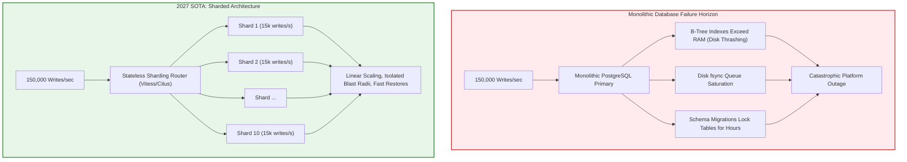
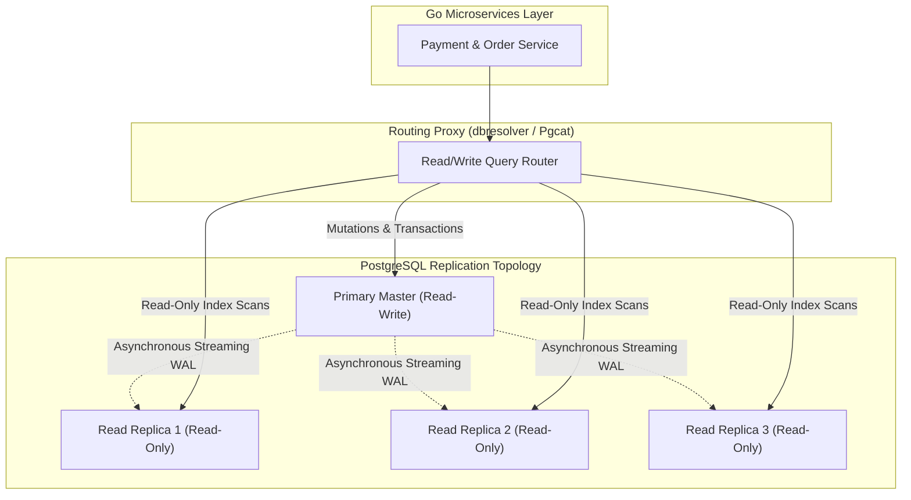
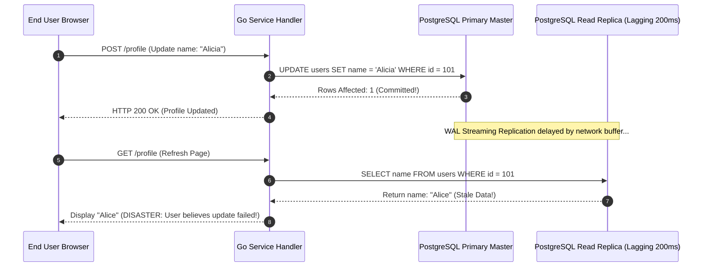
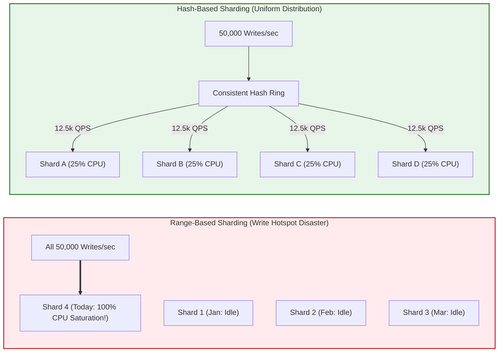
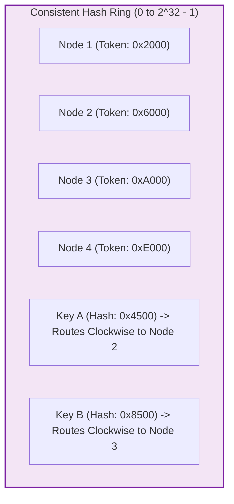
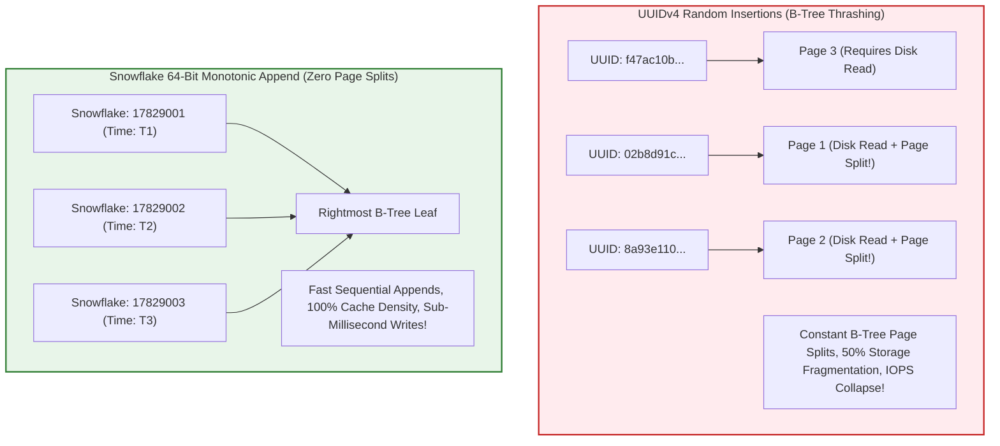
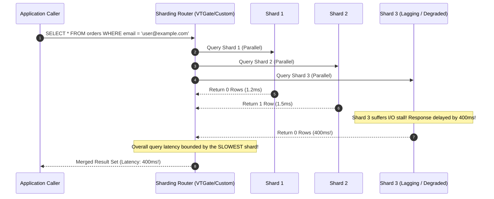
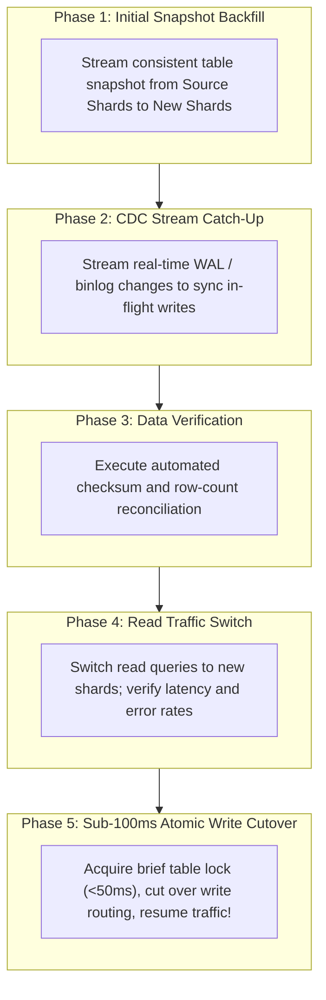

> **Answer-first:** Scaling relational databases beyond vertical hardware limits requires read/write splitting with session pinning to eliminate replication lag anomalies, followed by horizontal sharding across isolated partitions. The 2027 SOTA architecture pairs consistent hashing with virtual nodes, 64-bit monotonic Snowflake IDs to prevent B-Tree index fragmentation, and saga orchestration over blocking two-phase commits for cross-shard consistency.

> **Prerequisite:** Advanced knowledge of relational database internals (WAL logs, B-Tree indexes, replication lag), consistent hashing algorithms, and distributed transaction semantics is required for this chapter.

[Previous: Chapter 8 — Distributed Locking: Redlock vs ZooKeeper Lease Fencing](/series/high-concurrency-systems/distributed-locking-redlock-zookeeper/) | [Series Hub](/series/high-concurrency-systems/)

---

## 1. The Scaling Limits of Single Relational Databases

For the vast majority of software applications, a single vertically scaled PostgreSQL or MySQL instance handles workloads gracefully. With modern cloud instances offering up to 128 vCPUs, 1,024 GB of RAM, and provisioned NVMe SSD storage yielding 64,000 IOPS, a well-tuned relational database comfortably serves 20,000 to 50,000 queries per second.

However, when hyper-growth businesses breach petabyte-scale data volumes and sustained write traffic exceeds 100,000 mutations per second, single-node relational architectures hit insurmountable physical and economic barriers:

- **B-Tree Index Memory Saturation**: As table row counts exceed hundreds of millions, B-Tree indexes exceed the host's `shared_buffers` RAM capacity. Index traversals trigger continuous random disk page faults, degrading P99 query latency from 1.5ms to over 200ms.
- **Write I/O and Write-Ahead Log (WAL) Bottlenecks**: A database primary node can only scale writes as fast as its storage subsystem can execute sequential disk flushes (`fsync`) to the WAL log.
- **Vacuum and Maintenance Lock Contention**: Routine PostgreSQL autovacuum operations and MySQL table optimizations take days to complete on multi-terabyte tables, locking disk I/O channels.
- **Catastrophic Backup and Restore Times**: Performing a physical snapshot restore or `pg_dump` backup on a 15-terabyte monolithic database takes 18 to 36 hours, breaching disaster recovery (RTO) enterprise SLAs.



For real-world high-throughput distributed database architectures, explore our [Alipay Double 11 Architecture Deep-Dive](/posts/alipay-double-11-architecture-tps/) and [Architectural Reading Map](/reading-map/).

---

## 2. Read/Write Splitting & The Session Pinning Dilemma

Before embarking on the architectural complexity of horizontal sharding, engineering teams must first exploit **Read/Write Splitting**.

### Architecture of Read/Write Splitting

In typical OLTP workloads, read queries outnumber write queries by a factor of 5:1 to 20:1. Read/Write Splitting routes all state-mutating transactions (`INSERT`, `UPDATE`, `DELETE`, `SELECT ... FOR UPDATE`) to the Primary Master database, while delegating read-only queries (`SELECT`) across an array of Read Replicas:



### The Replication Lag Trap: Read-Your-Own-Writes Anomaly

Because PostgreSQL and MySQL streaming replication is asynchronous for performance reasons, there is an unavoidable **Replication Lag** (typically 5ms to 500ms, spiking to seconds under high load).

This lag triggers the notorious **Read-Your-Own-Writes Anomaly**:

1. A user updates their profile name from "Alice" to "Alicia".
2. The mutation commits instantly on the Primary Master.
3. The user's browser immediately refreshes, issuing a `GET /profile` request.
4. The router dispatches the read query to Read Replica 2, which is lagging by 150ms.
5. The user sees their old name "Alice" on screen, believes the update failed, and submits the form repeatedly, creating confusion and support tickets.



### Battle-Tested Session Pinning

To eliminate this bug, high-concurrency systems implement **Session Pinning (Causal Consistency Tracking)**:

- **Time-Based Pinning**: Following any write mutation, the application sets a short-lived cookie or Redis flag (`user_session_pin:{user_id}`) valid for 2 to 5 seconds. All read queries from that user during this window are forced to route directly to the Primary Master.
- **Log Sequence Number (LSN) Pinning**: The Primary returns its latest WAL Log Sequence Number (`pg_current_wal_lsn()`). The client includes this LSN in subsequent reads. The router verifies whether the target replica's received LSN (`pg_last_wal_replay_lsn()`) has surpassed the mutation LSN; if not, it queries the Primary.

---

## 3. Sharding Key Selection: The Architectural Foundation

When write throughput saturates the Primary Master even after offloading reads, horizontal **Database Sharding** becomes mandatory.

### The Sharding Key Invariant

The sharding key determines which physical database partition stores a given row. Selecting the wrong sharding key is a fatal architectural mistake that requires months of painful data migration to rectify.

### Range-Based Sharding vs Hash-Based Sharding

1. **Range-Based Sharding (e.g. by `created_at` date or auto-incrementing ID)**:
   - *Pitfall*: Creates catastrophic **Write Hotspots**. All new transactions flow exclusively to the latest active partition, starving older partitions while overwhelming the current shard.
2. **Hash-Based Sharding (e.g. `hash(user_id) % N`)**:
   - *Advantage*: Guarantees mathematically uniform distribution of write IOPS and disk storage across all shards.



### The Entity Co-Location Principle

To preserve local relational joins (`JOIN`), foreign keys, and atomic transactions within a single shard, all related entity tables must share the **same sharding key**:

- In an e-commerce platform, sharding by `merchant_id` co-locates `merchants`, `orders`, `order_items`, and `inventory` onto the same shard. A complex multi-table checkout query executes locally on a single database engine with full ACID guarantees.
- Cross-shard queries occur only when an aggregate report spans multiple merchants.

---

## 4. Consistent Hashing & Virtual Nodes (Vnodes)

A catastrophic flaw in naive sharding implementations is using the standard modulo operator: `shard_id = hash(key) % N`.

### The Modulo N Resharding Disaster

Suppose an organization shards its database across 4 physical nodes ($N = 4$). When traffic increases and a 5th node is added ($N = 5$), the modulo calculation changes for virtually every key:

$$\text{NewShard} = \text{hash}(key) \pmod 5 \neq \text{hash}(key) \pmod 4$$

Over **80% of all data rows** must be physically relocated across the network simultaneously, bringing production databases to a complete standstill.

### Consistent Hashing Ring Topology

Consistent hashing maps both database nodes and data keys onto a circular 32-bit or 64-bit integer ring ($0$ to $2^{32}-1$):



When adding a new node to the ring, **only keys that fall between the new node and its predecessor are migrated**, bounding data movement strictly to:

$$\text{Migrated Data Ratio} = \frac{1}{N + 1}$$

### Virtual Nodes (Vnodes)

In a basic consistent hashing ring with few physical nodes, non-uniform hash distribution leads to severe statistical skew, where one node holds 50% of the data.

To guarantee perfect balance, each physical server is assigned 100 to 256 **Virtual Nodes (Vnodes)** distributed pseudo-randomly across the ring. If physical Node 3 is provisioned with double the RAM and CPU, it receives double the number of virtual nodes, naturally absorbing double the traffic.

---

## 5. Distributed ID Generation: Snowflake vs TSID vs UUIDv4

In a sharded database, traditional single-node `AUTO_INCREMENT` and `BIGSERIAL` sequences are completely broken because multiple independent shards cannot coordinate sequential integers without a centralized locking bottleneck.

### Why UUIDv4 Destroys B-Tree Index Performance

Engineers frequently attempt to resolve this by generating random `UUIDv4` identifiers in application code. This is an catastrophic anti-pattern in high-throughput databases.

Because UUIDv4 values are completely random, new insertions do not append sequentially to the rightmost leaf of the database's primary key B-Tree index. Instead, insertions scatter randomly across arbitrary leaf pages:



Random insertions trigger continuous **B-Tree Page Splits**, inflating disk fragmentation by over 50% and thrashing memory caches. Write throughput collapses from 30,000 writes/sec to under 3,000 writes/sec.

### The Twitter Snowflake 64-Bit Architecture

The industry gold standard for distributed primary keys is the **Twitter Snowflake** 64-bit integer:

```text
+---------------------------------------------------------------------------------+
| 1 Bit | 41 Bits: Timestamp (ms) | 10 Bits: Worker/Shard ID | 12 Bits: Sequence  |
+---------------------------------------------------------------------------------+
```

1. **1 Bit Unused**: Signed integer compatibility bit (always 0).
2. **41 Bits Millisecond Timestamp**: Custom epoch provides 69 years of unique identifiers.
3. **10 Bits Worker/Machine ID**: Accommodates 1,024 independent worker nodes or shard instances without collision.
4. **12 Bits Sequence Number**: Allows each worker node to generate up to 4,096 unique IDs per single millisecond (over 4 million IDs per second per node).

Because the most significant 41 bits represent time, Snowflake IDs are **roughly time-ordered (k-sorted)**. Database inserts always append to the rightmost page of the B-Tree index, maximizing buffer cache hits and delivering maximum write throughput.

---

## 6. Scatter-Gather Queries & Secondary Lookups

When a query includes the sharding key in its `WHERE` clause (`WHERE merchant_id = 4920`), the sharding proxy routes the query directly to the single target shard. Execution is lightning fast.

However, queries that do not specify the sharding key (e.g. `SELECT * FROM orders WHERE customer_email = 'user@example.com'`) present a fundamental challenge: **Scatter-Gather**.

### The Scatter-Gather Penalty

To satisfy a non-sharded query, the router must broadcast the SQL query to *all* physical shards in parallel, wait for all shards to reply, merge the result sets in proxy memory, and re-sort:



The latency of a scatter-gather query is strictly bounded by the slowest, most degraded shard in the entire fleet. Furthermore, deep pagination (`LIMIT 20 OFFSET 50000`) requires every shard to return 50,020 rows to the proxy, consuming hundreds of megabytes of RAM.

### Solutions: Global Secondary Indexes & Search Offloading

1. **Global Secondary Index (GSI) Tables**: Maintain a specialized mapping table sharded by `email` that stores the corresponding `merchant_id`. The client first queries the GSI (single-shard lookup) to discover the `merchant_id`, then queries the main sharded cluster directly.
2. **Search Engine Offload**: Replicate sharded tables asynchronously via the Transactional Outbox pattern or Debezium CDC into Elasticsearch or ClickHouse for multi-dimensional filtering, analytics, and full-text search.

---

## 7. Distributed Transactions: Two-Phase Commit vs Saga Orchestration

When a single user transaction must mutate data spanning multiple distinct database shards (e.g. transferring funds between Account A on Shard 1 and Account B on Shard 2), traditional local ACID transactions cannot guarantee consistency.

### The Perils of Two-Phase Commit (2PC / XA)

The classic database solution is the Two-Phase Commit (2PC / XA) protocol:
- **Phase 1 (Prepare)**: The coordinator instructs all participating shards to acquire locks and write transaction data to durable storage without committing.
- **Phase 2 (Commit)**: If all shards report success, the coordinator broadcasts the commit directive.

In high-concurrency cloud environments, 2PC is an anti-pattern:
1. **Blocking Coordinator Hazard**: If the coordinator crashes or network partitions occur during Phase 1, participating shards hold row-level locks indefinitely, cascading into connection starvation.
2. **Throughput Collapse**: Locks are held across multiple network round-trips, driving transaction throughput down by 90% and P99 latency up by an order of magnitude.

### The Modern Alternative: Orchestrated Sagas

Production architectures utilize the **Saga Pattern** with compensating transactions:
- The transaction executes as a sequence of local, independent transactions.
- Step 1 executes on Shard 1 and commits immediately, releasing all database locks.
- If Step 2 on Shard 2 fails permanently, the saga orchestrator executes an explicit compensating transaction on Shard 1 (e.g. crediting the debited funds back).
- Sagas trade strict immediate isolation (I in ACID) for extreme horizontal throughput and availability (BASE semantics).

---

## 8. Enterprise Sharding Middleware: Vitess vs Citus

Engineering teams rarely build sharding logic from scratch today; they deploy battle-tested distributed database middleware.

### Vitess: Hyperscale Horizontal MySQL

Originally created by YouTube to scale MySQL to billions of users, **Vitess** serves as the gold standard in CNCF graduated sharding:
- **VTGate**: Stateless query routers that parse SQL queries, consult the global routing schema (**VSchema**), and direct queries to the appropriate shards.
- **VTTablet**: A sidecar proxy running alongside each MySQL instance that manages database connection pools, enforces query timeouts, and shields MySQL from traffic surges.
- **VReplication**: Built-in Change Data Capture engine that enables online live resharding without downtime.

### Citus: Distributed PostgreSQL

**Citus** transforms standard PostgreSQL into a distributed database using a native open-source extension:
- **Distributed Tables**: Tables are partitioned using hash sharding across worker nodes.
- **Reference Tables**: Small dimension tables (e.g. postal codes, product categories) are replicated 100% across all workers, allowing distributed joins to execute locally on each worker node with zero cross-network traffic.

---

## 9. Zero-Downtime Live Resharding: The 5-Phase Protocol


### Production Failure Autopsy: The $850k Flash Sale Inventory Oversell

To witness the real-world operational hazards of un-pinned read/write splitting, we analyze an incident that struck a consumer electronics e-tailer during a major smartphone product launch.

#### Incident Timeline & Failure Chain

1. **12:00:00 PM**: Flash sale launches for 5,000 limited-edition smartphones. Ingress traffic spikes to 65,000 QPS.
2. **12:00:05 PM**: User A reserves the final remaining smartphone in stock. The inventory service executes a write transaction against the PostgreSQL Primary: `UPDATE inventory SET quantity = 0 WHERE item_id = 902`. The write commits instantly.
3. **12:00:06 PM**: User B submits a checkout request for the same smartphone. Due to round-robin read/write splitting, the inventory check query `SELECT quantity FROM inventory WHERE item_id = 902` is dispatched to Read Replica 3.
4. **12:00:06 PM**: Under the sudden 65,000 QPS load, Read Replica 3 experiences a 2,800ms replication lag due to network buffer bloat. Replica 3 still reads `quantity = 1`!
5. **12:00:07 PM**: The application authorizes User B's checkout. Both User A and User B receive confirmed order confirmations for the exact same unique serial number.
6. **Result**: The platform oversold 850 non-existent devices across the afternoon, forcing the company to pay $850,000 in customer appeasement vouchers and order cancellations.

#### Technical Remediation

The platform instituted two immutable architectural rules:
1. **Critical Mutation Isolation**: State checks preceding financial or stock mutations (`SELECT FOR UPDATE`) are strictly forbidden from routing to read replicas. They must execute directly against the Primary Master.
2. **Session Pinning Enforcement**: Every client that executes an inventory reservation is pinned to the Primary for 5,000ms using a cryptographic JWT claim, guaranteeing causal consistency across subsequent reads.


The ultimate test of a sharded database architecture is splitting an active shard from $N$ to $2N$ nodes while serving live production traffic.



1. **Phase 1: Initial Snapshot Backfill**: Create a consistent snapshot on source shards and stream data bulk-copies to new destination shards.
2. **Phase 2: CDC Stream Catch-Up**: Stream real-time write-ahead logs (VReplication / Debezium) to apply mutations that occurred during backfill until replication lag approaches zero.
3. **Phase 3: Automated Data Diff Verification**: Run parallelized cryptographic hashing queries across key ranges to confirm 100% data parity between source and destination.
4. **Phase 4: Read Traffic Switch (`SwitchReads`)**: Direct all read traffic to the new shards. If query errors or latency regressions emerge, roll back immediately with zero data loss.
5. **Phase 5: Sub-100ms Atomic Write Cutover (`SwitchWrites`)**: The router briefly pauses writes for under 50 milliseconds, verifies WAL synchronization, updates its routing map atomically, and resumes full write traffic against the newly split shards.

---

## 10. Production-Grade Implementation

The following complete, compilable Go 1.25+ module implements an enterprise consistent hash ring with virtual nodes (Vnodes) and a Twitter Snowflake 64-bit distributed ID generator.

```go
package main

import (
	"crypto/sha256"
	"encoding/binary"
	"errors"
	"fmt"
	"sort"
	"strconv"
	"sync"
	"time"
)

var (
	ErrNoNodesAvailable = errors.New("no shard nodes registered in hash ring")
	ErrClockMovedBack   = errors.New("clock moved backwards, refusing to generate id")
)

// ConsistentHashRing manages deterministic key-to-shard mapping with virtual nodes.
type ConsistentHashRing struct {
	mu       sync.RWMutex
	vnodes   int
	ring     []uint32
	nodeMap  map[uint32]string
	allNodes map[string]bool
}

// NewConsistentHashRing constructs a hash ring with the specified virtual node count.
func NewConsistentHashRing(vnodes int) *ConsistentHashRing {
	if vnodes <= 0 {
		vnodes = 150
	}
	return &ConsistentHashRing{
		vnodes:   vnodes,
		nodeMap:  make(map[uint32]string),
		allNodes: make(map[string]bool),
	}
}

func hashKey(key string) uint32 {
	hasher := sha256.New()
	hasher.Write([]byte(key))
	digest := hasher.Sum(nil)
	return binary.BigEndian.Uint32(digest[:4])
}

// AddNode registers a physical shard node with its assigned virtual nodes.
func (r *ConsistentHashRing) AddNode(node string) {
	r.mu.Lock()
	defer r.mu.Unlock()

	if r.allNodes[node] {
		return
	}
	r.allNodes[node] = true

	for i := 0; i < r.vnodes; i++ {
		vnodeKey := node + "#" + strconv.Itoa(i)
		vhash := hashKey(vnodeKey)
		r.ring = append(r.ring, vhash)
		r.nodeMap[vhash] = node
	}
	sort.Slice(r.ring, func(i, j int) bool { return r.ring[i] < r.ring[j] })
}

// GetNode routes a sharding key to its responsible physical shard node.
func (r *ConsistentHashRing) GetNode(key string) (string, error) {
	r.mu.RLock()
	defer r.mu.RUnlock()

	if len(r.ring) == 0 {
		return "", ErrNoNodesAvailable
	}

	h := hashKey(key)
	idx := sort.Search(len(r.ring), func(i int) bool {
		return r.ring[i] >= h
	})

	if idx == len(r.ring) {
		idx = 0
	}

	return r.nodeMap[r.ring[idx]], nil
}

// SnowflakeIDGenerator implements Twitter Snowflake 64-bit ID generation.
type SnowflakeIDGenerator struct {
	mu            sync.Mutex
	workerID      int64
	sequence      int64
	lastTimestamp int64
	epoch         int64
}

// NewSnowflakeIDGenerator initializes a Snowflake generator with a 10-bit worker ID.
func NewSnowflakeIDGenerator(workerID int64) (*SnowflakeIDGenerator, error) {
	if workerID < 0 || workerID > 1023 {
		return nil, fmt.Errorf("worker ID must be between 0 and 1023, got %d", workerID)
	}
	return &SnowflakeIDGenerator{
		workerID: workerID,
		epoch:    1704067200000, // 2024-01-01 00:00:00 UTC
	}, nil
}

// NextID generates a monotonic 64-bit distributed identifier.
func (s *SnowflakeIDGenerator) NextID() (int64, error) {
	s.mu.Lock()
	defer s.mu.Unlock()

	now := time.Now().UnixMilli()
	if now < s.lastTimestamp {
		return 0, ErrClockMovedBack
	}

	if now == s.lastTimestamp {
		s.sequence = (s.sequence + 1) & 4095
		if s.sequence == 0 {
			for now <= s.lastTimestamp {
				now = time.Now().UnixMilli()
			}
		}
	} else {
		s.sequence = 0
	}

	s.lastTimestamp = now
	id := ((now - s.epoch) << 22) | (s.workerID << 12) | s.sequence
	return id, nil
}
```

---

## 11. Frequently Asked Questions


Sharding should only be undertaken when write throughput saturates the physical I/O and WAL limits of a high-end primary instance (>50k-100k writes/sec), when single-table row counts cause B-Tree indexes to thrash RAM, or when backup/restore times violate disaster recovery SLAs. For read-heavy systems, read/write splitting, caching, and partitioning should always be exhausted first.



UUIDv4 identifiers are completely random, scattering new inserts across arbitrary pages in the database's primary key B-Tree index. This triggers continuous B-Tree page splits, inflates disk fragmentation by 50%, and requires constant random disk I/O, reducing write throughput by up to 90% compared to roughly time-ordered 64-bit Snowflake IDs.



Without virtual nodes, adding a physical server to a hash ring causes uneven key distribution. By assigning 100 to 256 virtual nodes per physical machine across the 32-bit integer ring, keys are distributed uniformly. When adding a new server, only 1/(N+1) of total data is migrated, eliminating massive full-cluster re-shuffling.



Vitess is an external middleware proxy layer designed primarily for MySQL that uses stateless VTGate routers and VTTablet sidecars to orchestrate horizontal sharding and live resharding. Citus is an in-database PostgreSQL extension that transforms standard Postgres into a distributed cluster supporting distributed tables, reference tables, and distributed SQL query pushdown.


---

For enterprise architectural consulting on database sharding, Vitess deployment, and high-concurrency data tier scaling, contact our specialists at [Consulting & Advisory Services](/hire/).
