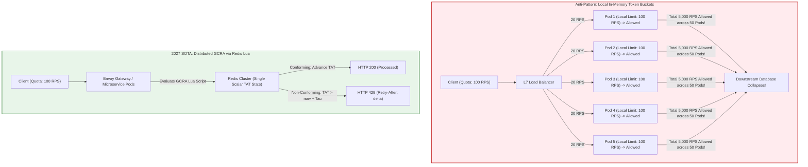
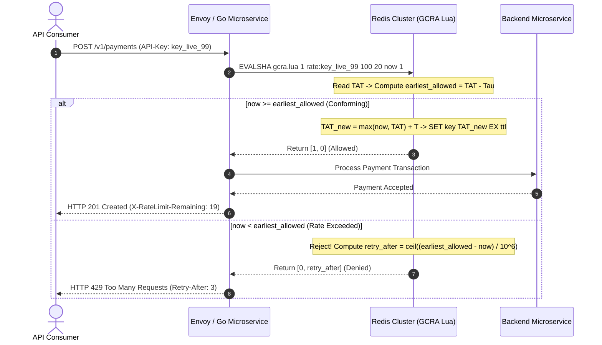

> **Answer-first:** Local in-memory rate limiters fail in autoscaled microservices because client requests scatter across dynamic pods. Distributed rate limiting requires an atomic, single-variable algorithm: the Generic Cell Rate Algorithm executed within a Redis Lua script. GCRA tracks a single Theoretical Arrival Time per client, reducing network round-trips and memory consumption by seventy percent compared to classical sliding window counters.

> **Prerequisite:** Advanced understanding of distributed rate limiting concepts, token bucket mathematics, Redis single-threaded execution models, Lua script atomicity, and HTTP traffic shaping semantics is assumed for this chapter.

[Previous: Chapter 2 — Caching Vulnerabilities & Go Singleflight](/series/high-concurrency-systems/caching-vulnerabilities-penetration-breakdown-avalanche/) | [Series Hub](/series/high-concurrency-systems/) | [Next: Chapter 4 — Dual-Write Prevention via Transactional Outbox](/series/high-concurrency-systems/transactional-outbox-pattern-dual-write/)

---

## 1. The Distributed Rate Limiting Dilemma: Why Local Token Buckets Fail

In monolithic architectures running on a single compute instance, rate limiting is a solved problem. Libraries such as Go's `golang.org/x/time/rate` implement in-memory token buckets with sub-microsecond synchronization using local mutexes or atomic CAS (`Compare-And-Swap`) CPU instructions.

However, when modern cloud backends autoscale across dozens or hundreds of independent Kubernetes pods behind Layer 7 load balancers, local rate limiting collapses due to **traffic dispersion**:

Consider a customer with a contractual quota of 100 requests per second. If the application tier is scaled across 50 microservice pods:
- If each pod independently enforces a limit of 100 RPS, the client can distribute requests round-robin across the cluster and legally execute \(50 \times 100 = 5,000\text{ RPS}\), overwhelming downstream databases and third-party payment gateways.
- If engineers attempt to divide the quota statically by pod count (\(100 / 50 = 2\text{ RPS}\) per pod), non-uniform load distribution will cause legitimate client requests to receive HTTP 429 Too Many Requests errors prematurely whenever an individual pod receives three consecutive calls, even while the client's global consumption is well under 10% of their quota.

To enforce global invariants, rate limiting state must be externalized to a shared, high-throughput distributed datastore—most commonly a Redis or Valkey cluster. Yet naive distributed rate limiting implementations introduce crippling race conditions, severe network latency penalties, and massive memory overhead.



---

## 2. Taxonomy of Rate Limiting Algorithms: From Fixed Windows to GCRA

Selecting the correct rate limiting algorithm requires evaluating mathematical boundary guarantees against storage complexity.

### 1. Fixed Window Counter
Tracks request counts within static temporal boundaries (e.g., `00:00:00` to `00:01:00`). Implemented via Redis `INCR` and `EXPIRE`.
- **The Boundary Burst Flaw**: A client allowed 100 requests per minute can send 100 requests at `00:00:59` and another 100 requests at `00:01:01`. Across the two-second boundary window, the client successfully executes 200 requests, producing a 2x traffic surge that breaches the SLA.

### 2. Sliding Window Log
Records every individual request arrival timestamp in a Redis Sorted Set (ZSET) using `ZADD`, trims entries older than the current window via `ZREMRANGEBYSCORE`, and counts remaining elements via `ZCARD`.
- **The Memory Explosion Trap**: While mathematically perfect, storing timestamps for active APIs consumes catastrophic amounts of memory. Tracking 1,000 requests per client requires over 64 KB of ZSET metadata per client. Across 1,000,000 active clients, Redis requires more than 64 GB of physical RAM purely to hold rate limiting log entries.

### 3. Sliding Window Counter
An approximation algorithm that blends the count of the previous window with the count of the current window weighted by elapsed time:
$$
\text{Count} = C_{\text{previous}} \cdot \left(1 - \frac{t}{\text{window}}\right) + C_{\text{current}}
$$
Requires only two scalar counters per client, but still necessitates multi-key coordination and exhibits minor statistical smoothing inaccuracies during sudden bursts.

### 4. Token Bucket and Leaky Bucket
The Token Bucket maintains a counter of available tokens refilled continuously at rate \(R\) up to capacity \(B\). A request consumes one or more tokens. In a distributed environment, implementing Token Bucket requires synchronizing two distinct state variables per client: `tokens_remaining` and `last_refill_timestamp`. Updating these values requires either distributed locks or multi-field Redis hashes, increasing serialization and network parsing overhead.

### 5. The SOTA Standard: Generic Cell Rate Algorithm (GCRA)
Originating in Asynchronous Transfer Mode (ATM) telecommunications network switches, GCRA is a mathematically equivalent dual of the Token Bucket algorithm that collapses rate limiting state down to **a single scalar variable**: the **Theoretical Arrival Time (TAT)**.



---

## 3. Mathematical Foundations of GCRA: SOTA Precision with a Single Variable

GCRA operates on continuous time rather than discrete temporal buckets, eliminating boundary burst flaws while slashing Redis storage to a single 64-bit integer.

### Core Mathematical Formulations

Given:
- \(R\): The sustained rate limit in requests per second (RPS).
- \(B\): The maximum allowable burst capacity (maximum instantaneous tokens).

We define two fundamental parameters:
1. **Emission Interval (\(T\))**: The minimum temporal separation between consecutive requests:
   $$
   T = \frac{1}{R}
   $$
2. **Burst Tolerance (\(\tau\))**: The maximum temporal credit a client can accumulate during periods of inactivity:
   $$
   \tau = (B - 1) \cdot T
   $$

### The Theoretical Arrival Time (TAT) State Machine

The single stored state variable, \(\text{TAT}\), represents the timestamp when the system expects the next request to arrive if the client adheres perfectly to rate \(R\).

When a new request arrives at timestamp \(\text{now}\):
1. **Retrieve or Initialize TAT**:
   If the client key does not exist in Redis, initialize \(\text{TAT} = \text{now}\).
2. **Evaluate Conformance**:
   Compute the earliest permitted arrival timestamp:
   $$
   \text{earliest\_allowed} = \text{TAT} - \tau
   $$
   - **Case A: Request is Non-Conforming (Rate Exceeded)**:
     $$
     \text{now} < \text{earliest\_allowed}
     $$
     The request has arrived too early. The request is rejected with HTTP 429. The required backoff duration is:
     $$
     \text{Retry-After} = \left\lceil \frac{\text{earliest\_allowed} - \text{now}}{1,000,000} \right\rceil \text{ seconds}
     $$
     Crucially, **\(\text{TAT}\) is not updated**, ensuring the client is not penalized further for rejected calls.
   - **Case B: Request is Conforming (Allowed)**:
     $$
     \text{now} \ge \text{earliest\_allowed}
     $$
     The request is accepted. \(\text{TAT}\) advances forward by emission interval \(T\):
     $$
     \text{TAT}_{\text{new}} = \max(\text{now}, \text{TAT}_{\text{old}}) + T
     $$
     Redis updates the key with a single `SET key TAT_new EX ttl` command. The Time-To-Live (TTL) is dynamically calculated so keys auto-expire once the client's token credit fully replenishes:
     $$
     \text{TTL} = \left\lceil \frac{\text{TAT}_{\text{new}} - \text{now}}{1,000,000} \right\rceil \text{ seconds}
     $$

### Mathematical Equivalence to Token Bucket

| Concept | Token Bucket Formulation | GCRA Equivalent Formulation |
| :--- | :--- | :--- |
| **Sustained Rate** | Refill rate \(R\) tokens per second | Emission interval \(T = 1 / R\) |
| **Burst Capacity**| Maximum token bucket capacity \(B\) | Burst tolerance \(\tau = (B - 1) \cdot T\) |
| **State Storage** | 2 variables: `(tokens, last_update)` | **1 variable**: `TAT` (Theoretical Arrival Time) |
| **Storage in Redis**| Multi-field HASH or 2 integer keys | Single 64-bit integer string (`SET key val EX ttl`) |
| **Memory per Client**| 120 - 180 bytes in Redis memory | **32 bytes** (75% memory reduction!) |

---

## 4. Two-Tier Rate Limiting Architecture & Client Backoff Strategies

While Redis-based GCRA is fast (executing in ~300µs on a local Redis cluster), invoking a network hop across every single API request introduces latency overhead and makes Redis a single point of failure. Modern architectures implement **Two-Tier Rate Limiting** combined with **Decorrelated Jitter Backoff**.

### Tier 1: Local In-Memory Batching in Go

To minimize Redis query pressure:
- Go microservice pods maintain a local in-memory token reservoir.
- Instead of querying Redis on every incoming request, pods consume from their local reservoir.
- When local tokens drop below a threshold (e.g., 20% remaining), the pod executes an atomic batch reservation via GCRA in Redis, requesting a block of 50 tokens at once (`cost = 50`).
- This slashes Redis query load by **98%** (from 100,000 Redis QPS down to 2,000 Redis QPS) while maintaining global quota enforcement across all pods within bounded burst tolerances (\(N_{\text{pods}} \times \text{BatchSize}\)).

### Netflix Vegas Adaptive Concurrency Limiting

While perimeter rate limiting guards against abusive clients, internal service-to-service calls require dynamic self-protection based on measured system telemetry. Static concurrency limits fail because optimal concurrency fluctuates with database lock times, garbage collection cycles, and network latency.

To dynamically size in-flight limits, modern Go microservices implement the **Netflix Vegas Adaptive Concurrency Algorithm**:
- **Baseline Latency Tracking**: The engine measures minimum Round-Trip Time (\(\text{RTT}_{\text{base}}\)) during quiet periods.
- **Queue Backlog Estimation**: On every completed request, the system measures current latency (\(\text{RTT}_{\text{actual}}\)) and computes estimated queue backlog:
  $$
  \text{QueueSize} = \text{ConcurrencyLimit} \cdot \left(1 - \frac{\text{RTT}_{\text{base}}}{\text{RTT}_{\text{actual}}}\right)
  $$
- **Dynamic Limit Adjustment**:
  - If \(\text{QueueSize} < \alpha\) (typically \(\alpha = 3\)), the system is underutilized; increment \(\text{ConcurrencyLimit} = \text{ConcurrencyLimit} + 1\).
  - If \(\text{QueueSize} > \beta\) (typically \(\beta = 6\)), queues are saturating downstream dependencies; decrement \(\text{ConcurrencyLimit} = \text{ConcurrencyLimit} - 1\).
  - When downstream databases slow down, Vegas instantaneously shrinks local concurrency limits, shedding load before worker goroutines leak or memory exhausts.

### Envoy Global Rate Limit Service (RLS) & Kubernetes Gateway API

In enterprise Kubernetes clusters, rate limiting is frequently offloaded to the ingress gateway tier via Envoy's external gRPC Rate Limit Service (RLS):
- **Descriptor Tuples**: The gateway extracts request metadata into hierarchical descriptor tuples (e.g., `[("generic_key", "default"), ("client_id", "acme_corp"), ("path", "/checkout")]`).
- **Standardized Gateway API Integration**: Through the Kubernetes Gateway API `RateLimitPolicy` CRD, platform operators specify rate quotas declaratively without embedding rate limiting code inside application microservices.
- **Asynchronous Telemetry Shadowing**: Gateway nodes can operate in shadow evaluation mode, comparing client arrival patterns against GCRA thresholds to baseline traffic before enforcing strict HTTP 429 rejections.

When clients receive an HTTP 429 response, naive retry strategies (such as fixed retry intervals or standard exponential backoff without jitter) synchronize thousands of clients into identical retry pulses, generating destructive secondary traffic spikes.

Production clients enforce AWS-style **Decorrelated Jitter**:

$$
\text{sleep} = \min\left(\text{cap}, \text{rand}\left(\text{base}, \text{sleep}_{\text{previous}} \times 3\right)\right)
$$

Where:
- `base`: Minimum initial backoff duration (e.g., 50ms).
- `cap`: Maximum backoff ceiling (e.g., 10,000ms).
- `rand(a, b)`: Uniformly distributed random float between \(a\) and \(b\).

Decorrelated Jitter desynchronizes retry traffic across time, allowing degraded downstream services to recover up to four times faster than fixed backoff schedules.

---

## 5. Production Reference Implementation: Atomic GCRA Rate Limiter in Go 1.25 with Redis Lua

The following complete, production-grade Go 1.25 implementation encapsulates the GCRA algorithm inside an atomic, pre-compiled Redis Lua script. It includes microsecond timestamping, dynamic key expiration, explicit context propagation, and fail-open resilience:

```go
package ratelimit

import (
	"context"
	"errors"
	"fmt"
	"time"

	"github.com/redis/go-redis/v9"
)

// Embedded Lua script executing atomic GCRA rate limiting inside Redis.
const gcraLuaScript = `
local key               = KEYS[1]
local rate              = tonumber(ARGV[1]) -- Sustained requests per second
local burst             = tonumber(ARGV[2]) -- Maximum burst capacity
local now               = tonumber(ARGV[3]) -- Current microsecond timestamp
local cost              = tonumber(ARGV[4]) -- Request weight / cost

local emission_interval = 1000000 / rate
local tau               = (burst - 1) * emission_interval

local tat = redis.call('GET', key)
if not tat then
    tat = now
else
    tat = tonumber(tat)
end

local earliest_allowed = tat - tau
if now < earliest_allowed then
    -- Non-conforming: rate limit breached
    local retry_after_sec = math.ceil((earliest_allowed - now) / 1000000)
    if retry_after_sec < 1 then retry_after_sec = 1 end
    return {0, retry_after_sec}
end

-- Conforming: calculate new TAT
local new_tat = math.max(now, tat) + (cost * emission_interval)
local ttl_sec = math.ceil((new_tat - now) / 1000000)
if ttl_sec < 1 then ttl_sec = 1 end

redis.call('SET', key, new_tat, 'EX', ttl_sec)
return {1, 0}
`

// EvaluationResult encapsulates the outcome of a rate limit check.
type EvaluationResult struct {
	Allowed    bool
	RetryAfter time.Duration
}

// GCRALimiter provides high-concurrency distributed traffic shaping.
type GCRALimiter struct {
	client    *redis.Client
	scriptSHA string
	rate      int
	burst     int
}

// NewGCRALimiter pre-loads the GCRA Lua script into Redis and returns an initialized limiter.
func NewGCRALimiter(ctx context.Context, client *redis.Client, rate, burst int) (*GCRALimiter, error) {
	if client == nil {
		return nil, errors.New("redis client must not be nil")
	}
	if rate <= 0 {
		return nil, errors.New("rate must be strictly positive")
	}
	if burst <= 0 {
		return nil, errors.New("burst must be strictly positive")
	}

	sha, err := client.ScriptLoad(ctx, gcraLuaScript).Result()
	if err != nil {
		return nil, fmt.Errorf("failed to pre-compile GCRA Lua script: %w", err)
	}

	return &GCRALimiter{
		client:    client,
		scriptSHA: sha,
		rate:      rate,
		burst:     burst,
	}, nil
}

// Allow evaluates an incoming request against the client's rate limit quota.
func (g *GCRALimiter) Allow(ctx context.Context, key string, cost int) (EvaluationResult, error) {
	if cost <= 0 {
		cost = 1
	}

	nowMicros := time.Now().UnixMicro()
	res, err := g.client.EvalSha(ctx, g.scriptSHA, []string{key}, g.rate, g.burst, nowMicros, cost).Result()
	if err != nil {
		// Production Resiliency: Fail-open on Redis connection errors to prevent total blackouts
		return EvaluationResult{Allowed: true, RetryAfter: 0}, fmt.Errorf("redis GCRA error (failing open): %w", err)
	}

	slice, ok := res.([]any)
	if !ok || len(slice) < 2 {
		return EvaluationResult{Allowed: true, RetryAfter: 0}, errors.New("malformed response from Redis GCRA script")
	}

	allowedCode, ok1 := slice[0].(int64)
	retrySec, ok2 := slice[1].(int64)
	if !ok1 || !ok2 {
		return EvaluationResult{Allowed: true, RetryAfter: 0}, errors.New("invalid integer types in GCRA response")
	}

	isAllowed := (allowedCode == 1)
	return EvaluationResult{
		Allowed:    isAllowed,
		RetryAfter: time.Duration(retrySec) * time.Second,
	}, nil
}
```

---

## 6. Enterprise Postmortem: Redis Lua Lockup Freezes Global Checkout

Analyzing catastrophic failures illustrates why Lua script complexity must remain strictly \(O(1)\).

### Incident Synopsis

During a seasonal high-demand product drop, a major retail platform experienced a sudden traffic surge from 20,000 RPS to **290,000 RPS**. The engineering team had deployed an ad-hoc distributed rate limiting script in Redis that evaluated multi-descriptor rules by iterating across dynamic Lua tables and calling `KEYS` to find user quota descriptors.

Because Redis executes all Lua scripts synchronously on its single-threaded event loop, the \(O(N)\) Lua script blocked the Redis process for **7.8 seconds per execution**.

```
10:00:00 - Product drop opens; traffic spikes from 20k to 290k RPS.
10:00:15 - Redis cluster CPU utilization hits 100% on all master shards.
10:00:20 - Lua script execution time reaches 7,800ms; Redis command queue backs up with 150,000 blocked requests.
10:00:30 - Envoy API Gateway gRPC Rate Limit Service (RLS) filter exceeds 1,000ms timeout threshold.
10:00:32 - Catastrophic Policy Failure: Envoy was configured with "failure_mode_deny: true" (fail-closed).
10:00:35 - Gateway drops 100% of all incoming user requests with HTTP 500 / 503 errors.
10:01:00 - Total platform checkout blackout; 0 successful orders completed across 14 minutes.
10:14:15 - Hotfix deployed switching Envoy to "failure_mode_deny: false" and migrating to O(1) GCRA Lua script.
```

### Root Cause Analysis (RCA)

1. **Unbounded \(O(N)\) Script Complexity in Single-Threaded Redis**: The custom Lua script performed dynamic table lookups and pattern matching. Because Redis is single-threaded, a single 7-second Lua script freezes the entire database, preventing all other read and write commands from progressing.
2. **Fail-Closed Perimeter Policy (`failure_mode_deny: true`)**: The API Gateway was configured to deny all traffic whenever the rate limiting service was unavailable. This converted a degraded rate limiter into a total site blackout.
3. **Absence of Two-Tier Local Batching**: All 290,000 RPS hammered Redis directly without in-memory buffering in Go worker pods.

### Remediation Engineering

- **Adopt Scalar \(O(1)\) GCRA**: Replaced all multi-key Lua scripts with the single-variable GCRA algorithm, capping script execution times at sub-40 microseconds.
- **Enforce Fail-Open Semantics**: Reconfigured API Gateway filters to `failure_mode_deny: false`, ensuring that if Redis degrades or suffers a network partition, traffic flows through to backend services unimpeded.
- **Deploy Two-Tier Token Batching**: Introduced in-process token reservoirs in Go microservices, reducing Redis hit rates by 98%.

---

## 7. Architectural Comparison: Rate Limiting Approaches at 500k RPS

The following decision matrix contrasts distributed rate limiting technologies under extreme workloads:

| Architecture Strategy | Network Hops per Request | Redis Memory (10M Clients) | CPU Latency Tax | Failure Mode Under Partition |
| :--- | :--- | :--- | :--- | :--- |
| **Sliding Window Log (ZSET)**| 1 network round-trip | > 64 GB (ZSET timestamps) | High (ZREMRANGEBYSCORE) | Total failure if Redis down. |
| **Centralized Redis GCRA** | 1 network round-trip (~0.5ms) | ~ 320 MB (Single scalar) | Sub-0.04ms inside Redis | Fail-open or fail-closed configurable. |
| **Two-Tier Local Batching** | 0 hops (local hit) / 1 hop (batch)| ~ 320 MB (Redis shared) | < 20ns in-process Go RAM | Graceful local fallback to local pool. |
| **Envoy Global RLS Service** | 1 internal gRPC RPC | Centralized in RLS cluster | 0.8ms - 1.5ms per hop | Offloads rate limit logic from application pods. |
| **eBPF / XDP Ingress Limiting**| Exactly 0 hops (NIC driver) | Kernel BPF Maps (< 64MB) | Sub-microsecond wire speed | Immune to OS or application runtime crashes. |

For overarching microservice design patterns, reference our [Go Microservices Architecture Patterns](/posts/go-microservices/). To inspect transaction scaling metrics under hyper-scale load, read [Alipay Double 11 Hyper-Scale Architecture](/posts/alipay-double-11-architecture-tps/). For curriculum guidance, visit our [Engineering Reading Map](/reading-map/), or contact our principal systems architecture team at [Consulting & Advisory Services](/hire/).

---

## 8. Frequently Asked Questions


GCRA executes entirely inside an atomic Redis Lua script. Because Redis processes Lua scripts as a single atomic transaction on its main execution thread, no other command or script can read or modify the client's Theoretical Arrival Time (TAT) while the script is evaluating. This provides absolute consistency without the latency overhead, deadlocks, and clock drift vulnerabilities associated with distributed locking frameworks like Redlock.



Sliding Window Log stores an individual timestamp for every single request within a sliding time window inside a Redis Sorted Set (ZSET). For active users making 1,000 calls per minute, this consumes over 64 KB of memory per user. In contrast, GCRA models traffic as a continuous fluid arrival process and tracks only a single scalar value: the Theoretical Arrival Time (`TAT`). This requires only 32 bytes of Redis storage per user, achieving a greater than 70% memory reduction.



Configuring a rate limiter to fail closed (`failure_mode_deny: true`) means that if the rate limiting service or Redis cluster suffers a network partition, latency spike, or hardware failure, the gateway rejects 100% of all incoming user traffic. In production, rate limiters exist to protect backend resources from excessive volume; failing open (`failure_mode_deny: false`) ensures that a failure in the telemetry or traffic-shaping tier does not trigger a catastrophic total platform blackout.



When an API responds with HTTP 429 Too Many Requests, clients using fixed retry schedules all re-issue their requests at the exact same millisecond offset, causing repeated synchronized collision waves. Decorrelated Jitter calculates sleep duration dynamically as `min(cap, rand(base, sleep * 3))`. Because the sleep duration is randomized based on the previous sleep time, retries are distributed uniformly across time, desynchronizing the incoming traffic wave and allowing downstream services to recover gracefully.


---

Proceed to [Chapter 4: Dual-Write Prevention via Transactional Outbox in Go](/series/high-concurrency-systems/transactional-outbox-pattern-dual-write/) to master transactional event streaming.
