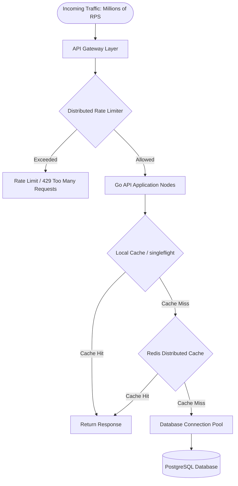
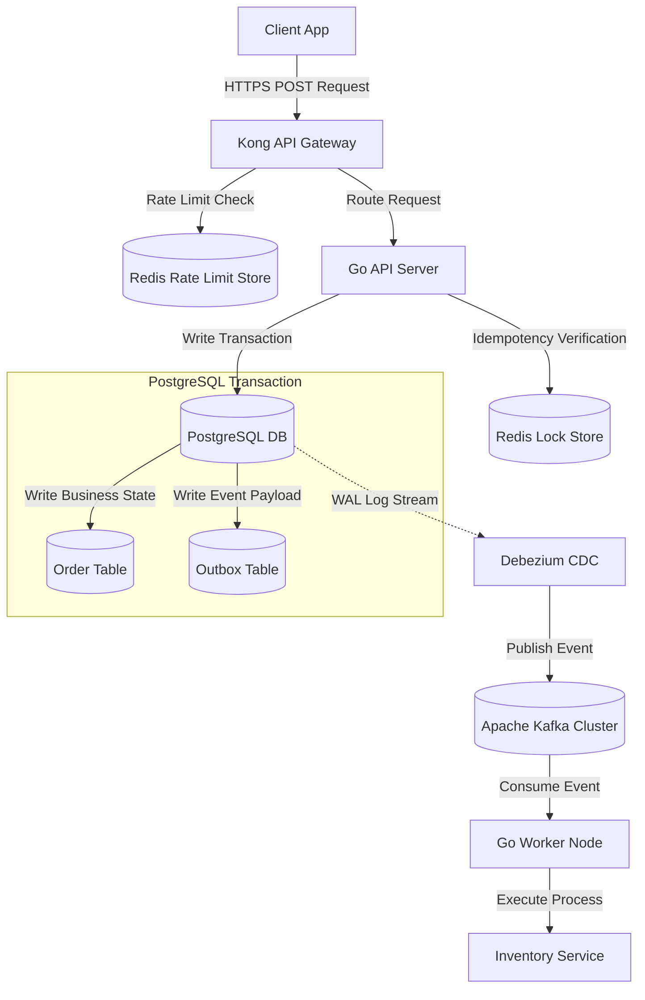

> **Prerequisite:** This is the executive summary and introductory overview of the **High Concurrency Systems** series. No prior reading is required to start here. You can view the full series roadmap at the [Series Hub]().

Despite the massive advancements in cloud computing, enterprise applications facing explosive traffic growth inevitably hit a brutal wall: the Database and the Network layer. The root cause lies not in the hardware, but in the **Architecture**. We attempt to solve the "Millions of Requests per Second" (C10M) problem by simply throwing more servers at it (Vertical/Horizontal Scaling), only to realize that stateful bottlenecks, cache stampedes, and dual-write inconsistencies bring the entire cluster to its knees.

## The Decline of the "Throw Hardware At It" Model

Many organizations initially handle traffic spikes by spinning up more application instances and upgrading Database specs. When applied to extreme real-world business contexts (such as E-commerce Flash Sales or Ride-Hailing surge hours), this approach reveals fatal flaws:
- **Database Connection Exhaustion:** Thousands of scaled-out Pods aggressively open TCP connections, draining the database CPU purely through OS Context Switching.
- **The Thundering Herd Phenomenon:** A single expired "Hot Key" in the cache can instantly unleash hundreds of thousands of concurrent read queries, obliterating the primary database before autoscaling even triggers.
- **Distributed Inconsistencies:** Updating databases and publishing events to message queues across distributed nodes leads to terrifying "Dual-Write" errors and double-charging customers during network blips.

To build truly resilient systems, Software Architects and Backend Leads must shift to a **Stateless, Asynchronous, and Event-Driven** architecture. Here, the system does not passively wait for bottlenecks to resolve; it proactively shields the infrastructure using Multi-level Caching, Rate Limiting, and Atomic Distributed Locks.



## The Ten Pillars of High-Concurrency Systems

This series explores the critical pillars for designing, securing, and operating an Enterprise-grade high-concurrency system, with a strong emphasis on practical implementations using **Golang** and its powerful concurrency primitives:

### 1. Overcoming the C10M Barrier (Stateless Architecture)
Modern applications must shift from the classical C10K socket management (solved via epoll) to C10M, which requires bypassing the OS kernel entirely using DPDK (Data Plane Development Kit) or XDP (eXpress Data Path). At the application tier, Golang leverages lightweight Goroutines and a work-stealing scheduler to multiplex millions of requests over a small pool of OS threads. To scale horizontally, the system must remain completely stateless, delegating session states to high-performance distributed key-value stores.

### 2. Neutralizing Cache Vulnerabilities
Caching is the first line of defense. However, systems must be hardened against three catastrophic failure modes: Cache Penetration (queries for non-existent keys), Cache Avalanche (simultaneous expiration of massive keys), and Cache Breakdown (hot key expiration causing a database stampede). Hardening includes deploying Bloom Filters to detect non-existent keys, introducing TTL jitter to prevent synchronized cache invalidation, and using Golang's `golang.org/x/sync/singleflight` to merge duplicate concurrent database queries.

### 3. Distributed Rate Limiting
Local, in-memory rate limiters fail to coordinate across horizontal clusters. A robust system requires a distributed rate-limiting mechanism powered by Redis Lua scripts. This ensures atomic execution of algorithms like Token Bucket or GCRA (Generic Cell Rate Algorithm) without incurring race conditions or transaction overhead.

### 4. The Transactional Outbox Pattern
Event-driven microservices must maintain transaction integrity across databases and message brokers (e.g., Kafka). Directly executing a dual-write (writing to a DB and publishing to Kafka) runs the risk of partial failures. The Transactional Outbox Pattern solves this by storing outbound events in an `outbox` table within the same relational transaction. A separate Change Data Capture (CDC) engine (like Debezium) then streams the outbox records to the message broker.

### 5. Connection Pool Optimization
Improper connection pool settings can degrade database performance. Tech leads must fine-tune Go's `*sql.DB` connection pool parameters—such as `SetMaxOpenConns`, `SetMaxIdleConns`, and `SetConnMaxLifetime`. Under extreme horizontal scale, middleman connection proxies like PgBouncer must be deployed to manage, queue, and multiplex thousands of client connections into a minimal database footprint.

### 6. API Gateways & Service Meshes
To route and govern high-traffic streams, backend architectures must separate North-South traffic (managed by external API Gateways like Kong or Envoy) from East-West service communication (governed by Service Meshes like Istio). This demarcation ensures low-latency routing, authentication, dynamic configuration updates via xDS APIs, and fine-grained mutual TLS (mTLS) enforcement.

### 7. Idempotent API Design
In distributed financial or payment systems, duplicate requests can cause duplicate charges. API endpoints must enforce idempotency. By generating a unique Idempotency Key client-side and validating it atomically using Redis transaction sets (`SET NX`) on the server, subsequent identical requests are safely deduplicated before executing business logic.

### 8. Distributed Locking (Redlock vs ZooKeeper)
When coordinating state across independent application nodes, developers must implement distributed locking. We compare the optimistic, time-sensitive Redis Redlock algorithm against the pessimistic, session-based ZooKeeper ephemeral sequential nodes. Choosing the correct lock mechanism prevents split-brain scenarios and data corruption under network partitions.

### 9. Database Sharding & Splitting
As relational databases hit physical limits, vertical scaling fails. Horizontal database sharding partition tables across multiple database instances based on a carefully chosen Sharding Key. Coupled with Consistent Hashing, this minimizes re-sharding overhead and enables limitless relational storage growth.

---

## High-Concurrency Architectural Blueprint

The following Mermaid diagram outlines the end-to-end data flow of a write-heavy, resilient system, showing how the outbox pattern and caching guard the database:



---

## Go Implementation: High-Performance Concurrent Ingestion

To illustrate these principles in practice, the following Go code implements a bounded worker pool pattern designed to ingest and process high-throughput tasks safely. This pattern prevents Out-of-Memory (OOM) errors by bounding the concurrency and queuing tasks in a buffered channel:

```go
package main

import (
	"context"
	"errors"
	"fmt"
	"sync"
	"time"
)

// Task represents a unit of work in our concurrent system.
type Task struct {
	ID        int
	Payload   string
	CreatedAt time.Time
}

// Result represents the outcome of a processed Task.
type Result struct {
	TaskID    int
	Processed bool
	Err       error
}

// IngestionEngine manages tasks queue and worker concurrency.
type IngestionEngine struct {
	maxWorkers int
	taskQueue  chan Task
	results    chan Result
	wg         sync.WaitGroup
	ctx        context.Context
	cancel     context.CancelFunc
}

// NewIngestionEngine creates a new worker pool engine.
func NewIngestionEngine(maxWorkers int, queueSize int) *IngestionEngine {
	ctx, cancel := context.WithCancel(context.Background())
	return &IngestionEngine{
		maxWorkers: maxWorkers,
		taskQueue:  make(chan Task, queueSize),
		results:    make(chan Result, queueSize),
		ctx:        ctx,
		cancel:     cancel,
	}
}

// Start spawns the configured number of workers.
func (e *IngestionEngine) Start() {
	for i := 1; i <= e.maxWorkers; i++ {
		e.wg.Add(1)
		go e.worker(i)
	}
}

// Submit enqueues a task for processing. Returns an error if queue is full.
func (e *IngestionEngine) Submit(task Task) error {
	select {
	case e.taskQueue <- task:
		return nil
	default:
		return errors.New("ingestion queue is full - backpressure applied")
	}
}

// worker listens for tasks and processes them concurrently.
func (e *IngestionEngine) worker(workerID int) {
	defer e.wg.Done()
	for {
		select {
		case <-e.ctx.Done():
			return
		case task, ok := <-e.taskQueue:
			if !ok {
				return
			}
			result := e.processTask(workerID, task)
			e.results <- result
		}
	}
}

// processTask executes the business logic for a single task.
func (e *IngestionEngine) processTask(workerID int, task Task) Result {
	// Simulate processing overhead (e.g., database write or network call)
	time.Sleep(50 * time.Millisecond)
	
	if task.ID % 10 == 0 {
		return Result{
			TaskID:    task.ID,
			Processed: false,
			Err:       fmt.Errorf("simulated database transient error for task %d", task.ID),
		}
	}
	
	return Result{
		TaskID:    task.ID,
		Processed: true,
		Err:       nil,
	}
}

// Stop gracefully shuts down the workers and waits for outstanding tasks.
func (e *IngestionEngine) Stop() {
	close(e.taskQueue)
	e.wg.Wait()
	close(e.results)
	e.cancel()
}

func main() {
	// Initialize engine with 5 concurrent workers and queue capacity of 100
	engine := NewIngestionEngine(5, 100)
	engine.Start()

	// Submit tasks in a separate goroutine
	go func() {
		for i := 1; i <= 20; i++ {
			task := Task{
				ID:        i,
				Payload:   fmt.Sprintf("Payload data for task %d", i),
				CreatedAt: time.Now(),
			}
			if err := engine.Submit(task); err != nil {
				fmt.Printf("Submit Error: %v\n", err)
			}
		}
		// Gracefully stop the engine after submission
		engine.Stop()
	}()

	// Read results
	for result := range engine.results {
		if result.Err != nil {
			fmt.Printf("Task %d failed: %v\n", result.TaskID, result.Err)
		} else {
			fmt.Printf("Task %d successfully processed\n", result.TaskID)
		}
	}
}
```

The worker pool implementation above demonstrates an essential pattern for handling C10M systems: applying **backpressure** using non-blocking channel sends (`select` with a `default` case). When the internal queue is filled to capacity, the system refuses to spawn more goroutines or buffer infinite memory, rejecting new requests instantly to maintain system stability.

---

## 🎯 Architecture Review & Consulting (Hire Me)

If your enterprise e-commerce or B2B platform is struggling with slow database queries, checkout timeouts, or scaling bottlenecks, don't let it jeopardize your business revenue.

👉 **[Book a 1:1 Architecture Consultation this week](/hire/)** with Lê Tuấn Anh (Vesviet) to identify bottlenecks and implement proven scaling strategies.

---

🔗 **Next Step:** [Chapter 1: How Systems Handle Millions of Requests/s (C10M)? Lessons from Shopee & Alipay]()

