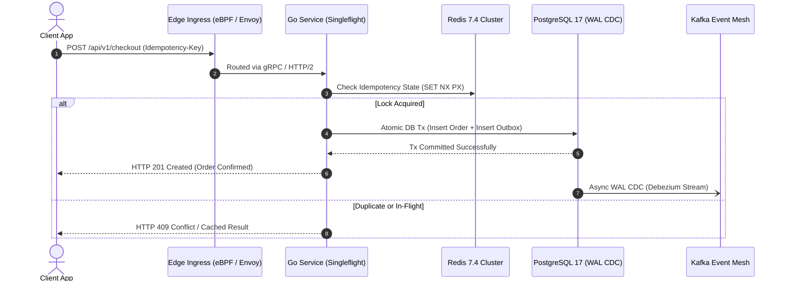

> **Multi-Language Edition:** This executive brief is also available in Vietnamese at [Thực Tế Của C10M: Sống Sót Qua Lưu Lượng Khổng Lồ (learn.tanhdev.com)](https://learn.tanhdev.com/series/high-concurrency-systems/executive-summary/).

[Series Overview: Masterclass Hub](/series/high-concurrency-systems/) | [Next Chapter: Chapter 1 — High Concurrency System Design in Go](/series/high-concurrency-systems/how-systems-handle-c10m/)

---

> **Executive Answer-First:** Achieving C10M scale (10 million concurrent sockets and sub-10ms p99 latencies) cannot be achieved merely by scaling cloud instances. It demands architectural re-engineering across four foundational tiers: **Kernel-Bypass I/O** (Linux io_uring / eBPF), **Zero-GC In-Memory Pipelines** (Go sync.Pool and off-heap ring buffers), **Asynchronous Event Sinks** (Transactional Outbox with CDC), and **Coordinated Distributed Caching** (Singleflight deduplication with Bloom filters).

---

## 1. The Reality of Modern Concurrency: From C10K to C10M

In 1999, the C10K problem challenged engineers to handle 10,000 concurrent connections on a single server. Today, high-growth e-commerce platforms and fintech applications face **C10M**—maintaining 10 million concurrent persistent TCP/WebSocket connections while serving hundreds of thousands of active transactions per second.

Under conventional OS configurations, 10 million idle TCP connections consume over **1.2 Terabytes of RAM** purely in socket buffers, and the operating system spends over 80% of CPU time on context switching and hardware interrupt servicing.

```mermaid
flowchart TD
    subgraph Traditional ["Legacy Epoll / Thread-per-Connection"]
        T1["10M Connections"] --> T2["OS Kernel Interrupt Storms"]
        T2 --> T3["Heavy Socket Buffers (128KB x 10M = 1.2TB RAM)"]
        T3 --> T4["Context Switch Thrashing & OOM Collapse"]
    end

    subgraph ModernSOTA ["2027 SOTA: Kernel Bypass & io_uring"]
        M1["10M Connections"] --> M2["eBPF / XDP Early Filtering"]
        M2 --> M3["io_uring Shared Submission Rings"]
        M3 --> M4["Go Netpoller + Slab Memory Buffers (48GB RAM)"]
    end

    classDef legacy fill:#ffebee,stroke:#c62828,stroke-width:2px;
    classDef sota fill:#e8f5e9,stroke:#2e7d32,stroke-width:2px;
    class Traditional legacy;
    class ModernSOTA sota;
```

---

## 2. The Four Pillars of Resilient High-Concurrency

To survive hyper-scale traffic without cascading service collapse, engineering organizations must enforce strict architectural invariants:

1. **Kernel-Level Resource Efficiency:** Minimum TCP socket buffers (`tcp_rmem = 4096`), socket reuse (`SO_REUSEPORT`), and Linux `io_uring` ring buffers.
2. **Deterministic Garbage Collection:** Zero-heap-allocation request lifecycles using `sync.Pool` and fixed-size byte arena allocations.
3. **Multi-Tiered Cache Protection:** Intercepting non-existent requests with Bloom Filters, spreading TTL expirations with random jitter, and collapsing concurrent duplicate DB hits using Golang `singleflight`.
4. **Guaranteed Eventual Consistency Without 2PC:** Dual-write avoidance via the Transactional Outbox Pattern powered by WAL-level Change Data Capture (Debezium/TiCDC).

```mermaid
sequenceDiagram
    autonumber
    actor Client as Client App
    participant Edge as Edge Ingress (eBPF / Envoy)
    participant App as Go Service (Singleflight)
    participant Cache as Redis 7.4 Cluster
    participant DB as PostgreSQL 17 (WAL CDC)
    participant Kafka as Kafka Event Mesh

    Client->>Edge: POST /api/v1/checkout (Idempotency-Key)
    Edge->>App: Routed via gRPC / HTTP/2
    App->>Cache: Check Idempotency State (SET NX PX)
    alt Lock Acquired
        App->>DB: Atomic DB Tx (Insert Order + Insert Outbox)
        DB-->>App: Tx Committed Successfully
        App-->>Client: HTTP 201 Created (Order Confirmed)
        DB-)Kafka: Async WAL CDC (Debezium Stream)
    else Duplicate or In-Flight
        App-->>Client: HTTP 409 Conflict / Cached Result
    end
```

---

## Frequently Asked Questions (FAQ)


Vertical scaling (upgrading to 128-core, 512GB RAM instances) hits non-linear latency penalties: NUMA (Non-Uniform Memory Access) cross-node bus contention, CPU cache line invalidation storms, and database lock serializations (`SELECT FOR UPDATE` row locks). When 5,000 threads compete for the same row lock or connection mutex, CPU utilization hits 100% in kernel lock contention rather than executing useful business logic.



In a microservices architecture, a single user request often triggers a fanout call tree across 20 to 50 internal services. If each downstream service has a p99 latency of 15ms, the cumulative probability of the client experiencing a p99 latency tail is \(1 - (0.99)^{50} \approx 39.5\%\). Without proactive hedge requests, adaptive concurrency limits, and strict circuit breaking, microservice architectures amplify tail latencies exponentially.



Enforcing a dedicated connection pool multiplexer (such as PgBouncer or Pgcat in transaction pooling mode) combined with database-level conditional atomic updates (`UPDATE inventory SET stock = stock - 1 WHERE id = 1 AND stock > 0`). This shields PostgreSQL from process-per-connection exhaustion and prevents long-lived pessimistic row locks that bring the entire transactional ledger to a halt.


---

## Next Steps in This Masterclass

Proceed to [Chapter 1: High Concurrency System Design Architecture in Go](/series/high-concurrency-systems/how-systems-handle-c10m/) to inspect the exact kernel parameters, epoll mechanics, and Go netpoller benchmarks required for C10M production engineering.
