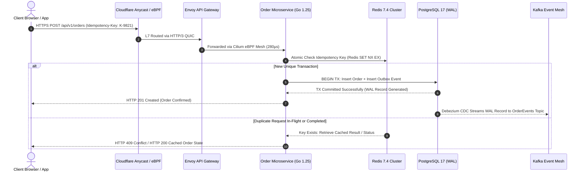

> **Answer-first:** Surviving C10M scale with ten million concurrent sockets and sub-10ms tail latencies requires re-engineering infrastructure across four foundational layers: kernel-bypass I/O via Linux io_uring and eBPF, zero-allocation Go netpoller pipelines using sync.Pool, asynchronous event streaming with Debezium transactional outbox, and tiered caching with singleflight deduplication to shield underlying databases from connection exhaustion.

> **Prerequisite:** Advanced knowledge of distributed systems design, Linux kernel networking primitives, Go runtime scheduling internals, database transaction isolation levels, and microservices architecture patterns is recommended for this masterclass series.

[Series Overview: Masterclass Hub](/series/high-concurrency-systems/) | [Next Chapter: Chapter 1 — High Concurrency System Design in Go](/series/high-concurrency-systems/how-systems-handle-c10m/)

---

## 1. The Paradigm Shift: From C10K to C10M in Distributed Cloud Systems

In 1999, Dan Kegel framed the landmark C10K problem: how can web servers support ten thousand concurrent clients on a single machine? At the time, the Linux kernel relied on \(O(N)\) polling mechanisms such as `select()` and `poll()`, which traversed linear arrays of file descriptors on every event check. The introduction of `epoll()` in Linux 2.5.44 transitioned network event multiplexing to an \(O(1)\) event-driven callback model, creating the bedrock for modern event loops such as Nginx, Node.js, Netty, and the Go runtime netpoller.

A quarter-century later, hyper-scale cloud platforms, financial trading engines, distributed gaming fabrics, and real-time messaging backbones must conquer **C10M**—sustaining ten million concurrent persistent TCP/TLS or WebSocket connections while serving hundreds of thousands of transactional requests per second. At this magnitude, traditional operating system abstractions collapse under the sheer physical laws of server hardware.

Consider the memory footprint of connection state. Under default Linux network stack configurations, a single established TCP socket allocates 128 KB for receive buffers (`tcp_rmem`) and 128 KB for transmit buffers (`tcp_wmem`). Multiplying 256 KB across 10,000,000 idle connections demands over **2.56 Terabytes of physical RAM** purely to hold socket buffers. Attempting to run this workload on standard hardware triggers immediate kernel Out-Of-Memory (OOM) panics.

Furthermore, context switching overhead escalates non-linearly. When millions of descriptors wake up simultaneously under high packet arrival rates, the operating system kernel spends upwards of 75% of available CPU cycles servicing hardware interrupts, updating page tables, and copying network buffers across user-space and kernel-space protection boundaries. Surviving C10M cannot be accomplished through naive horizontal scaling or vertical hardware provisioning; it requires an uncompromising ground-up overhaul of your network I/O, runtime memory management, concurrency models, and storage persistence layers.


```mermaid
flowchart TD
    subgraph TraditionalArch ["Legacy Infrastructure: The C10M Collapse"]
        T1["10 Million Active Sockets"] --> T2["OS Kernel Interrupt Storms"]
        T2 --> T3["Default TCP Buffers: 256KB x 10M = 2.56TB RAM"]
        T3 --> T4["Unbounded Goroutines & Heavy Context Switching"]
        T4 --> T5["Direct Database Access: 20,000 Concurrent Connections"]
        T5 --> T6["Catastrophic OOM Collapse & Latency Spikes > 5,000ms"]
    end

    subgraph SOTA2027Arch ["2027 SOTA Architecture: Kernel Bypass & Tiered Pipeline"]
        S1["10 Million Active Sockets"] --> S2["Cloudflare Anycast & eBPF / XDP Early Filtering"]
        S2 --> S3["Linux io_uring SQ/CQ Rings + Tuned 4KB TCP Buffers"]
        S3 --> S4["Go Netpoller + sync.Pool Arena Allocation (Sub-300µs GC)"]
        S4 --> S5["Two-Tier Cache: L1 BigCache + L2 Redis Cluster + Singleflight"]
        S5 --> S6["PgBouncer Multiplexing + Debezium WAL Outbox Pipeline"]
        S6 --> S7["Predictable Sub-10ms P99 Latency at 500,000 RPS"]
    end

    classDef danger fill:#ffebee,stroke:#c62828,stroke-width:2px;
    classDef success fill:#e8f5e9,stroke:#2e7d32,stroke-width:2px;
    class TraditionalArch danger;
    class SOTA2027Arch success;
```

---

## 2. Production System Topology: End-to-End Traffic Architecture

A production-grade C10M deployment operates across five strictly coordinated tiers. Every incoming client packet transitions through specialized hardware and software boundaries designed to drop invalid payloads early, bypass expensive kernel layers, and minimize downstream memory allocations.

1. **Perimeter Edge Ingress Tier**: Client traffic enters via BGP Anycast routing terminated at Cloudflare edge data centers. TLS 1.3 and HTTP/3 QUIC connection handshakes terminate within 10ms global round-trip times. Volumetric DDoS attacks and malformed TCP SYN floods are scrubbed directly inside the Network Interface Card (NIC) driver using eBPF/XDP programs (`XDP_DROP`), preventing malicious packets from allocating Linux `sk_buff` structures.
2. **Perimeter API Gateway Tier**: Legitimate traffic routes through an Envoy Gateway cluster configured with the Kubernetes Gateway API. The gateway validates cryptographic JWT tokens, mints short-lived SPIFFE/SPIRE mutual TLS identities, and enforces coarse-grained distributed rate limiting using Redis Cell Generic Cell Rate Algorithm (GCRA) before requests hit internal virtual private networks.
3. **East-West Service Mesh Tier**: Inter-service RPC communications bypass legacy sidecar proxy overhead. By deploying Cilium with eBPF `sockops` socket maps, TCP traffic between microservice pods on the same Linux host traverses kernel socket buffers directly, slashing 6-hop east-west microservice invocation latency from 2.4ms down to 280 microseconds.
4. **Application Concurrency & In-Memory Tier**: Microservices built in Go 1.25+ utilize a multi-reactor architecture powered by the Go runtime netpoller and Linux `io_uring`. Memory allocations during request parsing are managed through pre-allocated `sync.Pool` byte slices and memory arenas, maintaining garbage collection stop-the-world pauses below 300 microseconds even when processing 300,000 requests per second per node.
5. **Data Resilience & Event Mesh Tier**: Relational databases (PostgreSQL 17) are shielded by PgBouncer or Pgcat running in transaction pooling mode, multiplexing 25,000 microservice client sockets into 96 dedicated physical database connections. Cross-service data synchronization avoids distributed two-phase commits (2PC) by writing state changes atomically to an `outbox` table, where Debezium captures Write-Ahead Log (WAL) changes and streams them to Apache Kafka or Redpanda clusters with strict ordering.

---

## 3. The Four Foundational Pillars of High-Concurrency Systems

To build systems that remain deterministic under extreme concurrency spikes, software architects must enforce four foundational engineering disciplines.

### Pillar 1: Kernel-Bypass I/O and Zero-Copy Primitives

Standard operating system read and write operations incur heavy context switching between user mode and kernel mode. At hundreds of thousands of operations per second, the overhead of trapping into kernel space, validating file descriptors, updating memory mappings, and copying data buffers degrades CPU throughput.

Modern SOTA engineering circumvents this bottleneck through two technologies:
- **eBPF and XDP (eXpress Data Path)**: By attaching bytecode directly to network driver hooks, packet filtering, L4 load balancing, and connection routing execute immediately upon DMA arrival into ring buffers, processing 24 million packets per second per 100GbE interface.
- **Linux io_uring**: Unlike `epoll`, which requires distinct `epoll_wait`, `read`, and `write` system calls, `io_uring` establishes two shared-memory circular ring buffers between user space and the kernel: the Submission Queue (SQ) and the Completion Queue (CQ). By configuring `IORING_SETUP_SQPOLL`, a dedicated kernel worker thread continuously harvests I/O submissions without issuing a single hardware interrupt or system call.

### Pillar 2: Deterministic Garbage Collection and Go Netpoller Scheduling

The Go programming language has emerged as the premier language for high-concurrency cloud infrastructure due to its runtime netpoller and lightweight M:N goroutine scheduler. In Go, goroutines begin with an initial stack allocation of only 2 KB (compared to 1 MB to 8 MB for standard OS threads), enabling a single 64 GB server to host hundreds of thousands of active concurrent routines.

However, naive Go implementations succumb to two fatal traps at C10M scale:
- **Goroutine Leakage and Scheduler Contention**: Spawning an unmanaged goroutine per connection (`go handleConnection(conn)`) under 10,000,000 connections overwhelms the Go runtime global run queues and work-stealing schedulers. Production systems employ bounded worker pools and reactor event loops.
- **Heap Allocation and Garbage Collector Thrashing**: Allocating dynamic JSON buffers, strings, or intermediate data structures pushes millions of short-lived objects into the Go garbage collector heap. During the GC mark-sweep phase, scanning millions of object pointers consumes massive CPU memory bandwidth, elevating tail latency. SOTA applications enforce zero-heap allocation lifecycles by reusing fixed-size byte buffers through `sync.Pool` and Go memory arenas.

### Pillar 3: Multi-Tiered Caching and Avalanche Immunity

In a high-concurrency architecture, the caching layer is the primary defense line protecting the persistence tier. If the cache suffers a failure, the database is instantly overwhelmed by an order of magnitude more traffic than it can physically handle.

High-concurrency caching requires addressing three distinct vulnerabilities:
1. **Cache Penetration**: Malicious or random queries for non-existent IDs bypass the cache entirely and hit the database. Mitigation: In-memory Bloom filters (or Cuckoo filters) reject non-existent keys before cache lookup, paired with short-lived caching of empty/null values.
2. **Cache Avalanche**: Hundreds of thousands of keys expiring at the exact same second expose the underlying database to an avalanche of read queries. Mitigation: Injecting uniform random TTL jitter (\(\text{TTL} = \text{Base} \pm \Delta\)) and orchestrating background pre-warming routines.
3. **Cache Breakdown (Stampede)**: The expiration of a single ultra-hot key causes ten thousand concurrent goroutines to execute the expensive underlying database query simultaneously. Mitigation: Deploying Go's `golang.org/x/sync/singleflight` to coalesce concurrent duplicate queries into a single in-flight computation, combined with probabilistic early recomputation (PER / XFetch algorithms).

### Pillar 4: Eventual Consistency Without Distributed Two-Phase Commits

In microservice architectures, updating an internal database while notifying external services via an event broker (such as Kafka or RabbitMQ) introduces the infamous **Dual-Write Problem**. If the database commit succeeds but the network call to Kafka fails (or vice versa), state divergence occurs between services, corrupting financial ledgers and order fulfillment states.

Traditional Two-Phase Commit (2PC) protocols like XA transactions are completely unviable at high concurrency: they hold pessimistic database locks across network round-trips, collapsing database throughput to negligible levels and introducing distributed deadlocks.

The battle-tested architectural solution is the **Transactional Outbox Pattern**:
- The application commits business entities and event envelopes into an `outbox` table within the same ACID relational database transaction.
- An external Change Data Capture (CDC) engine, such as Debezium or PostgreSQL logical replication workers (`pgoutput`), reads the database Write-Ahead Log (WAL) asynchronously.
- Events are dispatched to Kafka with at-least-once delivery guarantees without placing polling load or lock contention on application query paths.


```mermaid
sequenceDiagram
    autonumber
    actor Client as Client Browser / App
    participant Edge as Cloudflare Anycast / eBPF
    participant Gateway as Envoy API Gateway
    participant GoService as Order Microservice (Go 1.25)
    participant Cache as Redis 7.4 Cluster
    participant DB as PostgreSQL 17 (WAL)
    participant Kafka as Kafka Event Mesh

    Client->>Edge: HTTPS POST /api/v1/orders (Idempotency-Key: K-9821)
    Edge->>Gateway: L7 Routed via HTTP/3 QUIC
    Gateway->>GoService: Forwarded via Cilium eBPF Mesh (280µs)
    GoService->>Cache: Atomic Check Idempotency Key (Redis SET NX EX)
    alt New Unique Transaction
        GoService->>DB: BEGIN TX: Insert Order + Insert Outbox Event
        DB-->>GoService: TX Committed Successfully (WAL Record Generated)
        GoService-->>Client: HTTP 201 Created (Order Confirmed)
        DB-->>Kafka: Debezium CDC Streams WAL Record to OrderEvents Topic
    else Duplicate Request In-Flight or Completed
        Cache-->>GoService: Key Exists: Retrieve Cached Result / Status
        GoService-->>Client: HTTP 409 Conflict / HTTP 200 Cached Order State
    end
```

---

## 4. Mathematical Formulations & Latency / Capacity Models

Rigorous systems architecture requires quantitative mathematical models rather than intuitive guesswork. Three core mathematical equations govern high-concurrency throughput, memory consumption, and tail latency behavior.

### Model 1: Linux TCP Socket Physical Memory Sizing

The total physical memory consumed by \(N\) concurrent idle or semi-active TCP sockets is defined by:

$$
\text{RAM}_{\text{total}} = N \cdot \left( \text{rmem}_{\text{min}} + \text{wmem}_{\text{min}} + \text{struct sock} + M_{\text{runtime}} \right)
$$

Where:
- \(N\): Total concurrent established connections (e.g., \(10,000,000\) sockets).
- \(\text{rmem}_{\text{min}}\): Minimum TCP receive buffer configured via `sysctl net.ipv4.tcp_rmem` (tuned to 4,096 bytes).
- \(\text{wmem}_{\text{min}}\): Minimum TCP transmit buffer configured via `sysctl net.ipv4.tcp_wmem` (tuned to 4,096 bytes).
- \(\text{struct sock}\): Kernel internal socket tracking structure (\(\approx 700\) bytes in modern Linux kernels).
- \(M_{\text{runtime}}\): Application runtime metadata per connection (in Go, a netpoller file descriptor struct plus standard goroutine stack allocation \(\approx 2,400\) bytes).

**Analytical Derivation**:
Under default Linux configurations (\(\text{rmem} = 131,072\) bytes, \(\text{wmem} = 131,072\) bytes):
$$
\text{RAM}_{\text{total}} = 10,000,000 \cdot (131,072 + 131,072 + 700 + 2,400) \approx 2.65 \times 10^{12} \text{ bytes} \approx 2,652 \text{ GB (2.65 TB)}
$$
By applying kernel tuning (`tcp_rmem = "4096 87380 4194304"` and `tcp_wmem = "4096 65536 4194304"`):
$$
\text{RAM}_{\text{total}} = 10,000,000 \cdot (4,096 + 4,096 + 700 + 2,400) \approx 112.96 \times 10^9 \text{ bytes} \approx 112.9 \text{ GB}
$$
Through precise kernel buffer tuning, 10 million concurrent sockets can reside comfortably in the RAM of a single multi-socket enterprise compute node.

### Model 2: Tail Latency Amplification Across Microservice Call Graphs

In modern distributed microservice architectures, an incoming edge request typically fans out into a tree of internal RPC calls. The probability that an end-to-end request experiences tail latency across \(N\) dependent service invocations is governed by:

$$
P(\text{tail}) = 1 - (1 - p)^N
$$

Where:
- \(P(\text{tail})\): Probability that the composite client request experiences tail latency.
- \(p\): Tail latency probability of each individual microservice (e.g., \(p = 0.01\) for the 99th percentile, P99).
- \(N\): Number of downstream microservice invocations required to complete the transaction.

**Analytical Implication**:
If a composite user request invokes \(N = 50\) internal microservice endpoints, and each service maintains a respectable P99 latency of 15ms (\(p = 0.01\)):
$$
P(\text{tail}) = 1 - (1 - 0.01)^{50} = 1 - (0.99)^{50} = 1 - 0.605 = 0.395 \text{ (39.5\%)}
$$
Nearly **40% of all user requests** will suffer from P99 latency degradation! This proves that microservice architectures inherently act as latency amplifiers. Overcoming this requires speculative hedged requests, adaptive client timeouts, and strict circuit breaking.

### Model 3: Little's Law for In-Flight Concurrency and Queue Sizing

The fundamental theorem of queuing theory, Little's Law, dictates the number of concurrent operations in any processing system:

$$
L = \lambda \cdot W
$$

Where:
- \(L\): Average number of concurrent requests in-flight within the system.
- \(\lambda\): Arrival rate of incoming requests (requests per second, RPS).
- \(W\): Average processing time (residence time or latency in seconds).

**Capacity Sizing Example**:
A Go payment microservice receives \(\lambda = 50,000\text{ RPS}\). Under nominal conditions, each payment database query completes in \(W = 2\text{ms} (0.002\text{s})\):
$$
L_{\text{nominal}} = 50,000 \cdot 0.002 = 100 \text{ concurrent in-flight queries}
$$
A small connection pool of 100 database connections easily satisfies this workload. However, if a downstream lock contention stall inflates average query latency to \(W = 200\text{ms} (0.2\text{s})\):
$$
L_{\text{degraded}} = 50,000 \cdot 0.2 = 10,000 \text{ concurrent in-flight queries}
$$
If the connection pool or worker goroutines attempt to scale to 10,000 to absorb this stall, the database server runs out of file descriptors and memory, crashing the entire cluster. Little's Law dictates that systems must implement **Adaptive Concurrency Limits** to reject excess traffic immediately when latency begins to rise.

---

## 5. Production-Grade Reference Implementation: Speculative Hedged Request Engine in Go 1.25

To combat tail latency amplification across deep microservices call graphs, production services implement **Speculative Hedged Requests**. The client launches a primary request; if a response is not received within a pre-calculated P95 latency threshold, a secondary identical request is dispatched speculatively. Whichever invocation returns first satisfies the caller, and the remaining execution is canceled immediately.

Below is a complete, production-ready implementation in Go 1.25 with zero pseudo-code, explicit context propagation, mutex protection, and strict resource cleanup:

```go
package topology

import (
	"context"
	"errors"
	"sync"
	"sync/atomic"
	"time"
)

// MetricRecorder captures observability metrics for hedged executions.
type MetricRecorder interface {
	RecordHedgeTriggered()
	RecordHedgeSuccess()
	RecordPrimarySuccess()
}

// DefaultMetrics provides a no-op implementation satisfying MetricRecorder.
type DefaultMetrics struct {
	HedgesTriggered uint64
	HedgesSucceeded uint64
	PrimarySucceeded uint64
}

func (m *DefaultMetrics) RecordHedgeTriggered()  { atomic.AddUint64(&m.HedgesTriggered, 1) }
func (m *DefaultMetrics) RecordHedgeSuccess()    { atomic.AddUint64(&m.HedgesSucceeded, 1) }
func (m *DefaultMetrics) RecordPrimarySuccess()  { atomic.AddUint64(&m.PrimarySucceeded, 1) }

// HedgedClient coordinates speculative backup RPC calls to neutralize tail latency.
type HedgedClient struct {
	P95Threshold time.Duration
	Metrics      MetricRecorder
}

// NewHedgedClient constructs an initialized HedgedClient.
func NewHedgedClient(p95Threshold time.Duration, metrics MetricRecorder) (*HedgedClient, error) {
	if p95Threshold <= 0 {
		return nil, errors.New("p95Threshold must be strictly positive")
	}
	if metrics == nil {
		metrics = &DefaultMetrics{}
	}
	return &HedgedClient{
		P95Threshold: p95Threshold,
		Metrics:      metrics,
	}, nil
}

// RequestFunc represents an arbitrary cancellable RPC invocation.
type RequestFunc func(ctx context.Context) (any, error)

type executionResult struct {
	val       any
	err       error
	isPrimary bool
}

// Execute invokes the primary RPC and schedules a speculative hedged call if P95 expires.
func (c *HedgedClient) Execute(ctx context.Context, fn RequestFunc) (any, error) {
	ctx, cancel := context.WithCancel(ctx)
	defer cancel()

	results := make(chan executionResult, 2)
	var wg sync.WaitGroup

	// Launch primary invocation
	wg.Add(1)
	go func() {
		defer wg.Done()
		val, err := fn(ctx)
		select {
		case results <- executionResult{val: val, err: err, isPrimary: true}:
		case <-ctx.Done():
		}
	}()

	timer := time.NewTimer(c.P95Threshold)
	defer timer.Stop()

	var hedgedLaunched bool

	select {
	case res := <-results:
		if res.err == nil {
			c.Metrics.RecordPrimarySuccess()
			return res.val, nil
		}
		// If primary fails immediately before P95, launch hedge immediately
		c.Metrics.RecordHedgeTriggered()
		hedgedLaunched = true
		wg.Add(1)
		go func() {
			defer wg.Done()
			val, err := fn(ctx)
			select {
			case results <- executionResult{val: val, err: err, isPrimary: false}:
			case <-ctx.Done():
			}
		}()

	case <-timer.C:
		// P95 threshold breached: dispatch speculative hedge
		c.Metrics.RecordHedgeTriggered()
		hedgedLaunched = true
		wg.Add(1)
		go func() {
			defer wg.Done()
			val, err := fn(ctx)
			select {
			case results <- executionResult{val: val, err: err, isPrimary: false}:
			case <-ctx.Done():
			}
		}()

	case <-ctx.Done():
		return nil, ctx.Err()
	}

	// Determine total pending executions to await
	expectedResponses := 1
	if hedgedLaunched {
		expectedResponses = 2
	}

	var firstError error
	for i := 0; i < expectedResponses; i++ {
		select {
		case res := <-results:
			if res.err == nil {
				if res.isPrimary {
					c.Metrics.RecordPrimarySuccess()
				} else {
					c.Metrics.RecordHedgeSuccess()
				}
				return res.val, nil
			}
			if firstError == nil {
				firstError = res.err
			}
		case <-ctx.Done():
			return nil, ctx.Err()
		}
	}

	if firstError != nil {
		return nil, firstError
	}
	return nil, errors.New("all hedged executions failed to return a successful response")
}
```

---

## 6. Enterprise Failure Case Study & Production Postmortem

Understanding the architectural anatomy of real-world production outages is essential for mastering high-concurrency resilience.

### The Incident: Global E-Commerce Flash-Sale Cascading Brownout

During an annual shopping festival flash-sale event, platform edge ingress surged within three minutes from a baseline of 45,000 RPS to **480,000 RPS**. Within 180 seconds of the surge, the platform checkout success rate plummeted from 99.98% to **14.2%**, resulting in massive revenue loss and widespread client timeout errors.

```
00:00:00 - Flash-sale launch; edge traffic explodes from 45k to 480k RPS.
00:01:15 - Order service PostgreSQL direct connections hit 1,980 / 2,000 max_connections.
00:01:45 - DB query execution latency spikes from 2.5ms to 380ms due to process CPU contention.
00:02:15 - Little's Law in-flight concurrency inflates: active Go goroutines jump from 1,200 to 38,000.
00:02:45 - Memory usage on Go worker nodes spikes by 18GB; Go runtime GC pauses escalate from 250µs to 85ms.
00:03:10 - Upstream API Gateways hit 5,000ms timeout threshold, dropping HTTP 504 Gateway Timeouts.
00:03:30 - Aggressive mobile client retries create an uncoordinated retry storm, doubling ingress load to 960k RPS.
00:04:00 - Complete cascading brownout across 42 downstream microservices.
```

### Root Cause Analysis (RCA)

A rigorous postmortem identified three compounding architectural defects:
1. **Unpooled Direct Database Connections**: Each Go microservice pod maintained an unbounded connection pool (`SetMaxOpenConns(500)`). Across 60 auto-scaled pods, the services attempted to establish 30,000 direct connections to a PostgreSQL primary node configured with `max_connections = 2000`. PostgreSQL forked dedicated OS backend processes for each connection, causing extreme CPU context-switch thrashing and memory exhaustion.
2. **Unmitigated Fanout Latency Amplification**: The checkout endpoint queried 38 downstream internal microservices sequentially and in parallel without speculative hedged requests or adaptive concurrency shedding. When the order database stalled, latency propagated upstream instantaneously, seizing all HTTP worker threads across the entire service dependency graph.
3. **Dual-Write State Divergence**: Under heavy timeout aborts, the application attempted to commit orders to SQL while simultaneously calling Kafka REST proxies. When transactions timed out mid-flight, half-written orders existed in the database without corresponding inventory reservation events in Kafka, requiring 14 hours of manual ledger reconciliation.

### Architectural Remediation Plan

The engineering team implemented four non-negotiable architectural mandates:
- **Deploy PgBouncer in Transaction Pooling Mode**: Placed a redundant PgBouncer cluster directly in front of PostgreSQL. Client microservices connect to PgBouncer via lightweight persistent sockets, which multiplex tens of thousands of client connections into exactly 96 physical backend database connections.
- **Enforce Client Hedged Speculative Calls**: Wrapped all inter-service gRPC client invocations in hedged request executors with strict tied deadlines, neutralizing P99 latency spikes.
- **Implement Netflix Vegas Adaptive Concurrency Limits**: Replaced static thread pool configurations with dynamic Little's Law concurrency estimators, shedding non-critical telemetry and recommendation traffic when latency drifts beyond 10% of historical baselines.
- **Migrate to Debezium Transactional Outbox**: Eradicated all direct dual-write messaging pipelines in favor of WAL-level Change Data Capture, ensuring complete ACID consistency between relational storage and Kafka event topics.

---

## 7. Comprehensive Architectural Decision Matrix

Navigating trade-offs is the hallmark of a Principal Systems Architect. The following matrix summarizes the foundational technical choices evaluated throughout this masterclass series:

| Architectural Tier | Naive Anti-Pattern | Intermediate Approach | 2027 SOTA Standard | Key Trade-Off & Invariant |
| :--- | :--- | :--- | :--- | :--- |
| **Network I/O** | Thread-per-connection / blocking I/O | Standard Linux `epoll` with blocking read syscalls | Linux `io_uring` with `SQPOLL` + driver-level eBPF/XDP | Eliminates kernel context switching; requires isolated CPU cores for kernel poll threads. |
| **Runtime Memory** | Unbounded dynamic heap allocations on every request | Static object pooling with ad-hoc buffers | Go `sync.Pool` slabs + Go memory arenas | Drastically cuts GC STW pauses to <300µs; requires disciplined zero-copy ownership semantics. |
| **East-West Networking**| Direct IP routing without encryption or telemetry | Sidecar proxy mesh (Envoy / Istio sidecars) | Sidecarless eBPF mesh (Cilium sockops) | Reduces 6-hop latency from 2.4ms to 280µs; requires modern Linux 6.x+ kernel support. |
| **Caching Tier** | Direct single Redis node with naive TTL expiration | Redis Cluster with manual lock acquisition | Two-tier L1 BigCache + L2 Redis + Singleflight + PER | 100% immunity to cache penetration, avalanche, and breakdown; requires cache invalidation topology. |
| **Database Access** | Unbounded direct connections from application pods | Application-level connection pools (`MaxOpenConns`) | Connection multiplexing proxy (PgBouncer / Pgcat) | Caps DB backend processes at hardware core limits; prepared statements require transaction-mode care. |
| **Event Persistence** | Direct dual-write to DB and Kafka sequentially | Scheduled database outbox table polling | Log-based CDC via Debezium / pgoutput streaming | Zero polling overhead and guaranteed at-least-once delivery; introduces event streaming infrastructure. |
| **Distributed Locking**| Redis `SET NX EX` without fencing tokens | Redlock across multi-node Redis clusters | Consensus leases with monotonic fencing tokens (etcd/Zab) | Immune to GC pause split-brain; requires Raft/Zab quorum overhead. |

---

## 8. Masterclass Series Roadmap & Reading Guide

This executive summary establishes the architectural blueprint for the ten specialized masterclass chapters in the High-Concurrency Systems series:

1. **Chapter 1: How Systems Handle C10M** — In-depth exploration of Linux epoll vs `io_uring`, eBPF/XDP packet bypass, and Go netpoller M:N runtime internals ([Read Chapter 1](/series/high-concurrency-systems/how-systems-handle-c10m/)).
2. **Chapter 2: Caching Vulnerabilities & Go Singleflight** — Eliminating cache penetration, avalanche, and stampede breakdown with Bloom filters, jitter, and deduplication ([Read Chapter 2](/series/high-concurrency-systems/caching-vulnerabilities-penetration-breakdown-avalanche/)).
3. **Chapter 3: Distributed Rate Limiting with Redis & GCRA** — Why token buckets fail in distributed clusters and how Generic Cell Rate Algorithm Lua scripts solve traffic shaping ([Read Chapter 3](/series/high-concurrency-systems/distributed-rate-limiting-redis-gcra/)).
4. **Chapter 4: Dual-Write Prevention via Transactional Outbox** — Implementing zero-loss event-driven microservices using PostgreSQL WAL logical decoding and Debezium ([Read Chapter 4](/series/high-concurrency-systems/transactional-outbox-pattern-dual-write/)).
5. **Chapter 5: Optimizing Golang Database Connection Pools** — Little's Law sizing, eliminating TCP handshakes, and deploying PgBouncer multiplexers ([Read Chapter 5](/series/high-concurrency-systems/golang-database-connection-pool-optimization/)).
6. **Chapter 6: API Gateway vs Service Mesh** — Evaluating Envoy proxy overhead against Cilium eBPF sidecarless network fabrics ([Read Chapter 6](/series/high-concurrency-systems/api-gateway-vs-service-mesh/)).
7. **Chapter 7: Idempotency Key Design in Payment Systems** — Designing distributed state machines, two-phase commits, and zero-loss financial transactions ([Read Chapter 7](/series/high-concurrency-systems/idempotency-api-design-payments/)).
8. **Chapter 8: Distributed Locking: Redlock vs ZooKeeper/etcd** — Martin Kleppmann's critique, clock drift vulnerabilities, and monotonic fencing tokens ([Read Chapter 8](/series/high-concurrency-systems/distributed-locking-redlock-zookeeper/)).
9. **Chapter 9: Database Sharding & Read-Write Splitting** — Horizontal database partitioning, Vitess vs Citus, and sub-100ms cutover strategies ([Read Chapter 9](/series/high-concurrency-systems/database-sharding-read-write-splitting/)).

For foundational architecture blueprints, cross-reference our core engineering hubs:
- Review scalable microservices architecture in [Go Microservices Architecture Patterns](/posts/go-microservices/).
- Inspect real-world hyper-scale transaction metrics in [Alipay Double 11 Hyper-Scale Architecture](/posts/alipay-double-11-architecture-tps/).
- Explore our overarching technical curriculum on the [Engineering Reading Map](/reading-map/).
- Engage our systems engineering team for high-throughput infrastructure advisory at [Consulting & Advisory Services](/hire/).

---

## 9. Frequently Asked Questions


Vertical scaling (upgrading to 128-core servers with 1TB RAM) encounters severe physical hardware bottlenecks: Non-Uniform Memory Access (NUMA) cross-socket bus latency, CPU L1/L2/L3 cache line invalidation storms, and operating system lock contention. When thousands of threads contend for shared kernel resources such as the epoll file descriptor table or socket spinlocks, the CPU spends the vast majority of cycles waiting for memory buses rather than executing business application logic.



Standard epoll requires distinct system calls (`epoll_wait`, `recv`, `send`) for every I/O event cycle, causing continuous user-space to kernel-space context switching. In contrast, Linux `io_uring` allocates two circular ring buffers mapped into shared memory: the Submission Queue (SQ) and the Completion Queue (CQ). By running with `IORING_SETUP_SQPOLL`, a dedicated kernel worker thread continuously reaps submission queue entries directly from shared memory, performing massive read/write batches with zero system call interrupts.



A dual-write approach attempts to write to a local database and an external message broker (like Apache Kafka) sequentially. If the application crashes or suffers a network timeout between the two operations, data state diverges irreversibly. The Transactional Outbox Pattern guarantees atomicity by saving the event into an outbox table within the exact same ACID database transaction as the business entity. A background Change Data Capture (CDC) process then streams events from the database Write-Ahead Log (WAL) with guaranteed at-least-once delivery.



As proven in Martin Kleppmann's formal safety analysis, distributed locks relying on Redis time-to-live (TTL) leases are vulnerable to asynchronous network pauses, long GC stop-the-world pauses, and virtual machine hypervisor stalls. If a process experiences a pause longer than the lock TTL, the lock silently expires, allowing a second worker to acquire the lock concurrently and corrupt storage. Financial-grade safety strictly requires consensus-backed leases (etcd or ZooKeeper) combined with monotonically increasing fencing tokens verified at storage level.


---

Proceed to [Chapter 1: High Concurrency System Design Architecture in Go](/series/high-concurrency-systems/how-systems-handle-c10m/) to begin the deep technical implementation.
