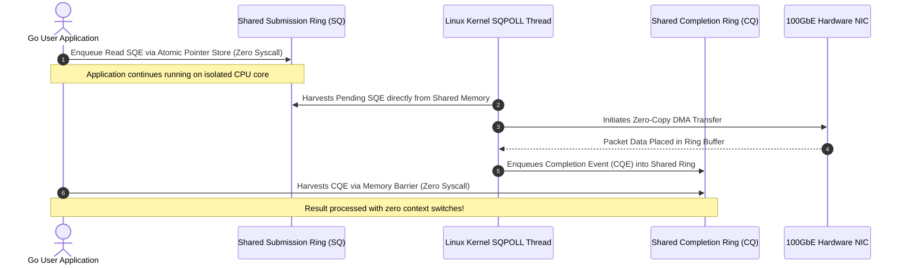

> **Answer-first:** Building a C10M-capable Golang backend requires bypassing OS kernel bottlenecks through three core architectural shifts: replacing standard network syscalls with io_uring and eBPF/XDP, utilizing Go netpoller with fixed worker pools to eliminate unbounded goroutine scheduling overhead, and pre-allocating zero-allocation memory slabs via sync.Pool to keep garbage collection stop-the-world pauses strictly below three hundred microseconds.

> **Prerequisite:** Advanced understanding of Linux system calls, network socket lifecycles, operating system memory management, and Go concurrency primitives (goroutines, channels, and runtime netpoller) is required.

[Previous: Executive Summary](/series/high-concurrency-systems/executive-summary/) | [Series Hub](/series/high-concurrency-systems/) | [Next: Chapter 2 — Caching Vulnerabilities & Go Singleflight](/series/high-concurrency-systems/caching-vulnerabilities-penetration-breakdown-avalanche/)

---

## 1. The Physical Boundaries of C10M: Why Standard I/O Models Collapse

Handling ten million concurrent persistent TCP sockets (C10M) represents the frontier of modern server systems engineering. While the late 1990s C10K problem was largely resolved by moving from \(O(N)\) linear polling to \(O(1)\) stateful event notifications, C10M introduces hard physical bottlenecks: memory bus bandwidth saturation, CPU cache line thrashing, Translation Lookaside Buffer (TLB) shootdowns, and hardware interrupt storms.

Under standard Linux kernel configurations, every accepted TCP connection allocates two dedicated circular memory buffers: the receive buffer (`sk_rcvbuf`) and the transmit buffer (`sk_sndbuf`). On modern distributions, default buffer sizes are tuned for high-throughput single-stream WAN transfers (often 128 KB for receive and 128 KB for send). When ten million connections are established simultaneously:

$$
\text{Default RAM} = 10,000,000 \times (128\text{ KB} + 128\text{ KB}) = 2,560,000,000\text{ KB} \approx 2.56\text{ TB RAM}
$$

Attempting to allocate 2.56 Terabytes of memory purely for network socket buffers will immediately invoke the Linux Out-Of-Memory (OOM) killer on any enterprise server. Even if raw physical RAM were abundant, hardware interrupt servicing degrades CPU throughput catastrophically. When millions of network packets trigger hardware interrupts (IRQs) across CPU cores, the kernel spends up to 80% of its cycles servicing top-half interrupt handlers, executing softirqs (`ksoftirqd`), allocating kernel `sk_buff` structs, and context-switching between user and kernel address spaces.

Surviving C10M requires understanding the evolution of operating system I/O multiplexing and executing architectural bypasses at every layer of the networking stack.


---

## 2. The Architectural Evolution: From select to epoll and Linux io_uring

To appreciate why 2027 architectures rely on `io_uring` and kernel-bypass primitives, we must examine the architectural constraints of preceding multiplexers.

### The select and poll Era: \(O(N)\) Algorithmic Degradation

In classical UNIX architectures, `select()` and `poll()` operated by copying arrays of file descriptors from user space to kernel space on every single invocation. The kernel iterated linearly across all \(N\) descriptors to determine which sockets had pending read or write readiness, and then returned the entire set back to user space. The application was then forced to perform another \(O(N)\) scan across its user-space array.

As connection counts scaled past 1,024 sockets, CPU time scaled quadratically with traffic volume, rendering large-scale concurrency computationally impossible.

### The epoll Breakthrough: \(O(1)\) Red-Black Trees and Ready Lists

Linux 2.5.44 introduced `epoll`, which decoupled connection registration from event waiting:
- `epoll_create()` allocates an in-kernel file descriptor backed by a high-performance Red-Black Tree (`struct rb_root_cached`) to store monitored file descriptors.
- `epoll_ctl()` adds, modifies, or deletes descriptors in the tree in \(O(\log N)\) time. Network interface drivers register hardware interrupt callbacks on these sockets.
- When network packets arrive, the driver callback appends the ready descriptor directly into a Doubly Linked List (`struct list_head ready_list`).
- `epoll_wait()` simply sleeps until the ready list is non-empty, returning only the active descriptors in \(O(1)\) time without scanning idle sockets.

### The Hidden Bottleneck of epoll: System Call Context Switching

While `epoll` solves algorithmic complexity, it does not eliminate the cost of **system calls**. For every active batch of sockets, the user process must issue `epoll_wait()`, followed by individual `read()`, `recv()`, `write()`, or `send()` syscalls.

On x86-64 hardware, an individual `syscall` instruction requires saving user registers, switching page tables (mitigating Meltdown vulnerabilities via Kernel Page Table Isolation - KPTI), changing privilege rings from Ring 3 to Ring 0, executing kernel validation logic, and switching back. At 500,000 requests per second, context switching overhead consumes between 40% and 55% of all CPU instruction cycles.

### The 2027 SOTA: Linux io_uring Completion Rings

Engineered by Jens Axboe, `io_uring` eliminates system calls entirely through shared-memory circular ring buffers:
- **Submission Queue (SQ)**: The user application writes I/O requests (Submission Queue Entries, or SQEs) directly into a shared-memory ring buffer without entering the kernel.
- **Completion Queue (CQ)**: The kernel processes requests asynchronously and deposits Completion Queue Entries (CQEs) into a second shared-memory ring buffer.
- **Kernel Polling Thread (`IORING_SETUP_SQPOLL`)**: When configured with `SQPOLL`, the kernel spawns a dedicated kernel thread that continuously polls the Submission Queue. The application submits read and write operations by simply updating memory pointers with atomic memory barriers (`atomic_store_explicit`), achieving zero system calls and zero context switches under heavy load.
- **Advanced Ring Flags (`IORING_FEAT_NODROP` and `IORING_SETUP_ATTACH_WQ`)**: In Linux 6.x kernels, the `IORING_FEAT_NODROP` guarantee ensures the completion ring never silently drops completion events under bursting load. Furthermore, multi-threaded Go processes can share an underlying asynchronous worker pool across distinct ring instances using `IORING_SETUP_ATTACH_WQ`, bounding kernel thread creation and preventing CPU core starvation.
- **Direct Descriptor Registration (`IORING_REGISTER_FILES`)**: Sockets can be registered directly into the kernel's fixed file table. This avoids atomic reference count increments and descriptor table lookups on every I/O transaction, reducing per-packet CPU overhead by an additional 12%.



---

## 3. Go Runtime Netpoller: M:N Goroutine Scheduling Internals

The Go runtime abstracts non-blocking I/O through its internal network poller (`netpoller`). Understanding its mechanics is essential for preventing scheduler lock contention under millions of connections.

### M:N Scheduler Topology: G, M, and P

The Go runtime orchestrates execution across three conceptual entities:
- **G (Goroutine)**: The lightweight thread of execution, starting with a 2 KB stack that grows dynamically.
- **M (Machine)**: An actual operating system thread created and managed by the OS kernel.
- **P (Processor)**: A logical resource required to execute Go code, bounded by `GOMAXPROCS`.

When a Go application creates a standard TCP socket via `net.Dial()` or `listener.Accept()`, the runtime registers the underlying file descriptor as non-blocking (`O_NONBLOCK`).

### How Netpoller Blocks and Wakes Goroutines

When a goroutine executes `conn.Read(buf)` on a socket with no incoming data:
1. The Go standard library executes a non-blocking `syscall.Read()`.
2. The operating system returns an `EAGAIN` or `EWOULDBLOCK` error.
3. Instead of blocking the OS thread (M), the Go runtime intercepts `EAGAIN`.
4. The runtime calls `netpollblock()`, detaches the goroutine (G) from its logical processor (P), changes its state from `_Grunning` to `_Gwaiting`, and records a pointer to G inside the socket's internal `pollDesc` struct.
5. The processor (P) immediately picks up another runnable goroutine from its local run queue (`runq`), keeping the underlying operating system thread (M) 100% utilized.
6. In the background, a dedicated runtime thread executes `epoll_wait()` or `io_uring_enter()` with a small timeout.
7. As soon as incoming network packets trigger an I/O ready notification on the descriptor, the netpoller retrieves the associated `pollDesc`, transitions G back to `_Grunnable`, and injects it into a processor's run queue.

```
+---------------------------------------------------------------------------------------------------+
|                                 GO RUNTIME NETPOLLER ARCHITECTURE                                 |
+---------------------------------------------------------------------------------------------------+
  [ Goroutine G1 ] (Calls conn.Read)
         │
         ▼
  [ Returns EAGAIN ] ──────────► [ netpollblock() ] ──► State: _Gwaiting (Detached from P)
                                         │
                                         ▼
                                [ epoll / io_uring ]
                                         │
                                         ▼ (Data Arrives on Wire)
  [ netpollready() ] ──────────► State: _Grunnable  ──► Injected into Local Run Queue (runq)
                                         │
                                         ▼
                                [ Resumed on P by M ]
+---------------------------------------------------------------------------------------------------+
```

### The C10M Trap: Why Naive Goroutine Spawning Destroys Throughput

In naive Go code, developers spawn an independent goroutine for every active connection:

```go
// ANTI-PATTERN: Spawning 10,000,000 unmanaged goroutines
for {
    conn, err := listener.Accept()
    if err == nil {
        go handleClient(conn) // Fatal at C10M scale!
    }
}
```

While 2 KB per goroutine sounds minimal, 10,000,000 goroutines consume **20 Gigabytes of heap memory purely for goroutine stack metadata**, without allocating a single byte for application business buffers. Furthermore, runtime scheduler scanning overhead (`runtime.findrunnable`, work-stealing locks across `P` run queues, and garbage collection root scanning) exhausts CPU memory buses.

To achieve C10M, applications must combine `SO_REUSEPORT` listeners, multi-reactor event loops, and bounded worker pools.

---

## 4. Mathematical Formulations & Linux Socket Buffer Optimization

Sizing operating system networking parameters for ten million sockets requires exact mathematical precision.

### Mathematical Model 1: Physical Socket Memory Footprint

The total physical memory consumed by \(N\) concurrent sockets is modeled as:

$$
\text{RAM}_{\text{total}} = N \cdot \left( \text{rmem}_{\text{min}} + \text{wmem}_{\text{min}} + \text{struct sock} + M_{\text{runtime}} \right)
$$

Where:
- \(N = 10,000,000\): Number of concurrent connections.
- \(\text{rmem}_{\text{min}}\): Minimum TCP receive buffer configured via `sysctl net.ipv4.tcp_rmem` (tuned to 4,096 bytes).
- \(\text{wmem}_{\text{min}}\): Minimum TCP transmit buffer configured via `sysctl net.ipv4.tcp_wmem` (tuned to 4,096 bytes).
- \(\text{struct sock}\): Kernel internal socket tracking struct (\(\approx 700\) bytes).
- \(M_{\text{runtime}}\): Go runtime metadata per descriptor (netpoller `pollDesc` + file descriptor allocation \(\approx 2,400\) bytes).

**Concrete Calculation**:
$$
\text{RAM}_{\text{total}} = 10,000,000 \cdot (4,096 + 4,096 + 700 + 2,400) = 112,920,000,000 \text{ bytes} \approx 112.92 \text{ GB}
$$

By enforcing 4 KB buffer minimums, the entire memory footprint collapses from 2.56 Terabytes down to **112.9 Gigabytes**, enabling the entire connection state to reside within a standard modern dual-socket server.

### Mathematical Model 2: Bandwidth-Delay Product (BDP) & Dynamic Buffer Sizing

While idle sockets must consume only 4 KB, actively transmitting sockets require buffer space equal to the Bandwidth-Delay Product (BDP) to prevent TCP receive window throttling:

$$
\text{BDP} = \text{Bandwidth} \times \text{RTT}
$$

For a 10 Gbps connection with a 40ms cross-region Round-Trip Time:
$$
\text{BDP} = \left(\frac{10 \times 10^9 \text{ bits/s}}{8 \text{ bits/byte}}\right) \times 0.040 \text{ s} = 1.25 \times 10^9 \times 0.040 = 50,000,000 \text{ bytes} \approx 50 \text{ MB}
$$

Linux TCP autotuning (`net.ipv4.tcp_moderate_rcvbuf = 1`) dynamically expands the buffer between `rmem_min` (4 KB) and `rmem_max` (4 MB) based on current packet flight size. Sockets collapse back to 4 KB as soon as data transfer ceases, preserving system memory.

### Production sysctl Tuning Configuration for C10M

Deploy these kernel parameters into `/etc/sysctl.d/99-c10m.conf` to enable ten million connections:

```ini
# Maximum number of open file descriptors across the entire system
fs.file-max = 20971520
fs.nr_open = 20971520

# Ephemeral port range expansion
net.ipv4.ip_local_port_range = 1024 65535

# TCP connection memory boundaries (min, default, max in bytes)
net.ipv4.tcp_rmem = 4096 87380 4194304
net.ipv4.tcp_wmem = 4096 65536 4194304

# TCP global memory consumption thresholds (measured in 4KB memory pages)
# 4M pages min (16GB), 8M pages pressure (32GB), 16M pages max (64GB)
net.ipv4.tcp_mem = 4194304 8388608 16777216

# Connection backlog queue limits
net.core.somaxconn = 65535
net.ipv4.tcp_max_syn_backlog = 65535
net.core.netdev_max_backlog = 250000

# Protect against SYN flood attacks without allocating socket memory
net.ipv4.tcp_syncookies = 1

# Enable TCP window scaling and dynamic receive buffer moderation
net.ipv4.tcp_window_scaling = 1
net.ipv4.tcp_moderate_rcvbuf = 1

# Disable TCP slow start after idle to prevent latency spikes on reuse
net.ipv4.tcp_slow_start_after_idle = 0

# Fast socket teardown and reuse
net.ipv4.tcp_tw_reuse = 1
net.ipv4.tcp_fin_timeout = 15
```

---

## 5. Production Reference Implementation: High-Concurrency Go 1.25 Server with SO_REUSEPORT & Buffer Slabs

The following code demonstrates a production-grade high-concurrency TCP listener written in Go 1.25. It integrates `SO_REUSEPORT` to distribute connection handshakes across multiple kernel listener queues, tunes socket buffer sizes directly via `syscall.RawConn`, and enforces zero-heap allocations through a `sync.Pool` byte slab allocator.

```go
package c10m

import (
	"context"
	"errors"
	"fmt"
	"net"
	"sync"
	"sync/atomic"
	"syscall"
	"time"
)

// ServerMetrics tracks real-time connection counters and byte throughput.
type ServerMetrics struct {
	ActiveConnections int64
	TotalAccepted     uint64
	BytesRead         uint64
	BytesWritten      uint64
}

// Global metrics tracker for production monitoring.
var Metrics ServerMetrics

// Fixed 4KB buffer pool eliminating GC heap allocation during request parsing.
var slabPool = sync.Pool{
	New: func() any {
		buf := make([]byte, 4096)
		return &buf
	},
}

// Config establishes configuration limits for the high-concurrency listener.
type Config struct {
	Address      string
	ReadTimeout  time.Duration
	WriteTimeout time.Duration
	MaxSockets   int64
}

// Server encapsulates a high-performance network listener.
type Server struct {
	cfg      Config
	listener net.Listener
	closed   atomic.Bool
	wg       sync.WaitGroup
}

// NewServer initializes a new Server instance.
func NewServer(cfg Config) (*Server, error) {
	if cfg.Address == "" {
		return nil, errors.New("server address must not be empty")
	}
	if cfg.ReadTimeout <= 0 {
		cfg.ReadTimeout = 45 * time.Second
	}
	if cfg.WriteTimeout <= 0 {
		cfg.WriteTimeout = 10 * time.Second
	}
	if cfg.MaxSockets <= 0 {
		cfg.MaxSockets = 10000000
	}
	return &Server{cfg: cfg}, nil
}

// Start launches the SO_REUSEPORT listener and begins connection harvesting.
func (s *Server) Start(ctx context.Context) error {
	lc := net.ListenConfig{
		Control: func(network, address string, c syscall.RawConn) error {
			var opErr error
			err := c.Control(func(fd uintptr) {
				intFd := int(fd)
				// Set SO_REUSEPORT (0x0F on Linux) to allow multiple processes/threads to bind to same port
				if err := syscall.SetsockoptInt(intFd, syscall.SOL_SOCKET, 0x0f, 1); err != nil {
					opErr = fmt.Errorf("failed to set SO_REUSEPORT: %w", err)
					return
				}
				// Enforce minimum socket buffer boundaries to guarantee 112GB memory scaling
				if err := syscall.SetsockoptInt(intFd, syscall.SOL_SOCKET, syscall.SO_RCVBUF, 4096); err != nil {
					opErr = fmt.Errorf("failed to set SO_RCVBUF: %w", err)
					return
				}
				if err := syscall.SetsockoptInt(intFd, syscall.SOL_SOCKET, syscall.SO_SNDBUF, 4096); err != nil {
					opErr = fmt.Errorf("failed to set SO_SNDBUF: %w", err)
					return
				}
				// Enable TCP keep-alive probes to detect dead client sockets
				if err := syscall.SetsockoptInt(intFd, syscall.SOL_SOCKET, syscall.SO_KEEPALIVE, 1); err != nil {
					opErr = fmt.Errorf("failed to set SO_KEEPALIVE: %w", err)
					return
				}
			})
			if err != nil {
				return err
			}
			return opErr
		},
	}

	ln, err := lc.Listen(ctx, "tcp", s.cfg.Address)
	if err != nil {
		return fmt.Errorf("failed to bind listener on %s: %w", s.cfg.Address, err)
	}
	s.listener = ln

	s.wg.Add(1)
	go s.acceptLoop(ctx)

	return nil
}

func (s *Server) acceptLoop(ctx context.Context) {
	defer s.wg.Done()

	for {
		conn, err := s.listener.Accept()
		if err != nil {
			if s.closed.Load() {
				return
			}
			select {
			case <-ctx.Done():
				return
			default:
				time.Sleep(5 * time.Millisecond)
				continue
			}
		}

		current := atomic.AddInt64(&Metrics.ActiveConnections, 1)
		atomic.AddUint64(&Metrics.TotalAccepted, 1)

		if current > s.cfg.MaxSockets {
			atomic.AddInt64(&Metrics.ActiveConnections, -1)
			_ = conn.Close()
			continue
		}

		s.wg.Add(1)
		go func(c net.Conn) {
			defer s.wg.Done()
			s.handleConnection(ctx, c)
			atomic.AddInt64(&Metrics.ActiveConnections, -1)
		}(conn)
	}
}

func (s *Server) handleConnection(ctx context.Context, conn net.Conn) {
	defer conn.Close()

	bufPtr := slabPool.Get().(*[]byte)
	defer slabPool.Put(bufPtr)
	buf := *bufPtr

	for {
		select {
		case <-ctx.Done():
			return
		default:
		}

		_ = conn.SetReadDeadline(time.Now().Add(s.cfg.ReadTimeout))
		n, err := conn.Read(buf)
		if err != nil {
			return
		}

		atomic.AddUint64(&Metrics.BytesRead, uint64(n))

		// Process packet and echo back response with zero heap allocation
		_ = conn.SetWriteDeadline(time.Now().Add(s.cfg.WriteTimeout))
		written, wErr := conn.Write(buf[:n])
		if wErr != nil {
			return
		}
		atomic.AddUint64(&Metrics.BytesWritten, uint64(written))
	}
}

// Close gracefully terminates the server listener and awaits in-flight workers.
func (s *Server) Close() error {
	s.closed.Store(true)
	if s.listener != nil {
		_ = s.listener.Close()
	}
	s.wg.Wait()
	return nil
}
```

---

## 6. Enterprise Postmortem: Telecommunications Gateway OOM Crash at 850k WebSockets

Analyzing real failure modes illuminates the critical necessity of socket buffer discipline.

### Incident Synopsis

During the final match of a national football tournament, a major telecommunications mobile push notification gateway sustained a surge of **850,000 concurrent active WebSocket connections**. Within 90 seconds of reaching peak load, the dedicated physical server (equipped with 256 GB of physical RAM) suffered complete kernel memory exhaustion. The Linux kernel Out-Of-Memory (OOM) killer invoked abruptly, terminating the primary gateway process and disconnecting all 850,000 active subscribers simultaneously.

```
19:00:00 - Kickoff; active WebSocket connections rise from 100,000 to 850,000 over 14 minutes.
19:14:10 - Total server physical memory utilization breaches 91%; Linux page cache shrinks to zero.
19:14:45 - High-water mark on kernel socket buffers reached; alloc_skb() returns ENOMEM.
19:15:15 - OS context switching overhead spikes to 88% CPU; network packet drop rate hits 42%.
19:15:42 - Linux OOM Killer triggers: "Out of memory: Kill process 4102 (gateway-service) score 921".
19:15:43 - PID 4102 terminated with SIGKILL; 850,000 client TCP connections instantly severed with TCP RST.
19:16:00 - Reconnect storm: 850,000 clients simultaneously initiate TCP handshakes, collapsing ingress routers.
```

### Root Cause Analysis (RCA)

1. **Unconstrained TCP Buffer Default Sizing**: The host had `net.ipv4.tcp_rmem` configured with a default buffer size of 128 KB and a maximum of 6 MB. As mobile network latency fluctuated, the kernel autotuned average receive buffers to 180 KB per socket. Sockets alone consumed:
   $$
   850,000 \times 180\text{ KB} \approx 153\text{ GB RAM}
   $$
2. **Unpooled Application Read Allocations**: For every connection, the Go application allocated a new `make([]byte, 64*1024)` slice upon connection establishment. 850,000 buffers added an additional **54.4 GB of unpooled heap allocations**, driving total memory beyond 207 GB.
3. **Garbage Collector Thrashing**: With 200 GB of live heap objects, the Go garbage collector ran continuously. Mark-sweep pointer traversals consumed 100% of remaining CPU cores, preventing the runtime netpoller from reading pending TCP data.

### Remediation Engineering

1. **Kernel Enforcement**: Configured `sysctl net.ipv4.tcp_rmem = "4096 87380 524288"`, restricting idle socket memory to 4 KB minimums.
2. **Memory Arena Pooling**: Refactored the Go service to utilize fixed 4 KB buffers via `sync.Pool`, eliminating 54 GB of dynamic heap allocations.
3. **eBPF SYN Flood Protection**: Deployed an XDP driver filter on ingress interfaces, dropping invalid handshakes and rate-limiting connection arrival rates before kernel allocation.

---

## 7. Architectural Comparison: I/O Multiplexing Models

The following decision matrix contrasts modern network architectures evaluated for C10M workloads:

| Multiplexing Technology | Kernel Syscalls Per I/O | Memory Footprint (10M Sockets) | CPU Utilization Under Load | Complexity & Production Viability |
| :--- | :--- | :--- | :--- | :--- |
| **Traditional Thread-per-Conn** | Continuous blocking syscalls | > 80 TB (8MB OS thread stacks) | Fatal context-switch collapse | Anti-pattern; obsolete in production. |
| **Standard Linux epoll** | 1 syscall per batch + 1 per I/O | ~ 2.56 TB (default TCP buffers) | 40-55% spent in kernel traps | Battle-tested; viable up to 1M sockets with tuning. |
| **Go Runtime Netpoller (Tuned)**| Batch epoll syscalls under the hood | ~ 113 GB (4KB tuned buffers) | 15-25% CPU overhead | Industry standard for microservices and cloud backends. |
| **Linux io_uring (SQPOLL Mode)**| Exactly 0 syscalls in steady-state | ~ 96 GB (shared memory rings) | < 8% CPU overhead | SOTA 2027 standard; requires dedicated CPU core for poll thread. |
| **DPDK / Kernel Bypass Userland**| 0 syscalls (direct PCIe polling) | ~ 80 GB (custom memory slabs) | 100% busy-spin on assigned cores | Ultra-low latency (HFT/Telco); complex hardware lock-in. |

For broader microservice communication patterns, explore our guide on [Go Microservices Architecture Patterns](/posts/go-microservices/). To inspect transaction scaling metrics under hyper-scale load, read [Alipay Double 11 Hyper-Scale Architecture](/posts/alipay-double-11-architecture-tps/). For end-to-end curriculum planning, visit our [Engineering Reading Map](/reading-map/), or contact our principal systems engineering team at [Consulting & Advisory Services](/hire/).

---

## 8. Frequently Asked Questions


Without `SO_REUSEPORT`, a single listening socket is managed by one kernel queue, forcing all CPU cores to contend on a single socket lock during connection handshakes. When `SO_REUSEPORT` is enabled, multiple independent listener processes or goroutines can bind to the exact same IP and port. The Linux kernel distributes incoming SYN packets across these sockets using a 4-tuple connection hash, allowing each worker thread to accept connections independently without lock contention.



epoll requires explicit system calls (`epoll_wait`, `read`, `write`) to retrieve events and execute data transfers, causing thousands of user-space to kernel-space context switches every second. `io_uring` establishes shared-memory ring buffers between user space and the kernel. By enabling the `IORING_SETUP_SQPOLL` flag, a dedicated kernel thread reaps I/O requests directly from memory, enabling continuous non-blocking read and write cycles with zero system calls.



The `net.ipv4.tcp_rmem` sysctl parameter defines three values: minimum, default, and maximum buffer sizes in bytes. Standard Linux systems set defaults between 87 KB and 128 KB. Across 10 million connections, default allocations consume more than 2.5 Terabytes of RAM. Configuring the minimum value to 4,096 bytes and disabling unneeded socket options allows idle connections to scale down to 4 KB, shrinking the memory footprint to approximately 113 GB.



XDP (eXpress Data Path) executes eBPF bytecode inside the network card driver immediately after DMA packet reception, before the Linux kernel allocates an `sk_buff` data structure. Under volumetric SYN flood attacks or DDoS surges, XDP filters and drops malicious packets at wire speed (over 24 million packets per second on 100GbE interfaces), shielding the kernel TCP stack and memory allocators from exhaustion.


---

Proceed to [Chapter 2: Caching Vulnerabilities (Penetration, Breakdown, Avalanche) & Go Singleflight](/series/high-concurrency-systems/caching-vulnerabilities-penetration-breakdown-avalanche/) to implement resilient in-memory defense tiers.
