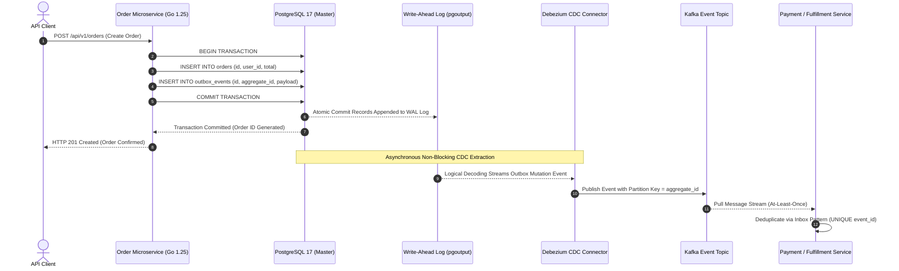

> **Answer-first:** Publishing messages to Kafka directly after database commits triggers catastrophic dual-write divergences during network timeouts or process crashes. The production standard is the Transactional Outbox Pattern powered by Log-based Change Data Capture: events are inserted atomically into an outbox table within the business transaction, and an external Debezium connector streams database write-ahead logs to Kafka with zero polling overhead.

> **Prerequisite:** Advanced understanding of database ACID transaction guarantees, distributed consistency anomalies, message broker delivery semantics (at-least-once vs exactly-once), and database replication mechanics is required.

[Previous: Chapter 3 — Distributed Rate Limiting with Redis & GCRA](/series/high-concurrency-systems/distributed-rate-limiting-redis-gcra/) | [Series Hub](/series/high-concurrency-systems/) | [Next: Chapter 5 — Optimizing Golang Database Connection Pools](/series/high-concurrency-systems/golang-database-connection-pool-optimization/)

---

## 1. The Dual-Write Trap: The Mathematical Impossibility of Naive Updates

In modern event-driven architectures, microservices frequently need to perform two distinct mutations in response to a single business action:
1. Update an internal relational database (such as creating an `orders` record in PostgreSQL).
2. Publish an integration event to a distributed message broker (such as pushing an `OrderCreated` event to Apache Kafka or RabbitMQ) so downstream services (inventory, payment, notification) can react.

Naive engineering designs implement this workflow sequentially within application code:

```go
// ANTI-PATTERN: The Fatal Dual-Write Trap
func CreateOrderNaive(ctx context.Context, db *sql.DB, kafkaProducer Producer, order Order) error {
	// Step 1: Commit to SQL Database
	orderSQL := "INSERT INTO orders (id, user_id, amount) VALUES ($1, $2, $3)"
	if _, err := db.ExecContext(ctx, orderSQL, order.ID, order.UserID, order.Amount); err != nil {
		return err
	}

	// Step 2: Publish to Message Broker
	if err := kafkaProducer.Publish("orders.topic", order); err != nil {
		// CATASTROPHE: Database has the order, but Kafka NEVER receives it!
		// Downstream services never fulfill the purchase.
		return err
	}
	return nil
}
```

This simple sequence contains a fatal architectural flaw known as the **Dual-Write Problem**. In any distributed computing environment governed by the Fischer-Lynch-Paterson (FLP) impossibility result and the Fallacies of Distributed Computing, independent systems cannot achieve atomic distributed consensus across uncoordinated networks without a formal coordination protocol.

Consider what occurs when failures intervene:
- **Scenario A (Database Commit Succeeds, Network Fails)**: The SQL database successfully commits the new order. As the application attempts to publish to Kafka, a network switch partition occurs, the Kafka broker rebalances, or the Go microservice pod receives a sudden `SIGKILL` from Kubernetes. The order exists permanently in the database, but downstream inventory and fulfillment services never receive the event. Money is taken, but goods are never shipped.
- **Scenario B (Reversed Order: Publish Succeeds, Database Fails)**: If an engineer attempts to reverse the order (publishing to Kafka before committing to SQL), a database unique constraint violation or connection pool timeout rolls back the SQL transaction. The Kafka event has already been published and consumed downstream, causing services to charge credit cards or reserve warehouse stock for an order that does not exist.
- **Scenario C (Two-Phase Commit / XA Transactions)**: Attempting to solve this with traditional distributed Two-Phase Commit (2PC) or XA protocols requires holding pessimistic database locks across network boundaries. Under high concurrency, 2PC collapses throughput by 95%, introduces distributed deadlocks, and creates availability bottlenecks where a single degraded Kafka broker halts the entire database.

```mermaid
flowchart TD
    subgraph DualWriteProblem ["The Fatal Dual-Write Failure Vector"]
        A1["Go Microservice"] -->|1. SQL BEGIN & COMMIT| DB1["PostgreSQL Primary Database"]
        DB1 -->|Order Saved in DB| A1
        A1 -->|2. Async Network RPC: Publish Event| K1["Apache Kafka Cluster"]
        K1 -.->|Network Partition / Broker Timeout / Crash!| FAIL["Event Dropped / Diverged!"]
        FAIL -->|Consequence| CRIT["Split-Brain State: DB has Order, Kafka Never Notified!"]
    end

    subgraph TransactionalOutboxSOTA ["2027 SOTA: Transactional Outbox + Log-Based CDC"]
        A2["Go Microservice"] -->|1. Atomic Single Transaction| TX["BEGIN TX"]
        TX -->|Insert Entity| TBL1["orders Table"]
        TX -->|Insert Event Payload| TBL2["outbox_events Table"]
        TX -->|COMMIT TX (Atomic)| DB2["PostgreSQL Primary (WAL Engine)"]
        DB2 -->|pgoutput Logical Decoding| CDC["Debezium CDC Connector"]
        CDC -->|Zero-Query Streaming Pipeline| K2["Kafka Cluster (Partition Key: order_id)"]
        K2 -->|At-Least-Once Delivery| CONS["Downstream Consumer (Inbox Pattern)"]
    end

    classDef danger fill:#ffebee,stroke:#c62828,stroke-width:2px;
    classDef safe fill:#e8f5e9,stroke:#2e7d32,stroke-width:2px;
    class DualWriteProblem danger;
    class TransactionalOutboxSOTA safe;
```

---

## 2. Architectural Solution: The Transactional Outbox Pattern

The definitive cloud-native standard for overcoming the Dual-Write problem is the **Transactional Outbox Pattern**. Rather than communicating with two distinct storage systems sequentially, the application treats the local relational database as the single source of truth for both business state and outgoing message payloads.

### How the Pattern Operates

1. **Atomic Local Transaction**: The application begins a standard local ACID database transaction. Within this single transaction, it writes domain records to business tables (e.g., `orders`) and writes corresponding event envelopes to a dedicated `outbox_events` table.
2. **ACID Guarantee**: Because both writes execute within the same database engine, they are guaranteed to either commit together or roll back together. It is mathematically impossible for an order to exist without its corresponding outbox event, and vice versa.
3. **Asynchronous Dispatch**: An external publisher processes records from the `outbox_events` table and forwards them to Kafka.



---

## 3. Publisher Topologies: Polling Publisher vs Log-Based CDC

Once outbox records are safely committed, how does the system extract them and transmit them to Kafka? Two architectural implementations exist:

### Approach A: The Polling Publisher (Anti-Pattern at Scale)

A background worker periodically executes a polling query:
```sql
SELECT * FROM outbox_events 
WHERE processed = FALSE 
ORDER BY created_at ASC 
LIMIT 500 
FOR UPDATE SKIP LOCKED;
```

While simple to implement, the Polling Publisher suffers from fatal scalability bottlenecks:
- **Database Query Pressure**: Continuous polling introduces continuous CPU and I/O load on the database primary, stealing resources from business transactions even during quiet periods.
- **PostgreSQL MVCC Table Bloat**: Regularly executing `UPDATE outbox_events SET processed = TRUE` or `DELETE FROM outbox_events` generates dead tuples in PostgreSQL. Without aggressive autovacuum tuning, table bloat degrades disk performance.
- **High End-to-End Latency**: Events experience latency equal to the polling interval (typically 500ms to 5,000ms), violating real-time processing requirements.

### Approach B: 2027 SOTA Standard: Log-Based Change Data Capture (CDC)

Rather than polling application tables via SQL queries, Log-Based CDC monitors the database's internal transaction log: the **Write-Ahead Log (WAL)** in PostgreSQL or the **Binary Log (binlog)** in MySQL.

Using PostgreSQL's native logical decoding plugin (`pgoutput`), a CDC engine such as **Debezium** attaches to a logical replication slot. As soon as a transaction commits, the database engine streams WAL change events to Debezium over the PostgreSQL replication protocol:
- **Zero Query Overhead**: No SQL queries, table scans, or lock acquisitions touch application tables. The database primary serves purely OLTP application traffic.
- **Sub-35ms Latency**: Events stream to Kafka within milliseconds of physical commit, drastically outpacing polling schedulers.
- **Exact Serial Ordering**: Events are emitted in the exact physical serial commit order recorded in the database WAL, preventing out-of-order event anomalies.
- **No Lost Events on Failure**: If the downstream pipeline halts, PostgreSQL pauses advancement of the logical replication slot, ensuring zero data loss upon recovery.

#### Deep Dive: How PostgreSQL Logical Decoding Operates Internally

PostgreSQL's logical decoding architecture separates physical block replication from logical change streaming:
1. **The WAL Sender Process (`walsender`)**: When Debezium connects with replication privileges, PostgreSQL spawns a dedicated background `walsender` process. This worker establishes a streaming replication connection (`IDENTIFY_SYSTEM`, `START_REPLICATION SLOT ... LOGICAL ...`).
2. **Decoding Engine and `pgoutput`**: As transactions execute and commit, the database engine appends WAL records into shared memory WAL buffers and flushes them to disk via `fsync`. The `walsender` process reads these WAL records sequentially, feeds them into the logical decoding engine, and invokes the `pgoutput` plugin to reconstruct tuple row mutations.
3. **Transaction Rollback Filtering**: If an application transaction aborts or rolls back, its changes in the WAL are silently discarded by the logical decoding engine. Only transactions with an explicit `COMMIT` WAL record are decoded and dispatched to Debezium. This eliminates ghost events and phantom reads entirely.
4. **Replication Acknowledgment and LSN Advancement**: As Debezium streams events to Kafka and receives `acks=all` confirmations from Kafka brokers, it transmits periodic status updates containing the latest `confirmed_flush_lsn` (Log Sequence Number) back to PostgreSQL. PostgreSQL safely updates the replication slot's commit point, freeing previous WAL files for truncation during the next checkpoint.

---

## 4. Mathematical Models & Operational Safety Limits

Operating a production CDC pipeline requires managing storage growth and event streaming throughput.

### Model 1: Replication Slot WAL Accumulation during Outage

PostgreSQL logical replication slots ensure that WAL segments containing unacknowledged events are never deleted by standard checkpoints. If the downstream Debezium connector or Kafka broker suffers an extended outage, PostgreSQL retains all generated WAL segments on disk.

The volume of accumulated WAL files is governed by:

$$
\text{WAL}_{\text{accumulated}} = \min\left(\text{Rate}_{\text{WAL}} \times T_{\text{downtime}}, \; \text{max\_slot\_wal\_keep\_size}\right)
$$

Where:
- \(\text{Rate}_{\text{WAL}}\): Rate of WAL generation under active write workloads (e.g., \(8\text{ MB/s}\) during peak hours).
- \(T_{\text{downtime}}\): Duration of downstream consumer or network downtime in seconds.
- \(\text{max\_slot\_wal\_keep\_size}\): Safety ceiling parameter introduced in PostgreSQL 13 to protect host disk availability.

**Operational Implication**:
If \(\text{max\_slot\_wal\_keep\_size}\) is left at its default value of `-1` (unlimited), a 16-hour weekend outage at \(8\text{ MB/s}\) will generate:
$$
\text{WAL} = 8\text{ MB/s} \times 57,600\text{ s} = 460,800\text{ MB} \approx 460.8\text{ GB}
$$
On a 500 GB storage volume, disk utilization hits 100%, causing the Linux kernel and PostgreSQL to panic (`PANIC: could not write to file pg_wal... No space left on device`), halting the entire company. Production databases must strictly enforce:

```ini
# Cap WAL retention to protect primary database availability
max_slot_wal_keep_size = 53687091200 # 50 GB
```

If the replication slot exceeds 50 GB, PostgreSQL invalidates the slot and resumes WAL pruning. The CDC connector will require a re-snapshot, but the primary database remains 100% online.

### Model 2: Outbox Partition Throughput Sizing

The maximum streaming throughput \(R_{\text{max}}\) across an outbox-to-Kafka pipeline is determined by:

$$
R_{\text{max}} = N_{\text{partitions}} \times \frac{\text{BatchSize}}{T_{\text{commit}} + T_{\text{kafka\_ack}}}
$$

Where:
- \(N_{\text{partitions}}\): Number of Kafka topic partitions (e.g., 32 partitions).
- \(\text{BatchSize}\): Number of outbox events batched per transmission (e.g., 500 events).
- \(T_{\text{commit}}\): Latency to read and acknowledge the database commit position (e.g., 5ms).
- \(T_{\text{kafka\_ack}}\): Round-trip latency for Kafka broker acknowledgements (`acks=all`, e.g., 10ms).

$$
R_{\text{max}} = 32 \times \frac{500}{0.005 + 0.010} = 32 \times \frac{500}{0.015} \approx 1,066,666 \text{ events/sec}
$$

A well-architected CDC pipeline can easily scale beyond one million events per second.

### Model 3: End-to-End Event Streaming Latency Profile

The total expected propagation delay \(\mathbb{E}[L_{\text{e2e}}]\) from the instant a user submits a checkout request to the instant a downstream consumer receives the `order.created` event from Kafka is modeled by the summation of pipeline stage delays:

$$
\mathbb{E}[L_{\text{e2e}}] = T_{\text{commit\_fsync}} + T_{\text{wal\_writer}} + T_{\text{decode}} + T_{\text{transit}} + T_{\text{kafka\_ack}}
$$

Where:
- \(T_{\text{commit\_fsync}}\): Database transactional durability barrier (1.5ms to 3.5ms on enterprise NVMe storage arrays).
- \(T_{\text{wal\_writer}}\): PostgreSQL WAL writer flush delay, bounded by `wal_writer_delay` (tuned to 10ms in high-throughput environments).
- \(T_{\text{decode}}\): Tuple reconstruction and serialization time inside `pgoutput` (0.4ms to 1.2ms per batch).
- \(T_{\text{transit}}\): Intra-VPC network latency between the primary database instance and the Kafka Connect cluster (0.3ms to 0.8ms).
- \(T_{\text{kafka\_ack}}\): Kafka distributed quorum acknowledgment latency under `acks=all` with `min.insync.replicas=2` (4.0ms to 9.0ms).

Substituting typical enterprise values:
$$
\mathbb{E}[L_{\text{e2e}}] \approx 2.5\text{ms} + 10.0\text{ms} + 0.8\text{ms} + 0.5\text{ms} + 6.0\text{ms} \approx 19.8\text{ms}
$$

This sub-20ms delivery profile delivers near-instantaneous eventual consistency across microservices while isolating transactional databases from network instability.

---

## 5. Production Reference Implementation: Atomic Outbox Staging in Go 1.25

The following production Go 1.25 code demonstrates how business entities and outbox events are committed atomically within a single SQL transaction using `database/sql`, explicit context handling, and UUID event identifiers:

```go
package outbox

import (
	"context"
	"database/sql"
	"encoding/json"
	"errors"
	"fmt"
	"time"

	"github.com/google/uuid"
)

// Order represents the primary domain business entity.
type Order struct {
	ID        string    `json:"order_id"`
	UserID    string    `json:"user_id"`
	Amount    float64   `json:"amount"`
	Currency  string    `json:"currency"`
	CreatedAt time.Time `json:"created_at"`
}

// OutboxRecord models the envelope persisted in the outbox table.
type OutboxRecord struct {
	ID            string          `json:"id"`
	AggregateType string          `json:"aggregate_type"`
	AggregateID   string          `json:"aggregate_id"`
	EventType     string          `json:"event_type"`
	Payload       json.RawMessage `json:"payload"`
	CreatedAt     time.Time       `json:"created_at"`
}

// OrderService coordinates order persistence and event outbox staging.
type OrderService struct {
	db *sql.DB
}

// NewOrderService constructs an initialized OrderService.
func NewOrderService(db *sql.DB) (*OrderService, error) {
	if db == nil {
		return nil, errors.New("database handle must not be nil")
	}
	return &OrderService{db: db}, nil
}

// CreateOrderAtomically inserts the order and outbox record within a single ACID transaction.
func (s *OrderService) CreateOrderAtomically(ctx context.Context, order Order) error {
	if order.ID == "" || order.UserID == "" {
		return errors.New("order ID and UserID are required fields")
	}

	tx, err := s.db.BeginTx(ctx, &sql.TxOptions{Isolation: sql.LevelReadCommitted})
	if err != nil {
		return fmt.Errorf("failed to begin SQL transaction: %w", err)
	}
	defer tx.Rollback()

	// 1. Insert domain business record
	orderQuery := `
		INSERT INTO orders (id, user_id, amount, currency, created_at)
		VALUES ($1, $2, $3, $4, $5);
	`
	_, err = tx.ExecContext(ctx, orderQuery, order.ID, order.UserID, order.Amount, order.Currency, order.CreatedAt)
	if err != nil {
		return fmt.Errorf("failed to insert order record: %w", err)
	}

	// 2. Serialize domain event payload
	payload, err := json.Marshal(order)
	if err != nil {
		return fmt.Errorf("failed to serialize outbox event payload: %w", err)
	}

	event := OutboxRecord{
		ID:            uuid.New().String(),
		AggregateType: "Order",
		AggregateID:   order.ID,
		EventType:     "order.created",
		Payload:       payload,
		CreatedAt:     time.Now().UTC(),
	}

	// 3. Insert outbox event within the exact same transaction
	outboxQuery := `
		INSERT INTO outbox_events (id, aggregate_type, aggregate_id, event_type, payload, created_at)
		VALUES ($1, $2, $3, $4, $5, $6);
	`
	_, err = tx.ExecContext(ctx, outboxQuery,
		event.ID,
		event.AggregateType,
		event.AggregateID,
		event.EventType,
		event.Payload,
		event.CreatedAt,
	)
	if err != nil {
		return fmt.Errorf("failed to insert outbox event: %w", err)
	}

	// 4. Commit transaction atomically
	if err := tx.Commit(); err != nil {
		return fmt.Errorf("failed to commit atomic order transaction: %w", err)
	}

	return nil
}
```

---

## 6. Enterprise Postmortem: Uncapped Replication Slot Halts Core Database

Examining real production failures highlights why replication slot limits must be strictly guarded.

### Incident Synopsis

During a planned weekend cloud infrastructure migration, a primary Debezium CDC container pod crashed due to an Out-Of-Memory (OOM) error. Because the platform team had not set up health checks for the replication worker, the failure went unnoticed over the weekend.

Meanwhile, the e-commerce platform continued processing transactions at standard volume. Because PostgreSQL was configured with an active logical replication slot with `max_slot_wal_keep_size = -1` (unlimited), PostgreSQL refused to delete any WAL segments generated after the crash. Over 42 hours, WAL segments accumulated until the database storage volume filled to **100% capacity**, forcing PostgreSQL into an unrecoverable emergency panic.

```
Saturday 02:15:00 - Debezium connector crashes with OOMKilled; confirmed_flush_lsn halts.
Sunday 14:00:00   - WAL accumulation reaches 380 GB; storage volume utilization breaches 80%.
Monday 08:30:00   - Peak morning checkout traffic surges; WAL generation jumps to 12 MB/s.
Monday 08:34:12   - Storage volume reaches 100% (500 GB / 500 GB).
Monday 08:34:15   - PostgreSQL kernel panics: "PANIC: could not write to file pg_wal... No space left on device".
Monday 08:34:20   - Database process terminates immediately; all 60 application microservices lose connectivity.
Monday 09:15:00   - DBA performs emergency single-user recovery, manually dropping the stuck replication slot.
```

### Root Cause Analysis (RCA)

1. **Unbounded Replication Slot Retention**: The PostgreSQL database had `max_slot_wal_keep_size = -1`. When the downstream consumer halted, PostgreSQL preserved every single WAL file generated over a 42-hour window.
2. **Missing Monitoring on WAL Lag**: No alerts were configured to track `pg_wal_lsn_diff(pg_current_wal_lsn(), confirmed_flush_lsn)`, allowing storage to fill silently.
3. **Absence of Auto-Restarting StatefulSets**: Debezium was deployed as a standalone Pod rather than a managed Kubernetes StatefulSet with liveness probes.

### Remediation Engineering

- **Enforce WAL Safety Ceilings**: Set `max_slot_wal_keep_size = 50GB` across all database clusters. If a consumer stalls beyond 50 GB, the slot invalidates automatically, shielding the database from disk exhaustion.
- **Deploy Prometheus Replication Lag Alerts**: Configured alerts triggering if replication lag exceeds 10 GB or if a replication slot remains inactive for more than 15 minutes.
- **StatefulSet Redundancy**: Migrated Debezium to Kubernetes StatefulSets with automatic pod restarts and dedicated memory limits.

---

## 7. Downstream Idempotency: The Consumer Inbox Pattern

Because distributed event streaming over Kafka guarantees **at-least-once delivery**, consumers will inevitably receive duplicate messages during network retries or consumer group rebalances.

To achieve end-to-end exactly-once processing, downstream consumers implement the **Inbox Pattern**:
1. Incoming messages are identified by their unique UUID `event_id` created during outbox insertion.
2. The consumer wraps event processing and an `INSERT INTO processed_inbox (event_id, processed_at) VALUES (?, NOW())` statement inside a single local database transaction.
3. If a duplicate event arrives, the database relational `UNIQUE` constraint on `event_id` triggers a conflict error (`ON CONFLICT DO NOTHING`), immediately terminating processing and preventing duplicate state mutations.

### Outbox Table Lifecycle Management: Eliminating Vacuum Bloat via Declarative Partitioning

While Log-Based CDC reads from the PostgreSQL Write-Ahead Log without running `SELECT` queries on the `outbox_events` table, the table itself accumulates rows continuously. In high-throughput transactional systems handling 5,000 to 20,000 orders per second, the outbox table grows by hundreds of millions of rows weekly.

Naive operational designs attempt to clean old rows using scheduled background delete jobs:
```sql
-- ANTI-PATTERN: Periodic deletion under high concurrency
DELETE FROM outbox_events WHERE created_at < NOW() - INTERVAL '7 days';
```

In MVCC-based relational engines like PostgreSQL, running bulk `DELETE` operations creates severe operational hazards:
- **Dead Tuple Accumulation**: Deleted rows remain physically on disk as dead tuples until the `autovacuum` daemon reclaims them. Under heavy write workloads, autovacuum cannot keep pace, leading to catastrophic table and index bloat.
- **Transaction ID (XID) Wraparound Risk**: Excessive dead tuples accelerate transaction ID consumption, increasing pressure on vacuum freezing.
- **Disk I/O and Lock Contention**: Bulk deletion holds row locks and floods the storage subsystem with write I/O, directly contending with active checkout transactions.

The 2027 enterprise SOTA solution is **Range-Based Declarative Partitioning** by creation timestamp:

```sql
-- Production DDL: Range Partitioned Outbox Table
CREATE TABLE outbox_events (
    id UUID NOT NULL,
    aggregate_type VARCHAR(64) NOT NULL,
    aggregate_id VARCHAR(64) NOT NULL,
    event_type VARCHAR(64) NOT NULL,
    payload JSONB NOT NULL,
    created_at TIMESTAMPTZ NOT NULL,
    PRIMARY KEY (created_at, id)
) PARTITION BY RANGE (created_at);

-- Daily partition creation managed via pg_partman or automated migration
CREATE TABLE outbox_events_2027_09_14 PARTITION OF outbox_events
    FOR VALUES FROM ('2027-09-14 00:00:00+00') TO ('2027-09-15 00:00:00+00');
```

When data exceeds the retention window (e.g., 7 days after all CDC offsets have safely propagated to Kafka), the system drops the obsolete partition:

```sql
-- Instantaneous O(1) metadata operation: Zero dead tuples, zero vacuum overhead
DROP TABLE outbox_events_2027_09_07;
```

Dropping an entire partition executes in less than 2 milliseconds as an $O(1)$ catalog update. It immediately reclaims disk blocks on the underlying file system without producing a single dead tuple, eliminating autovacuum lag and safeguarding database stability.

---

## 8. Architectural Decision Matrix: Dual-Write Mitigation Patterns

| Strategy | Consistency Guarantee | Database Query Pressure | Latency Impact | Operational Complexity |
| :--- | :--- | :--- | :--- | :--- |
| **Direct Dual-Write** | None (Split-brain inevitable) | None | Low until timeout | Low initial; fatal in production. |
| **Two-Phase Commit (XA/2PC)** | Strong consistency | Severe (Long-held locks) | Fatal (>10x latency increase) | Very high; incompatible with cloud Kafka. |
| **Polling Publisher** | Eventual consistency | High (Continuous polling) | 500ms - 5,000ms polling lag | Moderate; causes vacuum table bloat. |
| **Log-Based CDC (Debezium)** | Eventual consistency | **Zero query overhead** | **Sub-35ms stream latency** | Requires Debezium / Kafka Connect infrastructure. |

For deep dives on financial ledger state machine design, read [Idempotency Key Design in Payment Systems](/series/high-concurrency-systems/idempotency-api-design-payments/). For banking-grade event-driven architectures, explore [Banking Microservices Architecture Patterns](/posts/banking-microservices-architecture/). To plan enterprise microservices architectures, reference [Architecting a 21-Service E-Commerce System](/posts/architecting-21-service-ecommerce-golang-ddd/), visit our [Engineering Reading Map](/reading-map/), or contact our principal systems architecture team at [Consulting & Advisory Services](/hire/).

---

## 9. Frequently Asked Questions


In distributed computing, writing to two distinct storage layers (such as PostgreSQL and Apache Kafka) involves two independent network operations. According to the Two Generals' Problem and the FLP Impossibility Theorem, it is impossible for two remote nodes to reach guaranteed agreement over an unreliable network. If the first operation succeeds and the network fails before the second completes, the state between the systems diverges irreversibly unless both operations are bound inside a single local atomic commit.



Log-Based CDC engines like Debezium connect directly to the database engine's replication stream (such as PostgreSQL's `pgoutput` plugin or MySQL's binlog). When a transaction commits, the database engine writes physical change records to its Write-Ahead Log (WAL) on disk. Debezium reads this sequential log stream directly using standard replication protocols, extracting row mutations without acquiring database table locks or executing a single `SELECT` statement.



When a logical replication slot is active, PostgreSQL retains all WAL segments until the replication client confirms they have been processed. If the CDC consumer crashes or loses network connectivity, WAL segments accumulate indefinitely on disk. Configuring `max_slot_wal_keep_size` establishes a hard safety threshold (such as 50 GB). If accumulated WAL exceeds this limit, PostgreSQL invalidates the stalled slot and purges old files, preventing complete disk exhaustion from crashing the primary database.



Kafka guarantees at-least-once delivery, meaning network retries or consumer group rebalances can cause identical messages to be delivered multiple times. The Consumer Inbox Pattern records the unique `event_id` of each processed message in an `inbox` table protected by a `UNIQUE` relational constraint within the same transaction as the business state mutation. If a duplicate message arrives, the database constraint violation aborts processing cleanly, ensuring exact idempotency.


---

Proceed to [Chapter 5: Optimizing Golang Database Connection Pools to Prevent Bottlenecks](/series/high-concurrency-systems/golang-database-connection-pool-optimization/) to master database connection scaling.
