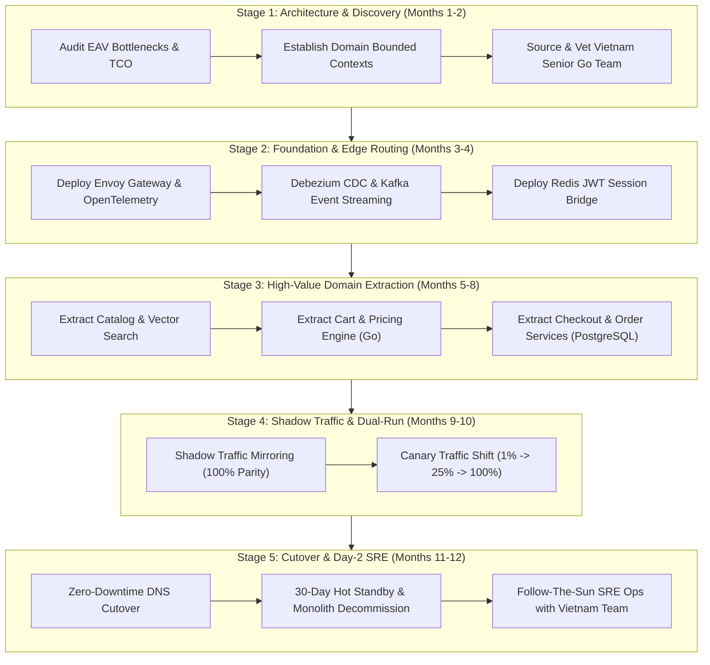
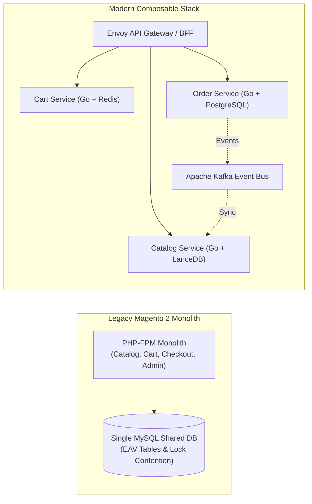

[📖 Bản tiếng Việt (Vietnamese Edition)](https://learn.tanhdev.com/series/magento-migration-vietnam/)

---

Your enterprise Magento 2 platform processes thousands of orders daily, but your engineering team spends **60% to 70% of every sprint cycle fighting technical debt**—patching core vulnerabilities, resolving third-party module conflicts, and firefighting database table locks on EAV schemas. Category catalog pages take upwards of 3.5 seconds to render, and checkouts risk deadlocking under flash sale concurrency.

With Adobe Commerce 2.4.5 and 2.4.6 officially reaching end-of-life (EOL) and strict security requirements mandated by **PCI-DSS v4.0**, engineering leaders face a strategic crossroad:

> *"Can we systematically decouple our mission-critical e-commerce platform into high-performance Go microservices without downtime—and can an elite, dedicated engineering squad in Vietnam deliver this for 70% less than onshore US/EU agencies?"*

Yes. This 16-part technical and operational masterclass provides the exact blueprint.

---

## 1. The 5-Stage Migration Lifecycle

Migrating from a monolithic PHP e-commerce platform to distributed Golang microservices requires a disciplined phased Strangler Fig strategy rather than a perilous big-bang rewrite:

---

## 2. Monolith vs Composable Microservices Architecture

The target architecture replaces shared database locking with autonomous, event-driven Go microservices running across Kubernetes:

---

## 3. Complete Series Curriculum (16 Modules)

### Module 1: The Strategic Decision Framework
1. **[Is Magento Worth It in 2026? The 2.4.9 Reality](/series/magento-migration-vietnam/magento-still-worth-investing-2026/)** — Platform lifecycle, PHP 8.4/8.5 compatibility, and TCO.
2. **[Migrating Magento to Microservices: When & Why](/series/magento-migration-vietnam/why-migrate-magento-to-microservices/)** — Monolithic database contention, Saga patterns, and decision checklists.
3. **[Composable E-Commerce Migration: Overcoming Tech Debt](/series/magento-migration-vietnam/ecommerce-architecture-composable-migration/)** — 21-service MACH decomposition, gRPC contracts, and bounded contexts.

### Module 2: Technical Execution & Strangler Fig
4. **[Why Migrate Magento to Microservices: Zero-Downtime Guide](/series/magento-migration-vietnam/moving-from-magento-to-microservices/)** — 3-phase Strangler Fig, Envoy shadow traffic, and hot standby cutover.
5. **[Exporting Magento 2 Data: Flatten EAV with SQL & Node.js](/series/magento-migration-vietnam/exporting-magento-2-data-flat-sql-nodejs/)** — Unpivoting EAV attributes, streaming ETL, and UUID re-keying.
6. **[Magento Migration: Shared DB, CDC, or Event Bus?](/series/magento-migration-vietnam/strangler-fig-shared-database-quick-win/)** — Anti-corruption layers, Debezium CDC, and outbox patterns.
7. **[Laravel vs Golang: When to Add Features in Each?](/series/magento-migration-vietnam/laravel-vs-golang-when-to-add-features.md)** — Decision matrices, gRPC hybrid gateways, and developer velocity.
8. **[Magento AI Integration: Modernize Without Rebuilding](/series/magento-migration-vietnam/magento-ai-integration-strategy-architecture/)** — Vector search, LanceDB hybrid retrieval, and AI shopping assistants.

### Module 3: Team Building, Cost Models & Day-2 Operations
9. **[Magento Development in Vietnam: Cost, Hiring & Upgrade](/series/magento-migration-vietnam/magento-vietnam/)** — Ecosystem tiers, compensation matrices, and engagement models.
10. **[Magento Enterprise Project Scoping & Agency Cost Matrix](/series/magento-migration-vietnam/magento-development-in-vietnam/)** — Story point scoping, agency red flags, and milestone gates.
11. **[Deconstructing the Ecosystem: Service Details by Domain](/series/magento-migration-vietnam/deconstructing-ecommerce-service-details-domain/)** — 8 Core domain specifications, gRPC contracts, and inventory locking.
12. **[Go Engineers in Vietnam: Vetting for Magento Migration](/series/magento-migration-vietnam/go-engineers-vietnam-migration-vetting/)** — 5 Real-world production screening scenarios and coding benchmarks.
13. **[Magento Migration Cost: Vietnam vs US/EU Team](/series/magento-migration-vietnam/magento-migration-cost-vietnam-vs-us-eu/)** — Financial model, dual-run cloud budgets, and break-even analysis.
14. **[Managing Vietnam Engineers Through a Magento Migration](/series/magento-migration-vietnam/remote-team-vietnam-magento-migration/)** — Asynchronous governance, 12h timezone inversion, and cutover protocols.
15. **[Post-Migration Operations: Managing Vietnam Go Team](/series/magento-migration-vietnam/post-migration-operations-vietnam-go-team/)** — Day-2 SRE playbook, Kubernetes observability, and on-call runbooks.

---

## Frequently Asked Questions


While Magento 2.4.9 updates PHP compatibility, it does not solve the fundamental architectural limits of MySQL EAV locking during high-concurrency checkouts. Migrating performance-critical domains (checkout, cart, pricing) to compiled Go microservices delivers sub-45ms P99 latencies, cuts infrastructure hosting costs by over 70%, and enables independent team deployments without risking full-site outages.



Vietnam boasts one of the world's most dynamic software engineering ecosystems, with senior Golang and cloud-native architects billing at $38–$52/hour compared to $180–$240/hour in the US. This enables brands to field an elite 5-person dedicated squad for approximately $280,000 annually, yielding a 70%+ capital saving while securing dedicated, long-term domain retention.



The Strangler Fig pattern places an API reverse proxy (such as Envoy Gateway) in front of Magento. Traffic is initially 100% routed to the monolith. Extracted Go services are deployed alongside Magento and validated using shadow traffic mirroring. Once data parity reaches 100%, traffic is incrementally shifted (1% -> 10% -> 50% -> 100%) with automated rollback triggers, ensuring zero disruption to live shoppers.

