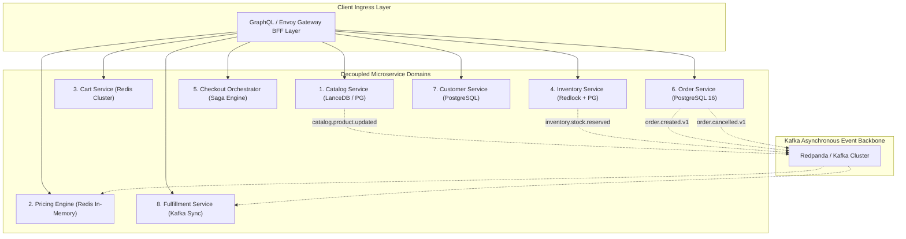
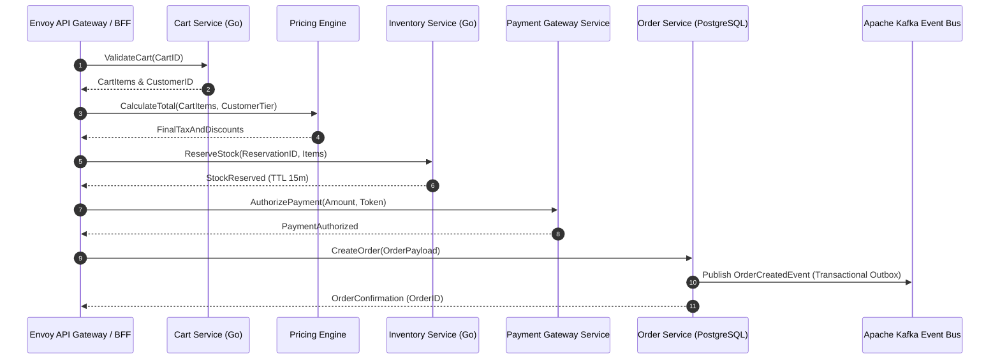

[📖 Bản tiếng Việt (Vietnamese Edition)](https://learn.tanhdev.com/series/magento-migration-vietnam/deconstructing-ecommerce-service-details-domain/)

---

> **Prerequisite:** Read [Part 10 — Magento Enterprise Project Scoping](/series/magento-migration-vietnam/magento-development-in-vietnam/) for domain effort allocations.

# Deconstructing the Ecosystem: Service Details by Domain

**Answer-first:** Deconstructing Magento's monolithic data model into high-performance Go microservices requires establishing strict Domain-Driven Design (DDD) bounded contexts across eight core commerce domains: **Catalog & Search**, **Dynamic Pricing**, **Cart & Session**, **Inventory Reservation**, **Checkout Orchestrator**, **Order Management**, **Customer & Identity**, and **Fulfillment Integration**. Enforcing strict database-per-service isolation with gRPC Protobuf synchronous APIs and Kafka asynchronous events eliminates inter-service lock contention and guarantees sub-35ms P99 query latency.

In a monolithic architecture, boundaries between data domains are soft and easily violated. Magento code routinely joins customer tables, inventory tables, and order tables in a single SQL query.

When migrating to distributed microservices, this relational entanglement must be severed. Each domain service becomes the sole authority over its data store.

---

## 1. Core Commerce Domain Decomposition Map



---

## 2. Granular Domain Specifications & Data Ownership

| Domain Service | Primary Storage | Synchronous Inbound API | Emitted Asynchronous Events | Internal State Managed |
| :--- | :--- | :--- | :--- | :--- |
| **Catalog Service** | LanceDB + PostgreSQL | gRPC `GetProduct`, `SearchCatalog` | `catalog.product.created` | Flat SKU attributes, categories, media, embeddings |
| **Pricing Engine** | Redis Hash + RAM | gRPC `CalculateCartPrice` | None (Consumer of rules) | Customer group rules, tier discounts, VAT tables |
| **Cart Service** | Redis Cluster | gRPC `AddToCart`, `GetCart` | `cart.abandoned.detected` | Ephemeral user sessions, items, applied coupons |
| **Inventory Service** | PostgreSQL + Redlock | gRPC `ReserveStock`, `ReleaseStock`| `inventory.stock.depleted` | Warehouse stock levels, active temporary reservations |
| **Checkout Orchestrator**| Stateless (Go) | REST `POST /v1/checkout/submit`| None (Drives Saga workflow) | Transient saga state machines, payment tokens |
| **Order Service** | PostgreSQL 16 | gRPC `CreateOrder`, `GetOrder` | `order.confirmed.v1` | Immutable orders, shipments, invoices, line items |
| **Customer Service** | PostgreSQL | gRPC `Authenticate`, `GetProfile`| `customer.registered.v1` | Passwords (Argon2id), address books, company trees |
| **Fulfillment Service**| PostgreSQL | gRPC `DispatchShipment` | `fulfillment.package.shipped`| 3PL warehouse tracking numbers, courier dispatches |

---

## 3. Production gRPC Protocol Schema: Inventory Reservation

The following Protobuf contract enforces strict distributed inventory locking with automatic expiration TTLs to prevent overselling during flash sales:

```protobuf
syntax = "proto3";

package commerce.inventory.v1;
option go_package = "github.com/vesviet/commerce/inventory/v1;inventoryv1";

service InventoryService {
  rpc ReserveStock (ReserveStockRequest) returns (ReserveStockResponse);
  rpc ReleaseStock (ReleaseStockRequest) returns (ReleaseStockResponse);
  rpc CommitStock (CommitStockRequest) returns (CommitStockResponse);
}

message ReserveStockRequest {
  string order_id = 1;
  repeated StockItem items = 2;
  int64 ttl_seconds = 3; // Lock expiration (e.g. 900s for checkout)
}

message StockItem {
  string sku = 1;
  int32 quantity = 2;
  string warehouse_id = 3;
}

message ReserveStockResponse {
  bool success = 1;
  string reservation_id = 2;
  repeated string out_of_stock_skus = 3;
}

message ReleaseStockRequest {
  string reservation_id = 1;
}

message ReleaseStockResponse {
  bool released = 1;
}

message CommitStockRequest {
  string reservation_id = 1;
  string order_id = 2;
}

message CommitStockResponse {
  bool committed = 1;
}
```

---

---

## 3. High-Concurrency Checkout gRPC Sequence

The sequence diagram below illustrates how decomposed domain microservices communicate via non-blocking gRPC during an order placement transaction:



## 4. Cross-Domain Communication Rules

To maintain high throughput and resilience, inter-service interactions adhere to strict protocol invariants:
1. **Zero Database Cross-Querying**: No service possesses credentials to access another service's private database.
2. **Command vs Query Segregation (CQRS)**: Heavy read paths (Product Listing Pages) read directly from read-optimized LanceDB and Redis caches, bypassing transactional SQL tables.
3. **Idempotent Event Consumers**: All asynchronous Kafka consumers track event UUIDs in Redis with a 24-hour deduplication window, ensuring duplicate delivery causes zero data corruption.

---

## ❓ Frequently Asked Questions (FAQ)


The Inventory Service combines PostgreSQL row versioning with distributed locks implemented in Redis using Redlock. When a customer begins checkout, stock is decremented in memory with a 15-minute expiration lease (TTL). If payment fails or the session times out, the lease expires and stock is returned automatically without database deadlocks.



Customer addresses reside strictly inside the Customer & Identity Service. During checkout, the Checkout Orchestrator fetches the verified address via gRPC and creates an immutable snapshot of that address inside the Order Management Service, ensuring that future customer profile edits never alter historical order records.



Rather than executing cross-database joins in production, all domain services stream their state change events (`order.created`, `inventory.adjusted`, `customer.updated`) to Kafka. A dedicated Analytics Ingestion Worker consumes these streams and loads denormalized analytical tables into ClickHouse or an Apache Iceberg lakehouse for high-speed reporting.


---

🔗 **Next Step:** Continue to [Part 12 — Go Engineers in Vietnam: Vetting for Magento Migration](/series/magento-migration-vietnam/go-engineers-vietnam-migration-vetting/).
