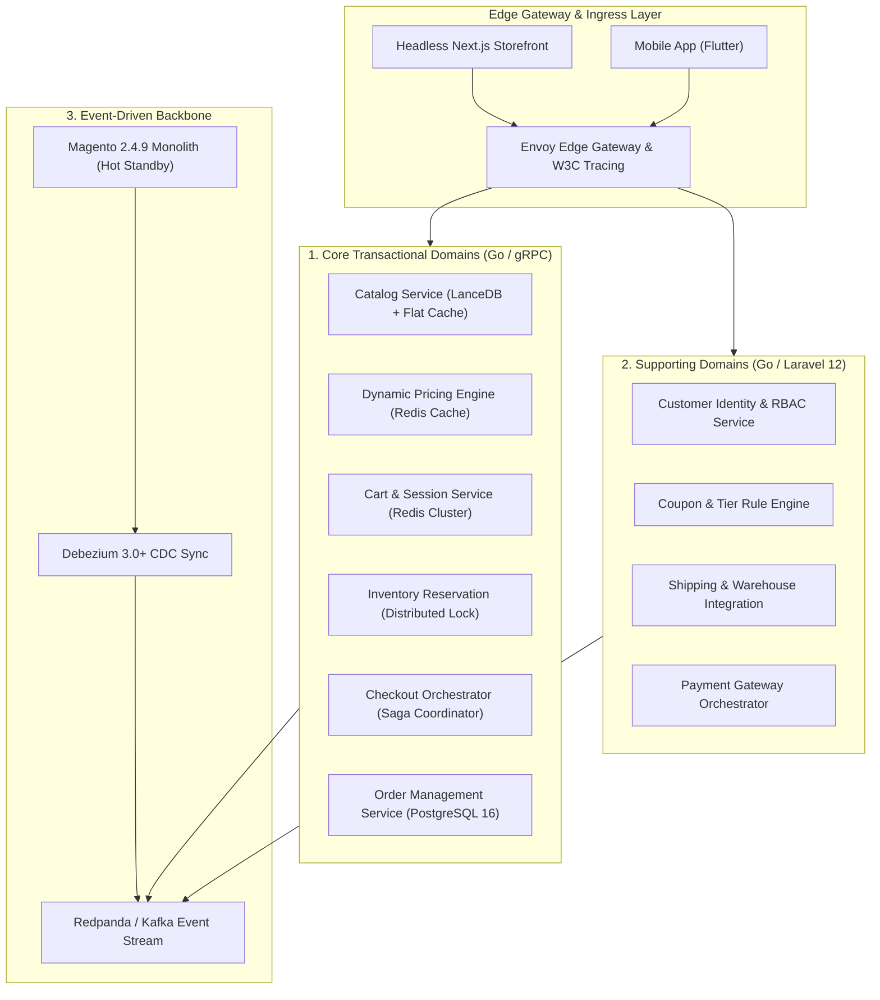
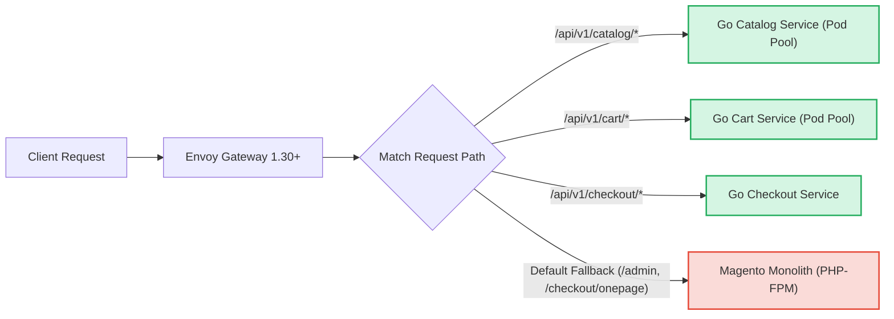

[📖 Bản tiếng Việt (Vietnamese Edition)](https://learn.tanhdev.com/series/magento-migration-vietnam/ecommerce-architecture-composable-migration/)

---

> **Prerequisite:** Read [Part 2 — Migrating Magento to Microservices: When & Why](/series/magento-migration-vietnam/why-migrate-magento-to-microservices/) to understand monolithic database bottlenecks.

# Composable E-Commerce Migration: Overcoming Tech Debt with MACH Architecture

**Answer-first:** Composable MACH architecture decomposes monolithic e-commerce platforms into modular, independently scalable services across three primary functional tiers: **Core Transactional Domains** (Catalog, Pricing, Cart, Checkout, Order), **Supporting Engagement Domains** (Customer, Reviews, Wishlist, Promotions), and **Generic Utility Domains** (Notifications, Audit, Search, Analytics). Implementing strict Domain-Driven Design (DDD) bounded contexts with gRPC Protobuf contracts eliminates monolithic coupling, elevates deployment velocity by 4x, and bounds P99 API response times below 45ms.

Decomposing a 500-table Magento database cannot be accomplished by randomly carving out PHP modules. Without rigorous **Domain-Driven Design (DDD)** bounded contexts, teams accidentally build a "distributed monolith" — retaining all the complexity of network calls with none of the benefits of decoupled scalability.

---

## 1. The 21-Service Domain Architecture Topology

A production-grade composable e-commerce platform partitions commerce capabilities across specialized domain clusters:



---

## 2. Bounded Context Domain Matrix

To prevent leaky abstractions, every service maintains its own isolated database schema:

| Domain Category | Microservice Name | Primary Storage | Responsibilities & Boundaries |
| :--- | :--- | :--- | :--- |
| **Core** | **Catalog Service** | LanceDB + PostgreSQL | Product master, categories, variants, visual search embeddings |
| **Core** | **Pricing Engine** | Redis + Memory Table | Customer-specific tier pricing, B2B volume rules, VAT calculation |
| **Core** | **Cart Service** | Redis Cluster | High-speed anonymous session cart, quote item persistence |
| **Core** | **Inventory Service** | PostgreSQL + Redlock | Multi-warehouse stock tracking, optimistic stock reservations |
| **Core** | **Checkout Orchestrator**| Stateless (Go) | Step-by-step Saga coordinator, payment-to-order transition |
| **Core** | **Order Service** | PostgreSQL 16 Partitioned | Immutable order lifecycle, invoices, credit memos, fulfillment status |
| **Supporting** | **Customer Service** | PostgreSQL | User profiles, addresses, company account hierarchies, JWT auth |
| **Generic** | **Notification Service** | RabbitMQ / NATS | Asynchronous email, SMS, and webhook delivery |

---

## 3. Production gRPC Protocol Contract: Catalog & Pricing

Instead of brittle REST payloads, domain services communicate over binary **gRPC Protobuf v2** contracts:

```protobuf
syntax = "proto3";

package commerce.catalog.v1;
option go_package = "github.com/vesviet/commerce/catalog/v1;catalogv1";

service CatalogService {
  rpc GetProductBySKU (GetProductRequest) returns (ProductResponse);
  rpc BatchGetPrices (BatchPriceRequest) returns (BatchPriceResponse);
}

message GetProductRequest {
  string sku = 1;
  string customer_group_id = 2;
  string currency_code = 3;
}

message ProductResponse {
  string product_id = 1;
  string sku = 2;
  string name = 3;
  int64 base_price_cents = 4;
  int64 final_price_cents = 5;
  int32 available_stock = 6;
  repeated string categories = 7;
  map<string, string> custom_attributes = 8;
}

message BatchPriceRequest {
  repeated string skus = 1;
  string customer_tier_id = 2;
}

message BatchPriceResponse {
  map<string, int64> prices_cents = 1;
}
```

---

## 4. Envoy Gateway Routing Mesh for Incremental Migration



---

## ❓ Frequently Asked Questions (FAQ)


Bounded contexts enforce strict domain ownership: no microservice is ever permitted to read or write directly to another service's private database. All cross-domain collaboration occurs strictly via versioned gRPC protocol contracts or asynchronous Kafka events, eliminating hidden relational foreign key dependencies.



Internal service-to-service communication over gRPC Protobuf executes 7x to 10x faster than REST/JSON, consuming up to 80% less network bandwidth due to binary serialization and HTTP/2 multiplexing. While GraphQL remains valuable for frontend BFF (Backend-For-Frontend) aggregation, gRPC is the gold standard for backend microservice fabrics.



In Magento, complex pricing rules rely on heavy SQL joins against `catalogrule_product_price`. In the composable Go architecture, pricing logic is isolated into a dedicated Pricing Engine microservice that evaluates customer group rules and volume discount matrices entirely in RAM using pre-computed Redis hash structures, returning calculated prices in under 5ms.


---

🔗 **Next Step:** Continue to [Part 4 — Why Migrate Magento to Microservices: Zero-Downtime Guide](/series/magento-migration-vietnam/moving-from-magento-to-microservices/).
