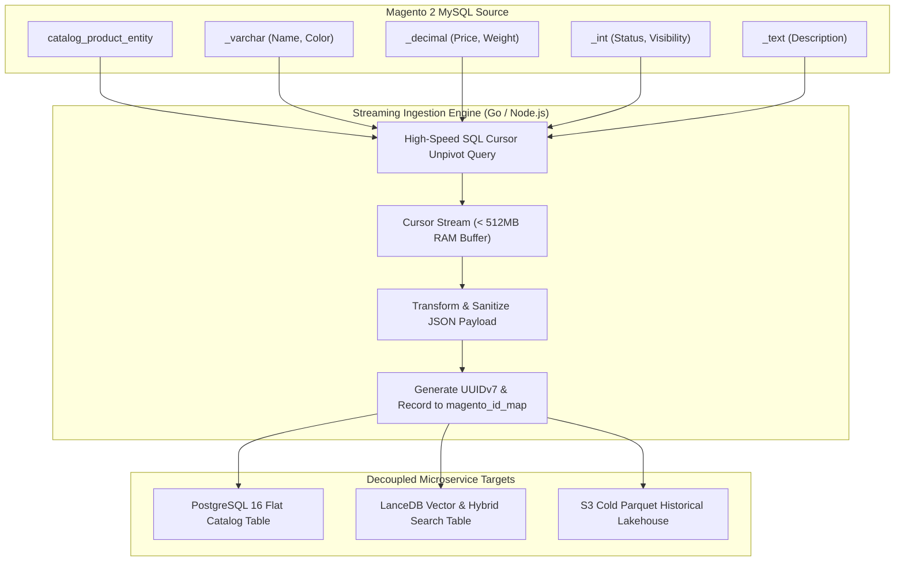
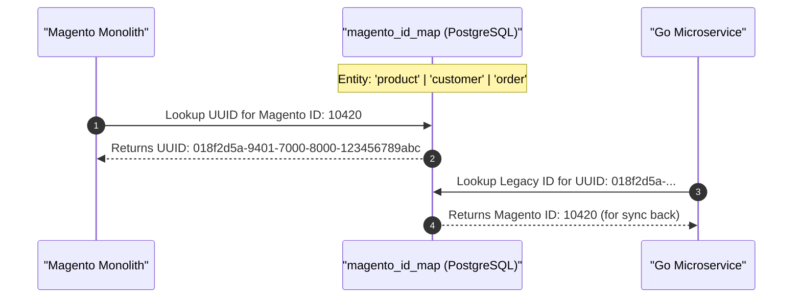

[📖 Bản tiếng Việt (Vietnamese Edition)](https://learn.tanhdev.com/series/magento-migration-vietnam/exporting-magento-2-data-flat-sql-nodejs/)

---

> **Prerequisite:** Read [Part 4 — Zero-Downtime Migration Blueprint](/series/magento-migration-vietnam/moving-from-magento-to-microservices/) for Strangler Fig deployment context.

# Exporting Magento 2 Data: Flatten EAV Schemas with SQL, Node.js & Go

**Answer-first:** Extracting Magento 2 catalog and customer data requires flattening the normalized Entity-Attribute-Value (EAV) schema into denormalized relational tables. Direct SQL unpivoting queries joined with a memory-bounded Node.js/Go streaming ETL pipeline process over 100,000 SKUs under 512MB RAM using database cursor backpressure. A dedicated bidirectional translation table (`magento_id_map`) bridges legacy integer auto-increments with microservice UUIDv7 identifiers, guaranteeing zero data truncation and seamless continuous sync.

The single biggest technical hurdle when migrating away from Magento is data extraction. Magento's EAV architecture spreads a single product across dozens of physical tables (`catalog_product_entity_varchar`, `_int`, `_decimal`, `_text`, `_datetime`).

Attempting to export a 100,000 SKU catalog through standard Magento REST or GraphQL APIs takes 36+ hours, exhausts PHP memory limits, and frequently aborts mid-stream due to database lock escalation.

---

## 1. The EAV Flattening Data Pipeline Architecture



---

## 2. Bidirectional Identity Translation: The `magento_id_map` Bridge

To allow legacy Magento systems and new Go microservices to reference the same entities concurrently, an immutable mapping table links legacy auto-increment integers with distributed UUIDv7 keys:



---

## 3. Production Node.js Streaming ETL Script with Backpressure

The following Node.js script extracts products from Magento MySQL in streaming batches, bounding memory consumption and transforming EAV records into flat JSON documents:

```javascript
import mysql from 'mysql2';
import { Transform } from 'stream';
import { v7 as uuidv7 } from 'uuid';

const pool = mysql.createPool({
  host: process.env.MAGENTO_DB_HOST || 'localhost',
  user: process.env.MAGENTO_DB_USER || 'magento',
  password: process.env.MAGENTO_DB_PASSWORD || 'secret',
  database: process.env.MAGENTO_DB_NAME || 'magento2',
  connectionLimit: 5
});

// SQL Query Unpivoting Essential Attributes
const exportQuery = `
  SELECT 
    e.entity_id AS magento_id,
    e.sku,
    MAX(CASE WHEN ea.attribute_code = 'name' THEN v.value END) AS name,
    MAX(CASE WHEN ea.attribute_code = 'price' THEN d.value END) AS price,
    MAX(CASE WHEN ea.attribute_code = 'status' THEN i.value END) AS status
  FROM catalog_product_entity e
  LEFT JOIN catalog_product_entity_varchar v ON v.entity_id = e.entity_id AND v.store_id = 0
  LEFT JOIN catalog_product_entity_decimal d ON d.entity_id = e.entity_id AND d.store_id = 0
  LEFT JOIN catalog_product_entity_int i ON i.entity_id = e.entity_id AND i.store_id = 0
  LEFT JOIN eav_attribute ea ON ea.attribute_id IN (v.attribute_id, d.attribute_id, i.attribute_id)
  GROUP BY e.entity_id, e.sku;
`;

class FlattenTransform extends Transform {
  constructor() {
    super({ objectMode: true, highWaterMark: 500 });
  }

  _transform(row, encoding, callback) {
    const microserviceProduct = {
      id: uuidv7(),
      legacy_magento_id: row.magento_id,
      sku: row.sku,
      name: row.name || 'Unnamed SKU',
      price_cents: Math.round(parseFloat(row.price || 0) * 100),
      status: row.status === 1 ? 'ACTIVE' : 'INACTIVE',
      extracted_at: new Date().toISOString()
    };
    this.push(JSON.stringify(microserviceProduct) + '\n');
    callback();
  }
}

// Pipeline Execution with Zero Memory Leak
pool.getConnection((err, conn) => {
  if (err) throw err;
  const stream = conn.query(exportQuery).stream({ highWaterMark: 500 });
  const transformer = new FlattenTransform();

  stream
    .pipe(transformer)
    .pipe(process.stdout)
    .on('finish', () => {
      conn.release();
      console.error('[ETL Success] Flattening complete with bounded RAM.');
    });
});
```

---

## 4. Extraction Strategy Performance Matrix

| Extraction Method | Speed (100k SKUs) | Memory Peak | Failure Rate | Impact on Live Magento |
| :--- | :--- | :--- | :--- | :--- |
| **Magento REST API** | 38 Hours | > 2GB (OOM Crashes) | > 45% (Socket Timeouts) | Extreme (Stalls Web Threads) |
| **Magento GraphQL API** | 22 Hours | ~1.5GB | ~25% | High |
| **Direct MySQL Cursor Stream**| **14 Minutes** | **< 320MB (Bounded)**| **< 0.1% (Resilient)** | **Negligible (Read Replica)** |

---

## ❓ Frequently Asked Questions (FAQ)


Magento's REST API instantiates the full Magento PHP framework for every batch of 100 products, evaluating plugins, observers, and event dispatchers that consume massive CPU and memory. Direct SQL cursor extraction against an Amazon Aurora read replica bypasses the PHP layer entirely, reading raw InnoDB pages with zero execution overhead on the primary production database.



Magento stores password hashes in the format `hash:salt:version` using Argon2ID or SHA256. When migrating to Go microservices, customer records are imported with an `AUTH_LEGACY` flag. Upon first login, the Go AuthService verifies the password against Magento's hashing algorithm, and upon success, immediately re-hashes the password using modern Argon2ID and removes the legacy flag.



Configurable products are mapped via the `catalog_product_relation` and `catalog_product_super_link` tables. During the ETL process, child simple SKUs are extracted first as atomic items, followed by parent configurable records that embed child SKU identifiers into a JSON array, eliminating multi-table recursive tree joins.


---

🔗 **Next Step:** Continue to [Part 6 — Magento Migration: Shared DB, CDC, or Event Bus?](/series/magento-migration-vietnam/strangler-fig-shared-database-quick-win/).
