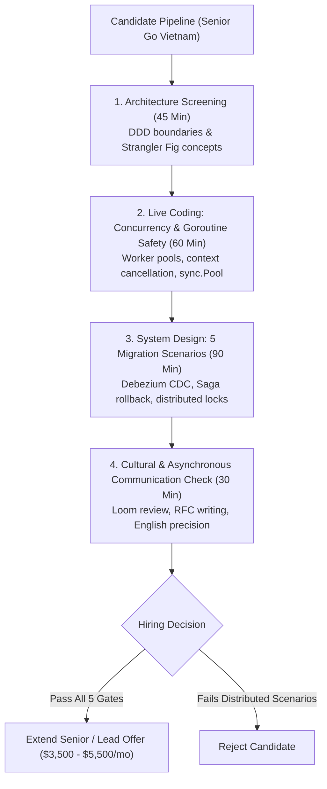
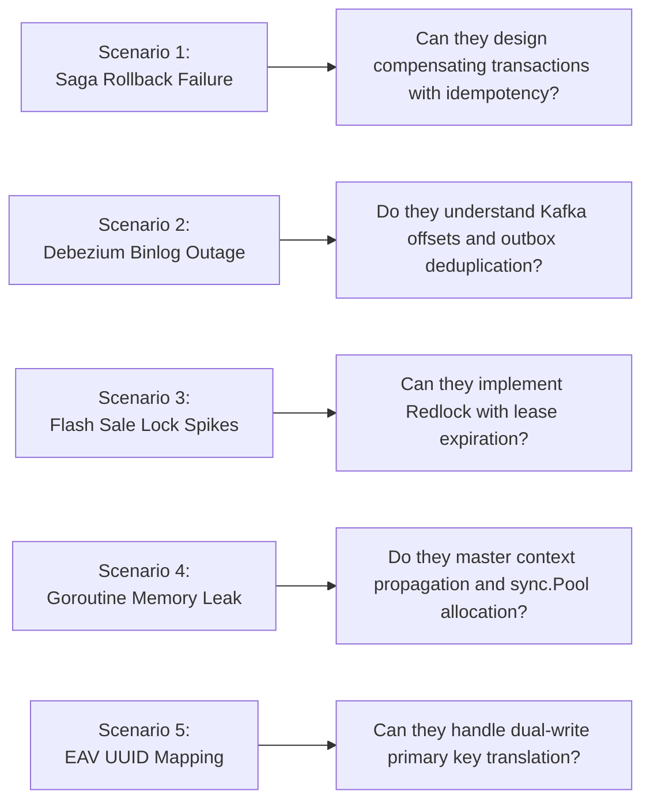

[📖 Bản tiếng Việt (Vietnamese Edition)](https://learn.tanhdev.com/series/magento-migration-vietnam/go-engineers-vietnam-migration-vetting/)

---

> **Prerequisite:** Read [Part 11 — Deconstructing the Ecosystem by Domain](/series/magento-migration-vietnam/deconstructing-ecommerce-service-details-domain/) for service boundaries.

# Vetting Go Engineers in Vietnam: 5 Production Migration Scenarios

**Answer-first:** Vetting senior Go engineers for a Magento re-architecture project requires evaluating **distributed systems migration competency** rather than basic greenfield syntax or algorithmic trivia. Technical interview scorecards must stress-test five concrete production scenarios: **1) Distributed Saga Rollbacks** during gateway failures, **2) Debezium CDC Event Deduplication**, **3) Zero-Downtime Dual-Write Identity Mapping (`magento_id_map`)**, **4) Redis Distributed Locking against Flash Sale Overselling**, and **5) Zero-Allocation Memory Pooling** under 10,000 concurrent goroutines.

A developer who can write a clean Go REST API from scratch is not necessarily qualified to dismantle a live, high-volume Magento monolith.

Migration engineering is significantly harder than greenfield development: it requires operating inside messy legacy constraints, synchronizing databases asynchronously, and designing for graceful degradation during multi-month cutovers.

---

## 1. Technical Vetting Funnel Topology



---

## 2. Five Production Migration Interview Scenarios



### Scenario Breakdown & Evaluation Criteria

1. **Scenario 1: Distributed Saga Compensation**: Ask the candidate to write an order coordinator where Step 1 (Inventory Reserve) succeeds, Step 2 (Payment Authorize) fails, and the network crashes while attempting the compensation step. *Green Signal*: Candidate implements persistent outbox retries with exponential backoff and idempotency keys.
2. **Scenario 2: CDC Event Ordering & Deduplication**: Ask how they prevent duplicate order event processing when Debezium crashes and replays 5 minutes of binlog events from its last checkpoint. *Green Signal*: Candidate utilizes Redis bloom filters or database unique constraints rather than relying on Kafka partition ordering alone.
3. **Scenario 3: Flash Sale Distributed Locking**: Ask them to prevent 2,000 concurrent goroutines from overselling 10 remaining items in stock. *Green Signal*: Candidate rejects raw MySQL `SELECT FOR UPDATE` and implements Redis atomic decrements (`DECRBY`) or Redlock with explicit TTLs.
4. **Scenario 4: High-Concurrency Goroutine Leak Prevention**: Provide code containing an unbuffered channel and an un-cancelled context causing thousands of goroutines to leak during HTTP timeouts. *Green Signal*: Candidate identifies leak within 3 minutes and instruments `pprof` goroutine stack traces.
5. **Scenario 5: Legacy Integer to UUIDv7 Translation**: Ask how they bridge Magento's 32-bit integer auto-increments with microservice UUIDv7 identifiers during a 6-month dual-write window. *Green Signal*: Candidate designs an immutable bidirectional lookup table with local LRU caching.

---

## 3. Production Code Challenge: Goroutine Worker Pool with Context Cancellation

A standard technical screening task evaluating concurrency control, graceful termination, and backpressure:

```go
package main

import (
	"context"
	"fmt"
	"sync"
	"time"
)

type Job struct {
	ID    int
	SKU   string
	Price float64
}

func WorkerPool(ctx context.Context, numWorkers int, jobs <-chan Job) <-chan string {
	results := make(chan string, numWorkers*2)
	var wg sync.WaitGroup

	for i := 0; i < numWorkers; i++ {
		wg.Add(1)
		go func(workerID int) {
			defer wg.Done()
			for {
				select {
				case <-ctx.Done():
					fmt.Printf("[Worker %d] Context cancelled, shutting down gracefully.\n", workerID)
					return
				case job, ok := <-jobs:
					if !ok {
						return
					}
					// Process item simulation
					res := fmt.Sprintf("Worker %d processed SKU %s at $%.2f", workerID, job.SKU, job.Price)
					select {
					case results <- res:
					case <-ctx.Done():
						return
					}
				}
			}
		}(i)
	}

	go func() {
		wg.Wait()
		close(results)
	}()

	return results
}
```

---

## 4. Candidate Scoring Matrix: Greenfield vs Migration Engineers

| Competency Area | Junior / Mid Candidate | Senior Migration Engineer (Hire Signal) |
| :--- | :--- | :--- |
| **Concurrency Mastery** | Uses `time.Sleep` to avoid race conditions | Uses `sync.Mutex`, channels, and `errgroup` |
| **Error Handling** | Ignores errors or prints to stdout | Implements custom domain errors and telemetry spans |
| **Distributed Transactions** | Assumes network calls never fail | Designs compensating sagas and outbox queues |
| **Database Knowledge** | Relies entirely on ORM abstractions (GORM)| Writes optimized raw SQL, understands isolation levels |
| **Legacy Code Attitude** | Refuses to inspect PHP; demands greenfield | Analyzes legacy PHP logic to extract true business rules |

---

## ❓ Frequently Asked Questions (FAQ)


LeetCode puzzles measure memorized binary tree algorithms, which have zero correlation with real-world migration challenges. A migration engineer's daily reality consists of debugging MySQL deadlock traces, handling network timeouts between PHP and Go, structuring Kafka consumer consumer groups, and designing resilient rollback playbooks.



A top-tier Senior Go Engineer with 6–8 years of experience capable of driving an enterprise migration commands between $3,200 and $4,800 USD per month ($38,000–$58,000/year). A Principal Distributed Systems Architect ranges from $4,800 to $6,500 USD per month. This represents an 70% savings compared to equivalent US talent ($180,000–$250,000/year).



Assign a take-home architectural review task: provide a 2-page specification of an existing Magento checkout bottleneck and ask the candidate to record a 5-minute Loom walkthrough and write an architectural decision record (ADR). This immediately evaluates their English technical clarity, architectural depth, and asynchronous communication discipline.


---

🔗 **Next Step:** Continue to [Part 13 — Magento Migration Cost: Vietnam vs US/EU Team (2026 Model)](/series/magento-migration-vietnam/magento-migration-cost-vietnam-vs-us-eu/).
