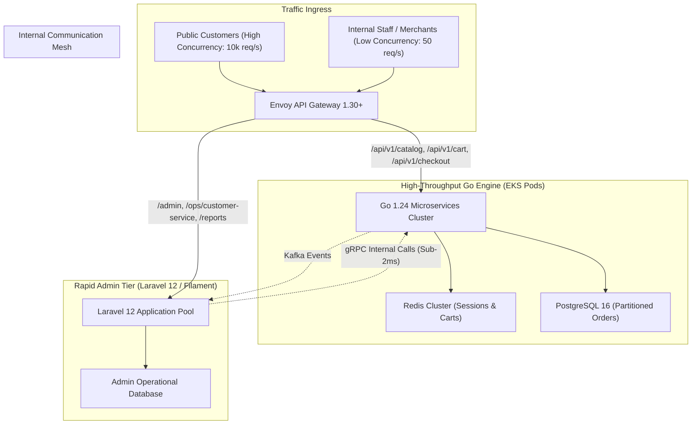
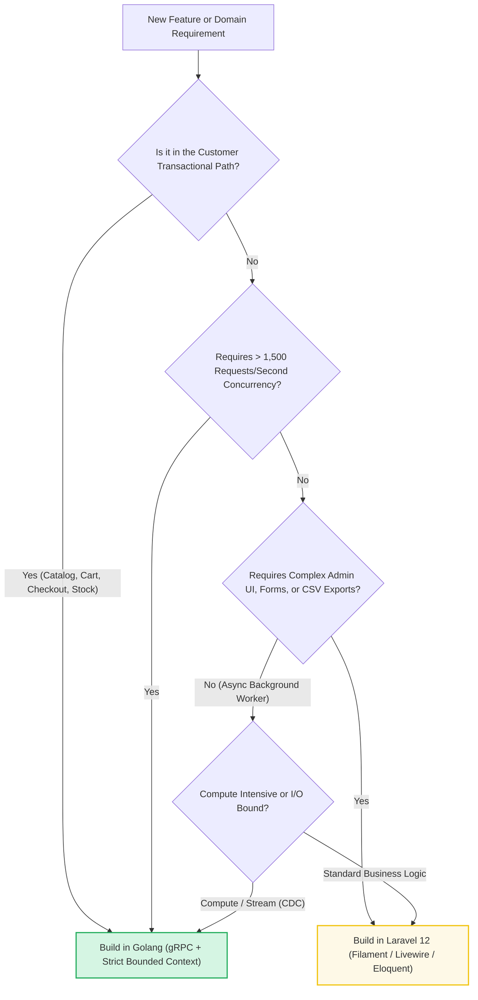

[📖 Bản tiếng Việt (Vietnamese Edition)](https://learn.tanhdev.com/series/magento-migration-vietnam/laravel-vs-golang-when-to-add-features/)

---

> **Prerequisite:** Read [Part 6 — Magento Migration: Shared DB, CDC, or Event Bus?](/series/magento-migration-vietnam/strangler-fig-shared-database-quick-win/) for data synchronization architecture.

# Laravel vs Golang: When to Add Features in Each?

**Answer-first:** In a modernized composable e-commerce architecture, language selection is governed by domain operational profiles: **Golang** is mandated for high-throughput, latency-critical customer-facing paths (Catalog search, Cart calculations, Inventory reservations, and Checkout) demanding sub-50ms P99 latency and high concurrency (>5,000 req/sec). Conversely, **Laravel 11/12** is deployed for complex back-office administrative portals (Filament admin panels, customer service tooling, merchant onboarding, and reporting) where developer velocity and rapid CRUD prototyping yield a 3x faster time-to-market.

Migrating away from Magento does not mean rewriting every administrative form and reporting screen in Go. Forcing low-traffic admin CRUD into Go needlessly inflates engineering hours, while leaving high-concurrency checkout paths in PHP perpetuates server stability risks.

A pragmatic polyglot architecture leverages the respective superpowers of both ecosystems.

---

## 1. Polyglot System Architecture Topology



---

## 2. Language Selection Decision Framework



---

## 3. Production Benchmark: Performance & Economics Matrix

| Metric / Dimension | Golang 1.24 Microservice | Laravel 12 (PHP 8.4 + Octane) | Standard Magento 2.4.9 PHP-FPM |
| :--- | :--- | :--- | :--- |
| **Peak Throughput / CPU Core** | **8,500+ req/sec** | ~1,200 req/sec | ~85 req/sec |
| **Container RAM Footprint** | **12MB - 25MB** | 120MB - 250MB | 350MB - 650MB |
| **P99 API Latency** | **15ms - 45ms** | 65ms - 150ms | 1,800ms - 3,500ms |
| **Time-to-Market (Admin CRUD)**| Moderate (Manual UI code) | **Extremely Fast (Filament Admin)**| Slow (XML / UI Components) |
| **Concurrency Model** | Native Goroutines (M:N) | Swoole / RoadRunner Worker Pool | Process-per-request (PHP-FPM) |

---

## 4. Production Code: Laravel Consuming Go via gRPC

To keep the system decoupled, Laravel admin features query the Go core engine using lightweight gRPC clients rather than touching raw microservice database tables:

```php
<?php

namespace App\Services;

use Commerce\Catalog\V1\CatalogServiceClient;
use Commerce\Catalog\V1\GetProductRequest;
use Grpc\ChannelCredentials;

class GoCatalogGateway
{
    private CatalogServiceClient $client;

    public function __construct()
    {
        // Connect to internal Go microservice over high-speed gRPC
        $this->client = new CatalogServiceClient(
            config('services.go_catalog.endpoint', 'catalog-service.internal:50051'),
            ['credentials' => ChannelCredentials::createInsecure()]
        );
    }

    public function getProductDetails(string $sku, string $tierId = 'tier_gold'): array
    {
        $request = new GetProductRequest();
        $request->setSku($sku);
        $request->setCustomerGroupId($tierId);

        list($response, $status) = $this->client->GetProductBySKU($request)->wait();

        if ($status->code !== \Grpc\STATUS_OK) {
            throw new \RuntimeException("Go Catalog gRPC error: {$status->details}");
        }

        return [
            'id' => $response->getProductId(),
            'sku' => $response->getSku(),
            'name' => $response->getName(),
            'price_formatted' => '$' . number_format($response->getFinalPriceCents() / 100, 2),
            'stock_available' => $response->getAvailableStock(),
        ];
    }
}
```

---

## ❓ Frequently Asked Questions (FAQ)


While Golang is unmatched for high-throughput APIs, building back-office administrative portals (complex CRUD interfaces, role-based form validation, CSV data exports, customer service dashboards) in Go requires writing substantial boilerplate code. Laravel's ecosystem (notably Filament and Nova) enables engineers to ship rich, secure admin portals in days rather than months.



Laravel Octane with Swoole keeps the PHP application resident in memory, increasing throughput from 80 req/s to 1,200 req/s. However, PHP remains fundamentally single-threaded per worker and lacks Go's native goroutine lightweight concurrency. For memory-intensive catalog caching, real-time inventory distributed locking, and sub-20ms checkout pipelines, Go outperforms Octane by 7x while consuming 90% less RAM.



The architectural golden rule is strict Database-Per-Service isolation. Laravel is never granted database credentials to the Go services' PostgreSQL or Redis stores. All communication must pass through versioned gRPC APIs or asynchronous Kafka event streams, preserving complete architectural independence.


---

🔗 **Next Step:** Proceed to [Part 8 — Magento AI Integration: Modernize Without Rebuilding](/series/magento-migration-vietnam/magento-ai-integration-strategy-architecture/).
