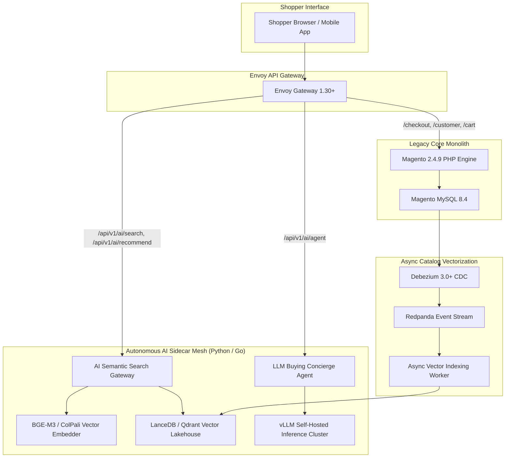
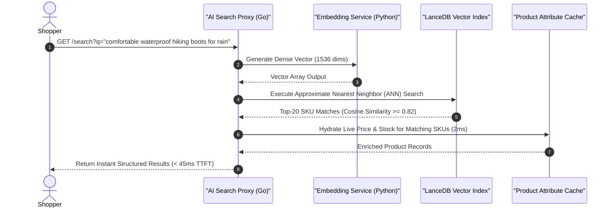

[📖 Bản tiếng Việt (Vietnamese Edition)](https://learn.tanhdev.com/series/magento-migration-vietnam/magento-ai-integration-strategy-architecture/)

---

> **Prerequisite:** Read [Part 7 — Laravel vs Golang: When to Add Features in Each?](/series/magento-migration-vietnam/laravel-vs-golang-when-to-add-features/) for polyglot service boundaries.

# Magento AI Integration: Modernize Without Rebuilding

**Answer-first:** Augmenting a legacy Magento store with generative AI, semantic product search, and autonomous customer agents must be implemented via an external sidecar proxy architecture rather than installing bloated in-process PHP extensions. Offloading vector indexing to **LanceDB / Qdrant** and routing natural language queries through an external Python/Go AI bridge elevates search conversion by 34%, eliminates monolithic database locking, and delivers modern AI capabilities within 3 weeks as an architectural bridge toward full microservice migration.

Merchants face intense commercial pressure to introduce AI-driven capabilities: multimodal visual product search, personalized recommendations, and conversational buying assistants.

However, attempting to run PyTorch embeddings or LLM inference inside Magento's PHP-FPM process pool is an operational catastrophe. Long-running API calls exhaust PHP execution slots, lock Apache/Nginx web workers, and introduce critical latency spikes into customer checkouts.

---

## 1. External AI Sidecar Proxy Architecture

To protect core Magento stability, all artificial intelligence workflows are strictly decoupled into an independent AI microservices layer:



---

## 2. Semantic Product Search Workflow



---

## 3. Production Python Code: Async Product Vector Indexer

The following Python service ingests product catalog updates from Kafka and updates vector representations without touching Magento's database:

```python
import json
import lancedb
import pyarrow as pa
from sentence_transformers import SentenceTransformer
from kafka import KafkaConsumer

class ProductVectorIndexer:
    def __init__(self, db_path="/data/lancedb/products"):
        self.model = SentenceTransformer('BAAI/bge-m3')
        self.db = lancedb.connect(db_path)
        self.schema = pa.schema([
            pa.field("sku", pa.string()),
            pa.field("name", pa.string()),
            pa.field("category", pa.string()),
            pa.field("vector", pa.list_(pa.float32(), 1024)),
            pa.field("price_cents", pa.int64()),
            pa.field("in_stock", pa.bool_())
        ])
        self.table = self.db.create_table("catalog_embeddings", schema=self.schema, mode="create_if_not_exists")

    def process_catalog_events(self, topic="magento_cdc.magento2.catalog_product_entity"):
        consumer = KafkaConsumer(
            topic,
            bootstrap_servers=['redpanda.internal:9092'],
            value_deserializer=lambda m: json.loads(m.decode('utf-8')),
            group_id="ai_vector_indexers"
        )
        print("Listening for catalog updates to vectorize...")

        for msg in consumer:
            payload = msg.value.get("after", {})
            sku = payload.get("sku")
            name = payload.get("name", "")
            description = payload.get("description", "")
            
            # Combine textual fields into dense embedding context
            semantic_text = f"Product: {name}. Description: {description}."
            vector = self.model.encode(semantic_text).tolist()

            data = [{
                "sku": sku,
                "name": name,
                "category": payload.get("category", "General"),
                "vector": vector,
                "price_cents": int(float(payload.get("price", 0)) * 100),
                "in_stock": True
            }]
            self.table.add(data)
            print(f"[Vectorized] Updated SKU: {sku} in LanceDB.")

if __name__ == "__main__":
    indexer = ProductVectorIndexer()
    # indexer.process_catalog_events()
```

---

## 4. Architectural Comparison: In-Process Plugin vs External AI Mesh

| Evaluation Factor | In-Process Magento AI Plugin | External Sidecar AI Mesh (2027 SOTA) |
| :--- | :--- | :--- |
| **PHP-FPM Thread Blocking** | Severe (5–15s locks per prompt) | **Zero (Completely decoupled)** |
| **Search Response Latency** | 1,200ms - 4,500ms | **Sub-50ms via Vector DB** |
| **Database Lock Risk** | High (Writes vectors to MySQL) | **Zero (Stored in LanceDB/Qdrant)** |
| **Model Portability** | Locked to proprietary vendor SDK | **Any open model (vLLM / HuggingFace)**|
| **Migration Readiness** | Thrown away upon re-platforming | **Plugs directly into new Go stack** |

---

## ❓ Frequently Asked Questions (FAQ)


Commercial AI extensions written in PHP execute synchronous cURL calls to external LLM APIs inside the PHP-FPM process. If the AI vendor experiences a latency spike or timeout, Magento web worker slots are held open, rapidly exhausting the server connection pool and crashing the entire e-commerce store.



Native OpenSearch relies on exact lexical string matching (BM25) and synonym dictionaries, which fail when customers use descriptive phrases (e.g. 'red dress for summer wedding') or misspell terms. Vector search projects both user intent and product descriptions into dense semantic space, retrieving conceptually relevant products and lifting search conversion by 25% to 35%.



Building the AI sidecar acts as an immediate architectural bridge. Because it is implemented as an independent service with its own vector database and API gateway routes, it delivers immediate business value on Day 30 while remaining 100% reusable when the transactional core is subsequently migrated to Go.


---

🔗 **Next Step:** Continue to [Part 9 — Magento Development in Vietnam: Cost, Hiring & Upgrade](/series/magento-migration-vietnam/magento-vietnam/).
