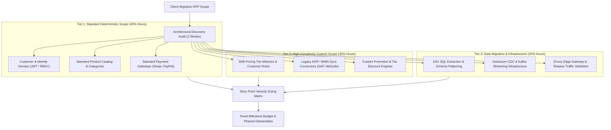
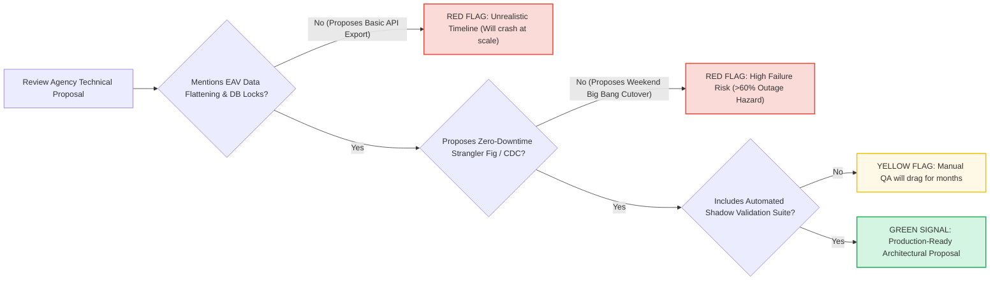

[📖 Bản tiếng Việt (Vietnamese Edition)](https://learn.tanhdev.com/series/magento-migration-vietnam/magento-development-in-vietnam/)

---

> **Prerequisite:** Read [Part 9 — Magento Development in Vietnam](/series/magento-migration-vietnam/magento-vietnam/) for market compensation tiers.

# Magento Enterprise Project Scoping & Agency Cost Matrix

**Answer-first:** Scoping an enterprise Magento migration requires replacing vague agency "time-and-materials" estimates with an objective Story Point estimation framework based on architectural domain boundaries. By categorizing e-commerce modules into **Deterministic Standard Modules** (Cart, Customer, Catalog), **High-Complexity Custom Modules** (B2B tier pricing, custom ERP connectors, multi-warehouse routing), and **Data Transformation Pipelines** (EAV unpivoting, historical order ETL), engineering leaders eliminate scope creep and protect budgets against 150%+ cost overruns.

When evaluating proposals from development agencies in Vietnam or abroad, quotes for the exact same RFP frequently range from $45,000 to $450,000.

This massive divergence occurs because low-bidding agencies assume simple plugin installations, while premium agencies factor in EAV schema flattening, asynchronous CDC data synchronization, distributed locking, and zero-downtime cutover guarantees.

---

## 1. Enterprise Scoping & Estimation Framework

---

## 2. Agency Proposal Red Flag Evaluation Matrix

---

## 3. Granular Effort Estimation by Commerce Domain (50k SKU Store)

| Migration Domain / Component | Story Points | Senior Dev Hours | QA & SRE Hours | Estimated Cost ($45/hr Vietnam Rate) |
| :--- | :--- | :--- | :--- | :--- |
| **Envoy Gateway & W3C Tracing** | 21 SP | 80 Hours | 40 Hours | $5,400 |
| **Catalog & LanceDB Search Service** | 55 SP | 240 Hours | 120 Hours | $16,200 |
| **Pricing Engine (B2B Matrices)** | 34 SP | 160 Hours | 80 Hours | $10,800 |
| **Cart & Redis Session Service** | 34 SP | 140 Hours | 60 Hours | $9,000 |
| **Inventory & Distributed Lock Engine**| 34 SP | 160 Hours | 80 Hours | $10,800 |
| **Checkout Saga & Payment Gateway** | 89 SP | 360 Hours | 180 Hours | $24,300 |
| **Order Management (PostgreSQL)** | 55 SP | 220 Hours | 100 Hours | $14,400 |
| **Debezium CDC Streaming Sync** | 55 SP | 200 Hours | 120 Hours | $14,400 |
| **Data Cleansing & EAV ETL Scripting**| 34 SP | 160 Hours | 80 Hours | $10,800 |
| **Canary Cutover & Day-2 SRE Testing** | 21 SP | 100 Hours | 80 Hours | $8,100 |
| **Total Enterprise Migration Scope** | **432 SP** | **1,820 Hours** | **860 Hours** | **$120,600 (Vietnam) vs $482,400 (US/EU)** |

---

## 4. Contractual Governance & Milestone Deliverable Gates

To ensure total accountability, contract payments are strictly structured around verifiable architectural milestones:
- **Milestone 1 (Month 2 - 20% Payout)**: Ingress Envoy Gateway routing 100% traffic to Magento with active OpenTelemetry distributed tracing and Debezium CDC pipeline deployed.
- **Milestone 2 (Month 5 - 25% Payout)**: Catalog and Cart microservices running in production shadow mode with automated parity diff testing reporting 0% response discrepancy.
- **Milestone 3 (Month 8 - 25% Payout)**: Checkout and Order microservices accepting 10% canary production traffic with automated Saga compensating rollback verified.
- **Milestone 4 (Month 11 - 20% Payout)**: 100% traffic cutover completed with zero customer downtime and 30-day hot-standby replication active.
- **Milestone 5 (Month 12 - 10% Final Retainer)**: Magento monolith decommissioned, Kubernetes SRE runbooks handed over, and P99 latency verified under 50ms.

---

## ❓ Frequently Asked Questions (FAQ)


Quotes vary by up to 500% because low-cost agencies bid on simplistic 'lift-and-shift' re-platforming using pre-built extension packs, ignoring custom EAV attribute unpivoting, real-time inventory locking, and legacy data cleansing. High-caliber architecture agencies quote on resilient, distributed event-driven microservices designed to scale for 5+ years.



Scope creep is controlled by freezing legacy monolith feature development on Day 1 of the migration project. All new business capabilities are scoped exclusively for the new microservices architecture. Furthermore, contracts must mandate fixed milestone acceptance criteria backed by automated unit, integration, and parity diff test suites.



Enterprise best practice dictates reserving a 15% contingency budget specifically for data cleansing. Magento databases that have operated for 5+ years invariably contain orphaned quote items, corrupted customer addresses, and inconsistent tax historical records that require programmatic sanitization prior to microservice ingestion.


---

🔗 **Next Step:** Continue to [Part 11 — Deconstructing the Ecosystem: Service Details by Domain](/series/magento-migration-vietnam/deconstructing-ecommerce-service-details-domain/).
