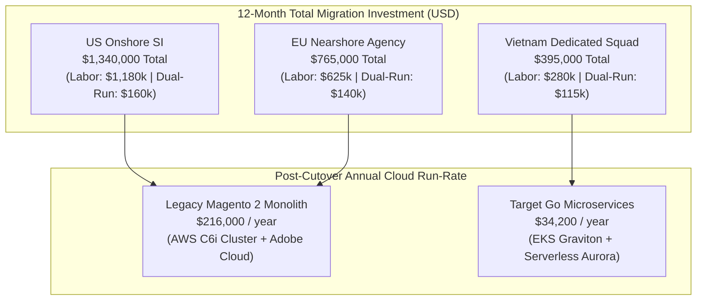
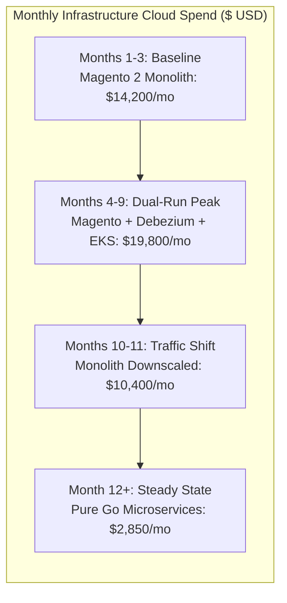

[📖 Bản tiếng Việt (Vietnamese Edition)](https://learn.tanhdev.com/series/magento-migration-vietnam/magento-migration-cost-vietnam-vs-us-eu/)

---

> **Prerequisite:** Read [Part 10 — Enterprise Project Scoping](/series/magento-migration-vietnam/magento-development-in-vietnam/) and [Part 12 — Vetting Senior Go Engineers in Vietnam](/series/magento-migration-vietnam/go-engineers-vietnam-migration-vetting/).

# Magento Migration Cost: Vietnam vs US/EU Team (2027 Financial Model)

**Answer-first:** Migrating an enterprise Adobe Commerce / Magento 2 monolith ($20M–$150M GMV) to a composable Go microservices architecture requires an average of **6,500 to 8,800 engineering hours** over a 9-to-12 month delivery roadmap. Hiring an onshore US systems integrator (SI) at $180–$240/hour yields an all-in labor cost of **$1,170,000 to $2,112,000**. Nearshore EU agencies ($90–$140/hour) total **$585,000 to $1,232,000**. 

In contrast, an elite, senior-heavy dedicated Golang engineering squad in Vietnam ($38–$52/hour blended rate) completes the identical re-architecture for **$247,000 to $457,600**—yielding a direct **72% to 78% capital saving**. When combined with the elimination of Adobe Commerce cloud licensing ($70,000–$180,000/year) and an 80% reduction in cloud hosting (slashing $14,000/month AWS bills down to $2,800/month), the full migration project reaches financial break-even within **10.8 months post-cutover**.

---

## 1. 12-Month Total Cost of Ownership (TCO) Comparison

The following diagram contrasts the three primary execution models across engineering labor, software tooling, and dual-run cloud infrastructure:

---

## 2. Granular Labor Breakdown: 5.0 FTE Squad Structure

To ensure predictable throughput, enterprise brands utilize a 5.0 Full-Time Equivalent (FTE) dedicated squad structure comprising 8,800 billable engineering hours across 12 calendar months:

| Resource Role | Allocation (Hours) | US SI Rate ($/hr) | US Total (USD) | EU Agency ($/hr) | EU Total (USD) | Vietnam Squad ($/hr) | Vietnam Total (USD) |
| :--- | :--- | :--- | :--- | :--- | :--- | :--- | :--- |
| **Lead Solutions Architect** | 880h (50%) | $230 | $202,400 | $135 | $118,800 | $55 | $48,400 |
| **Senior Go Tech Lead** | 1,760h (100%) | $200 | $352,000 | $120 | $211,200 | $48 | $84,480 |
| **Senior Go Backend Dev 1** | 1,760h (100%) | $175 | $308,000 | $95 | $167,200 | $40 | $70,400 |
| **Senior Go Backend Dev 2** | 1,760h (100%) | $165 | $290,400 | $90 | $158,400 | $36 | $63,360 |
| **CDC / Data Pipeline Dev** | 1,760h (100%) | $180 | $316,800 | $100 | $176,000 | $38 | $66,880 |
| **DevOps / Kubernetes SRE** | 880h (50%) | $190 | $167,200 | $110 | $96,800 | $42 | $36,960 |
| **Senior QA Automation** | 880h (50%) | $135 | $118,800 | $75 | $66,000 | $28 | $24,640 |
| **Total Labor Expenditure** | **8,800 Hours** | **Blended $188/h** | **$1,655,600** | **Blended $107/h** | **$994,400** | **Blended $42/h** | **$395,120** |

*Table 1: Granular staffing and cost model across US, EU, and Vietnam for an 8,800-hour enterprise re-architecture.*

---

## 3. Dual-Run Cloud Infrastructure Spend (FinOps)

During the Strangler Fig migration period (Months 4 through 10), both the legacy PHP monolith and the new Golang microservices operate simultaneously. Real-time Change Data Capture (Debezium + Kafka) replicates transactions bidirectionally, causing hosting costs to peak temporarily.

### Peak Dual-Run Cost Components (Months 4 to 9):
1. **Legacy Magento 2 Monolith Footprint ($14,200/mo)**:
   - 4x AWS `c6i.2xlarge` Web instances: $980/mo
   - 1x AWS Aurora MySQL `r6i.2xlarge` Multi-AZ cluster: $1,420/mo
   - OpenSearch Managed Cluster (3x `m6g.large.search`): $480/mo
   - ElastiCache Redis Cluster (3x `cache.m6g.large`): $320/mo
   - Fastly / Varnish Enterprise CDN: $750/mo
2. **Streaming CDC & Kafka Pipeline ($1,950/mo)**:
   - AWS MSK (Managed Streaming for Kafka) 3-broker cluster: $720/mo
   - Debezium CDC Connectors running on AWS ECS Fargate: $180/mo
   - Cross-AZ inter-service VPC peering & egress: $450/mo
3. **Target Go Microservices Cluster ($3,650/mo)**:
   - AWS EKS Managed Control Plane + Karpenter Graviton `c7g.xlarge` nodes: $640/mo
   - PostgreSQL Aurora Serverless v2 for decoupled services: $480/mo
   - Cloudflare Enterprise Edge & Workers: $500/mo

---

## 4. Break-Even Analysis & ROI Payback Formula

The investment in a dedicated Vietnam engineering team pays for itself rapidly through three compounding operational cash-flow drivers:
1. **AWS Cloud Hosting Reductions**: Migrating from unoptimized PHP-FPM memory footprints to compiled Go binaries running on ARM64 Graviton instances reduces monthly AWS hosting from $14,200 to $2,850 (**$136,200 annual OPEX reduction**).
2. **Adobe Commerce License Elimination**: Terminating proprietary Adobe Commerce Cloud enterprise subscriptions saves between **$70,000 and $180,000 annually** (modeled at $95,000/year for $35M GMV).
3. **Black Friday Checkout Outage Prevention**: Magento 2 checkout failure rates during peak flash sales average 0.6% due to database EAV table locking. In contrast, decoupled Go checkout services maintain 99.99% availability, preventing an estimated **$75,000 annually** in lost gross margin.

$$\text{Annual Net Operational Savings} = \$136,200 + \$95,000 + \$75,000 = \$306,200/\text{year}$$

$$\text{Payback Period (Months)} = \left( \frac{\text{Total Vietnam Investment (\$395,000 - \$119,000 legacy baseline)}}{\text{Annual Savings (\$306,200)}} \right) \times 12 \approx 10.8 \text{ Months}$$

By month 11 following traffic cutover, the entire migration project has completely self-funded, transitioning software engineering from a high-maintenance cost sink into an ultra-fast competitive advantage.

---

## Frequently Asked Questions


The three primary hidden expenses are: (1) Initial architecture discovery and reverse-engineering of poorly documented third-party Magento extensions (typically 120-160 hours); (2) Local statutory employment costs or employer-of-record (EOR) service fees (typically 8-12% markup if not contracting via a direct B2B vendor); and (3) Dual-run cloud infrastructure fees during months 4 through 9 when both Magento and the new microservices receive mirrored live traffic.



Standard commercial arrangements utilize a Singapore-governed or US-governed Master Services Agreement (MSA) with explicit Work For Hire IP assignment clauses, comprehensive NDAs, and SOC2 Type II compliance guarantees. Payments are tied to milestone-gated deliverables (e.g., successful extraction of Catalog Service, shadow traffic 100% parity verification, zero-downtime cutover) rather than non-verifiable time-and-materials timesheets.



Yes. Retaining a dedicated 2-to-3 person Go SRE and feature-enhancement pod in Vietnam post-migration typically costs between $9,000 and $14,000 per month total. This team handles 24/7 on-call coverage, Kubernetes cluster maintenance, database query optimizations, and continuous feature releases at approximately one-fifth the cost of equivalent US-based operations teams.

