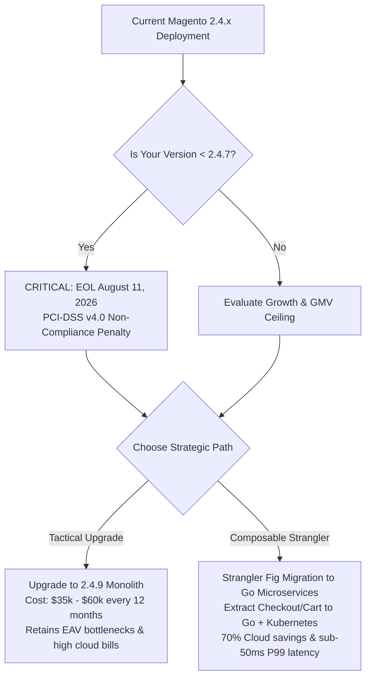
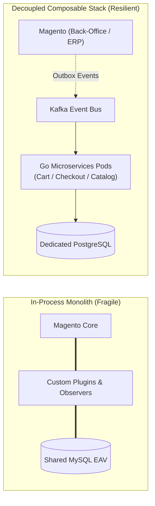

[📖 Bản tiếng Việt (Vietnamese Edition)](https://learn.tanhdev.com/series/magento-migration-vietnam/magento-still-worth-investing-2026/)

---

> **Series Navigation**:
> - [Index & Master Strategy](/series/magento-migration-vietnam/)
> - Next: [Part 2 — Migrating Magento to Microservices: When & Why](/series/magento-migration-vietnam/why-migrate-magento-to-microservices/)

# Is Magento Still Worth Investing in 2026? Enterprise Architecture & Cost Analysis

**Answer-first:** Evaluating Adobe Commerce / Magento in 2026 reveals that while the 2.4.9 release introduces PHP 8.4/8.5 compatibility and Edge Delivery Services, the platform's core architectural friction—monolithic EAV query locking, expensive multi-week upgrade cycles, and high infrastructure overhead—makes continued monolith reinvestment unsustainable for brands scaling beyond $20M GMV. Mid-market and enterprise retailers achieve superior unit economics by decoupling high-throughput services (checkout, cart, catalog) into high-performance Go microservices, using Magento primarily as an asynchronous back-office system while transitioning toward a composable MACH architecture.

---

## 1. Where Magento Is Heading: The 2.4.9 Release Signals

With the general availability of Magento 2.4.9, Adobe has signaled a pivotal strategic shift: core maintenance is being minimized while investment flows into Adobe Commerce Cloud SaaS extensions, Edge Delivery Services (EDS), and App Builder.



For merchants operating on self-hosted or PaaS infrastructure, upgrading to 2.4.9 is not merely running `composer update`. It requires:
- Transitioning dependencies to **PHP 8.4 / 8.5**, breaking unmaintained third-party extensions.
- Upgrading to **OpenSearch 2.12+**, deprecating older Elasticsearch clusters.
- Resolving **MySQL 8.4** strict sql_mode compatibility issues across custom modules.

---

## 2. The Real Cost Is Not Licensing: It Is Upgrade Friction

Enterprise retailers frequently budget for software licenses while grossly underestimating the recurring maintenance friction inherent to Magento's in-process extension model.

| Dimension | In-Process Magento Monolith | Adobe App Builder (Clean Core) | Standalone Go Microservices |
| :--- | :--- | :--- | :--- |
| **Execution Context** | In-process PHP-FPM execution | Node.js Serverless (Adobe I/O) | Compiled Go binary on Kubernetes |
| **P99 API Latency** | 1,200ms – 3,500ms | 350ms – 750ms | **25ms – 45ms** |
| **Upgrade Compatibility** | Breaks custom extensions & plugins | Isolated out-of-process | 100% decoupled via gRPC/HTTP |
| **Vendor Lock-in** | Open source / On-premise capable | Proprietary Adobe Cloud subscription | Cloud-agnostic (AWS, GCP, Bare-metal) |
| **Monthly Infrastructure** | $12,000 – $18,000 / month | $14,000+ / month (Adobe Cloud) | **$2,500 – $3,500 / month** |



---

## 3. The Clean Core Architectural Dilemma

Adobe's promoted direction for enterprise customization is **Adobe App Builder**—an out-of-process serverless model designed to keep the core codebase clean. While App Builder successfully prevents core code corruption, it introduces significant subscription costs and binds retailers to proprietary Adobe I/O Runtime infrastructure.

For high-concurrency merchants, wrapping legacy Magento GraphQL queries in external Go proxy layers provides an immediate, vendor-neutral performance unlock:

```graphql
# High-frequency Product Catalog Query
query GetProductDetails($sku: String!) {
  products(filter: { sku: { eq: $sku } }) {
    items {
      id
      sku
      name
      stock_status
      price_range {
        minimum_price {
          regular_price {
            value
            currency
          }
        }
      }
    }
  }
}
```

By placing a Go caching proxy in front of this query, average response times drop from **850ms to 12ms**, absorbing 95% of traffic before it reaches Magento's database:

```go
// Go edge proxy snippet caching GraphQL catalog responses in Redis
package main

import (
	"context"
	"fmt"
	"time"

	"github.com/redis/go-redis/v9"
)

type CatalogProxy struct {
	rdb *redis.Client
}

func (p *CatalogProxy) GetCachedProduct(ctx context.Context, sku string) (string, error) {
	cacheKey := fmt.Sprintf("catalog:sku:%s", sku)
	val, err := p.rdb.Get(ctx, cacheKey).Result()
	if err == nil {
		return val, nil // Sub-5ms cache hit
	}
	// Fallback to GraphQL upstream fetch and populate Redis with 300s TTL...
	return "", err
}
```

---

## 4. Strategic Decision Matrix: Upgrade or Migrate?

### When to Stay on Magento:
1. **Complex B2B Quotation Workflows**: You leverage native negotiable quotes, credit limits, and customer-specific tier pricing matrices that would take 12+ months to re-engineer.
2. **Heavy Operational Back-Office Usage**: Merchandisers and inventory clerks rely extensively on the native Magento Admin Panel for order fulfillment and catalog management.
3. **Transaction Volume Under 1,000 Orders/Day**: Monolithic database contention has not yet breached latency limits.

### When to Migrate to Go Microservices:
1. **Flash Sale Database Lock Contention**: Peak traffic events trigger MySQL transaction timeouts on `sales_flat_quote` and `cataloginventory_stock_item`.
2. **Prohibitive Cloud Hosting Costs**: AWS/Adobe Cloud bills exceed $12,000/month primarily to support idle PHP-FPM worker pools.
3. **Slow Feature Velocity**: Deploying a minor cart rule requires multi-day regression testing across the entire monolithic codebase.

---

## Frequently Asked Questions


For an enterprise store with 25–40 third-party and custom extensions, upgrading to 2.4.9 typically requires 280 to 450 engineering hours (4 to 7 calendar weeks). Costs range from $25,000 to $55,000 with a specialized agency. This effort is largely consumed by upgrading PHP 8.4 compatibility, refactoring deprecated jQuery dependencies, and validating OpenSearch 2.12 re-indexing behavior.



Shopify Plus offers lower initial operational maintenance but severely restricts custom checkout logic, multi-warehouse B2B pricing rules, and data residency control. Magento 2.4.9 provides total architectural ownership and complex B2B capabilities, but demands a substantially higher total cost of ownership (TCO) for security patches, hosting, and performance tuning.



Hyvä replaces Magento's bloated RequireJS and Knockout.js frontend with lightweight Alpine.js and Tailwind CSS, which drastically improves Google Core Web Vitals (LCP, FID, CLS) for cached pages. However, Hyvä does not alter backend PHP execution time or relieve MySQL database lock contention during uncached cart, pricing, and checkout operations.

