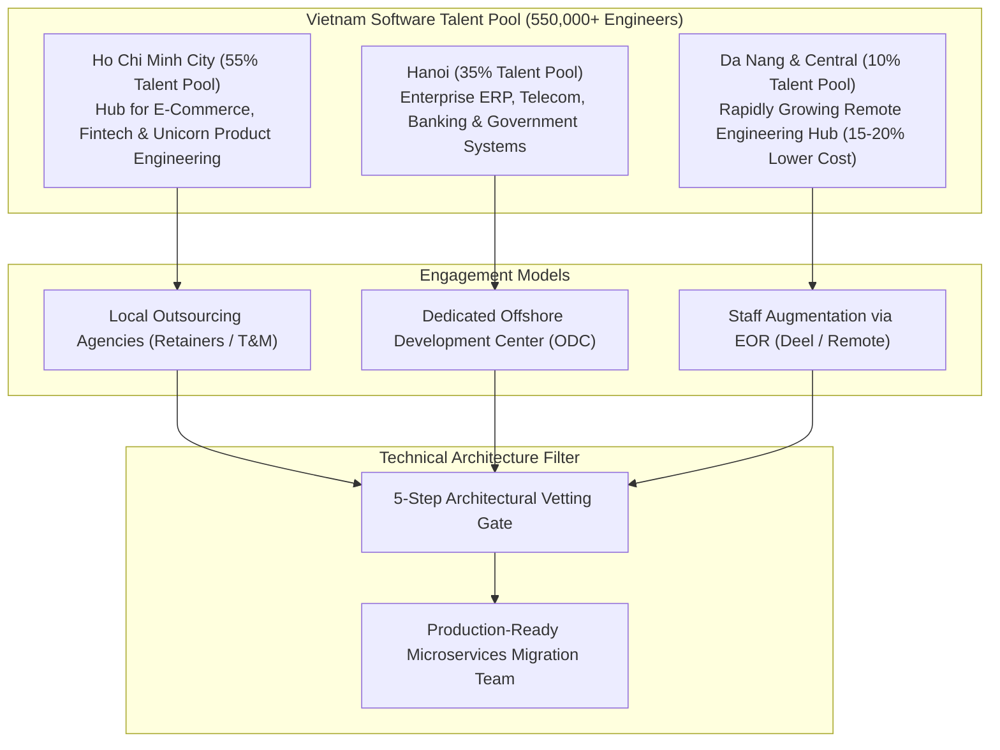
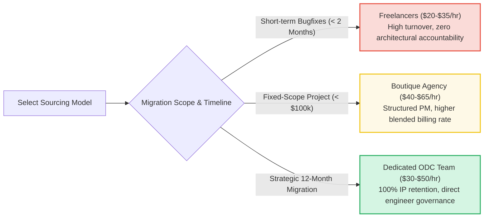

[📖 Bản tiếng Việt (Vietnamese Edition)](https://learn.tanhdev.com/series/magento-migration-vietnam/magento-vietnam/)

---

> **Prerequisite:** Read [Part 8 — Magento AI Integration Strategy](/series/magento-migration-vietnam/magento-ai-integration-strategy-architecture/) for transitional architecture options.

# Hiring Magento & Go Developers in Vietnam: Agency, Freelance & Dedicated ODC Guide

**Answer-first:** Vietnam's software engineering ecosystem encompasses over 550,000 developers, offering high-caliber talent across three primary pricing tiers: Junior/Mid theme customizers ($15–$28/hr), Senior Magento specialists ($30–$45/hr), and Lead Distributed Systems / Go Architects ($50–$80/hr). For enterprise migrations, establishing a **Dedicated Offshore Development Center (ODC)** or partnering with a specialized boutique engineering firm delivers 65–75% capital savings compared to US/EU agency retainers ($180–$250/hr), provided technical vetting filters out generic agency padding.

Vietnam has emerged as one of the premier software engineering powerhouses in Asia. The country's engineers operate the high-volume technology backbones for Southeast Asian unicorns such as Tiki, ZaloPay, MoMo, and Shopee.

However, the local engineering market is sharply bifurcated: on one end are low-end outsourcing shops that copy-paste commercial Magento extensions; on the other are elite distributed systems architects who build high-throughput Go microservices processing millions of daily transactions.

---

## 1. Vietnam Software Engineering Landscape & Regional Hubs

---

## 2. Engagement Model Trade-offs: Agency vs Freelance vs Dedicated ODC

---

## 3. Comprehensive Compensation & Cost Tier Matrix (2026/2027)

| Seniority / Role | Hourly Rate (Blended) | Monthly Salary (Direct EOR) | Typical Experience & Core Capabilities |
| :--- | :--- | :--- | :--- |
| **Junior / Mid Magento Dev** | $15 – $28 / hr | $1,400 – $2,200 / mo | Frontend theme modifications, basic extension configuration |
| **Senior Magento Specialist** | $30 – $45 / hr | $2,500 – $3,800 / mo | Core checkout customization, EAV optimization, module debugging |
| **Senior Go Microservices Dev**| **$35 – $55 / hr** | **$2,800 – $4,500 / mo** | High-throughput gRPC, goroutine concurrency, PostgreSQL, Kafka |
| **Principal Distributed Architect**| **$55 – $80 / hr** | **$4,800 – $6,800 / mo** | System decomposition, DDD bounded contexts, SRE, Envoy Gateway |
| **US/EU Agency Counterpart** | $175 – $260 / hr | $14,000 – $22,000 / mo | Identical deliverable scope at 3.5x to 4.5x total capital expenditure |

---

## 4. Key Signals for Vetting Vietnam Engineering Candidates

1. **Production Concurrency Experience**: Look for engineers who have worked at high-scale domestic consumer platforms (VNG, Tiki, ZaloPay, Shopee VN, OneMount). Ask how they handle database deadlocks and distributed locking during 11.11 shopping festivals.
2. **English Proficiency (Written vs Spoken)**: In asynchronous remote setups, structured written English (RFCs, PR descriptions, Loom videos) is 5x more critical than fluent conversational banter. Look for candidates who communicate with clear technical precision.
3. **Architectural Mindset**: Filter out candidates who view software engineering solely as "installing extensions." Test their understanding of the Strangler Fig pattern, database-per-service isolation, and event-driven architectures.

---

## ❓ Frequently Asked Questions (FAQ)


Vietnam ranks high in Asian English proficiency indices, particularly in Ho Chi Minh City and Da Nang where international tech firms concentrate. Senior developers routinely produce immaculate technical documentation, communicate seamlessly over Slack and GitHub, and participate actively in daily standups during morning/evening overlap windows.



Foreign enterprises typically engage Vietnam engineers via an Employer of Record (EOR) like Deel or Remote, or through contracts with established Vietnamese corporate entities. Vietnamese intellectual property laws recognize explicit work-for-hire agreements, assigning 100% of code ownership, patents, and trade secrets directly to the foreign enterprise.



Traditional outsourcing assigns shared agency developers across multiple client projects, leading to split attention and high turnover. A Dedicated ODC provides an exclusive, full-time team that operates as a direct extension of your internal engineering department, adopting your Git standards, testing frameworks, and company culture while remaining 65% more cost-effective.


---

🔗 **Next Step:** Proceed to [Part 10 — Magento Enterprise Project Scoping & Agency Cost Matrix](/series/magento-migration-vietnam/magento-development-in-vietnam/).
