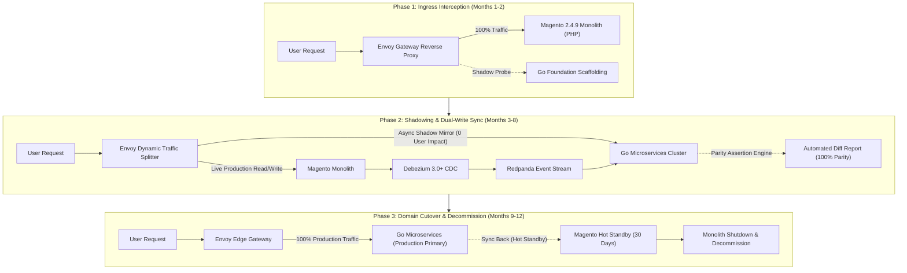
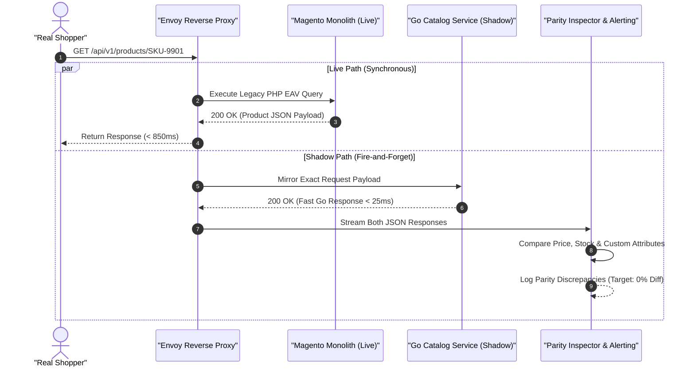

[📖 Bản tiếng Việt (Vietnamese Edition)](https://learn.tanhdev.com/series/magento-migration-vietnam/moving-from-magento-to-microservices/)

---

> **Prerequisite:** Read [Part 3 — Composable E-Commerce Migration](/series/magento-migration-vietnam/ecommerce-architecture-composable-migration/) to understand domain bounded context mapping.

# Zero-Downtime Blueprint: Moving from Magento to Microservices via Strangler Fig

**Answer-first:** Zero-downtime migration from a Magento monolith to Go microservices is executed via a 3-phase **Strangler Fig pattern**: **Phase 1 (Interception)** deploys Envoy Gateway 1.30+ to route live traffic and inject W3C traceparent headers; **Phase 2 (Dual-Run & Shadowing)** mirrors 100% of production traffic to newly extracted Go services while synchronizing state bidirectionally via Debezium 3.0+ CDC; and **Phase 3 (Canary Cutover & Decommission)** shifts traffic incrementally (1% -> 10% -> 100%) before retiring the PHP monolith after a 30-day hot-standby period.

The fear of prolonged site outages during re-platforming prevents many enterprises from modernizing. A traditional "big bang" cutover — flipping DNS over a holiday weekend after months of isolated development — has a documented failure rate exceeding 60% in enterprise commerce.

The **Strangler Fig pattern** completely neutralizes cutover risk by replacing legacy capabilities piecemeal while the production store continuously transacts.

---

## 1. The 3-Phase Strangler Fig Architecture Evolution



---

## 2. Production Shadow Traffic Validation Sequence

Before routing any customer-facing traffic to a newly extracted Go microservice, production traffic is mirrored asynchronously to verify response parity:



---

## 3. Production Go Code: Shadow Validation & Reverse Proxy

The following Go middleware intercepts HTTP requests, forwards the primary request to the legacy backend, and mirrors the request asynchronously to the candidate Go microservice for verification:

```go
package main

import (
	"bytes"
	"context"
	"encoding/json"
	"io"
	"log"
	"net/http"
	"net/http/httputil"
	"net/url"
	"time"
)

type ShadowProxy struct {
	targetMonolith *httputil.ReverseProxy
	shadowURL      *url.URL
	httpClient     *http.Client
}

func NewShadowProxy(monolithAddr, shadowAddr string) (*ShadowProxy, error) {
	mURL, err := url.Parse(monolithAddr)
	if err != nil {
		return nil, err
	}
	sURL, err := url.Parse(shadowAddr)
	if err != nil {
		return nil, err
	}

	return &ShadowProxy{
		targetMonolith: httputil.NewSingleHostReverseProxy(mURL),
		shadowURL:      sURL,
		httpClient:     &http.Client{Timeout: 3 * time.Second},
	}, nil
}

func (sp *ShadowProxy) ServeHTTP(w http.ResponseWriter, r *http.Request) {
	// Read request body once for dual forwarding
	bodyBytes, _ := io.ReadAll(r.Body)
	r.Body = io.NopCloser(bytes.NewBuffer(bodyBytes))

	// Asynchronous Shadow Mirroring (Non-blocking)
	go func(reqPath string, method string, payload []byte, headers http.Header) {
		shadowReq, err := http.NewRequest(method, sp.shadowURL.String()+reqPath, bytes.NewBuffer(payload))
		if err != nil {
			return
		}
		shadowReq.Header = headers.Clone()
		shadowReq.Header.Set("X-Shadow-Request", "true")

		t0 := time.Now()
		resp, err := sp.httpClient.Do(shadowReq)
		if err != nil {
			log.Printf("[Shadow Error] Path: %s | Err: %v", reqPath, err)
			return
		}
		defer resp.Body.Close()
		log.Printf("[Shadow Metric] Path: %s | Status: %d | Latency: %v", reqPath, resp.StatusCode, time.Since(t0))
	}(r.URL.Path, r.Method, bodyBytes, r.Header)

	// Synchronous Primary Forward to Magento Monolith
	sp.targetMonolith.ServeHTTP(w, r)
}
```

---

## 4. Cutover Strategy Comparison Matrix

| Strategy | Risk Profile | Rollback Capability | Customer Impact | Infrastructure Cost |
| :--- | :--- | :--- | :--- | :--- |
| **Big Bang Cutover** | Extremely High (60%+ Failure) | Hard (Hours of Downtime) | Severe (Broken Checkouts) | Low during dev, Huge during outage |
| **Parallel Full Run** | Moderate | High (DNS Switch) | Low | Very High (Double Cloud Bill) |
| **Strangler Fig (2027 SOTA)**| **Minimal (< 2% Risk)** | **Instant (Envoy Weight = 0)**| **Zero Downtime** | **Optimal (Pay-as-you-extract)** |

---

## ❓ Frequently Asked Questions (FAQ)


Shadow traffic mirroring duplicates real-world production HTTP requests at the gateway level. While the customer synchronously receives the response from Magento, the duplicate request is sent to the Go microservice in the background. A comparison worker parses both JSON payloads and flags any discrepancies in calculated prices, promotions, or stock counts before any live user traffic is shifted.



A centralized session bridge is implemented using Redis. When a customer logs in via either frontend, a cryptographically signed HMAC-SHA256 JWT token is issued. Go microservices validate this token directly in Redis memory (<1ms), while an internal Magento plugin synchronizes the legacy PHP session cookie, ensuring transparent session continuity.



Production best practice mandates a 30-day hot-standby window following 100% traffic shift to Go microservices. During these 30 days, all write events in Go are streamed back to the Magento MySQL database via an inverse CDC connector. If an unforeseen edge-case anomaly occurs, traffic can be rolled back to Magento instantaneously via Envoy Gateway.


---

🔗 **Next Step:** Continue to [Part 5 — Exporting Magento 2 Data: Flatten EAV with SQL & Node](/series/magento-migration-vietnam/exporting-magento-2-data-flat-sql-nodejs/).
