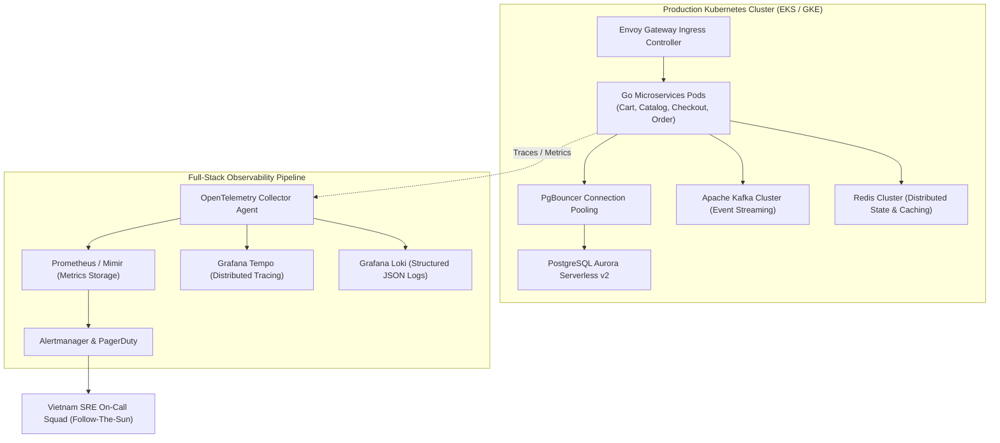

[📖 Bản tiếng Việt (Vietnamese Edition)](https://learn.tanhdev.com/series/magento-migration-vietnam/post-migration-operations-vietnam-go-team/)

---

> **Prerequisite:** Read [Part 13 — Magento Migration Cost Model](/series/magento-migration-vietnam/magento-migration-cost-vietnam-vs-us-eu/) and [Part 14 — Managing Vietnam Engineers](/series/magento-migration-vietnam/remote-team-vietnam-magento-migration/).

# Post-Migration Operations: Managing Vietnam Go Team (2027 Day-2 SRE Playbook)

**Answer-first:** Decommissioning the monolithic Adobe Commerce / Magento 2 codebase permanently terminates PHP memory leaks, blocking EAV database table locks, and sluggish full-page cache purge cycles. However, transitioning to a distributed Golang microservices topology running across Kubernetes clusters introduces distributed operational challenges: inter-service network partitions, asynchronous Kafka consumer lag, and ephemeral pod resource constraints. A high-performing Day-2 operational model transitions the Vietnam engineering squad from migration contractors into an **autonomous SRE & platform engineering unit** managing reliability, continuous optimization, and production incident response.

---

## 1. Day-2 Kubernetes Observability & Telemetry Architecture

The post-migration microservices stack relies on a unified OpenTelemetry ingestion pipeline routing high-cardinality telemetry into Prometheus, Grafana Tempo, and Loki:



---

## 2. SLO / SLA Hierarchy & Error Budget Governance

Service Level Objectives (SLOs) are non-negotiable quantitative commitments. When an error budget burns faster than sustainable thresholds, automated CI/CD deployments halt, and engineering focus shifts entirely to stability engineering.

| Microservice | Target SLI Metric | Tier-1 Critical Threshold | Tier-2 Warning | 30-Day Error Budget |
| :--- | :--- | :--- | :--- | :--- |
| **Checkout Service** | Latency P99 (`POST /checkout`) | **< 45ms** | > 80ms | 0.01% (99.99% Availability) |
| **Cart Service** | Latency P99 (`POST /cart/items`) | **< 25ms** | > 50ms | 0.05% (99.95% Availability) |
| **Catalog Query** | Latency P95 (`GET /products/:id`) | **< 15ms** | > 35ms | 0.10% (99.90% Availability) |
| **Order CDC Stream** | End-to-End Ingestion Lag | **< 200ms** | > 1,500ms | Max 100 uncommitted msgs |
| **Payment Gateway** | Idempotency Failure Rate | **0.00%** | > 0.001% | 0 Unhandled webhook drops |

When error budget burn exceeds **10% over a 1-hour window**, Alertmanager automatically triggers a P1 incident via PagerDuty to the primary Vietnam on-call SRE.

---

## 3. High-Severity Incident Response Sequence

The following operational workflow dictates how the Vietnam SRE team isolates and resolves Sev-1 incidents without disrupting business operations:

```mermaid
sequenceDiagram
    autonumber
    participant Alert as Prometheus / Alertmanager
    participant Pager as PagerDuty Schedule
    participant SRE as Vietnam SRE On-Call
    participant Runbook as Automated Diagnostic Runbook
    participant Stakeholder as Global Incident Bridge (Slack)

    Alert->>Pager: P1 Trigger: Checkout Service Error Budget Burn Rate > 10x
    Pager->>SRE: Page Primary On-Call Engineer (ACK within 5 mins)
    SRE->>Pager: Acknowledge Incident Alert
    SRE->>Stakeholder: Open #incident-checkout-p1 channel & declare incident commander
    SRE->>Runbook: Execute Diagnostic CLI script (`sre-cli diagnose checkout`)
    Runbook-->>SRE: Root Cause: PgBouncer connection pool saturation (Max 200/200 reached)
    SRE->>Runbook: Scale PgBouncer pool & trigger graceful pod restart
    Runbook-->>SRE: DB Pool Utilization normal (35%), Error rate normalized to 0.001%
    SRE->>Stakeholder: Mitigation confirmed; Initiate 48-hour Post-Mortem review
```

---

## 4. Automated Production Runbooks

Every production alert must link directly to a tested, deterministic runbook. Ambiguous troubleshooting is strictly prohibited:

```bash
#!/usr/bin/env bash
# SRE-104: Automatic diagnostic and remediation script for Kafka Consumer Lag
set -euo pipefail

CONSUMER_GROUP="order-inventory-projector"
TOPIC_NAME="orders.events.v1"
THRESHOLD_LAG=1000

echo "[$(date -u)] Inspecting Kafka Consumer Lag for ${CONSUMER_GROUP}..."
CURRENT_LAG=$(kafka-consumer-groups.sh --bootstrap-server kafka:9092 \
  --describe --group "${CONSUMER_GROUP}" | awk 'NR>1 {sum += $6} END {print sum}')

echo "Current Total Consumer Lag: ${CURRENT_LAG}"

if [ "${CURRENT_LAG}" -gt "${THRESHOLD_LAG}" ]; then
  echo "WARNING: Consumer lag exceeded threshold (${THRESHOLD_LAG})."
  echo "Checking Pod CPU utilization and scaling replicas..."
  
  CURRENT_REPLICAS=$(kubectl get deployment order-inventory-worker -n production \
    -o jsonpath='{.spec.replicas}')
    
  if [ "${CURRENT_REPLICAS}" -lt 16 ]; then
    NEW_REPLICAS=$((CURRENT_REPLICAS * 2))
    echo "Scaling order-inventory-worker from ${CURRENT_REPLICAS} to ${NEW_REPLICAS} pods..."
    kubectl scale deployment order-inventory-worker --replicas="${NEW_REPLICAS}" -n production
    echo "Scaled successfully. Monitoring lag dissipation..."
  else
    echo "CRITICAL: Already at maximum replica limit (16). Checking for downstream database deadlock..."
    kubectl logs -n production -l app=order-inventory-worker --tail=50 | grep -i "deadlock\|timeout"
  fi
fi
```

---

## 5. FinOps & Continuous Performance Profiling

In traditional Magento 2 environments, infrastructure scaling is reactive: teams provision massive EC2 instances to buffer against unoptimized PHP garbage collection. In the post-migration Go architecture, the Vietnam operations team implements **Continuous Performance Profiling (Pyroscope / Grafana Phlare)** and automated FinOps right-sizing:
1. **CPU Allocation**: Go microservices compile into native machine code. In-flight memory consumption per pod averages **24MB to 65MB**, allowing high-density pod scheduling on AWS Graviton (`c7g.xlarge` or `c7g.2xlarge`) instances with Karpenter.
2. **Database Query Tuning**: Slow query logs (> 20ms) are aggregated nightly by the Vietnam SRE team. Indexes are continuously tuned using `pg_stat_statements`, eliminating unindexed full-table scans.
3. **Monthly FinOps Audit**: Cloud spend is audited against transaction volume. The target metric is keeping infrastructure expenditure under **$0.008 per completed checkout transaction**.

---

## Frequently Asked Questions


Collaboration centers on the Error Budget. If a service maintains an unspent error budget (> 99.95% reliability), product teams deploy new features with complete autonomy. If an incident depletes the error budget, feature deployments freeze automatically, and the Vietnam SRE squad pairs with feature developers to eliminate stability bugs. Weekly async reviews cover SLO trends, open post-mortems, and cloud infrastructure cost curves.



A mature Vietnam Go SRE squad guarantees a 5-minute Mean Time to Acknowledge (MTTA) for Sev-1 incidents and a 20-minute Mean Time to Mitigate (MTTR). By operating a Follow-The-Sun handoff model with well-documented automated runbooks, incidents are contained rapidly before reaching end-customer visibility.



Knowledge retention is engineered through three operational rules: (1) All infrastructure and alerts are managed strictly as code (Terraform, Helm charts, and PrometheusRule manifests in Git); (2) No incident post-mortem is closed without an accompanying update to automated runbooks; and (3) Squad rotation requires a mandatory 2-week shadowing period where incoming engineers independently resolve staged chaos engineering drills in staging environments.

