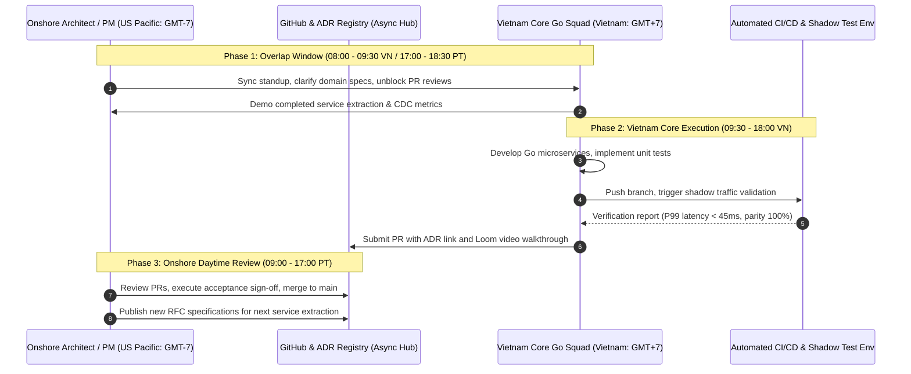
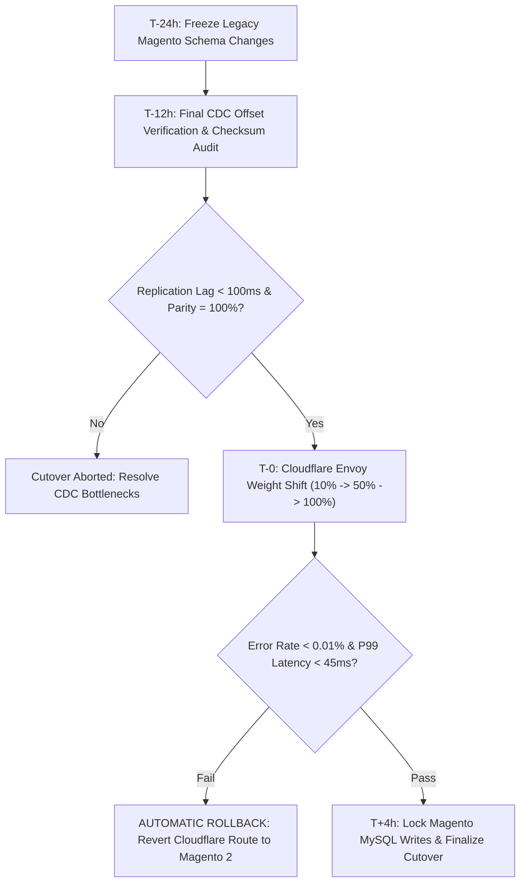

[📖 Bản tiếng Việt (Vietnamese Edition)](https://learn.tanhdev.com/series/magento-migration-vietnam/remote-team-vietnam-magento-migration/)

---

> **Prerequisite:** Read [Part 12 — Vetting Senior Go Engineers in Vietnam](/series/magento-migration-vietnam/go-engineers-vietnam-migration-vetting/) and [Part 13 — Magento Migration Cost Model](/series/magento-migration-vietnam/magento-migration-cost-vietnam-vs-us-eu/).

# Managing Vietnam Engineers Through a Magento Migration (2027 Remote Operating Model)

**Answer-first:** Successfully managing a remote engineering squad in Vietnam (GMT+7) from North America or Western Europe requires converting the 11-to-15 hour timezone difference from a communication hurdle into a competitive **24-hour Follow-The-Sun development engine**. By establishing an **Asynchronous-First Governance Model**—anchored by version-controlled Architecture Decision Records (ADRs), a daily 90-minute synchronous overlap window (08:00–09:30 VN / 17:00–18:30 PT), and automated CI/CD shadow testing gates—engineering leaders eliminate blocked workflows and sustain rapid delivery cadence.

---

## 1. The 24-Hour Follow-The-Sun Development Loop

The 12-hour timezone inversion ensures continuous, round-the-clock progress when workflows are structured properly:



---

## 2. Codifying Architecture via Architecture Decision Records (ADRs)

To prevent misunderstandings and costly refactors across timezones, all technical decisions are formalized as version-controlled ADRs stored directly in the repository at `docs/adr/`:

```markdown
# ADR-014: Transactional Outbox Pattern for Order Checkout Event Publishing

## Status
Accepted (Signed off by US Architect & VN Tech Lead on 2027-02-15)

## Context
During checkout migration, persisting the order record in PostgreSQL and emitting an 
OrderCreated event to Apache Kafka must be strictly atomic. Direct dual-writes produce 
inconsistent inventory states when Kafka broker network partitions occur.

## Decision
We mandate the Transactional Outbox Pattern using Debezium PostgreSQL CDC Connector:
1. The Go order-service writes the order entity and outbox event table in a single DB transaction.
2. Debezium captures WAL changes from `order_outbox_events` and streams to topic `orders.events.v1`.
3. Kafka retention is configured to 7 days with compact cleanup policy.

## Consequences
- Positive: Zero ghost orders or orphaned Kafka events during network drops.
- Negative: Adds 15ms end-to-end event propagation latency to downstream notifications.
- Compliance: Must include test coverage verifying database rollback cleans outbox entries.
```

---

## 3. The 48-Hour Production Cutover Protocol

Production cutovers are never conducted on hope. The migration squad conducts at least three end-to-end rehearsal drills in staging before executing final traffic cutovers:



### Go/No-Go Decision Criteria Matrix:
1. **Data Consistency**: Checksum parity between PostgreSQL extracted tables and Magento MySQL master must reach 100.000% across a sample of 100,000 active SKU records.
2. **Replication Lag**: Debezium Kafka consumer group lag must remain under 50 records during simulated peak traffic.
3. **HTTP 5xx Error Budget**: Error rates must not exceed 0.01% (1 in 10,000 requests) over a consecutive 60-minute window.
4. **Latency Ceiling**: P99 response time for `POST /api/v1/cart/checkout` must remain below 120ms under 5x projected peak concurrency.

---

## 4. Weekly Governance Rhythm & Team Dynamics

A high-retention engineering culture bridging international headquarters and Vietnam talent relies on radical transparency:
- **Async Daily Standups**: Posted in Slack by 09:15 GMT+7 answering: (1) What shipped yesterday with PR links; (2) Today's commit goal; (3) Blockers requiring onshore review.
- **Code Review Turnaround SLA**: PRs submitted before 17:00 GMT+7 receive reviews by onshore architects before 10:00 PT, ensuring zero idle waiting time.
- **English Communication Standards**: All technical documentation, PR descriptions, issue trackers, and ADRs are strictly in English. Code comments adhere to standard Go doc guidelines (`godoc`).
- **Quarterly In-Person Kickoffs**: Sponsoring onshore tech leads to visit Ho Chi Minh City or Da Nang for in-person sprint kickoffs dramatically deepens trust and domain alignment.

---

## Frequently Asked Questions


Modern senior Go engineers in Vietnam who have worked with international software product firms possess strong written technical English skills. We standardize communication around written artifacts (ADRs, OpenAPI contracts, Git PR descriptions, and short screen recordings using Loom) rather than long, fast-paced verbal meetings. This ensures precision, eliminates misunderstandings, and leaves a searchable technical audit trail.



We implement a Follow-The-Sun on-call rotation. During Vietnam daytime (09:00 - 18:00 GMT+7), primary PagerDuty alerts route directly to the Vietnam SRE/Go engineering pod. During US/EU daytime, secondary escalation engineers onshore handle first response. For 24/7 coverage, senior Vietnam engineers participate in an on-call rotation with dedicated standby stipends and compensated recovery time.



The three most critical red flags are: (1) Pull requests remaining unmerged or inactive for more than 48 hours; (2) Features being developed without a signed-off ADR or OpenAPI schema specification; and (3) Lack of daily automated integration test runs against live shadow traffic. Detecting these signals early allows management to intervene before scope drift impacts the cutover milestone.

