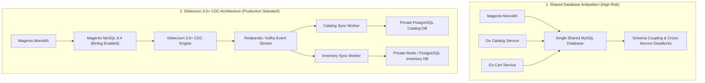
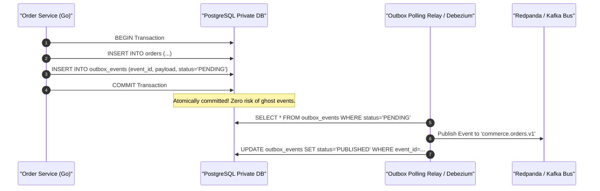

[📖 Bản tiếng Việt (Vietnamese Edition)](https://learn.tanhdev.com/series/magento-migration-vietnam/strangler-fig-shared-database-quick-win/)

---

> **Prerequisite:** Read [Part 5 — Exporting Magento 2 Data: Flatten EAV with SQL & Node](/series/magento-migration-vietnam/exporting-magento-2-data-flat-sql-nodejs/) for data unpivoting fundamentals.

# Magento Database Migration: Shared DB, CDC, or Event Bus?

**Answer-first:** While connecting new microservices directly to the existing Magento database (Shared Database pattern) appears tempting as a quick win, it introduces severe schema coupling, cross-service deadlock hazards, and violates core microservice boundaries. The 2027 production standard uses **Debezium 3.0+ Change Data Capture (CDC)** streaming row changes via **Redpanda/Kafka** into independent domain databases. This decouples schemas, guarantees sub-50ms data synchronization latency, and maintains dual-write integrity via the Transactional Outbox pattern.

When decomposing a monolithic commerce architecture, the database sync strategy dictates whether the migration succeeds smoothly or devolves into a data-corrupting distributed nightmare.

Teams often succumb to the "Shared Database" shortcut: pointing their new Go catalog service directly at Magento's MySQL tables. Within weeks, indexer locks clash with Go connection pools, schema patches break microservice queries, and the team finds itself trapped in the worst of both worlds.

---

## 1. Architectural Topology: Shared DB Antipattern vs CDC Mesh



---

## 2. Transactional Outbox Pattern for Go Microservices

When Go microservices update domain state, they must emit events to Kafka without risking split-brain discrepancies. The **Transactional Outbox Pattern** ensures that database state changes and event records commit atomically in a single local transaction:



---

## 3. Production Debezium Connector Configuration

The following JSON configuration registers a high-speed Debezium MySQL connector monitoring Magento order and quote changes:

```json
{
  "name": "magento-cdc-connector",
  "config": {
    "connector.class": "io.debezium.connector.mysql.MySqlConnector",
    "tasks.max": "1",
    "database.hostname": "aurora-mysql.internal.net",
    "database.port": "3306",
    "database.user": "debezium_cdc",
    "database.password": "${env:CDC_PASSWORD}",
    "database.server.id": "184054",
    "topic.prefix": "magento_cdc",
    "table.include.list": "magento2.sales_order,magento2.sales_order_item,magento2.cataloginventory_stock_item",
    "schema.history.internal.kafka.bootstrap.servers": "redpanda.internal.net:9092",
    "schema.history.internal.kafka.topic": "schema-changes.magento",
    "decimal.handling.mode": "double",
    "tombstones.on.delete": "true"
  }
}
```

---

## 4. 16-Dimension Synchronization Strategy Evaluation Matrix

| Evaluation Dimension | Shared Database | Event Bus (App-Level Dual Write) | Debezium CDC Streaming (2027 SOTA) |
| :--- | :--- | :--- | :--- |
| **Initial Implementation Time** | 1–2 Weeks | 4–6 Weeks | 2–3 Weeks |
| **Schema Decoupling** | Zero (Locked to EAV) | Moderate | **Complete Decoupling** |
| **Dual-Write Split-Brain Risk** | N/A (Single DB) | Severe (App crashes mid-write)| **Zero (Log-based capture)** |
| **Impact on Magento Core Code** | Zero | High (Plugins required) | **Zero (Reads MySQL binlog)** |
| **Latency of Data Sync** | Instant | 100ms - 500ms | **Sub-50ms** |
| **Handling of Hard Deletes** | Instant | Often missed | **Automatic Tombstone Events** |
| **Production Rollback Safety** | Poor | Moderate | **High (Bi-directional sync)** |

---

## ❓ Frequently Asked Questions (FAQ)


While connecting a new service directly to the legacy database saves initial ETL setup time, it tightly binds the new service to Magento's complex, un-optimized schema. Any future Magento upgrade or table restructuring will break the microservice. Furthermore, shared connection pools and concurrent table locks will continue degrading overall platform stability.



Debezium operates as a non-invasive daemon that tails the MySQL Binary Log (binlog) at the storage engine layer, acting essentially like a standard MySQL replication slave. It executes zero `SELECT` queries against live tables, generating near-zero CPU and memory overhead on the database master.



Because MySQL transaction commits occur independently of Kafka, no user-facing transactions are blocked. Debezium records its exact position in the binlog using byte offsets. Once Kafka recovers, Debezium resumes streaming from the exact checkpoint without dropping a single event, guaranteeing eventual consistency.


---

🔗 **Next Step:** Proceed to [Part 7 — Laravel vs Golang: When to Add Features in Each?](/series/magento-migration-vietnam/laravel-vs-golang-when-to-add-features/).
