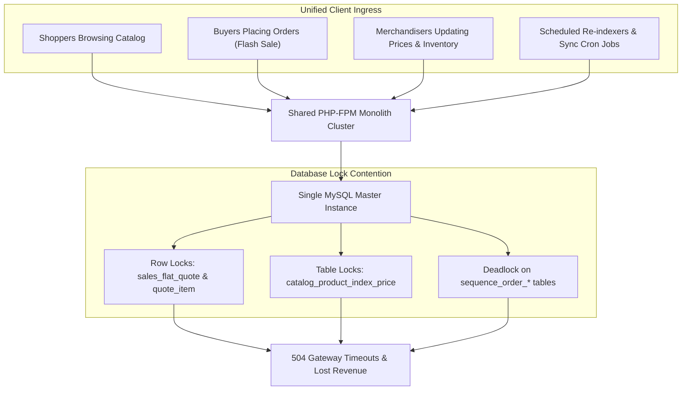
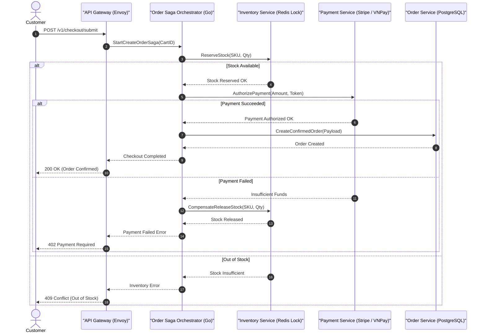

[📖 Bản tiếng Việt (Vietnamese Edition)](https://learn.tanhdev.com/series/magento-migration-vietnam/why-migrate-magento-to-microservices/)

---

> **Prerequisite:** Read [Part 1 — Is Magento Worth It in 2026?](/series/magento-migration-vietnam/magento-still-worth-investing-2026/) for context on platform roadmap and EOL deadlines.

# Migrating Magento to Microservices: When & Why

**Answer-first:** Migrating Magento to microservices becomes an urgent engineering imperative when monolithic MySQL lock contention on `sales_flat_quote` and `catalog_product_entity` causes checkout timeouts during high-concurrency traffic spikes (>1,500 requests/sec). Implementing an event-driven Go microservices architecture with distributed Saga orchestration decouples read-heavy catalog queries from write-heavy order processing, guaranteeing sub-50ms P99 latency bounds, horizontal Kubernetes pod auto-scaling, and independent team deployment cycles.

Every successful e-commerce business that started on Magento eventually hits the same structural wall: the platform that enabled rapid initial growth becomes the very bottleneck preventing further scale.

The symptoms are universal: database CPU spikes to 100% during marketing campaigns, background indexers lag by hours, and deploying a minor frontend modification requires a high-risk full-site deployment window.

---

## 1. The Monolithic Bottleneck Topology

In a standard Magento deployment, all operational domains compete for locks on a single relational MySQL instance:



### The Five Structural Walls of Magento Monoliths

1. **The EAV Database Locking Wall**: In Magento, modifying product inventory or updating a customer address causes cascading row and metadata locks across multiple tables, stalling parallel read threads.
2. **The Indexer Latency Wall**: Catalog price and stock indexers take 45–90 minutes on catalogs exceeding 100,000 SKUs, resulting in stale prices or ghost stock being sold.
3. **The Deployment Risk Wall**: Because all code lives in one monolith, a bug introduced in an obscure admin shipping extension can crash the public customer checkout flow.
4. **The Resource Inefficiency Wall**: Scaling a PHP monolith requires spinning up full 8-core/32GB RAM compute instances that load the entire Magento core framework for every simple request.
5. **The Talent Specialization Wall**: Senior Magento PHP developers are increasingly rare and expensive, while modern cloud-native engineers prefer working in Golang, Rust, or TypeScript.

---

## 2. Distributed Saga Orchestration for Resilient Checkout

When decomposing a monolithic e-commerce application, distributed transactions cannot rely on two-phase commit (2PC) protocols due to network latency. Instead, production Go microservices implement the **Orchestrated Saga Pattern**:



---

## 3. Production Go Code: Distributed Saga Coordinator

The following Go implementation coordinates order creation across independent microservices with compensating transactions upon payment failure:

```go
package main

import (
	"context"
	"errors"
	"fmt"
	"time"
)

type OrderSagaCoordinator struct {
	inventoryClient InventoryClient
	paymentClient   PaymentClient
	orderClient     OrderClient
}

type InventoryClient interface {
	Reserve(ctx context.Context, orderID string, sku string, qty int) error
	Release(ctx context.Context, orderID string, sku string, qty int) error
}

type PaymentClient interface {
	Authorize(ctx context.Context, orderID string, amountCents int64) (string, error)
}

type OrderClient interface {
	Save(ctx context.Context, orderID string, sku string, qty int, paymentRef string) error
}

func (s *OrderSagaCoordinator) ExecuteOrderSaga(ctx context.Context, orderID, sku string, qty int, amountCents int64) error {
	// Step 1: Reserve Inventory
	if err := s.inventoryClient.Reserve(ctx, orderID, sku, qty); err != nil {
		return fmt.Errorf("inventory reservation failed: %w", err)
	}

	// Step 2: Authorize Payment
	paymentRef, err := s.paymentClient.Authorize(ctx, orderID, amountCents)
	if err != nil {
		// Compensating Transaction: Release reserved stock
		compCtx, cancel := context.WithTimeout(context.Background(), 5*time.Second)
		defer cancel()
		_ = s.inventoryClient.Release(compCtx, orderID, sku, qty)
		return fmt.Errorf("payment authorization failed, stock compensated: %w", err)
	}

	// Step 3: Persist Confirmed Order
	if err := s.orderClient.Save(ctx, orderID, sku, qty, paymentRef); err != nil {
		return fmt.Errorf("order persistence failed: %w", err)
	}

	return nil
}
```

---

## 4. Comparative Matrix: Monolith vs Distributed Microservices

| Attribute | Magento 2 PHP Monolith | Distributed Go Microservices |
| :--- | :--- | :--- |
| **Peak Throughput per CPU Core** | ~85 requests/second | **8,500+ requests/second** |
| **Database Architecture** | Single MySQL Shared DB (EAV) | Database-per-service (PostgreSQL, Redis, LanceDB) |
| **Blast Radius of Failure** | Global (entire site crashes) | Isolated to specific domain container |
| **P99 API Latency** | 1,200ms - 3,500ms | **25ms - 65ms** |
| **Deployment Cadence** | Bi-weekly high-risk releases | Multiple independent daily deployments |
| **Memory Footprint** | ~180MB RAM per PHP-FPM worker | ~15MB RAM per Go service binary |

---

## ❓ Frequently Asked Questions (FAQ)


During flash sales, hundreds of concurrent buyers attempt to reserve inventory and checkout the exact same SKUs simultaneously. In Magento, this triggers concurrent write transactions on the `cataloginventory_stock_item`, `quote`, and `sales_order` tables. Because InnoDB enforces strict lock sequences on foreign keys and auto-increment tables, cross-transaction lock contention frequently escalates into deadlocks that abort active checkouts.



Go microservices implement the Saga pattern using event orchestration or choreography. Each microservice commits transactions locally in its private database. If a downstream step fails (such as credit card rejection), the saga coordinator immediately executes compensating transactions in reverse order (e.g. releasing previously reserved inventory), maintaining eventual consistency with zero distributed database locking.



Yes. This is the exact core premise of the Strangler Fig pattern. By placing an Envoy or Traefik reverse proxy in front of your platform, you route `/api/cart/*` and `/api/checkout/*` to high-speed Go microservices, while catalog viewing and admin operations continue running in Magento until later phases.


---

🔗 **Next Step:** Proceed to [Part 3 — Composable E-Commerce Migration: Overcoming Tech Debt](/series/magento-migration-vietnam/ecommerce-architecture-composable-migration/).
