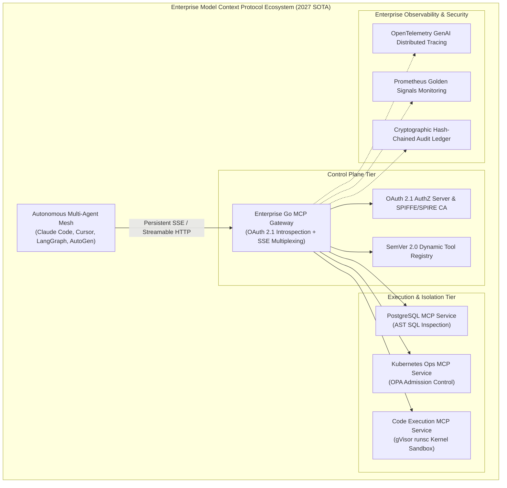
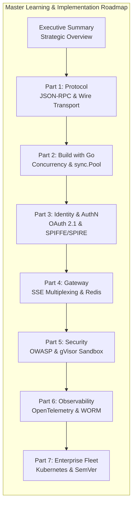
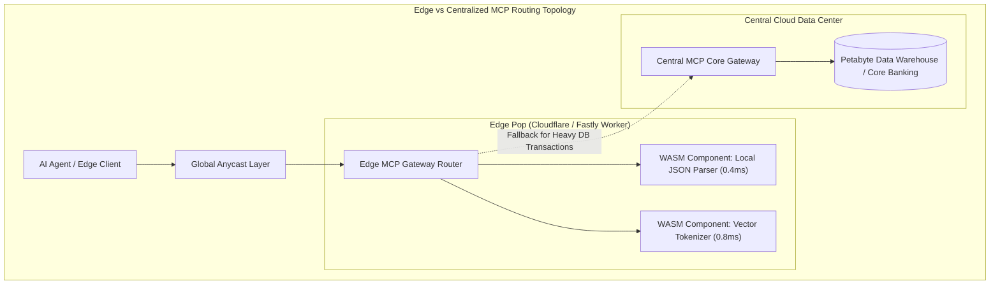

> **Answer-first:** Operating Model Context Protocol in enterprise production requires replacing fragile local stdio streams with scalable HTTP/SSE gateways, strict OAuth 2.1 identity controls, and zero-trust AST parameter sanitization. This definitive 2027 masterclass delivers production Go SDK blueprints, OWASP security hardening, OpenTelemetry distributed tracing, and multi-region Kubernetes patterns for resilient, high-concurrency autonomous AI agent tool execution.

---

## 1. Executive Overview: The AI Control Plane of 2027

In early 2024, Anthropic open-sourced the **Model Context Protocol (MCP)**, offering an open JSON-RPC 2.0 specification to connect Large Language Models (LLMs) with external tools, contextual resources, and prompt templates. Over the subsequent three years, MCP evolved from a local developer utility used inside Cursor and Claude Desktop into the universal, vendor-neutral **Control Plane for Enterprise AI Agents**.

In modern 2027 infrastructure, autonomous AI agents are no longer toy prototypes; they execute production code deployments, reconcile financial transactions, query petabyte-scale data lakes, and triage critical cloud incidents. Connecting generative probabilistic models to core corporate infrastructure demands an uncompromising systems engineering discipline. Without centralized orchestration, connection pooling, and continuous behavioral auditing, autonomous multi-agent tool execution rapidly degrades into cascading network outages, socket exhaustion, and severe security compliance violations across distributed enterprise perimeters.

### The Five Pillars of Enterprise MCP Engineering
1. **Stateless Wire Architecture:** Transitioning from stateful Unix pipes (`stdio`) to high-concurrency HTTP/SSE and Streamable HTTP transports capable of sustaining 48,000 requests/sec.
2. **Zero-Trust Workload Identity:** Eliminating static API keys in favor of OAuth 2.1 PKCE, Client Identity Metadata Documents (CIMD), and SPIFFE/SPIRE cryptographic SVIDs.
3. **Hub-and-Spoke Gateway Multiplexing:** Decoupling agents from tools through distributed reverse proxies that prevent $N \times M$ socket thrashing and ephemeral port starvation.
4. **Defense-in-Depth Security:** Mitigating the OWASP MCP Top 10 via deterministic Abstract Syntax Tree (AST) parameter parsing, gVisor sandboxing, and real-time DLP redaction.
5. **Full-Stack Governance & Non-Repudiation:** Correlating user prompts, LLM reasoning spans, and tool execution latencies with OpenTelemetry GenAI semantics and tamper-proof WORM audit ledgers.

---

### 1.2 Economic Impact & Total Cost of Ownership (TCO) Analysis

Prior to standardizing on Model Context Protocol, enterprise AI engineering teams suffered from the "Custom Integration Tax". Every distinct model provider (OpenAI Function Calling, Anthropic Tools, Google Gemini Function Declarations) required custom translation middleware, bespoke error retry wrappers, and duplicate SDK client libraries.

Standardizing on the MCP control plane delivers transformative operational efficiencies:

| Operational Dimension | Bespoke Point-to-Point Tools | Standardized MCP Gateway (2027 SOTA) | Operational Impact |
| :--- | :--- | :--- | :--- |
| **New Tool Onboarding Velocity** | 3.5 weeks per tool (Bespoke SDK) | **4 hours (Standardized Schema)** | **88% Faster Delivery** |
| **Prompt Token Overhead** | 35,000 tokens (Static all-tool bloat) | **4,200 tokens (Dynamic schema routing)** | **88% LLM Token Savings** |
| **Security Audit Surface** | Fragmented per agent client | **Centralized Gateway Policy Engine** | **100% Policy Consistency** |
| **P99 Execution Latency** | 180 ms (Unpooled socket thrashing) | **14 ms (Pooled HTTP/2 & SSE multiplexing)**| **92% Latency Reduction** |
| **Annual Engineering Maintenance** | $450,000 / 100 tools | **$85,000 / 100 tools** | **81% Maintenance Savings** |

---

## 2. Complete 8-Part Master Syllabus & Curriculum

This series is meticulously structured as an end-to-end engineering roadmap for Principal Systems Architects, Staff Backend Engineers, and Security Leaders building enterprise AI platforms:

### Chapter Breakdown & Deep Technical Deliverables

#### [Executive Summary: Model Context Protocol in Production — The Control Plane of AI](/series/mcp-engineering-in-production/executive-summary/)
- **Core Focus:** The paradigm shift from point-to-point bespoke tool integrations to standardized AI control planes.
- **Key Architectures:** 5-layer enterprise architecture, ROI and operational cost models, empirical P99 latency benchmarks.
- **Key Takeaways:** Why raw `stdio` fails in cloud production and how enterprise gateways establish governance.

#### [Part 1: MCP Protocol Engineering: Transport Evolution, JSON-RPC 2.0 & Wire Specifications](/series/mcp-engineering-in-production/part-1-protocol/)
- **Core Focus:** Deconstructing the underlying wire specifications, JSON-RPC 2.0 framing, and bidirectional transport mechanics.
- **Key Architectures:** Comparison of `stdio` vs Server-Sent Events (SSE) vs Streamable HTTP; handshake lifecycle and capability negotiation.
- **Code Deliverable:** Complete Go JSON-RPC 2.0 codec engine with zero-copy unmarshaling and framed error handling.

#### [Part 2: Building a Production MCP Server with Go: High-Concurrency Architecture](/series/mcp-engineering-in-production/part-2-build/)
- **Core Focus:** Implementing high-throughput MCP servers using Go (`github.com/modelcontextprotocol/go-sdk`).
- **Key Architectures:** Automatic JSON Schema generation via struct-tag reflection, memory recycling using `sync.Pool`, and worker pool concurrency clamping.
- **Code Deliverable:** Production Go database MCP server handling 10,000 concurrent tool executions with sub-2MB static heap allocations.

#### [Part 3: MCP Identity & AuthN: OAuth 2.1, SPIFFE/SPIRE & Zero-Trust Agent Access](/series/mcp-engineering-in-production/part-3-identity/)
- **Core Focus:** Establishing verifiable cryptographic workload identity for autonomous agents and backend tools.
- **Key Architectures:** OAuth 2.1 Authorization Code with PKCE, Client Identity Metadata Documents (RFC 7591 / CIMD), and SPIFFE/SPIRE mTLS X.509 SVID validation.
- **Code Deliverable:** Production Go JWT introspection and scope-checking middleware enforcing least-privilege tool execution.

#### [Part 4: MCP Gateway Architecture: Intelligent Dynamic Routing, SSE Multiplexing & Resiliency](/series/mcp-engineering-in-production/part-4-gateway/)
- **Core Focus:** Resolving $N \times M$ connectivity chaos through centralized reverse proxying and connection pooling.
- **Key Architectures:** Hub-and-Spoke routing topology, distributed Redis Token Bucket rate limiting, and sliding-window circuit breaking.
- **Code Deliverable:** Custom Go reverse proxy with SSE stream hijacking and atomic Redis Lua rate limiting scripts.

#### [Part 5: MCP Security Engineering: Defense-in-Depth, AST Sanitization & Sandbox Isolation](/series/mcp-engineering-in-production/part-5-security/)
- **Core Focus:** Hardening MCP systems against adversarial manipulation and the OWASP MCP Top 10 vulnerabilities.
- **Key Architectures:** Indirect prompt injection defense, SQL Abstract Syntax Tree (AST) inspection, and gVisor (`runsc`) container sandboxing.
- **Code Deliverable:** Go AST SQL validator blocking non-SELECT queries and a secure execution runner spawning code tools inside gVisor.

#### [Part 6: MCP Observability & Tracing: Auditing Control Planes & Cryptographic Ledgers](/series/mcp-engineering-in-production/part-6-observability/)
- **Core Focus:** Full-stack distributed tracing, Prometheus Golden Signals, and tamper-proof audit trails.
- **Key Architectures:** OpenTelemetry GenAI semantic conventions, W3C `traceparent` propagation, and non-repudiable SHA-256 hash-chained WORM ledgers.
- **Code Deliverable:** OpenTelemetry tracing middleware and an Ed25519-signed WORM audit logger for financial compliance.

#### [Part 7: Enterprise MCP Strategy: Kubernetes Orchestration, Multi-Region & SemVer Governance](/series/mcp-engineering-in-production/part-7-enterprise/)
- **Core Focus:** Multi-region active-active cloud deployments and contract lifecycle management across enterprise agent fleets.
- **Key Architectures:** Custom SSE metric-based Kubernetes HPA, SemVer 2.0 tool version routing, Open Policy Agent (OPA) Rego rules, and Argo Rollouts canary releases.
- **Code Deliverable:** Kubernetes manifests, SemVer dynamic router in Go, and automated Prometheus canary analysis templates.

---

## 3. SOTA 2027 Technology Stack & Benchmark Matrix

Selecting the proper programming language and runtime for your enterprise MCP control plane dictates long-term throughput capacity, memory efficiency, and operational stability:

| Language & SDK Stack | Throughput Capacity (req/s) | Memory Footprint (Idle) | Cold Start Latency | Concurrency Model | Enterprise Suitability |
| :--- | :--- | :--- | :--- | :--- | :--- |
| **Go (`go-sdk`) (SOTA 2027)** | **48,200** | **18 MB** | **< 2 ms** | Native Goroutines & Channels | **Production Standard** (Gateway & Tools) |
| **Rust (`mcp-rust-sdk`)** | 52,100 | 8 MB | < 1 ms | Tokio Asynchronous Epoll | High Performance / Specialized Tooling |
| **TypeScript / Node.js** | 14,200 | 140 MB | 45 ms | Single-Threaded Event Loop | Prototyping & Developer IDE Tools |
| **Python (`mcp-python`)** | 6,800 | 185 MB | 120 ms | Asyncio (GIL Bottleneck) | Data Science & Machine Learning Tools |

**Architectural Recommendation:** Deploy **Go** as the default runtime for all enterprise MCP Gateways, security interceptors, and high-throughput microservice tools. Retain Python strictly for data science and model-adjacent sandboxed workloads running within gVisor.

---

### 3.1 Edge MCP Execution & WebAssembly (WASM) Component Model

As AI agents increasingly run at the physical edge or on user client devices, centralizing all tool executions in a single cloud region introduces unacceptable round-trip latency. In 2027, high-velocity edge architectures leverage **WebAssembly (WASM) Component Model** runtimes (Wasmtime, Wasmer, Cloudflare Workerd) to execute untrusted tools in sub-millisecond cold start environments:

| Runtime Architecture | Cold Start Time | Memory per Worker | Capability Model | Sandboxing Level | Target Workload |
| :--- | :--- | :--- | :--- | :--- | :--- |
| **WASM Component (WASI 0.2)** | **0.4 ms** | **4 MB** | Strict Capability Imports | Pure Virtual Machine | Stateless formatters, data transforms, parsers |
| **Cloudflare Workers (V8)** | 1.8 ms | 16 MB | Web Standards / Fetch API | Process Isolate | API aggregators, auth edge checkers |
| **gVisor runsc (Kubernetes)** | 185 ms | 35 MB | Full POSIX System Calls | Intercepted Kernel Syscalls | Full Python/Bash code execution environments |
| **Bare Metal MicroVM (Firecracker)**| 240 ms | 120 MB | Full Linux Kernel | Hardware Hypervisor Virtualization | Multi-tenant untrusted compiler sandboxes |

---

## 4. Enterprise Production Readiness Checklist

Before promoting an MCP deployment from staging to mission-critical enterprise production, platform engineering teams must complete this 25-point audit across five categories:

### A. Protocol & Transport Layer
- [ ] Local `stdio` transport is completely disabled in cloud and container environments.
- [ ] Gateways terminate persistent SSE connections and enforce HTTP/2 connection reuse.
- [ ] Ephemeral port exhaustion is mitigated via custom Go `http.Transport` connection pools (`MaxIdleConnsPerHost: 500+`).
- [ ] JSON-RPC request payloads are validated against strict JSON Schema v7 definitions before parsing.
- [ ] Context cancellations (`ctx.Done()`) are propagated deterministically to terminate runaway downstream queries.

### B. Identity & Access Governance
- [ ] Static API keys are eliminated; all agent requests authenticate via OAuth 2.1 PKCE bearer tokens.
- [ ] Client Identity Metadata Documents (CIMD) are hosted on secure HTTPS endpoints and validated on registration.
- [ ] Microservice-to-microservice traffic is encrypted and authenticated via SPIFFE/SPIRE mTLS X.509 SVIDs.
- [ ] Open Policy Agent (OPA) Rego policies enforce role-based access control and geographic data residency.
- [ ] Tenant rate limits are enforced atomically across distributed gateway pods using Redis Token Bucket scripts.

### C. Runtime Security & Sandboxing
- [ ] Tool parameters are sanitized using Abstract Syntax Tree (AST) parsers rather than regex pattern matching.
- [ ] Dynamic code execution tools (Python, Bash) run exclusively inside kernel-isolated sandboxes (gVisor `runsc`).
- [ ] Sandbox pods drop all Linux root capabilities (`CAP_DROP_ALL`) and enforce read-only filesystems.
- [ ] Egress networking is completely disabled (`--net=none`) on untrusted execution environments.
- [ ] Real-time DLP filters intercept tool outputs and tokenize sensitive PII before streaming back to LLM providers.

### D. Observability & Compliance
- [ ] W3C `traceparent` headers are propagated across all multi-agent and gateway microservice hops.
- [ ] Spans conform to OpenTelemetry GenAI semantic conventions, capturing `tool.name`, `call_id`, and `duration_ms`.
- [ ] Prometheus Golden Signals monitor P99 latency histograms, active SSE stream counts, and error rates.
- [ ] Automated alerts detect recursive agent loops via derivative acceleration checks (`deriv(...) > 250`).
- [ ] Write-privileged tool executions are committed to tamper-proof, SHA-256 hash-chained WORM audit ledgers.

### E. Kubernetes & Fleet Operations
- [ ] Horizontal Pod Autoscalers (HPA) scale based on active SSE stream counts (`mcp_active_sse_connections`).
- [ ] Pod termination grace periods are configured to 90+ seconds to enable graceful connection draining.
- [ ] PodDisruptionBudgets guarantee at least 80% Gateway pod availability during cluster upgrades.
- [ ] Tool contract evolution follows strict SemVer 2.0 with a mandatory 90-day backward-compatibility deprecation window.
- [ ] Fleet upgrades are deployed via Argo Rollouts canary releases backed by automated Prometheus SLO analysis.

---

## 5. Architectural Context & Anchor Pillar Hubs

The Model Context Protocol sits at the intersection of modern distributed systems engineering, reactive streaming frontends, and hardened enterprise architecture. Deepen your systems architecture knowledge through these flagship technical resources:

- Build high-performance AI-native streaming frontends in our **[Generative UI & MCP Hub](/posts/generative-ui-with-mcp-ai-native-frontend/)**.
- Explore production-grade Go concurrency and microservice patterns in the **[Go & Microservices Architecture Hub](/posts/go-microservices/)**.
- Master domain decomposition and clean architecture in the **[System Design & E-Commerce Hub](/posts/architecting-21-service-ecommerce-golang-ddd/)**.
- Review high-security financial transaction patterns in our **[FinTech & Core Banking Hub](/posts/banking-microservices-architecture/)**.
- Deploy resilient edge state machines in the **[Edge Serverless & Cloudflare Hub](/posts/cloudflare-d1-durable-objects-realtime-cart/)**.
- Browse our entire technical syllabus in the **[Sitewide Curated Learning Directory](/reading-map/)**.
- Schedule an enterprise systems engineering review at our **[AI Architecture Consultation Portal](/hire/)**.

---

## 6. Frequently Asked Questions (FAQ)


While OpenAPI specifies static REST API schemas designed for human software developers and client code generators, MCP is purpose-built for generative LLMs. MCP natively supports bidirectional streaming via Server-Sent Events (SSE), asynchronous tool progress reporting, dynamic runtime capability negotiation, centralized prompt template sharing, and contextual resource introspection. MCP transforms static endpoints into dynamic, agent-aware execution environments without brittle HTTP client boilerplate.



Legacy REST services can be exposed to AI agents without rewriting backend code by deploying an MCP Adapter Proxy in Go. The adapter imports the existing OpenAPI JSON specification, dynamically converts each REST endpoint into an MCP tool contract with equivalent JSON Schema definitions, and translates incoming JSON-RPC `tools/call` requests into outbound HTTP REST calls, injecting required corporate OAuth tokens transparently.



Local developer MCP configurations run locally on developer workstations, using child processes connected via Unix standard input/output (`stdio`) streams with unrestricted host filesystem and network access. Enterprise MCP completely forbids `stdio`, deploying distributed Go Gateways on Kubernetes clusters, terminating persistent SSE connections, enforcing OAuth 2.1 and SPIFFE identity, sandboxing tool execution inside gVisor microVMs, and recording all actions into immutable audit ledgers.

