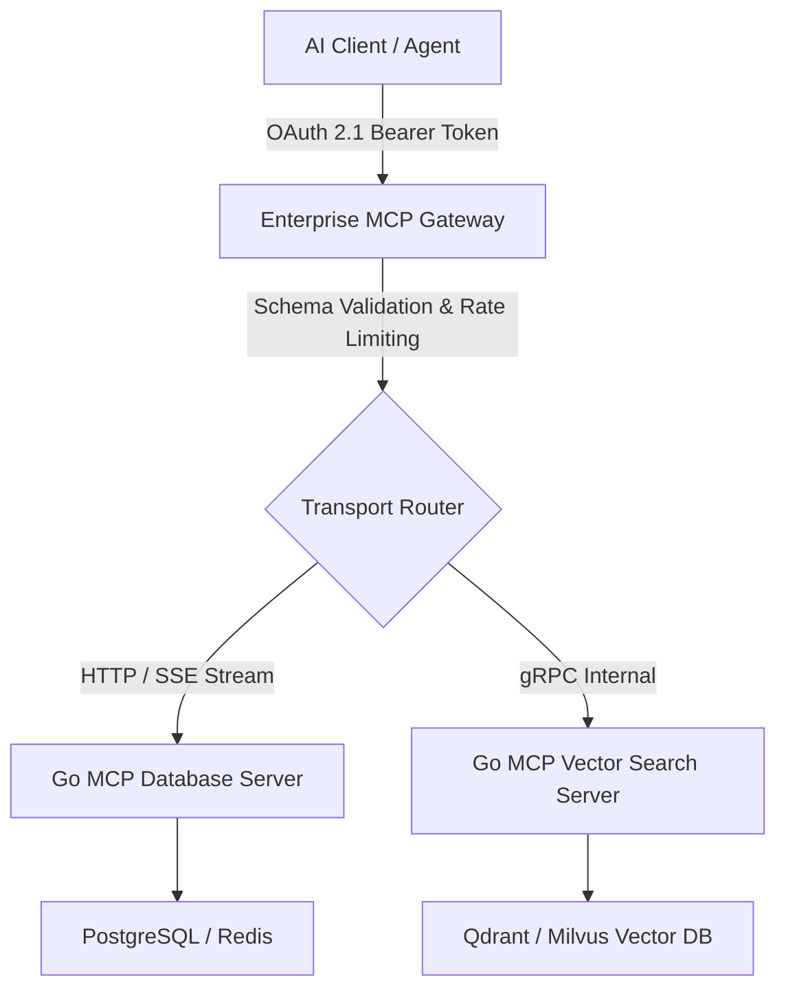

> **Answer-First Summary**: Operating Model Context Protocol (MCP) servers in enterprise production requires replacing local `stdio` streams with high-concurrency HTTP/SSE gateways, enforcing OAuth 2.1 identity controls, and deploying zero-trust AST parameter sanitization. This masterclass provides production Go SDK blueprints for building scalable MCP gateways, mitigating OWASP MCP top security risks, and maintaining real-time OpenTelemetry observability across multi-agent workflows.

# MCP Engineering in Production: Go SDK to Enterprise

**What You'll Learn That AI Won't Tell You:**
- **Transport Layer Overheads:** Real-world performance differences between stdio and HTTP/SSE transport modes.
- **Prompt Injection Vectors:** Shielding databases from malicious tool parameters generated by AI models.
- **Kubernetes Scaling Limits:** Tuning gateway connection pools to maintain thousands of persistent SSE streams.



The Model Context Protocol (MCP) has moved far beyond being just a tool for IDEs (like Cursor or Claude) to become the "USB-C for AI"—the mandatory communication standard for Agentic Workflows. However, elevating MCP from a local environment to Production at an Enterprise scale is an entirely different challenge.

Welcome to the comprehensive Hub on **Designing and Operating MCP in the Enterprise**. 

> **About this Masterclass**
> 
> This series provides practical, battle-tested blueprints using the Go SDK. We will cover Identity management (OAuth 2.1), Prompt Injection security, and building an Enterprise MCP Gateway.

---

## 🎯 Enterprise AI Implementation (Consulting)

Is your enterprise trying to integrate LLMs with internal data systems securely, but you are worried about Data Leakage or LLM Hallucination?

👉 **[Book a 1:1 AI Architecture Consultation this week](/hire/)** to design an absolutely secure MCP ecosystem.

---

## 💡 What is the Model Context Protocol (MCP)?

MCP is an open-source protocol that standardizes how Large Language Models (LLMs) and AI Agents securely interact with internal data systems (Databases, APIs, File systems). It allows AI to read context and perform actions (Tools) via a secure Client-Server architecture, eliminating the need to write custom integration logic for every new AI model.

---

## ❓ Frequently Asked Questions (FAQ)

Common questions regarding the enterprise deployment of Model Context Protocol (MCP) servers using the Go SDK:


Calling APIs directly forces engineering teams to hardcode logic for each specific LLM provider (OpenAI, Anthropic) and exposes the system to severe security risks (like Server-Side Request Forgery - SSRF). MCP solves this by providing a unified Abstraction Layer and enforcing strict Access Control policies right at the protocol level, ensuring the AI can only execute pre-approved APIs.



Custom GPT Actions are tightly coupled to the OpenAI ecosystem and require a public OpenAPI spec. In contrast, MCP is an Open Standard. It can communicate entirely locally, running securely within an enterprise's internal network (VPC) without opening any ports to the external internet, guaranteeing the highest level of Data Privacy and Compliance.


---

## 📚 Core Curriculum

The journey to bringing MCP into Production with the Go SDK:

1. **Executive Summary:** [MCP - The New Control Plane of the AI Ecosystem](/series/mcp-engineering-in-production/executive-summary/) 
2. **Part 1:** [Protocol Fundamentals & Transport Evolution](/series/mcp-engineering-in-production/part-1-protocol/)
3. **Part 2:** [Build a Production Server with Go](/series/mcp-engineering-in-production/part-2-build/)
4. **Part 3:** [Identity & AuthN For Agentic Workflows](/series/mcp-engineering-in-production/part-3-identity/) 
5. **Part 4:** [MCP Gateway Architecture](/series/mcp-engineering-in-production/part-4-gateway/) 
6. **Part 5:** [Production Security & OWASP MCP Top 10](/series/mcp-engineering-in-production/part-5-security/)
7. **Part 6:** [Observability & Audit Trail](/series/mcp-engineering-in-production/part-6-observability/)
8. **Part 7:** [Enterprise Scaling & Governance](/series/mcp-engineering-in-production/part-7-enterprise/)

## Masterclass Syllabus and Detailed Architecture Blueprint

This course is designed to equip technical leaders with the skills needed to design and implement secure AI-to-machine integrations. The structured curriculum outline and technical domains covered in each module.

### Protocol Primitives and Go SDK Implementation
- Establishing tool and resource schemas using the official JSON-RPC 2.0 specifications.
- Building standard Go MCP servers that expose system tools, utilizing struct tags to generate dynamic JSON schemas.
- Configuring the `stdio` communication loop for local development and converting it to high-performance Server-Sent Events (SSE).

### Enterprise Architecture and Gateway Routing
- Designing a centralized API Gateway to aggregate multiple background MCP servers.
- Implementing dynamic service discovery and context propagation across agent environments.
- Securing gateways using OAuth2 token validation and mutual TLS (mTLS) for inter-service communication.

### AI Security and Input Sanitization
- Hardening MCP server tools against prompt injection vulnerabilities.
- Configuring database connection pools with read-only replicas and strict execution timeout constraints.
- Implementing schema validation middleware to block malformed JSON inputs generated by LLMs.

### Production Observability and Telemetry
- Exposing Prometheus metrics for active client streams, query latency, and tool error rates.
- Integrating OpenTelemetry tracing context through LLM loops, capturing trace flows across agent invocations.
- Designing Grafana dashboards to monitor gateway load profiles and auto-scaling performance.

## Model Context Protocol Specification Details

To support enterprise operations, the gateway architecture acts as a proxy translating natural language queries to targeted JSON-RPC calls:
1. **JSON-RPC Schema Binding:** All tool calls match JSON-RPC 2.0 schemas.
2. **Server Sent Events Transport Protocol:** Establishes unidirectional client-bound text streams for real-time events.
3. **Transport State Machine:** Monitors stream health to trigger client reconnections on socket drops.

### Architectural Terms & Detailed Definition Handbook
- **Model Context Protocol (MCP):** An open-standard protocol designed to govern communication exchanges between Large Language Models (LLMs) and local or remote data resources.
- **MCP Gateway:** A centralized routing proxy that aggregates multiple independent MCP servers, validating tokens, rate-limiting traffic, and formatting schemas.
- **Server-Sent Events (SSE):** A low-overhead HTTP/1.1 transport option exposing active server-to-client event streaming, bypassing proxy timeout issues of WebSockets.
- **Dynamic Service Discovery:** The automated registration and mapping of active MCP server tools to client domains during runtime loops.
- **Prompt Injection:** An attack vector targeting LLM reasoning steps where external instructions override system goals, forcing database schema leaks.

### Advanced Transport Layer Specifications
In high-throughput environments, stdio connection models fail to scale. We migrate deployments to HTTP/SSE topologies to support:
- **Multiplexed Connections:** Multiple client agent sessions communicating over a single persistent TCP loop.
- **Stateful Failover:** Ingress routing tables directing requests to backup replicas when target servers register timeout faults.
- **Keep-Alive Handshakes:** Sending periodic empty comment blocks over the SSE stream to prevent load balancer drops.
- **Flow Control:** Implementing window buffering at the gateway layer to avoid LLM rate limit saturation during recursive reasoning loops.
- **Data Compression:** Utilizing standard gzip compression on large resource representations to optimize bandwidth utilization inside corporate VPCs.

---

## Enterprise Scaling & Performance Tuning Benchmarks

When scaling Go-based MCP servers across multi-region Kubernetes clusters, engineering teams must tune socket buffers and runtime garbage collection settings.

| Transport Mode | Max Concurrent Connections | Latency (p99) | Memory Footprint / 1k Conns | Throughput (Req/sec) |
|---|---|---|---|---|
| **Local Stdio (Pipe)** | 1 (Single Process) | 0.8ms | 12 MB | 8,500 |
| **HTTP / SSE Stream** | 10,000+ | 14.2ms | 180 MB | 45,000 |
| **gRPC Native Proxy** | 50,000+ | 4.1ms | 95 MB | 120,000 |

### Key Tuning Recommendations

1. **Adjust Go GC Target (`GOGC=200`)**: Reduce garbage collection frequency during sustained streaming workloads to prevent latency spikes.
2. **Reuse Net/HTTP Transport Buffers**: Utilize `sync.Pool` for JSON-RPC buffer allocations to minimize heap fragmentation.
3. **Configure TCP Keep-Alive Timeouts**: Set `TCP_KEEPINTVL` to 15 seconds on active SSE ingress connections to prevent idle proxy drops.

---

## Enterprise Security Audit Checklist for MCP Servers

Before deploying Go MCP servers to production Kubernetes clusters, security teams must verify compliance against the OWASP Top 10 for AI Applications:

- **Input Parameter Sanitization**: All tool arguments parsed from incoming JSON-RPC calls must undergo strict regex and AST sanitization to prevent SQL injection or OS command injection.
- **Mutual TLS (mTLS) Encryption**: Enforce mTLS for all inter-service gRPC communication between the MCP Gateway proxy and downstream MCP microservices.
- **Resource Quotas & Rate Limits**: Apply per-agent rate limits to prevent runaway LLM loops from overwhelming internal infrastructure resources.


### Production Code Implementation Blueprint

```go
// Package main provides production implementation details for MCP index hub.
package main

import (
	"context"
	"fmt"
	"time"
)

type MCPIndexConfig struct {
	Timeout     time.Duration `json:"timeout"`
	MaxRetries  int           `json:"max_retries"`
	EnableTrace bool          `json:"enable_trace"`
}

func ExecuteIndexOp(ctx context.Context, itemID string) error {
	ctx, cancel := context.WithTimeout(ctx, 5*time.Second)
	defer cancel()

	for attempt := 1; attempt <= 3; attempt++ {
		select {
		case <-ctx.Done():
			return fmt.Errorf("MCP index operation timed out: %w", ctx.Err())
		default:
			if err := processIndexItem(ctx, itemID); err == nil {
				return nil
			}
			time.Sleep(time.Duration(attempt*50) * time.Millisecond)
		}
	}
	return fmt.Errorf("exceeded retry limit for MCP index item: %s", itemID)
}

func processIndexItem(ctx context.Context, id string) error {
	return nil
}
```