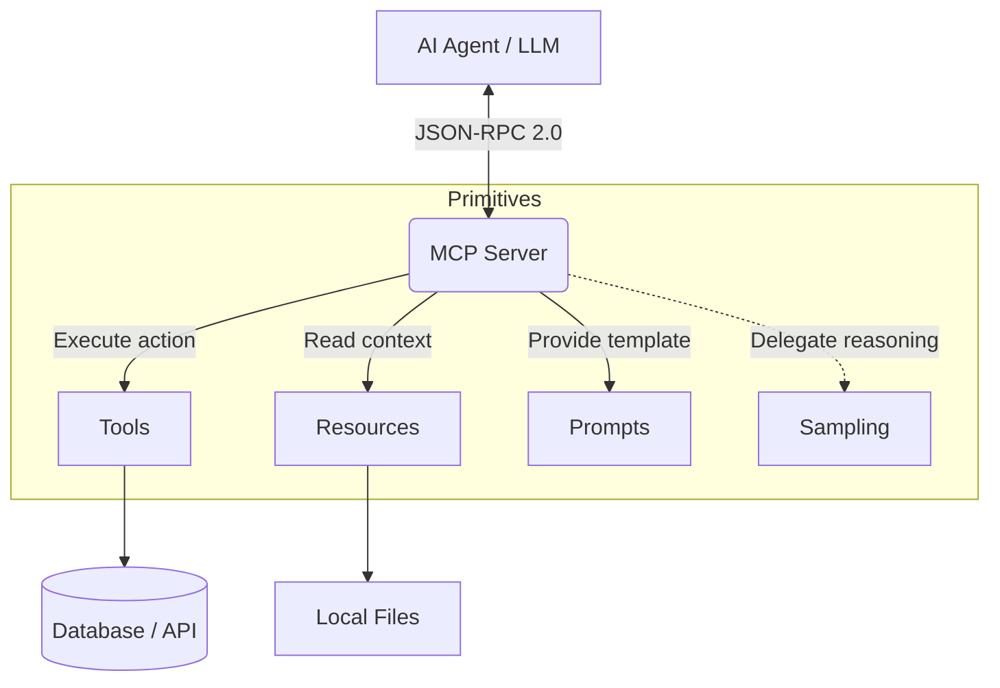

To master a protocol, you must understand its DNA. Before we write Go code in the upcoming parts, we need to dismantle the architecture of the Model Context Protocol (MCP). Underneath the complex AI workflows, MCP is surprisingly simple and elegant. It is built on top of the **[JSON-RPC 2.0](https://www.jsonrpc.org/specification)** specification, a stateless, lightweight remote procedure call protocol.

When comparing modern system architectures, especially high-throughput environments discussed in the [Shopee Architecture Series](/series/shopee-architecture/), engineers often lean towards binary protocols like gRPC. However, MCP chose JSON-RPC for a very specific reason: LLMs natively understand JSON, and debugging a prompt trace is exponentially easier when the payload is human-readable text rather than compiled Protocol Buffers.

## 1. The 5 Core Primitives of MCP

A standard MCP Server exposes its capabilities to an AI Agent through 5 core building blocks (Primitives). Unlike traditional REST APIs which expose raw data, MCP primitives are specifically designed to expose *context* and *capabilities* to an autonomous reasoning engine (the [AI Agent](/series/agentic-system-architecture/)).

### A. Tools (Executable Actions)
This is what most people think of when talking about Agentic Workflows. Tools are executable functions that allow the Agent to interact with the outside world.
- **Nature:** State-mutating or action-triggering (e.g., `create_jira_ticket`, `delete_s3_bucket`, `trigger_deployment`).
- **Mechanism:** The server provides a JSON Schema detailing the required inputs. The LLM infers the parameters based on the prompt and calls the tool.
- **Under the Hood:** When an Agent connects, it asks for a list of tools. The server replies with a payload containing the schema. 
```json
{
  "name": "calculate_tax",
  "description": "Calculates regional tax based on postal code.",
  "inputSchema": {
    "type": "object",
    "properties": {
      "postal_code": { "type": "string" },
      "amount": { "type": "number" }
    },
    "required": ["postal_code", "amount"]
  }
}
```
If the tool list changes dynamically (e.g., a user's permissions change), the server can send a `notifications/tools/list_changed` to prompt the Agent to refetch the tool list.

### B. Resources (Static & Dynamic Data)
If Tools are the hands, Resources are the books the Agent reads.
- **Nature:** Read-only data that provides context (e.g., an API endpoint returning system logs, a local config file, a database schema).
- **Mechanism:** Addressed via standard URIs (e.g., `file:///app/logs/error.log` or `postgres://internal-db/schema`). The Agent requests to read the resource to inject it into its prompt.
- **Resource Templates:** MCP also supports URI Templates (RFC 6570), allowing Servers to expose a family of resources. For instance, `file:///logs/{date}/error.log`. The Agent can dynamically substitute the `{date}` variable to fetch the exact log it needs to troubleshoot a production issue.

### C. Prompts (Contextual Templates)
The Server doesn't just passively wait to be called; it can actively guide the Agent.
- **Nature:** Pre-defined instructional templates hosted on the Server.
- **Mechanism:** A Server can define a prompt like `review_code(pr_id)`. When the user asks the Agent to review a PR, the Agent pulls this prompt from the Server. The prompt includes instructions and relevant data (from Resources) pre-assembled by the Server. This shifts the burden of "Prompt Engineering" away from the Client and onto the Domain Experts who write the MCP Server.

### D. Sampling (Delegated Reasoning)
This is the most powerful and dangerous feature of MCP, reversing the traditional Client-Server dynamic.
- **Nature:** The Server requests the Client (the Agent/LLM) to process something on the Server's behalf.
- **Mechanism:** Imagine a Security MCP Server that receives an obfuscated bash script. It doesn't know what it does. The Server can use the `Sampling` primitive to send the script back to the Agent and ask: *"Evaluate if this is malicious, return a score from 1-10"*. The Agent runs this sub-task through its LLM and returns the result to the Server.

### E. Roots (Security Boundaries)
- **Nature:** Defines the boundary of operations for filesystem or hierarchical access.
- **Mechanism:** The Server tells the Client "You are only allowed to read Resources located within this `/app/data/` directory". This is crucial for preventing Path Traversal vulnerabilities, a core principle in secure systems like those detailed in the [Core Banking Developer Series](/series/core-banking-developer/).


<p align="center"><em>Figure 1: The 5 Core Primitives connecting an AI Agent to a Server via JSON-RPC 2.0</em></p>

## 2. Transport Evolution: From Local to Enterprise

The MCP protocol is completely decoupled from the Network Transport layer. This abstraction allows the same protocol to run inside a local terminal or across the global internet.

### Phase 1: Standard I/O (stdio)
In its early days (late 2024), MCP primarily ran over `stdio`.
- **How it works:** The AI Agent (like Claude Desktop or Cursor) spawns the MCP Server as a local subprocess. They communicate by reading and writing JSON-RPC to `stdout` and `stdin`.
- **Limitation:** It only works locally. It's impossible to scale, load balance, or distribute across a network. If the Server crashes, the Agent loses connection permanently until restarted. It cannot be used in a Microservices architecture.

### Phase 2: Streamable HTTP (SSE - Server-Sent Events)
To bring MCP to the Cloud, the Agentic AI Foundation standardized the HTTP Transport using SSE. This is the **mandatory standard for Production**.
- **How it works:** 
  1. The Agent sends a standard HTTP POST request to an initialization endpoint (e.g., `/sse`).
  2. The Server responds with a persistent SSE connection (`Content-Type: text/event-stream`), holding the stream open. This stream is used exclusively to push messages (server-to-client).
  3. In the initial SSE payload, the Server provides a specific `POST` endpoint URI. The Agent sends its JSON-RPC requests via standard HTTP POST to this specific endpoint (client-to-server).
- **Advantage:** By splitting the bi-directional communication into an SSE downstream and a POST upstream, the architecture becomes completely stateless at the network layer. It can pass through standard API Gateways, Load Balancers, and WAFs without requiring WebSocket upgrades.

## 3. Server Cards: The Heart of Auto-Discovery

How does a new Agent entering the network know what a newly deployed Jira MCP Server can do? The answer is **Server Cards** (Metadata Documents).

When the Agent connects, the first exchange is the `initialize` handshake. The Agent sends its capabilities, and the Server responds with its own:

```json
{
  "protocolVersion": "2024-11-05",
  "serverInfo": {
    "name": "enterprise-jira-mcp",
    "version": "1.2.0"
  },
  "capabilities": {
    "tools": { "listChanged": true },
    "resources": { "subscribe": true },
    "prompts": { "listChanged": false },
    "logging": {}
  }
}
```

This handshake defines the dynamic contract between AI and Machine. If the server declares `"tools": {}`, the Agent knows it can call the `tools/list` endpoint to fetch the JSON Schema of all available Jira actions. If the server adds `"subscribe": true` to resources, the Agent knows it can subscribe to real-time updates for specific data points, reducing polling overhead.

## 4. Frequently Asked Questions (FAQ)

**Q: Why does MCP use JSON-RPC over HTTP (SSE) instead of gRPC or WebSockets?**  
**A:** WebSockets often suffer from proxy timeouts, load balancer drops, and complex state management in Enterprise firewalls. SSE (Server-Sent Events) is standard HTTP/1.1 over port 443, making it incredibly firewall-friendly. Furthermore, JSON-RPC is human-readable, which is vital when debugging AI prompts. gRPC's binary nature makes tracing LLM inputs/outputs unnecessarily difficult.

**Q: Can a single MCP Server expose both Tools and Resources simultaneously?**  
**A:** Absolutely. A fully-featured MCP Server, like a "GitHub MCP Server", will typically expose Repositories and Issues as *Resources* (for the Agent to read), and Actions like `create_pull_request` as *Tools* (for the Agent to execute).

**Q: Is MCP replacing REST APIs?**  
**A:** No. REST and GraphQL are optimized for Machine-to-Machine data transfer and UI rendering. MCP is a semantic wrapper on top of your existing REST APIs, designed specifically to explain the *intent* and *usage* of those APIs to an AI Agent.

## Conclusion

MCP provides a standardized syntax for AI-to-Machine communication. By shifting the transport layer from `stdio` to HTTP/SSE, we have unlocked the ability to deploy MCP globally as part of an Enterprise architecture. Understanding the 5 core primitives is essential before diving into code.

However, to build a resilient Server capable of handling thousands of requests, we need a robust language and strict implementation disciplines. In the next part, we will use the Official Go SDK to construct the backbone of an Enterprise Server.

---
*Next up: [Part 2: Build a Production Server with Go](/series/mcp-engineering-in-production/part-2-build/)*
