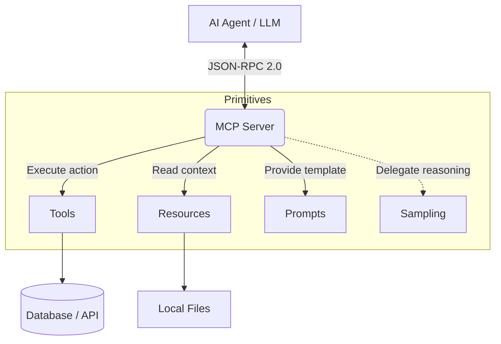

To master a protocol, you must understand its DNA. Before we write Go code in the upcoming parts, we need to dismantle the architecture of the Model Context Protocol (MCP). Underneath the complex AI workflows, MCP is surprisingly simple and elegant. It is built on top of the **[JSON-RPC 2.0](https://www.jsonrpc.org/specification)** specification.

## 1. The 5 Core Primitives of MCP

A standard MCP Server exposes its capabilities to an AI Agent through 5 core building blocks (Primitives).

### A. Tools
This is what most people think of when talking about Agentic Workflows. Tools are executable functions.
- **Nature:** State-mutating or action-triggering (e.g., `create_jira_ticket`, `delete_s3_bucket`).
- **Mechanism:** The server provides a JSON Schema detailing the inputs required. The LLM infers the parameters based on the prompt and calls the tool.

### B. Resources
If Tools are the hands, Resources are the books the Agent reads.
- **Nature:** Read-only data that provides context (e.g., an API endpoint returning system logs, a local config file, a database schema).
- **Mechanism:** Addressed via standard URIs (e.g., `file:///app/logs/error.log` or `postgres://internal-db/schema`). The Agent requests to read the resource to inject it into its prompt.

### C. Prompts
The Server doesn't just passively wait to be called; it can actively guide the Agent.
- **Nature:** Pre-defined templates hosted on the Server.
- **Mechanism:** A Server can define a prompt like `review_code(pr_id)`. When the user asks the Agent to review a PR, the Agent pulls this prompt from the Server. The prompt includes instructions and relevant data (from Resources) pre-assembled by the Server.

### D. Sampling
This is the most powerful and dangerous feature of MCP.
- **Nature:** The Server requests the Agent to use the LLM to process something on the Server's behalf.
- **Mechanism:** Imagine a Security MCP Server that receives an obfuscated bash script. It doesn't know what it does. The Server can use the `Sampling` primitive to send the script back to the Agent and ask: *"Evaluate if this is malicious, return a score from 1-10"*.

### E. Roots
- **Nature:** Defines the boundary of operations (Security Boundaries).
- **Mechanism:** The Server tells the Client "You are only allowed to read Resources located within this `/app/data/` directory".


<p align="center"><em>Figure 1: The 5 Core Primitives connecting an AI Agent to a Server via JSON-RPC 2.0</em></p>

## 2. Transport Evolution: From Local to Enterprise

The MCP protocol is completely decoupled from the Network Transport layer. This is a smart design, but also the most confusing point for Enterprise systems.

### Phase 1: Standard I/O (stdio)
In its early days (late 2024), MCP primarily ran over `stdio`.
- **How it works:** The AI Agent (like Claude Desktop) spawns the MCP Server as a local subprocess. They communicate by reading and writing JSON-RPC to `stdout` and `stdin`.
- **Limitation:** It only works locally. It's impossible to scale, load balance, or distribute across a network. If the Server crashes, the Agent loses connection.

### Phase 2: Streamable HTTP (SSE - Server-Sent Events)
To bring MCP to the Cloud, the Agentic AI Foundation standardized the HTTP Transport using SSE. This is the **mandatory standard for Production**.
- **How it works:** 
  1. The Agent sends a standard HTTP POST request to initialize the connection.
  2. The Server responds with a persistent SSE connection (holding the stream open) to push messages (server-to-client).
  3. The Agent sends its JSON-RPC requests via standard HTTP POST to a specific endpoint (client-to-server).
- **Advantage:** Completely stateless at the network layer. It can pass through API Gateways, Load Balancers, WAFs, and easily integrates with existing network security layers.

## 3. Server Cards: The Heart of Auto-Discovery

How does a new Agent entering the network know what the Jira MCP Server can do? The answer is **Server Cards** (Metadata Documents).

When the Agent connects, the first exchange is the `initialize` handshake. The Server will respond with its capabilities:

```json
{
  "protocolVersion": "2024-11-05",
  "serverInfo": {
    "name": "enterprise-jira-mcp",
    "version": "1.2.0"
  },
  "capabilities": {
    "tools": { "listChanged": true },
    "resources": { "subscribe": true },
    "logging": {}
  }
}
```

This handshake defines the contract. If the server declares `"tools": {}`, the Agent knows it can call the `tools/list` endpoint to fetch the JSON Schema of all available Jira actions.

## Conclusion

MCP provides a standardized syntax for AI-to-Machine communication. By shifting the transport layer from `stdio` to HTTP/SSE, we have unlocked the ability to deploy MCP globally.

However, to build a resilient Server capable of handling thousands of requests, we need a robust language. In the next part, we will use the Official Go SDK to construct the backbone of an Enterprise Server.

---
*Next up: [Part 2: Build a Production Server with Go](/series/mcp-engineering-in-production/part-2-build/)*
