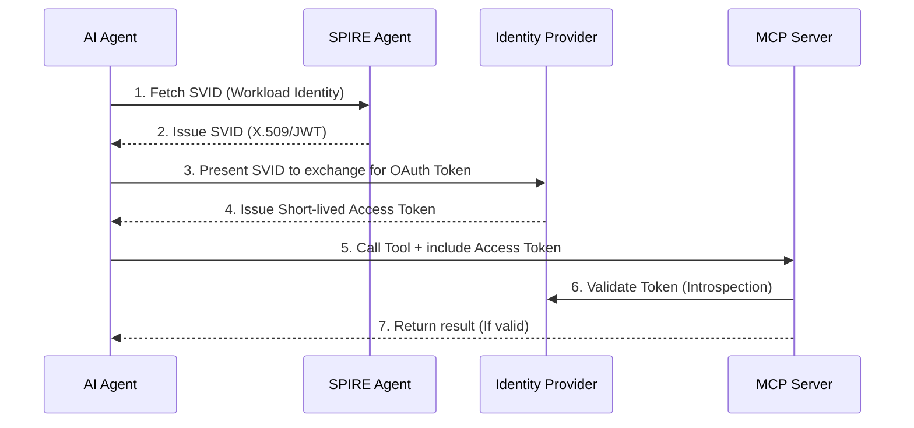

> **Prerequisite:** Before reading this part, please ensure you have read the previous article in this series: [Part 3: Part 2: Build a Production Server with Go]().

If Part 2 helped you build a robust Server, Part 3 addresses the most headache-inducing question in Security: **"How does the MCP Server know WHICH Agent is calling it, and does that Agent have the PERMISSION to do so?"**

In the early days of Agentic AI, developers often bypassed this by hardcoding long-lived API Keys. But in a Zero Trust environment, an API Key stored in plain text inside a Python script of an Agent is a ticking time bomb. If the Agent falls victim to a [Prompt Injection](/series/mcp-engineering-in-production/part-5-security/) attack, the hacker captures that API Key and gains full access to your infrastructure.

This is where enterprise Identity standards step in, bridging the gap between traditional IAM and autonomous AI systems.

## 1. Authentication (AuthN) with OAuth 2.1

For MCP Servers running over HTTP Transport (SSE), the Agentic AI Foundation strongly recommends using **OAuth 2.1** as the default mechanism. Unlike OAuth 2.0, OAuth 2.1 strictly mandates the use of **PKCE (Proof Key for Code Exchange)** for all clients, eliminating the risk of authorization code interception.

When an Agent wants to connect to an MCP Server, it must attach an `Authorization: Bearer <Token>` header. But how does an automated Agent, without a human to click "Login", securely obtain this token?

### The Death of DCR (Dynamic Client Registration)
Historically, to get a token, the Agent had to register itself with the Identity Provider (IdP - like Keycloak, Okta) using the RFC 7591 (DCR) standard. However, DCR opens up a massive attack surface: anyone scanning the internet could spam register thousands of rogue clients into your IdP, leading to a Denial of Wallet attack.

### The Rise of CIMD (Client ID Metadata Documents)
By late 2025 (via SEP-991), the MCP ecosystem shifted to **[CIMD](https://spec.modelcontextprotocol.io/specification/auth/)**.
Instead of pushing registration data to the IdP, the Agent simply hosts a static JSON file on its domain (e.g., `https://agent.example.com/.well-known/oauth-client.json`).

Here is an example of what a CIMD file looks like:
```json
{
  "client_id": "https://agent.example.com",
  "client_name": "Finance Reporting Agent",
  "token_endpoint_auth_method": "private_key_jwt",
  "jwks_uri": "https://agent.example.com/.well-known/jwks.json",
  "grant_types": ["client_credentials"]
}
```

When the Agent requests a token, the IdP pulls this JSON file to verify the Agent's identity. This flips the trust model: the IdP only trusts Agents hosted on domains previously whitelisted by the Admin.

> **Production Note (SSRF Risk):** When implementing CIMD on the IdP or MCP Gateway side, you must meticulously protect against **SSRF (Server-Side Request Forgery)** attacks. Hackers might provide a malicious `client_id` URI (like `http://169.254.169.254/latest/meta-data/`) to trick your IdP into reading cloud instance metadata. Always validate the URI scheme, resolve the IP to ensure it's not internal, and set strict HTTP timeouts.

## 2. Authorization (AuthZ) and Workload Identity

OAuth 2.1 solves the problem of "Who are you?" (AuthN). But in a Microservices/Agentic architecture, relying solely on OAuth scopes is not enough. We need **Workload Identity**, and the gold standard for this is **SPIFFE/SPIRE**.

As emphasized when building zero trust in the [AI Driven Playbook](/series/ai-driven-playbook/), a Workload Identity ensures that only the exact binary running on the exact authorized Kubernetes node is granted the identity. It removes the need for storing secrets entirely.

### Integrating SPIFFE with MCP (3 Patterns)


<p align="center"><em>Figure 2: SPIFFE-Backed OAuth flow for Workload Identity</em></p>

1. **SPIFFE-Backed OAuth/OIDC (Most Common):**
   The Agent calls the local SPIRE Agent via a UNIX domain socket to get an SVID (SPIFFE Verifiable Identity Document). It exchanges this SVID for an OAuth Token (JWT) from the Identity Provider, then uses that token to call the MCP Server.
2. **Service Mesh Sidecar:**
   If both the [AI Agent](/series/agentic-system-architecture/) and the MCP Server lie within the same cluster (e.g., Istio), you don't even need to write auth code. The Envoy proxies intercept the MCP traffic, automatically authenticate via mTLS using SPIFFE X.509 certificates, and forward the request to the Go Server.
3. **Instance-Level Auth (AWS IAM / GCP SA):**
   If running entirely on AWS, you can assign an IAM Role to the EC2/EKS pod running the Agent, and the MCP Server validates the sigv4 signature. Simple, but heavily vendor locked-in.

## 3. Human-in-the-Loop (HITL) Authentication

Not every action can be fully delegated to AI. For high-risk tools like `transfer_money` or `drop_database` (common in high-stakes environments like those discussed in the [Core Banking Developer](/series/core-banking-developer/) series), the MCP Server must enforce a **Human-in-the-Loop** mechanism.

When the Agent calls `transfer_money`, the MCP Server doesn't execute it immediately. Instead:
1. The Server pauses the execution and returns a special MCP response instructing the Agent to wait.
2. The Agent parses the response and pauses its inference loop.
3. The system sends a Slack message or an MFA prompt to the human Admin's phone.
4. The Admin clicks "Approve".
5. The MCP Server resumes the context and returns the result to the Agent.

This is the ultimate safety net for Enterprise systems, ensuring that destructive actions always have a human cryptographically signing off on the execution.

## 4. Frequently Asked Questions (FAQ)

**Q: Can we use API Keys instead of OAuth if our agents are purely internal?**  
**A:** While you *can*, you shouldn't. Static API Keys have a long lifespan and are difficult to rotate. In an Agentic system where the Agent's memory or context window might be accidentally logged or exposed, a leaked API key grants permanent access. Short-lived OAuth tokens (lasting 5 minutes) drastically reduce this risk.

**Q: Does SPIFFE replace OAuth?**  
**A:** No, they complement each other. SPIFFE is used for machine-to-machine identity (Agent to IdP), proving *what* the workload is. OAuth is used for authorization (Agent to MCP Server), proving *what permissions* the workload holds.

**Q: How does the Server differentiate between a User's identity and the Agent's identity?**  
**A:** This requires Token Exchange (RFC 8693). The Agent authenticates with its own Workload Identity, but also passes the User's JWT (who initiated the chat). The MCP Server validates both: "Is this a valid Agent?" AND "Does the User behind this Agent have permission to read this file?".

## Conclusion

Identity for AI Agents is a complex paradigm shift. We are moving from human-centric identities (passwords, cookies) to machine-centric identities (cryptographic SVIDs, Short-lived JWTs). By strictly applying OAuth 2.1, CIMD, and SPIFFE, you ensure that every Tool call is fully authenticated and traceable.

Once you have a secure Server (Part 2) and strong Identities (Part 3), the next question is: How do you connect 100 Agents to 500 MCP Servers without creating an unmanageable spaghetti network? We need an orchestrator.


## 4. Go Middleware for Agent Identity & Authentication

Securing dynamic Model Context Protocol endpoints requires authenticating the caller context and verifying JWT signatures before exposing tooling access to agents.

### AuthN Middleware Snippet
```go
package main

import (
	"fmt"
	"net/http"
	"strings"
)

func ValidateMCPToken(next http.Handler) http.Handler {
	return http.HandlerFunc(func(w http.ResponseWriter, r *http.Request) {
		authHeader := r.Header.Get("Authorization")
		if authHeader == "" || !strings.HasPrefix(authHeader, "Bearer ") {
			http.Error(w, "Unauthorized: bearer token required", http.StatusUnauthorized)
			return
		}
		
		token := strings.TrimPrefix(authHeader, "Bearer ")
		// Simulate JWT claim extraction and trust boundary validation
		if token == "invalid-token" {
			http.Error(w, "Forbidden: invalid credentials", http.StatusForbidden)
			return
		}
		
		fmt.Println("Access authorized for client credentials context.")
		next.ServeHTTP(w, r)
	})
}

func main() {
	mux := http.NewServeMux()
	mux.Handle("/mcp/v1/tools", ValidateMCPToken(http.HandlerFunc(func(w http.ResponseWriter, r *http.Request) {
		w.Write([]byte("[]"))
	})))
	fmt.Println("AuthN middleware registered on gateway server.")
}
```

### Identity and Token Claims Verification
When validating agent tokens:
- Extract the `agent_role` and `org_id` claims from the JWT.
- Map claims against tools to build granular access lists.
- Reject requests if the signature has expired or if key rotation fails.

### Technical Appendix: Token Lifecycle and mTLS Configurations
In addition to token checks:
- **Short-Lived Access Tokens:** Issue tokens with an expiration window of 15 minutes. Use refresh tokens stored in Redis to cycle them.
- **Mutual TLS (mTLS):** Configure the gateway to require client certificates from downstream MCP agents. This ensures network connections are verified before HTTP middleware runs.
- **JWKS Endpoint Caching:** Fetch verification keys from the authorization server's JWKS endpoint, caching them in memory for 1 hour to prevent network roundtrips on every request.


## Operational Context: Part 3 Identity Appendix

### Telemetry Correlation and OpenTelemetry Tracing Conventions
Tracking agent actions requires propagating tracing context through dynamic tool invocations. Utilize the OpenTelemetry SDK to create parent spans for LLM reasoning sessions, linking tool executions as child spans. Annote traces with metadata fields such as model name, token consumption, and execution duration to locate latency bottlenecks in the system.

---

## Navigation & Next Steps

[← Previous Part]()
[Next Part →]()

🔗 **Next Step:** Continue to [Part 4: Part 4: MCP Gateway Architecture]()

Need help implementing this architecture in your organization? [Contact us](/contact/) or [hire our technical consulting team](/hire/) to review your system design and codebase.
