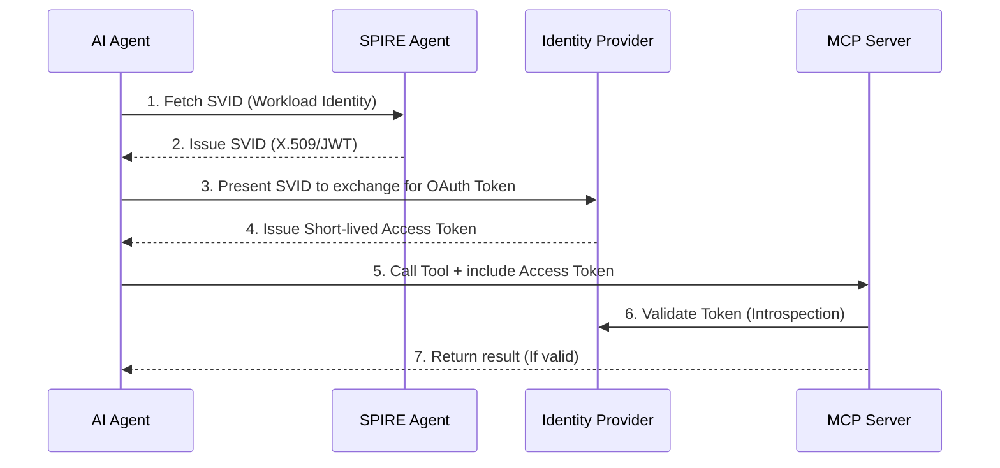

If Part 2 helped you build a robust Server, Part 3 addresses the most headache-inducing question in Security: **"How does the MCP Server know WHICH Agent is calling it, and does that Agent have the PERMISSION to do so?"**

In the early days of Agentic AI, developers often bypassed this by hardcoding long-lived API Keys. But in a Zero Trust environment, an API Key stored in plain text inside a Python script of an Agent is a time bomb. If the Agent falls victim to a [Prompt Injection](/series/mcp-engineering-in-production/part-5-security/) attack, the hacker captures that API Key and gains full access to your infrastructure.

This is where enterprise Identity standards step in.

## 1. Authentication (AuthN) with OAuth 2.1

For MCP Servers running over HTTP Transport (SSE), the Agentic AI Foundation strongly recommends using **OAuth 2.1** as the default mechanism.

When an Agent wants to connect to an MCP Server, it must attach an `Authorization: Bearer <Token>` header. But how does an automated Agent, without a human to click "Login", get this token?

### The Death of DCR (Dynamic Client Registration)
Historically, to get a token, the Agent had to register itself with the Identity Provider (IdP - like Keycloak, Okta) using the RFC 7591 (DCR) standard. However, DCR opens up a huge attack surface: anyone can spam register thousands of rogue clients into the IdP.

### The Rise of CIMD (Client ID Metadata Documents)
By late 2025 (via SEP-991), the MCP ecosystem shifted to **CIMD**.
Instead of pushing registration data to the IdP, the Agent simply hosts a static JSON file on its domain (e.g., `https://agent.example.com/.well-known/oauth-client.json`).

When the Agent requests a token, the IdP pulls this JSON file to verify the Agent's identity. This flips the trust model: the IdP only trusts Agents hosted on domains previously whitelisted by the Admin.

> **Production Note:** When implementing CIMD on the IdP or MCP Gateway side, you must meticulously protect against **SSRF (Server-Side Request Forgery)** attacks. Hackers might provide a malicious URI (like `http://169.254.169.254/latest/meta-data/`) to trick the IdP into reading cloud instance metadata.

## 2. Authorization (AuthZ) and Workload Identity

OAuth 2.1 solves the problem of "Who are you?" (AuthN). But in a Microservices/Agentic architecture, relying solely on OAuth scopes is not enough. We need **Workload Identity**, and the gold standard for this is **SPIFFE/SPIRE**.

As emphasized when building zero trust in the [AI Driven Playbook](/series/ai-driven-playbook/), a Workload Identity ensures that only the exact binary running on the exact authorized Kubernetes node is granted the identity.

### Integrating SPIFFE with MCP (3 Patterns)

1. **SPIFFE-Backed OAuth/OIDC (Most Common):**
   The Agent calls the local SPIRE Agent to get an SVID. It exchanges this SVID for an OAuth Token (JWT) from the Identity Provider, then uses that token to call the MCP Server.
2. **Service Mesh Sidecar:**
   If both the [AI Agent](/series/agentic-system-architecture/) and the MCP Server lie within the same cluster (e.g., Istio), you don't even need to write auth code. The Envoy proxies intercept the MCP traffic, automatically authenticate via mTLS using SPIFFE X.509 certificates, and forward the request to the Go Server.
3. **Instance-Level Auth (AWS IAM / GCP SA):**
   If running entirely on AWS, you can assign an IAM Role to the EC2/EKS pod running the Agent, and the MCP Server validates the sigv4 signature. Simple, but heavily vendor locked-in.

## 3. Human-in-the-Loop (HITL) Authentication

Not every action can be fully delegated to AI. For high-risk tools like `transfer_money` or `drop_database`, the MCP Server must enforce a **Human-in-the-Loop** mechanism.

When the Agent calls `transfer_money`, the MCP Server doesn't execute it immediately. Instead:
1. The Server pauses the execution and returns a special MCP response: `ActionRequiresApproval`.
2. The Agent pauses its inference loop.
3. The system sends a Slack message or an MFA prompt to the human Admin's phone.
4. The Admin clicks "Approve".
5. The MCP Server resumes the context and returns the result to the Agent.

This is the ultimate safety net for Enterprise systems.

## Conclusion

Identity for AI Agents is a complex paradigm shift. We are moving from human-centric identities (passwords, cookies) to machine-centric identities (cryptographic SVIDs, Short-lived JWTs). 

Once you have a secure Server (Part 2) and strong Identities (Part 3), the next question is: How do you connect 100 Agents to 500 MCP Servers without creating an unmanageable spaghetti network? We need an orchestrator.

---
*Next up: [Part 4: MCP Gateway Architecture](/series/mcp-engineering-in-production/part-4-gateway/)*
