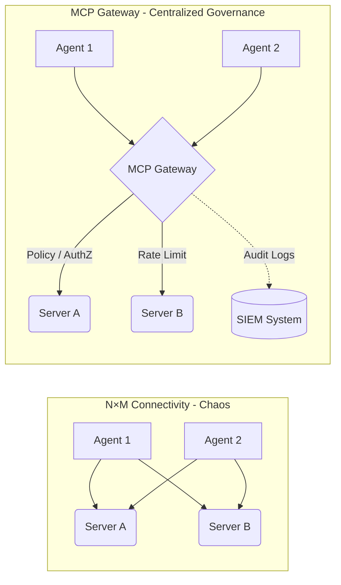

When deploying Model Context Protocol (MCP) in a large Enterprise, you will quickly hit a wall. If 50 AI Agents need to talk to 100 different internal systems (Jira, Confluence, GitHub, internal DBs), letting them connect directly creates a chaotic matrix of 5,000 P2P connections.

This is why the **MCP Gateway** was born, becoming a mandatory architectural component in 2026.

<em>Figure 3: N×M Connectivity chaos compared to centralized MCP Gateway governance</em>

## 1. The Role of the MCP Gateway

The MCP Gateway acts as a **specialized Reverse Proxy for AI**. It sits between all communication traffic from Agents to MCP Servers, acting as a singular **Control Plane**.

Core functions of the Gateway:
- **Routing & Discovery:** Agents only need to connect to the Gateway. The Gateway maintains an internal Registry of all active MCP Servers and routes requests dynamically.
- **Protocol Translation:** An Agent might communicate via SSE, while the backend MCP Server uses WebSockets or gRPC. The Gateway seamlessly translates these transport layers.
- **Policy Enforcement:** The central choke point to apply OPA (Open Policy Agent) rules. E.g., *"Agent X is only allowed to call `read_*` tools from 8 AM to 5 PM."*
- **Circuit Breaker & Rate Limiting:** AI Agents are prone to "infinite loops" (hallucinating and calling a tool repeatedly). The Gateway detects this spike and cuts the connection, saving API costs and protecting the backend from DDoS.

As discussed in the [AI Driven Playbook](/series/ai-driven-playbook/), having a centralized choke point is key to maintaining security and governance.

## 2. Two Architectural Patterns for Gateways

### Pattern A: Hub-and-Spoke (Centralized)
- **Architecture:** One massive Gateway cluster sits in the middle. All Agents and all Servers connect to it.
- **Pros:** Simple to deploy, easy to manage logs centrally. Ideal for mid-sized organizations.
- **Cons:** Single Point of Failure (SPOF) and a potential bottleneck for latency if the infrastructure spans multiple geographic regions.

### Pattern B: Federated Mesh (Decentralized)
- **Architecture:** Similar to a Service Mesh (like Istio). Gateways are deployed as sidecars or node-level DaemonSets. They synchronize their Registry and Policies via a global Control Plane.
- **Pros:** Ultra-low latency, highly resilient. Perfect for global Enterprises spanning multiple AWS regions or hybrid-cloud setups.
- **Cons:** High operational complexity.

## 3. Mitigating the "Shadow MCP Servers" Risk

There is a severe vulnerability classified as **MCP09** in the OWASP MCP Top 10 (Beta): **Shadow MCP Servers**.

Similar to Shadow IT, this occurs when an independent dev team spins up an MCP Server for their own convenience (e.g., pointing it directly at the production database) without going through Security review, and shares the URL with other Agents.

**How the Gateway Solves This:**
By enforcing a strict Zero Trust network policy, Agents are *only* allowed to talk to the Gateway's IP. The Gateway, in turn, only routes traffic to MCP Servers officially registered in its internal Registry. Any attempt by an Agent to reach an unapproved "Shadow Server" is immediately dropped and logged as a security incident.

## Conclusion

The MCP Gateway is the unsung hero of Enterprise Agentic systems. It transforms a fragile, chaotic web of direct connections into a robust, observable, and governable platform. 

But architecture alone is not enough. We must look at the specific threats facing the tools themselves. In the next part, we will dive headfirst into the dark side of MCP: The OWASP Top 10 Vulnerabilities.

---
*Next up: [Part 5: Production Security & OWASP MCP Top 10](/series/mcp-engineering-in-production/part-5-security/)*
