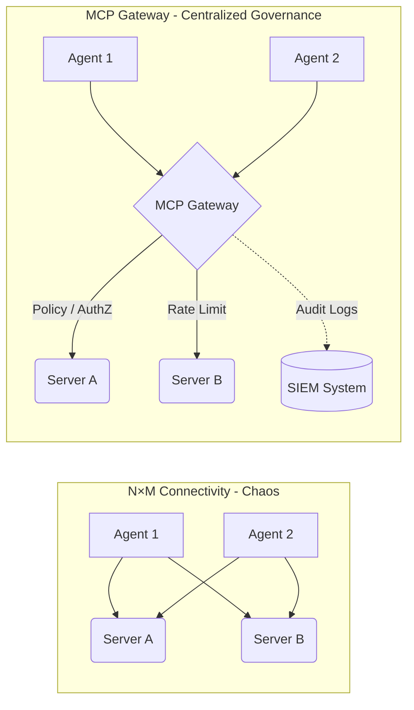

When deploying Model Context Protocol (MCP) in a large Enterprise, you will quickly hit an architectural wall. If 50 distinct AI Agents (Coding Agents, HR Bots, Financial Analysts) need to talk to 100 different internal systems (Jira, Confluence, GitHub, internal DBs), letting them connect directly creates a chaotic matrix of 5,000 P2P connections. 

This is why the **MCP Gateway** was born, becoming a mandatory architectural component in 2026 for any organization operating [Agentic Systems](/series/agentic-system-architecture/).


<p align="center"><em>Figure 3: N×M Connectivity chaos compared to centralized MCP Gateway governance</em></p>

## 1. The Role of the MCP Gateway

The MCP Gateway acts as a **specialized Reverse Proxy for AI**. It sits between all communication traffic from Agents to MCP Servers, acting as a singular **Control Plane**. Unlike traditional API Gateways (like Kong or Apigee) which just forward HTTP traffic, an MCP Gateway natively understands the JSON-RPC structure of the Model Context Protocol.

Core functions of the Gateway:

- **Routing & Discovery:** Agents only need to connect to the Gateway. The Gateway maintains an internal Registry of all active MCP Servers and routes requests dynamically. When an Agent calls `tools/list`, the Gateway aggregates tools from multiple backend servers into a single cohesive list.
- **Protocol Translation:** An Agent might communicate with the Gateway via SSE (Server-Sent Events) over HTTP, while the backend legacy MCP Server uses `stdio` or WebSockets. The Gateway seamlessly translates these transport layers on the fly.
- **Circuit Breaker & Rate Limiting:** AI Agents are prone to "infinite loops" (hallucinating and calling a tool repeatedly). The Gateway detects this spike and cuts the connection, saving massive LLM API token costs and protecting the backend from accidental DDoS.

## 2. Centralized Policy Enforcement (OPA)

One of the biggest advantages of the Gateway is centralizing security rules via **Policy-as-Code**, often utilizing Open Policy Agent (OPA).

Instead of hardcoding authorization logic into every single Go server, the Gateway intercepts the request and evaluates a Rego policy.
For example, we can enforce: *"Agent X is only allowed to call `read_*` tools from 8 AM to 5 PM, and is strictly forbidden from accessing the Production Database Server."*

Here is a simplified example of a Rego policy running inside the MCP Gateway:
```rego
package mcp.authz

default allow = false

# Allow if the agent has 'read_only' role and the tool starts with 'fetch_'
allow {
    input.agent.role == "read_only"
    startswith(input.request.tool_name, "fetch_")
}

# Deny all access to production servers on weekends
deny {
    input.server.environment == "production"
    is_weekend(time.now_ns())
}
```
As discussed in the [AI Driven Playbook](/series/ai-driven-playbook/), having a centralized choke point is key to maintaining security and governance at an enterprise scale.

## 3. Two Architectural Patterns for Gateways

Depending on your organization's size, you must choose the right topological pattern.

### Pattern A: Hub-and-Spoke (Centralized)
- **Architecture:** One massive Gateway cluster sits in the middle. All Agents and all Servers connect to it. Traffic routes through this central hub.
- **Pros:** Simple to deploy, easy to manage logs centrally. Ideal for mid-sized organizations.
- **Cons:** Single Point of Failure (SPOF) and a potential bottleneck for latency if the infrastructure spans multiple geographic regions.

### Pattern B: Federated Mesh (Decentralized)
- **Architecture:** Similar to a Service Mesh (like Istio). Gateways are deployed as sidecars or node-level DaemonSets alongside the Agents. They synchronize their Registry and Policies via a global Control Plane.
- **Pros:** Ultra-low latency, highly resilient. This is the architecture used by massive high-concurrency systems, akin to the real-time event routing detailed in the [Ride-Hailing Realtime Architecture](/series/ride-hailing-realtime-architecture/) series. Perfect for global Enterprises spanning multiple AWS regions.
- **Cons:** High operational complexity. Debugging a misrouted request in a mesh requires advanced distributed tracing.

## 4. Mitigating the "Shadow MCP Servers" Risk

There is a severe vulnerability classified as **MCP09** in the OWASP MCP Top 10 (Beta): **Shadow MCP Servers**.

Similar to Shadow IT, this occurs when an independent dev team spins up an MCP Server for their own convenience (e.g., pointing it directly at the production database) without going through Security review, and shares the URL directly with other Agents.

**How the Gateway Solves This:**
By enforcing a strict Zero Trust network policy at the VPC level, Agents are *only* allowed to talk to the Gateway's internal IP. The Gateway, in turn, only routes traffic to MCP Servers officially registered in its internal Registry. Any attempt by an Agent to bypass the Gateway and reach an unapproved "Shadow Server" is immediately dropped by the firewall and logged as a high-severity security incident.

## 5. Frequently Asked Questions (FAQ)

**Q: Do I need to build my own MCP Gateway from scratch?**  
**A:** No. As of 2026, major open-source API Gateways (like Envoy, KrakenD) and commercial vendors have released specialized plugins for MCP. You can configure them to parse JSON-RPC payloads and apply rate-limiting without writing custom proxy code in Go.

**Q: How does the Gateway handle Schema Validation?**  
**A:** An advanced MCP Gateway can act as a firewall. When an Agent sends a `CallToolRequest`, the Gateway inspects the JSON payload against the cached JSON Schema of the Tool. If the Agent hallucinated a parameter, the Gateway rejects it with an error immediately, without ever forwarding the invalid request to the backend Server.

**Q: Does the Gateway introduce noticeable latency?**  
**A:** Typically, an Envoy-based Gateway adds less than 2-3 milliseconds of overhead. Compared to the hundreds of milliseconds it takes for the LLM to generate the tool-call tokens, the Gateway latency is completely negligible.

## Conclusion

The MCP Gateway is the unsung hero of Enterprise Agentic systems. It transforms a fragile, chaotic web of direct connections into a robust, observable, and governable platform. By handling routing, protocol translation, and central policy enforcement, it allows Developers to focus purely on business logic in their MCP Servers.

But architecture alone is not enough. We must look at the specific security threats facing the tools themselves. In the next part, we will dive headfirst into the dark side of MCP: The OWASP Top 10 Vulnerabilities.

---
*Next up: [Part 5: Production Security & OWASP MCP Top 10](/series/mcp-engineering-in-production/part-5-security/)*
