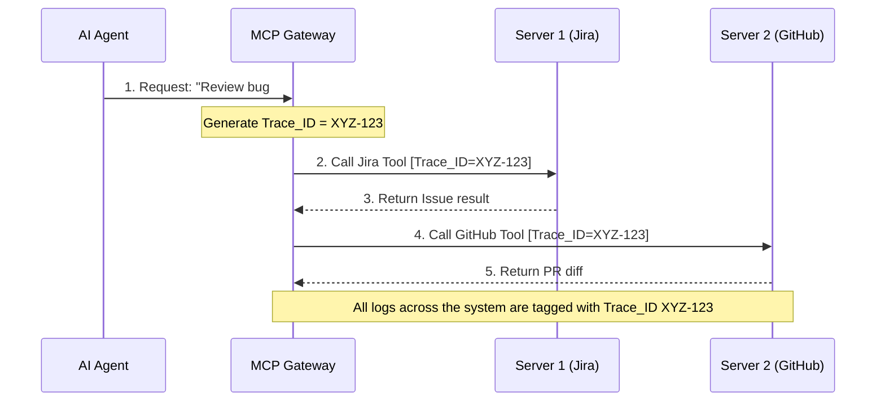

As mentioned in [Part 5](/series/mcp-engineering-in-production/part-5-security/), the **MCP08 (Lack of Audit & Telemetry)** vulnerability is one of the biggest risks in Agentic systems. In the [AI Driven Playbook](/series/ai-driven-playbook/), we agreed that: When AI automates tasks on behalf of humans, the requirements for Observability and Auditing become stricter than ever, especially under the pressure of regulations like the EU AI Act.

When a human clicks a button and the system crashes, we have an error stack trace. When an Agent hallucinates, calls the wrong MCP tool, and drops a database table, we need more than a stack trace—we need the entire "Chain of Thought" leading to that disaster.

This article guides you through setting up an enterprise-grade Observability system for an MCP Server.

## 1. The Three Pillars of Telemetry for MCP

We don't use `fmt.Println()` to debug MCP (this will break the protocol if running over `stdio` as discussed in [Part 2](/series/mcp-engineering-in-production/part-2-build/)). Instead, all telemetry data must be structured and exported via **OpenTelemetry (OTel)**. This mindset should be very familiar if you have studied [The AI Driven Engineer](/series/ai-driven-engineer/).

### A. Structured Logging
Logs are not just text strings to be skimmed by the human eye. They must be machine-readable JSON containing rich metadata.
Every log line from an MCP Server must answer:
- Who is calling? (`agent_id`, `client_name`)
- What tool is being called? (`tool_name`)
- What is the request ID? (`mcp_request_id`)
- What is the status? (`status: success/failed/rate_limited`)

In Go, you should utilize `slog` (the structured logging package introduced in Go 1.21) hooked up to an OpenTelemetry exporter.

### B. Metrics
Metrics help you detect Behavioral Anomalies in the Agent over time, preventing runaway costs and security breaches.
Important metrics to track via Prometheus/Grafana:
- `mcp_tool_invocation_total`: The total number of times a tool is called, tagged by `tool_name` and `agent_id`. If the `delete_database` tool suddenly spikes from 0 to 100 in a minute, you have an active Prompt Injection happening.
- `mcp_request_duration_seconds`: Processing time. Vital for diagnosing slow third-party API dependencies.
- `mcp_payload_size_bytes`: Payload size. A bloated Context Window often originates from a Tool returning too much garbage data. Monitoring this prevents the "Context Window Exceeded" token crash.

### C. Distributed Tracing
This is the hardest but most valuable part. A single "thought" from an LLM can lead to 5 consecutive MCP Tool calls, distributed across 3 different MCP Servers. As seen in hyper-scale microservices architectures (like [Alipay Double 11](/series/alipay-double-11/)), tracing the request lifecycle is paramount.

Without a Correlation ID, you will see disjointed logs and won't be able to tell if they belong to the same reasoning loop of an Agent. The Gateway must inject a `trace_id` (via standard W3C Trace Context headers) into every request sent down to the MCP Server over HTTP.


<p align="center"><em>Figure 5: Gateway injecting Trace_ID for Distributed Tracing across multiple MCP Servers</em></p>

## 2. SIEM Integration and Audit Trail

For Enterprise organizations, pushing logs to Kibana or Grafana is not enough. Logs related to system-altering behaviors (like `provision_server` or `modify_user_role`) must be treated as **Security Events**.

They need to be exported directly into SIEM (Security Information and Event Management) systems like Splunk, Datadog Security, or Microsoft Sentinel for anomaly detection and compliance auditing.

### Standard Audit Log Structure:
```json
{
  "timestamp": "2026-05-15T14:30:00Z",
  "event_type": "mcp_tool_execution",
  "actor": {
    "identity_type": "spiffe",
    "agent_id": "spiffe://example.com/agent/finance-bot/uuid-abc123",
    "user_context": "john.doe@company.com"
  },
  "action": {
    "server_name": "billing-mcp-server",
    "tool_name": "refund_customer",
    "arguments_hash": "e3b0c44298fc1c149afbf4c8996fb92427ae41e4649b934ca495991b7852b855"
  },
  "outcome": "success",
  "trace_id": "5b8aa5a2-c941-4775-b66f-3c6eb2d6a695"
}
```
*Crucial Note on Data Scrubbing:* Do not log sensitive parameters (PII, Passwords, API Secrets) in plain text. Always scrub or hash the arguments payload (`arguments_hash`) to avoid creating a new vulnerability (MCP01 Token Mismanagement via Log Leakage).

## 3. Semantic Validation at the Gateway

Observability is not just for "looking at the past". It can be used to block requests in Real-time.

Your Gateway can apply **Semantic Validation**:
Based on live metrics, if the Gateway notices an Agent continuously calling the `search_logs` tool with rapidly changing keywords but getting no results, it can recognize that the Agent is stuck in an Infinite reasoning loop. The Gateway can automatically cut the connection (Circuit Breaker) to save token costs and prevent the Agent from spiraling out of control.

## 4. Frequently Asked Questions (FAQ)

**Q: Do I need to implement OpenTelemetry manually in Go?**  
**A:** The Official Go SDK provides hooks and middleware for OpenTelemetry. You can easily wrap your `mcp.AddTool` handlers with OTel spans, automatically capturing the execution duration and status.

**Q: How do I store the Agent's original prompt along with the MCP logs?**  
**A:** The MCP Server does not see the Agent's prompt (it only sees the parsed JSON-RPC arguments). To correlate the prompt with the execution, the Agent Orchestrator (like LangChain) must attach the `trace_id` to its LLM prompt logs, and the Gateway must pass that same `trace_id` to the MCP Server. You join the data inside your SIEM using the `trace_id`.

## Conclusion

Observability turns the "black box" of AI into a transparent, verifiable system. By leveraging OpenTelemetry, Metrics, and Tracing, you ensure that every action taken by an autonomous Agent is auditable and justifiable to compliance boards. 

Once you have a solid Gateway, tight Security, and comprehensive Observability, the final step is to scale this system out for the entire enterprise to use.

---
*Next up: [Part 7: Enterprise Scaling & Governance](/series/mcp-engineering-in-production/part-7-enterprise/)*
