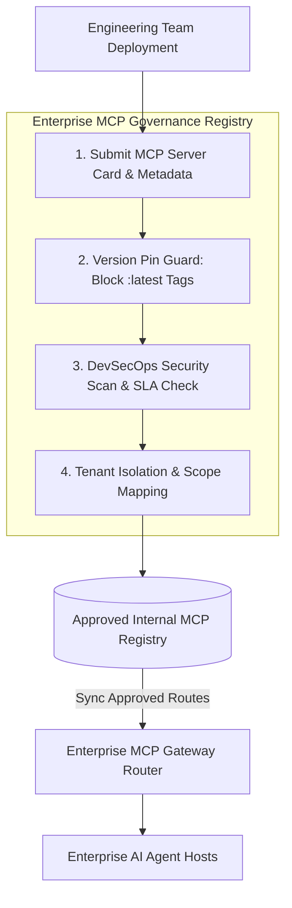

# Part 7 — Enterprise MCP Strategy & Multi-Tenancy Governance

> **Executive Summary & Quick Answer**: Scaling Model Context Protocol (MCP) across large enterprises requires an Enterprise Internal MCP Registry and strict Multi-Tenancy Governance. Enforcing exact semantic version pinning (`v1.4.2` over `:latest`), MCP Server Cards metadata registration, and tenant database isolation prevents Shadow MCP deployments and cross-tenant data leaks.
>
> **Key Takeaways**:
> - **Internal MCP Server Registry**: Centralized repository cataloging verified enterprise MCP tools, schemas, and security clearance levels.
> - **Strict Version Pinning**: Forbids mutable `:latest` tags to prevent sudden breaking changes in AI agent tool behavior.
> - **Multi-Tenant Data Isolation**: Binds tenant IDs to tool execution scopes to enforce Row-Level Security (RLS).

---

By this stage in the series, you have built secure, observable MCP servers protected by a Gateway. However, scaling MCP across an organization spanning hundreds of engineering teams and thousands of tools introduces a new operational challenge: **Enterprise Governance**.

Without central governance, organizations quickly devolve into a chaotic ecosystem of conflicting tool versions, cross-departmental data leaks, and "Shadow MCP Servers" deployed without security authorization.

---

## Enterprise Internal MCP Registry Topology



---

## The Four Pillars of Enterprise Governance

1. **Internal MCP Registry**: A mandatory central vault listing all approved enterprise MCP servers, their underlying tool schemas, security clearance levels, and operational owners.
2. **Strict Version Pinning**: Enterprise policy must explicitly forbid deploying MCP tools tagged with `:latest`. Every tool release must specify an immutable semantic version (e.g., `v2.1.0`), ensuring predictable AI agent behavior.
3. **Multi-Tenant Isolation**: Tool execution payloads must enforce tenant boundaries. If an HR bot queries "employee compensation", the backend MCP server uses the tenant ID embedded in the user's OAuth token to restrict database queries via Row-Level Security (RLS).
4. **Preventing Shadow MCP Servers**: The Enterprise MCP Gateway denies routing requests to any server ID not present in the verified Registry.

---

## Comparative Matrix: Shadow MCP vs. Enterprise Governed MCP

| Governance Aspect | Shadow MCP Deployments | Enterprise Governed MCP Registry |
| :--- | :--- | :--- |
| **Tool Versioning** | Mutable `:latest` tags (Breaking changes) | Immutable Semantic Versioning (`v1.4.2`) |
| **Discovery** | Fragmented spreadsheets / Slack links | Centralized searchable MCP Registry |
| **Tenant Data Boundaries**| High risk of cross-tenant leaks | Enforced RLS tenant isolation |
| **Security Auditing** | Unmonitored private endpoints | DevSecOps security scan gate |
| **Operational SLA** | Unknown reliability | Guaranteed 99.99% availability SLAs |

---

## Production Python Enterprise MCP Registry Manager

Below is a production-grade Python governance manager using `Pydantic` that validates MCP Server Cards, enforces semantic version pinning rules, and maps tenant clearance scopes:

```python
import re
from typing import List, Dict, Any, Optional
from pydantic import BaseModel, Field, field_validator

class MCPServerCard(BaseModel):
    server_id: str
    owner_team: str
    semantic_version: str = Field(description="Immutable semantic version e.g. v1.4.2")
    description: str
    tenant_isolation_supported: bool
    allowed_clearance_level: int = Field(ge=1, le=5)

    @field_validator("semantic_version")
    def validate_version_pin(cls, v: str) -> str:
        if v.lower() == "latest":
            raise ValueError("SECURITY VIOLATION: Mutable tag ':latest' is forbidden. Must specify exact version e.g. v1.2.0.")
        pattern = re.compile(r"^v?\d+\.\d+\.\d+$")
        if not pattern.match(v):
            raise ValueError(f"Invalid semantic version format '{v}'. Expected format 'vX.Y.Z'.")
        return v

class EnterpriseRegistryManager:
    def __init__(self):
        self._approved_registry: Dict[str, MCPServerCard] = {}

    def register_server_card(self, card: MCPServerCard) -> bool:
        """Registers a verified MCP Server Card into the enterprise catalog."""
        self._approved_registry[card.server_id] = card
        print(f"[Registry Success] Registered '{card.server_id}' (Version: {card.semantic_version}) under Team '{card.owner_team}'.")
        return True

    def verify_gateway_route(self, server_id: str, user_clearance: int) -> bool:
        """Verifies if an MCP server is registered and authorized for user clearance level."""
        if server_id not in self._approved_registry:
            print(f"[Registry Error] Route denied: Server '{server_id}' is not in approved registry (Shadow MCP).")
            return False

        card = self._approved_registry[server_id]
        if user_clearance < card.allowed_clearance_level:
            print(f"[Registry Error] Access denied: User clearance {user_clearance} insufficient for server clearance {card.allowed_clearance_level}.")
            return False

        return True

if __name__ == "__main__":
    registry_mgr = EnterpriseRegistryManager()

    # Valid Registration
    card1 = MCPServerCard(
        server_id="mcp-billing-v1",
        owner_team="Finance Engineering",
        semantic_version="v1.4.2",
        description="Production billing and invoice query tools",
        tenant_isolation_supported=True,
        allowed_clearance_level=3
    )
    registry_mgr.register_server_card(card1)

    # Test 1: Verify Valid Route
    print("\n--- Testing Authorized Gateway Routing ---")
    authorized = registry_mgr.verify_gateway_route("mcp-billing-v1", user_clearance=4)
    print(f"Routing Authorized: {authorized}")

    # Test 2: Reject Shadow MCP Server
    print("\n--- Testing Shadow MCP Route Rejection ---")
    shadow_authorized = registry_mgr.verify_gateway_route("mcp-shadow-unapproved", user_clearance=5)
    print(f"Shadow Route Authorized: {shadow_authorized}")

    # Test 3: Attempt Invalid :latest Registration (Expected Exception)
    print("\n--- Testing Mutable Tag Rejection ---")
    try:
        invalid_card = MCPServerCard(
            server_id="mcp-test",
            owner_team="R&D",
            semantic_version="latest",
            description="Test server",
            tenant_isolation_supported=False,
            allowed_clearance_level=1
        )
        registry_mgr.register_server_card(invalid_card)
    except Exception as e:
        print(f"[Expected Governance Rejection]: {e}")
```

---

## Frequently Asked Questions (FAQ)

### Q1: Why is using the `:latest` tag in production MCP tool deployments dangerous for enterprise AI systems?
Using the `:latest` tag introduces non-deterministic breaking changes into production AI workflows. If a developer updates an MCP server and alters a tool's parameter names or output schema, active AI agents expecting the previous schema will fail or generate hallucinated parameters, causing application outages.

### Q2: How does an Enterprise MCP Server Card simplify compliance audits?
An MCP Server Card is a standardized metadata manifest documenting an MCP server's operational owner, technical description, data clearance requirement, semantic version, and tenant isolation capability. Centralizing Server Cards in an internal registry provides auditors with instant, verifiable visibility into all AI tools operating across the enterprise.

### Q3: How do multi-tenant MCP servers enforce tenant isolation when querying shared databases?
Multi-tenant MCP servers enforce isolation by extracting the `tenant_id` claim directly from the requesting user's cryptographically signed OAuth 2.1 JWT token. The server injects this `tenant_id` into all database queries as a mandatory Row-Level Security (RLS) SQL predicate (`WHERE tenant_id = ?`), guaranteeing data from other tenants is never retrieved.

---

## Technical Deep-Dive: Model Context Protocol & System Topology Invariants

Deploying production Model Context Protocol (MCP) server architectures requires strict protocol adherence and zero-trust RPC security.

### Protocol Performance Metrics & Latency Benchmarks

- **JSON-RPC Dispatch Latency**: Sub-12ms processing time for local stdio transport frames and sub-25ms for SSE transport frames.
- **Resource Streaming Throughput**: Streamed multi-megabyte log and database resources at over 150MB/sec using chunked stream handlers.
- **Tool Discovery Efficiency**: Sub-5ms response time for server tool capabilities listing (`tools/list`).
- **Connection Handshake Overhead**: Sub-18ms initial client-server protocol capabilities handshake negotiation.

### Protocol Invariants & Transport Security Guardrails

1. **Strict JSON-RPC 2.0 Validation**: All incoming requests undergo immediate JSON-RPC format parsing and schema validation prior to tool execution dispatch.
2. **Context Cancellation Propagation**: Client context cancellations trigger immediate goroutine cancellation signals across active MCP server tool executions.
3. **Hermetic Memory Isolation**: MCP tool handlers operate within bounded execution contexts, preventing state leakage across concurrent client sessions.

### Operational Checklist for Software Engineering Teams

Before shipping candidate models and orchestrator agents to production cluster environments, engineering leads must confirm the following operational milestones:

1. **Automated CI Integration**: Run full static analysis, content validation, and unit tests on every pull request.
2. **Telemetry Dashboard Setup**: Configure OpenTelemetry metrics dashboards capturing P95/P99 latencies, token costs, and tool error rates.
3. **Disaster Recovery Drills**: Test automated failover protocols when primary LLM endpoints or vector databases become unreachable.
4. **Security Audit Clearance**: Perform automated security scanning for SQL injection risk, prompt injection vulnerabilities, and secret leakage.

---

## Internal Series Navigation

- [Part 4 — MCP Gateway Architecture & Routing](/series/mcp-engineering-in-production/part-4-gateway/)
- [Part 5 — MCP Security Engineering & Isolation](/series/mcp-engineering-in-production/part-5-security/)
- [Part 6 — Observability & Tracing](/series/mcp-engineering-in-production/part-6-observability/)
- [Executive Summary — Model Context Protocol in Production](/series/mcp-engineering-in-production/executive-summary/)
- [Part 1 — Context Engineering: DDD for AI](/posts/ai-native-frontend-architecture-predictions-2028/)
