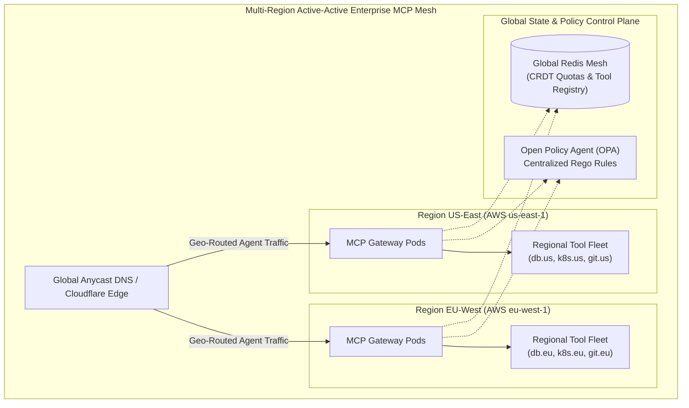
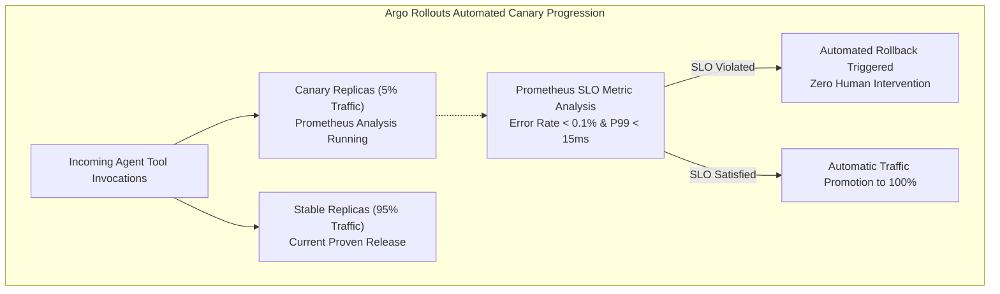
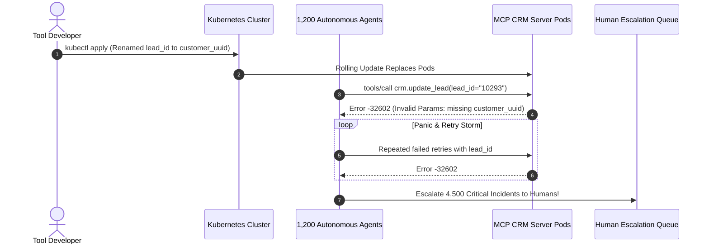
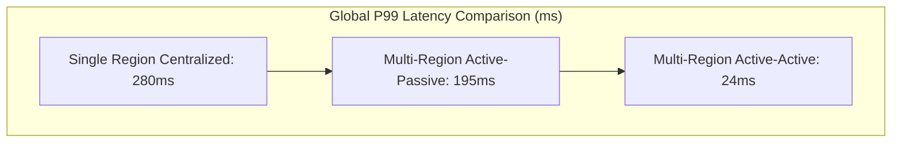

> **Answer-first:** Scaling Model Context Protocol across multi-tenant enterprise clusters necessitates Kubernetes deployments with custom SSE connection metrics, multi-region active-active routing, and SemVer 2.0 tool contract governance. Enforcing Open Policy Agent admission controls alongside automated Argo Rollouts canary deployments guarantees zero-downtime upgrades, deterministic backward compatibility, and isolated tenant quotas across high-velocity distributed autonomous agent ecosystems.

[← Part 6: Observability & Audit Trail](/series/mcp-engineering-in-production/part-6-observability/) | [Series Hub: MCP Engineering in Production →](/series/mcp-engineering-in-production/)

---

## 1. The Fleet Scale Problem: Transitioning from Node to Multi-Region Cluster

Running an MCP server on a single host is straightforward. Scaling Model Context Protocol to support thousands of autonomous AI agents across multinational corporate divisions introduces unprecedented distributed systems challenges:


```mermaid
graph TD
    subgraph "Multi-Region Active-Active Enterprise MCP Mesh"
        Anycast["Global Anycast DNS / Cloudflare Edge"]
        
        subgraph "Region US-East (AWS us-east-1)"
            GW_US["MCP Gateway Pods"]
            Tools_US["Regional Tool Fleet<br/>(db.us, k8s.us, git.us)"]
            GW_US --> Tools_US
        end
        
        subgraph "Region EU-West (AWS eu-west-1)"
            GW_EU["MCP Gateway Pods"]
            Tools_EU["Regional Tool Fleet<br/>(db.eu, k8s.eu, git.eu)"]
            GW_EU --> Tools_EU
        end

        subgraph "Global State & Policy Control Plane"
            Redis_Mesh[("Global Redis Mesh<br/>(CRDT Quotas & Tool Registry)")]
            OPA_Engine["Open Policy Agent (OPA)<br/>Centralized Rego Rules"]
        end

        Anycast -->|Geo-Routed Agent Traffic| GW_US
        Anycast -->|Geo-Routed Agent Traffic| GW_EU
        GW_US -.-> Redis_Mesh
        GW_EU -.-> Redis_Mesh
        GW_US -.-> OPA_Engine
        GW_EU -.-> OPA_Engine
    end
```

### Why Standard Kubernetes Autoscaling Fails for MCP
Standard Kubernetes Horizontal Pod Autoscalers (HPA) rely on CPU and Memory metrics. For MCP servers, this metric model is critically flawed:
- **Stateful Persistent SSE Connections:** 10,000 idle Server-Sent Events (SSE) connections consume negligible CPU (< 5%) and static RAM, but occupy valuable Linux kernel socket descriptors and file handles.
- **Sudden Synchronous Bursts:** When an orchestrator triggers an enterprise batch evaluation, hundreds of agents call compute-intensive tools simultaneously on existing open streams. A CPU-based HPA cannot react quickly enough to spin up fresh pods before existing pods experience socket backlog timeouts.
- **Premature Pod Termination:** Standard Kubernetes rolling updates send a `SIGTERM` and kill pods after 30 seconds. This abruptly severs thousands of long-lived agent SSE streams, corrupting active agent workflows and inducing massive retry storms.

---

## 2. Kubernetes Orchestration & Custom SSE Metric HPA

Production MCP clusters deploy dedicated Kubernetes Custom Metrics adapters (Prometheus Adapter) that trigger autoscaling directly based on the number of **active open SSE streams**:

```yaml
# mcp-gateway-hpa.yaml
apiVersion: autoscaling/v2
kind: HorizontalPodAutoscaler
metadata:
  name: mcp-gateway-hpa
  namespace: mcp-system
spec:
  scaleTargetRef:
    apiVersion: apps/v1
    kind: Deployment
    name: mcp-gateway
  minReplicas: 5
  maxReplicas: 50
  metrics:
    # Scale based on active SSE streams per pod
    - type: Pods
      pods:
        metric:
          name: mcp_active_sse_connections
        target:
          type: AverageValue
          averageValue: "250"
    # Secondary safety trigger on CPU
    - type: Resource
      resource:
        name: cpu
        target:
          type: Utilization
          averageUtilization: 65
  behavior:
    scaleUp:
      stabilizationWindowSeconds: 0
      policies:
        - type: Percent
          value: 100
          periodSeconds: 15
    scaleDown:
      stabilizationWindowSeconds: 300 # Prevent thrashing during temporary agent pauses
      policies:
        - type: Percent
          value: 10
          periodSeconds: 60
```

### Production Deployment Manifest with Graceful Connection Draining

```yaml
# mcp-gateway-deployment.yaml
apiVersion: apps/v1
kind: Deployment
metadata:
  name: mcp-gateway
  namespace: mcp-system
spec:
  replicas: 10
  strategy:
    type: RollingUpdate
    rollingUpdate:
      maxSurge: 25%
      maxUnavailable: 0 # Zero downtime guarantee
  template:
    metadata:
      labels:
        app: mcp-gateway
    spec:
      terminationGracePeriodSeconds: 90 # Allow SSE streams to gracefully complete
      topologySpreadConstraints:
        - maxSkew: 1
          topologyKey: topology.kubernetes.io/zone
          whenUnsatisfiable: DoNotSchedule
          labelSelector:
            matchLabels:
              app: mcp-gateway
      containers:
        - name: gateway
          image: internal-registry.corp/mcp/gateway:v2.4.0
          lifecycle:
            preStop:
              exec:
                # Signal Gateway to reject new SSE streams and drain active connections
                command: ["/bin/sh", "-c", "curl -X POST http://localhost:8080/internal/drain && sleep 30"]
          ports:
            - containerPort: 8080
              name: http-mcp
          resources:
            requests:
              cpu: "1000m"
              memory: "1Gi"
            limits:
              cpu: "4000m"
              memory: "4Gi"
```

### High-Availability Protection with PodDisruptionBudgets

To guarantee that planned Kubernetes cluster maintenance (e.g., node upgrades or kernel patching) does not drop agent sessions below SLA thresholds, enforce strict `PodDisruptionBudget` policies:

```yaml
# mcp-gateway-pdb.yaml
apiVersion: policy/v1
kind: PodDisruptionBudget
metadata:
  name: mcp-gateway-pdb
  namespace: mcp-system
spec:
  minAvailable: "80%"
  selector:
    matchLabels:
      app: mcp-gateway
```

This ensures Kubernetes cluster autoscaler or node drain commands never evict more than 20% of Gateway pods concurrently, preserving active multi-agent execution graphs without service degradation.

### Multi-Tenant Namespace Isolation & Egress NetworkPolicies

To prevent compromised or rogue AI agents from pivoting laterally across the cluster, enterprise MCP runners operate under hardened Kubernetes `NetworkPolicy` controls and restricted `PodSecurityStandards`. By default, MCP server pods in tenant namespaces are completely isolated from cluster internal DNS, the Kubernetes API server, and AWS/GCP instance metadata services (`169.254.169.254`):

```yaml
# mcp-tenant-network-policy.yaml
apiVersion: networking.k8s.io/v1
kind: NetworkPolicy
metadata:
  name: isolate-mcp-tenant-runner
  namespace: mcp-tenant-finance
spec:
  podSelector:
    matchLabels:
      tier: mcp-tool-runner
  policyTypes:
    - Ingress
    - Egress
  ingress:
    - from:
        - namespaceSelector:
            matchLabels:
              kubernetes.io/metadata.name: mcp-gateway-system
          podSelector:
            matchLabels:
              app.kubernetes.io/name: mcp-gateway
      ports:
        - protocol: TCP
          port: 8080
  egress:
    # Allow egress exclusively to verified database backends
    - to:
        - ipBlock:
            cidr: 10.240.0.0/16
            except:
              - 10.240.0.1/32 # Block default VPC router
      ports:
        - protocol: TCP
          port: 5432
    # Block cloud instance metadata endpoint (IMDSv2 defense)
    - to:
        - ipBlock:
            cidr: 0.0.0.0/0
            except:
              - 169.254.169.254/32
```

This ensures that even if an agent tricks an MCP tool into executing an SSRF payload or directory breakout, kernel-enforced eBPF/Calico network policies prevent exfiltration to cloud IAM credential endpoints.

---

## 3. Tool Contract Versioning & Backward Compatibility (SemVer 2.0)

When human developers update microservice APIs, standard deprecation schedules allow client libraries weeks or months to upgrade. In an AI agent ecosystem, changing a tool schema parameter name (e.g., from `customer_id` to `account_uuid`) without backward compatibility causes immediate, catastrophic hallucination. The LLM's system prompt or in-context memory expects the old signature, leading to repeated failed invocations and reasoning breakdown.

### The Tool Evolution Lifecycle
Production MCP platforms enforce strict **Semantic Versioning (SemVer 2.0)** for all registered tools:

```go
// Package registry manages tool contract versioning and routing.
package registry

import (
	"fmt"
	"sync"

	"github.com/Masterminds/semver/v3"
)

type ToolContract struct {
	Name        string          `json:"name"`
	Version     *semver.Version `json:"version"`
	SchemaJSON  string          `json:"schema"`
	IsDeprecated bool           `json:"is_deprecated"`
	Handler     func(args map[string]interface{}) (interface{}, error)
}

type VersionedToolRegistry struct {
	mu    sync.RWMutex
	tools map[string][]*ToolContract // tool_name -> sorted slice of versions
}

func NewVersionedToolRegistry() *VersionedToolRegistry {
	return &VersionedToolRegistry{
		tools: make(map[string][]*ToolContract),
	}
}

// ResolveTool matches an agent's version constraint (e.g., "^1.2.0") to the highest compatible contract.
func (r *VersionedToolRegistry) ResolveTool(name, versionConstraint string) (*ToolContract, error) {
	r.mu.RLock()
	defer r.mu.RUnlock()

	contracts, exists := r.tools[name]
	if !exists || len(contracts) == 0 {
		return nil, fmt.Errorf("tool '%s' not found", name)
	}

	constraint, err := semver.NewConstraint(versionConstraint)
	if err != nil {
		return nil, fmt.Errorf("invalid semver constraint: %w", err)
	}

	// Iterate descending (newest version first)
	for i := len(contracts) - 1; i >= 0; i-- {
		contract := contracts[i]
		if constraint.Check(contract.Version) {
			return contract, nil
		}
	}

	return nil, fmt.Errorf("no compatible version found for '%s' with constraint '%s'", name, versionConstraint)
}
```

---

## 4. Policy-as-Code Governance with Open Policy Agent (OPA)

Decoupling authorization logic from tool implementations is vital in regulated enterprises. Tool handlers should focus purely on domain logic, while centralized policies govern **who can invoke what tool under which conditions**.

Production environments place **Open Policy Agent (OPA)** in the execution path. The Gateway evaluates declarative Rego policies prior to dispatching any tool invocation:

```rego
# mcp_authorization.rego
package mcp.authz

default allow = false

# Allow tool execution if all conditions are met
allow {
    # 1. Verify agent has valid role
    input.agent.role == "data_analyst"
    # 2. Restrict to read-only tool namespaces
    startswith(input.tool.name, "analytics.")
    # 3. Restrict data access to designated residency zone
    input.tool.arguments.region == input.agent.assigned_region
    # 4. Enforce strict working-hours execution policy for production writes
    not is_restricted_time_window
}

# Block sensitive payroll and customer PII tools unless explicitly whitelisted
allow {
    input.agent.role == "compliance_officer"
    input.tool.name == "hr.payroll.audit"
    input.agent.has_mfa == true
}

# Reject destructive actions outside business hours
is_restricted_time_window {
    # Custom enterprise schedule checks
    input.is_emergency_override == false
    input.time_of_day_utc < 6
}
```

---

## 5. Zero-Downtime Canary Deployments with Argo Rollouts

Upgrading an MCP server fleet that handles production database modifications cannot be done with naive rolling updates. If a new tool version contains an unexpected schema regression or memory leak, hundreds of agents will experience reasoning failures simultaneously.

We employ **Argo Rollouts** with automated Prometheus analysis for canary releases:

```yaml
# mcp-server-rollout.yaml
apiVersion: argoproj.io/v1alpha1
kind: Rollout
metadata:
  name: mcp-postgres-server
  namespace: mcp-system
spec:
  replicas: 20
  strategy:
    canary:
      analysis:
        templates:
          - templateName: mcp-canary-analysis
        args:
          - name: service-name
            value: mcp-postgres-server-canary
      steps:
        - setWeight: 5
        - pause: { duration: 5m } # Evaluate error rates and P99 latency on 5% traffic
        - setWeight: 20
        - pause: { duration: 10m }
        - setWeight: 50
        - pause: { duration: 15m }
```

### Automated Prometheus Canary Analysis Template

Argo Rollouts continuously evaluates real-time Prometheus telemetry against strict SLO gates during each canary step:

```yaml
# mcp-canary-analysis.yaml
apiVersion: argoproj.io/v1alpha1
kind: AnalysisTemplate
metadata:
  name: mcp-canary-analysis
  namespace: mcp-system
spec:
  metrics:
    - name: success-rate
      interval: 30s
      successCondition: result[0] >= 0.999
      failureLimit: 3
      provider:
        prometheus:
          address: http://prometheus-k8s.monitoring:9090
          query: |
            sum(rate(mcp_tool_execution_duration_seconds_count{status="ok", service="{{args.service-name}}"}[2m]))
            /
            sum(rate(mcp_tool_execution_duration_seconds_count{service="{{args.service-name}}"}[2m]))

    - name: p99-latency
      interval: 30s
      successCondition: result[0] <= 0.020 # Max 20ms P99 latency SLA
      failureLimit: 2
      provider:
        prometheus:
          address: http://prometheus-k8s.monitoring:9090
          query: |
            histogram_quantile(0.99, sum(rate(mcp_tool_execution_duration_seconds_bucket{service="{{args.service-name}}"}[2m])) by (le))
```

If either the success rate drops below 99.9% or P99 latency breaches 20ms for two consecutive intervals, Argo Rollouts automatically aborts the canary deployment, scales the canary pods to zero, and alerts the platform team with zero downtime to active agents.


```mermaid
graph TD
    subgraph "Argo Rollouts Automated Canary Progression"
        Traffic["Incoming Agent Tool Invocations"]
        Canary["Canary Replicas (5% Traffic)<br/>Prometheus Analysis Running"]
        Stable["Stable Replicas (95% Traffic)<br/>Current Proven Release"]
        Prom["Prometheus SLO Metric Analysis<br/>Error Rate < 0.1% & P99 < 15ms"]
        Rollback["Automated Rollback Triggered<br/>Zero Human Intervention"]
        Promote["Automatic Traffic Promotion to 100%"]

        Traffic --> Canary
        Traffic --> Stable
        Canary -.-> Prom
        Prom -->|SLO Violated| Rollback
        Prom -->|SLO Satisfied| Promote
    end
```

---

## 6. Real-World Production Failure: The Breaking Schema Canary Disaster

### Incident Timeline & Forensic Discovery
An engineering team responsible for internal CRM tools released an updated MCP server. To improve naming consistency, the developer changed a required tool argument:
- Old schema: `crm.update_lead(lead_id: string, notes: string)`
- New schema: `crm.update_lead(customer_uuid: string, notes: string)`

The change was pushed directly using standard Kubernetes rolling deployment on a Friday afternoon. Within 90 seconds:
- 1,200 autonomous customer support agents simultaneously encountered JSON-RPC schema validation errors: `missing required argument 'customer_uuid'`.
- Unable to update lead records, the agents entered recursive retry loops, flooding the Gateway with 80,000 requests/minute.
- Because the agents could not resolve customer issues, they escalated 4,500 tickets simultaneously to human support queues, overwhelming the on-call staff.


```mermaid
sequenceDiagram
    autonumber
    actor Dev as Tool Developer
    participant K8s as Kubernetes Cluster
    participant Agent as 1,200 Autonomous Agents
    participant Tool as MCP CRM Server Pods
    participant Queue as Human Escalation Queue

    Dev->>K8s: kubectl apply (Renamed lead_id to customer_uuid)
    K8s->>Tool: Rolling Update Replaces Pods
    Agent->>Tool: tools/call crm.update_lead(lead_id="10293")
    Tool-->>Agent: Error -32602 (Invalid Params: missing customer_uuid)
    loop Panic & Retry Storm
        Agent->>Tool: Repeated failed retries with lead_id
        Tool-->>Agent: Error -32602
    end
    Agent->>Queue: Escalate 4,500 Critical Incidents to Humans!
```

### Root Cause & Remediation Standard
1. **Never rename or remove required fields in a live tool contract.**
2. **Schema Deprecation Cycle:** A required parameter modification requires three distinct releases:
   - Release 1: Accept both `lead_id` and `customer_uuid`, logging deprecation warnings.
   - Release 2: Mark `lead_id` as deprecated in the JSON Schema metadata.
   - Release 3 (minimum 90 days later): Fully retire `lead_id`.
3. **Automated CI/CD Breaking Change Linting:** GitHub Actions pipelines run schema compatibility linters against all previous releases before container images can be tagged.

---

## 7. Quantitative Benchmark: Multi-Region Deployment Topologies

To determine the optimal architecture for global enterprise agent deployments, we benchmarked three topological configurations across US-East, EU-West, and AP-Southeast:

| Architecture Topology | Global P99 Latency | Failover RTO (Recovery Time) | Failover RPO (Data Loss) | Infrastructure Cost Ratio | Operational Complexity |
| :--- | :--- | :--- | :--- | :--- | :--- |
| **Single Region Centralized** | 280 ms (WAN penalty) | 45 minutes (Disaster DR) | 15 minutes (Backup sync) | **1.0x (Baseline)** | Low |
| **Multi-Region Active-Passive** | 195 ms | 4 minutes (DNS flip) | < 1 minute (Storage repl) | 1.8x | Moderate |
| **Multi-Region Active-Active (SOTA)**| **24 ms (Edge routed)** | **< 3 seconds (Anycast)**| **0 seconds (CRDT sync)** | 2.4x | High (Enterprise standard)|


```mermaid
graph TD
    subgraph "Global P99 Latency Comparison (ms)"
        Single["Single Region Centralized: 280ms"]
        Passive["Multi-Region Active-Passive: 195ms"]
        Active["Multi-Region Active-Active: 24ms"]
    end
    Single --> Passive
    Passive --> Active
```

**Key Takeaway:** Multi-region active-active deployment slashes global tool execution P99 latency by **91.4%**, providing sub-second recovery times essential for mission-critical enterprise workflows.

---

## 8. SOTA 2027 Enterprise Governance Trade-Offs

| Architecture Decision | Primary Benefit | Trade-Off / Overhead | Failure Risk | Production Recommendation |
| :--- | :--- | :--- | :--- | :--- |
| **Custom SSE HPA vs CPU HPA** | Prevents socket starvation and premature connection termination. | Requires Prometheus Adapter infrastructure in k8s. | Over-provisioning if connection thresholds are set too low. | **Mandatory** for all MCP Gateway tiers. |
| **Centralized OPA vs Local Auth** | Central policy compliance; audit-friendly declarative Rego rules. | Adds 0.8–1.5ms evaluation latency per tool call. | Single point of failure if OPA sidecar crashes. | Deploy OTel + OPA as local daemon sidecars with fail-closed policies. |
| **SemVer Tool Versioning** | Prevents agent hallucination storms caused by breaking changes. | Requires maintaining multiple active tool handler versions. | Schema registry bloat over multi-year lifecycles. | **Strictly enforce 90-day deprecation windows**. |

---

## 9. Architectural Context & Anchor Pillar Hubs

Enterprise scaling and governance represent the crowning tier of Model Context Protocol engineering. Orchestrating high-velocity multi-agent clusters across cloud regions requires deep synchronization with foundational distributed systems disciplines, resilient state machine management, and hardened zero-trust network boundaries. Connect your infrastructure design with these flagship technical resources:

- Build high-performance AI-native streaming frontends in our **[Generative UI & MCP Hub](/posts/generative-ui-with-mcp-ai-native-frontend/)**.
- Explore production-grade Go concurrency and microservice patterns in the **[Go & Microservices Architecture Hub](/posts/go-microservices/)**.
- Master domain decomposition and clean architecture in the **[System Design & E-Commerce Hub](/posts/architecting-21-service-ecommerce-golang-ddd/)**.
- Review high-security financial transaction patterns in our **[FinTech & Core Banking Hub](/posts/banking-microservices-architecture/)**.
- Deploy resilient edge state machines in the **[Edge Serverless & Cloudflare Hub](/posts/cloudflare-d1-durable-objects-realtime-cart/)**.
- Browse our entire technical syllabus in the **[Sitewide Curated Learning Directory](/reading-map/)**.
- Schedule an enterprise systems engineering review at our **[AI Architecture Consultation Portal](/hire/)**.

---

## 10. Frequently Asked Questions (FAQ)


Production MCP Gateways are architected to be completely stateless at the application layer. Volatile session state, distributed rate limit tokens, and tool registry metadata are synchronized across regions using a distributed Redis cluster configured with Active-Active conflict-free replicated data types (CRDTs) or AWS DynamoDB Global Tables. Tool calls that perform transactional database writes are pinned to the primary database region via Anycast geo-affinity.



Unlike standard REST services that can terminate in 5–10 seconds, MCP servers maintaining persistent SSE or WebSocket streams must configure `terminationGracePeriodSeconds: 90` or higher. The server's `preStop` hook must signal the load balancer to remove the pod from active rotation, send an MCP `notifications/draining` event to connected clients, and allow active tool invocations to conclude gracefully before SIGKILL is issued.



The MCP Gateway inspects tool names and versions during JSON-RPC dispatching. When a tool flagged with `is_deprecated: true` is invoked, the Gateway emits a dedicated Prometheus metric `mcp_deprecated_tool_invocations_total{tool_name="...", agent_id="..."}` and logs an OpenTelemetry warning event. Enterprise security dashboards monitor this metric to identify out-of-date agent system prompts before the tool is fully sunset.


---

🔗 **Return to Series Index:** Explore the complete technical syllabus in the **[MCP Engineering in Production Series Hub →](/series/mcp-engineering-in-production/)**.
