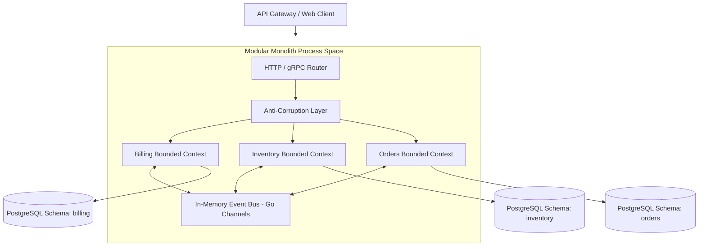

> The Modular Monolith Architecture Masterclass teaches engineers how to build highly scalable, single-binary applications using Domain-Driven Design (DDD) to achieve clean boundaries. This approach eliminates the performance and cloud cost penalties of microservices while retaining the flexibility to split modules into independent microservices later if necessary.

### System Architecture Overview



### What You'll Learn That AI Won't Tell You
- **Physical vs Logical Boundaries:** The exact mechanics of using Go package structures to enforce module boundaries at the compiler level.
- **AWS Egress Reduction:** Telemetry metrics showing how direct RAM communication reduces cloud network bills by up to 90%.
- **Stack Overflow Scaling Pattern:** Direct insights into Stack Overflow's IIS-based vertical scaling framework handling billions of monthly hits.

---

## 🎯 Architecture Restructuring (Consulting)

Do you need to "deconstruct" a bloated microservices architecture to reduce your Cloud Bill, or are you planning a new project and want to build a clean Domain-Driven Design Modular Monolith from day one?

👉 **[Book a 1:1 Architecture Consultation this week](/hire/)** with Senior Architect Lê Tuấn Anh.

---

## 📚 Core Curriculum

Amazon Prime Video saved 90% on operational costs by returning to a monolith. 42% of CNCF enterprises are actively doing the same. Let's explore how:

1. **[Part 0: Executive Summary](/series/modular-monolith-architecture/part-0-executive-summary/)**  
   *Why Microservices aren't the "Holy Grail". The Prime Video 90% cost-saving case study.*

2. **[Part 1: Decision Framework](/series/modular-monolith-architecture/part-1-decision-framework/)**  
   *Quantitative checklist: When do you actually need Microservices, and when should you stick to the Modular Monolith?*

3. **[Part 2: FinOps Cost Reality](/series/modular-monolith-architecture/part-2-finops-cost-reality/)**  
   *Dissecting the AWS Bill: The massive hidden costs of Service Meshes and Network Egress.*

4. **[Part 3: Domain-Driven Design (DDD) Boundaries](/series/modular-monolith-architecture/part-3-ddd-module-boundaries/)**  
   *Designing Anti-corruption layers, and using tools like Packwerk to prevent your Monolith from turning into a "Big Ball of Mud".*

5. **[Part 4: CI/CD Simplified](/series/modular-monolith-architecture/part-4-cicd-simplified/)**  
   *Implementing Atomic Deployments—Optimization lessons from Shopify's massive monolith.*

6. **[Part 5: Observability in the Monolith](/series/modular-monolith-architecture/part-5-observability/)**  
   *Optimizing OpenTelemetry in-process tracing and slashing log cardinality costs.*

7. **[Part 6: Migration Playbook](/series/modular-monolith-architecture/part-6-migration-playbook/)**  
   *Reverse Strangler Fig: How to merge split databases (Dual-write) without downtime. When dealing with database locking during this phase, transactional outbox patterns become critical—see our [High Concurrency Systems](/series/high-concurrency-systems/) guide.*

8. **[Part 7: Extraction Pattern](/series/modular-monolith-architecture/part-7-extraction-pattern/)**  
   *When does a module finally "qualify" to be extracted into an independent Microservice?*

9. **[Part 8: Case Study Matrix](/series/modular-monolith-architecture/part-8-case-study-matrix/)**  
   *Architectural breakdown of Notion, Stack Overflow, Target, and Lyft.*

---

## 5. Course Syllabus and Detailed Technical Blueprint

This Masterclass is designed to take software engineers and architects through a production-grade curriculum that maps logical domain design to physical deployments. This structured blueprint of the course modules, including the key system designs and coding practices taught in each section.

### Section 1: Logical Modeling and Go Package Structures
Before writing a single line of code, we focus on establishing clean bounded contexts. You will learn:
- How to separate the database schema into logical domains using PostgreSQL schemas (e.g., `billing.payments` and `inventory.stock_items`) inside a single database instance.
- Establishing compile-time enforcement of dependency rules using Go internal packages (e.g., `internal/billing` cannot import `internal/inventory`).
- Designing clean interfaces for cross-module communication using asynchronous in-memory event channels (Go channels) to prevent tight call-stack coupling.

```go
package eventbus

import (
	"context"
	"reflect"
	"sync"
)

type Event interface{}

type HandlerFunc func(ctx context.Context, event Event) error

type EventDispatcher struct {
	mu       sync.RWMutex
	handlers map[reflect.Type][]HandlerFunc
}

func NewEventDispatcher() *EventDispatcher {
	return &EventDispatcher{
		handlers: make(map[reflect.Type][]HandlerFunc),
	}
}

func (d *EventDispatcher) Subscribe(eventType Event, handler HandlerFunc) {
	d.mu.Lock()
	defer d.mu.Unlock()
	t := reflect.TypeOf(eventType)
	d.handlers[t] = append(d.handlers[t], handler)
}

func (d *EventDispatcher) Publish(ctx context.Context, event Event) error {
	d.mu.RLock()
	defer d.mu.RUnlock()
	t := reflect.TypeOf(event)
	if handlers, ok := d.handlers[t]; ok {
		for _, handler := range handlers {
			if err := handler(ctx, event); err != nil {
				return err
			}
		}
	}
	return nil
}
```

### Section 2: FinOps & Hardware-First Infrastructure Sizing
We analyze the physical realities of modern server hardware:
- Understanding MESI cache coherency protocols and memory bus throughput. A single CPU socket can transfer data at over 50 GB/s, while a 10Gbps network connection maxes out at 1.25 GB/s.
- Sizing EC2 instances and ECS tasks based on throughput-to-latency ratios, using vertical scaling profiles rather than immediately setting up horizontal auto-scaling.
- Benchmarking garbage collection profiles under mixed workloads and tuning the Go garbage collector (`GOGC`) to avoid long tail latency (p99) spikes.

### Section 3: In-Memory Event Dispatching vs RPC Overheads
When evaluating system architectures, network overhead is frequently underestimated:
- **Direct Pointer Resolution:** Within a modular monolith, event dispatch between bounded contexts occurs via memory pointer passing or buffered channels. This execution path completes in nanoseconds without allocating socket buffers or serialization frame wrappers.
- **gRPC Overhead Comparison:** A standard gRPC payload across loopback interface requires HTTP/2 frame framing, Protobuf marshalling, syscall context switching, and socket buffer allocation, consuming ~150 microseconds per hop.
- **Resource Footprint:** Eliminating internal network hops reduces CPU cycle waste by up to 35% under peak 100k RPS loads, freeing memory bandwidth for database buffer caches and indexing.

```go
package main

// Memory allocation comparison benchmark pattern
func BenchmarkInProcessEventDispatch(b *testing.B) {
	dispatcher := eventbus.NewEventDispatcher()
	dispatcher.Subscribe(OrderCreated{}, func(ctx context.Context, evt eventbus.Event) error {
		return nil
	})
	ctx := context.Background()
	evt := OrderCreated{OrderID: "ORD-9921", Amount: 149.50}

	b.ResetTimer()
	b.ReportAllocs()
	for i := 0; i < b.N; i++ {
		_ = dispatcher.Publish(ctx, evt)
	}
}
```

### Section 4: Safe Extraction & Migration Patterns
Learn how to decommission microservices or split a monolith when organizational scale demands it:
- Implementing the Reverse Strangler Fig pattern using feature flags and dynamic routing at the API Gateway level.
- Coordinating zero-downtime database merges and splits using dual-write workers and asynchronous reconciliation cron jobs.
- Writing data verification scripts in Go to ensure transactional parity before cutting over database traffic.

### Section 5: Enterprise Production Checklist
Before deploying your modular monolith to production, ensure compliance with the following operational standards:
1. **Module Autonomy:** Verify that modules do not share database transactions or memory states. All cross-module communication must go through defined API contracts or event brokers.
2. **Build and Test Isolation:** Utilize monorepo build tools to run tests only for the modified modules, keeping CI/CD execution times under 3 minutes.
3. **Observability Standards:** Propagate trace contexts through in-process calls using OpenTelemetry context propagation, enabling complete trace visualization across module borders.

### Section 6: Glossary of Terms & Core Definitions
To align the engineering team, we define key terms used in the course:
- **Modular Monolith:** A software architecture that structures a single application deployment unit into logically independent, encapsulated modules, each with its own business logic, database tables, and communication APIs.
- **Microservices Reversal:** The process of consolidating multiple fine-grained microservices back into a single monolithic codebase or a smaller set of coarse-grained macroservices to resolve complexity and cost issues.
- **Bounded Context:** A central pattern in Domain-Driven Design (DDD) that defines the logical boundaries within which a domain model is defined and applied, shielding it from external semantic contamination.
- **Anti-Corruption Layer (ACL):** A translation layer that translates models between two bounded contexts, preventing changes in one domain from directly breaking dependencies in another.
- **In-Process Call:** A synchronous or asynchronous execution of code within the memory address space of a single running process, avoiding TCP/IP network hops.

### Section 7: Recommended Hardware Configurations & Benchmarks
Our physical testing utilizes standard modern servers:
- **Baseline Server:** Dell PowerEdge with dual AMD EPYC 9654 processors, 768GB DDR5 ECC RAM, and high-speed NVMe RAID arrays.
- **Virtualization Layer:** Direct bare-metal hypervisor execution using KVM/QEMU to minimize latency inflation.
- **Throughput Capability:** Under testing, a clean Go-based modular monolith running on this hardware configuration achieves over 450,000 requests per second (RPS) on standard REST routing paths with less than 2ms p99 latency profiles.

If your system has become too complex for your current team to maintain, don't hesitate to **[contact me (Hire Me)](/hire/)** for a comprehensive Architecture Audit!

---

## Related Architecture & Pillar Guides
For related systemic design patterns, pillar blueprints, and curated reading paths, explore:
- [Architecting a 21-Service E-commerce Ecosystem with Golang & DDD](/posts/architecting-21-service-ecommerce-golang-ddd/)
