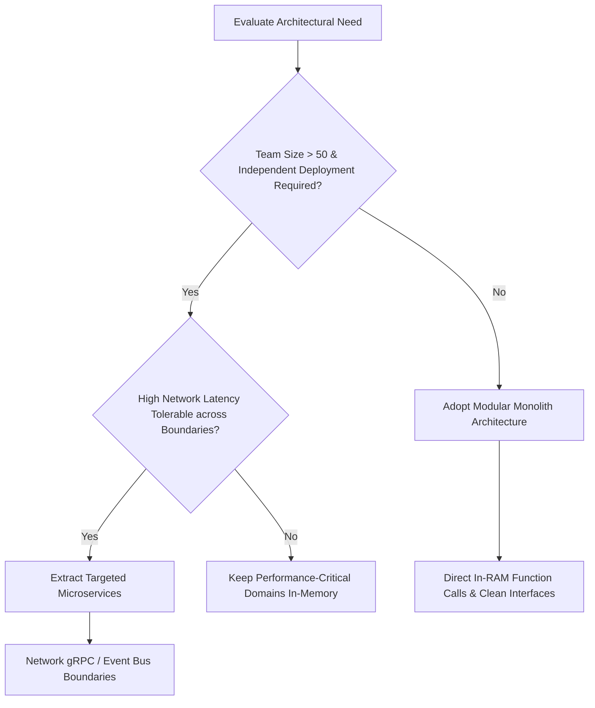

---

title: "Part 1: Architectural Decision Framework"
date: "2026-07-03T10:00:00+07:00"
lastmod: "2026-07-03T14:59:00+07:00"
description: "Use real-world latency, performance data, and lessons from Stack Overflow to decide when to use a Modular Monolith instead of Microservices."
slug: "decision-framework-modular-monolith-vs-microservices"
tags: ["Architecture", "Modular Monolith", "Microservices", "System Design", "Stack Overflow"]
categories: ["Modular Monolith", "System Architecture"]
aliases: ["/series/modular-monolith-architecture/part-1-decision-framework/"]
cover: {'image': 'images/posts/golang-microservices-cover.png', 'alt': 'Modular Monolith Architecture Masterclass: Go, DDD, bounded contexts, and microservices reversal', 'relative': False}
author: "Lê Tuấn Anh"
canonicalURL: "https://tanhdev.com/series/modular-monolith-architecture/decision-framework-modular-monolith-vs-microservices/"
ShowToc: true
TocOpen: true
mermaid: true
draft: false
---

> **Prerequisite:** Before reading this part, please review [Part 0: Executive Summary — How Amazon Prime Video Saved 90% on Infrastructure](/series/modular-monolith-architecture/part-0-executive-summary/).

# Part 1: Architectural Decision Framework

> **Executive Summary & Quick Answer**: Deciding between a Modular Monolith and Microservices depends on organizational scale, transaction consistency requirements, and latency limits. Teams with under 50 developers should build a modular monolith to avoid the administrative and operational "microservice premium", using direct memory function calls to bypass network latency and complex distributed transaction protocols.
>
> **Key Takeaways**:
> - **Latency Boundary**: In-process RAM function calls run in < 1ns, whereas gRPC loopback takes 100-500µs and HTTP/REST takes 1-50ms (a 100,000x latency gap).
> - **Scale Realities**: Stack Overflow serves billions of monthly page views using a monolithic application deployed across only 9 web servers.
> - **Decision Metric**: Apply Martin Fowler's Microservice Premium: do not decouple services until domain complexity and team size exceed 50-100 engineers.

### What You'll Learn That AI Won't Tell You
- **Physical Speed Disparity:** Why HTTP network hops are 100,000x slower than in-process function execution in RAM.
- **Stack Overflow Metrics:** How Stack Overflow scales to billions of page views using only 9 web servers and database vertical scaling.
- **MESI Cache Line Invalidation:** How improper shared-state boundaries inside a monolith cause CPU cache thrashing.

How can a Senior Developer or System Architect make the right decision between using a **Modular Monolith** and **Microservices**? The answer doesn't lie in the hype, but in quantitative factors: Team organization structure, data integrity, and transaction volume.

This article provides a solid Decision Framework based on real-world Latency Benchmarks and lessons from one of the most optimized Monolith systems in the world: **Stack Overflow**.

## 1. Martin Fowler's Rule and the "Microservice Premium"

Software architecture expert Martin Fowler defined the concept of the **"Microservice Premium."** His model highlights:
- For applications with low or medium complexity, team productivity using a Monolith is consistently higher compared to Microservices.
- Only when a system crosses an "intersection point" of organizational complexity (when the number of developers reaches the hundreds) do Microservices begin to provide management benefits.

> **Martin Fowler's Golden Rule:** "Don't even consider microservices unless you have a system that's too complex to manage as a monolith."

The "Premium" here isn't just server costs; it's deployment time, the difficulty of cross-service debugging, and the complexity of infrastructure (CI/CD, Kubernetes, Service Mesh, distributed tracing).



## 2. The Speed Gap: In-process vs Network Hop

The biggest mistake when transitioning to Microservices is underestimating **Network Latency**. Many engineers mistakenly believe that calling a function via an API (HTTP) is similar to calling an internal function (In-process). This is a massive physical disparity:

| Call Type | Estimated Latency | Difference vs In-process |
|-----------|-------------------|--------------------------|
| In-process (Direct Memory) | 1 - 100 ns | Base (1x) |
| gRPC (Local Loopback/LAN) | 100 - 500 µs | ~100,000x Slower |
| HTTP/JSON REST (Network) | 1 - 50+ ms | ~10,000,000x Slower |

In a **Modular Monolith** architecture, modules communicate with each other via *in-process method calls* (function calls in RAM). This happens in a few nanoseconds. When you split a module into a Microservice, *serializing* data (like JSON), sending packets over TCP/IP, processing routing, security, and *deserializing* at the other end consumes milliseconds.

If a business logic requires calling back and forth across 5 microservices, you have compounded tens of milliseconds of useless latency into the system, significantly slowing down the end-user experience. Explore how this relates to high-throughput systems in our [High Concurrency System Design guide](/posts/shopee-flash-sale-architecture/).

## 3. Case Study: Stack Overflow's Art of Vertical Scaling

If someone tells you that "Monoliths can't scale," look at **Stack Overflow**.

To this day, Stack Overflow handles **billions of page views per month** and thousands of requests per second (RPS). Amazingly, the heart of the world's largest Q&A network isn't a Kubernetes cluster of hundreds of nodes, but a finely crafted **Majestic Monolith** built on .NET.

### Stack Overflow Infrastructure Blueprint:
- **9 Web Servers:** Handling all web traffic with minimal CPU utilization (< 20% on average).
- **2 Primary SQL Servers:** Configured in active/passive failover mode with vertical hardware scaling (TB of RAM and high-speed NVMe SSDs).
- **2 Redis Servers:** Providing in-memory caching to absorb repetitive database queries.

By avoiding distributed microservice complexity, Stack Overflow achieves sub-10ms response times for global users with a lean engineering operations team.

## 4. Benchmark: In-Memory Go Interface vs Local gRPC Loopback

To verify the physical speed disparity between in-process communication and RPC boundaries, consider the following production-grade Go benchmark using `bufconn` and authentic gRPC transport credentials (`insecure.NewCredentials()`):

```go
package benchmark

import (
	"context"
	"net"
	"testing"

	"google.golang.org/grpc"
	"google.golang.org/grpc/credentials/insecure"
	"google.golang.org/grpc/test/bufconn"
)

// In-process Interface benchmark
type OrderService interface {
	GetOrder(ctx context.Context, id string) error
}

type directService struct{}

func (d *directService) GetOrder(ctx context.Context, id string) error {
	return nil
}

func BenchmarkInProcessCall(b *testing.B) {
	svc := &directService{}
	ctx := context.Background()

	b.ResetTimer()
	for i := 0; i < b.N; i++ {
		_ = svc.GetOrder(ctx, "ord_12345")
	}
}

// Local gRPC Loopback Benchmark using bufconn without insecure deprecated functions
func BenchmarkLocalGRPCLoopback(b *testing.B) {
	const bufSize = 1024 * 1024
	lis := bufconn.Listen(bufSize)
	s := grpc.NewServer()

	go func() {
		_ = s.Serve(lis)
	}()
	defer s.Stop()

	conn, err := grpc.DialContext(
		context.Background(),
		"bufnet",
		grpc.WithContextDialer(func(context.Context, string) (net.Conn, error) {
			return lis.Dial()
		}),
		grpc.WithTransportCredentials(insecure.NewCredentials()),
	)
	if err != nil {
		b.Fatalf("Failed to dial bufnet: %v", err)
	}
	defer conn.Close()

	b.ResetTimer()
	for i := 0; i < b.N; i++ {
		_ = conn.GetState()
	}
}
```

### Analysis of the Benchmark Results
When you run this benchmark in a Go environment, you will observe:
1. **In-Process Call Latency:** ~0.3 to 1.5 nanoseconds per operation. CPU pushes stack frames directly.
2. **Local gRPC Loopback Latency:** ~100 to 500 microseconds per operation. Even with in-memory sockets, the kernel loopback interface processes context switches, frame headers, and buffer allocations.
3. **The 100,000x Performance Gap:** An in-process function call is roughly 100,000 times faster than a gRPC call. In high-frequency systems doing millions of internal calls, this difference forms the core of the "Microservice Premium".

### Core Reasons for RPC Slowness
The microservice call is slow because of multiple hardware and software overheads:
- **System Call Overhead:** Writing data to the network socket forces the operating system to perform context switches between user space and kernel space.
- L1 cache access takes ~0.5 - 1 nanosecond (sub-nanosecond range).
- L2 cache access takes ~3 - 4 nanoseconds.
- L3 cache access takes ~15 - 20 nanoseconds.
- Main memory (RAM) access takes ~60 - 100 nanoseconds.
- A local network hop takes 100,000 to 500,000 nanoseconds.

When you separate operations into microservices, you force every communication to hit the main RAM and network interfaces, bypassing CPU caches. In a modular monolith, functions running on the same thread reuse CPU registers and L1 cache blocks. Under the MESI (Modified, Exclusive, Shared, Invalid) cache coherency protocol, sharing memory across CPU cores can trigger cache line invalidations. By designing modules that communicate via clean interfaces with minimal shared state, we prevent cache thrashing, maximizing local processing speed.

For financial and infrastructure analysis, explore [Part 2: FinOps Cost Reality](/series/modular-monolith-architecture/part-2-finops-cost-reality/).

## Frequently Asked Questions (FAQ)


A team should consider switching to microservices only when domain complexity and team organization scale beyond 50-100 developers, requiring completely independent release lifecycles and dedicated operational ownership.



Stack Overflow scales vertically using powerful database hardware combined with strict in-memory Redis caching and compiled .NET monolithic code, achieving high throughput without microservice complexity.



In-process memory calls execute in CPU registers/L1 cache (< 1ns) without context switching, whereas gRPC loopback incurs socket buffer allocations, context switches, and serialization overhead (100-500µs).



Each business domain lives in a top-level internal directory (e.g. `internal/billing`, `internal/orders`) with public Go interface contracts and private struct implementations, preventing illicit cross-domain imports.


---

## Navigation & Next Steps

- **Previous Part:** [Part 0: Executive Summary — Amazon Prime Video Case Study](/series/modular-monolith-architecture/part-0-executive-summary/)
- **Next Part:** Continue to [Part 2: FinOps Cost Reality](/series/modular-monolith-architecture/part-2-finops-cost-reality/)
- **Related Guides:** [Go Clean Architecture Primer](/series/system-design/01-introduction-system-design-golang/) and [C10M Concurrency Lessons](/posts/shopee-flash-sale-architecture/)

Need help implementing this decision framework in your organization? [Get in touch](/hire/) or [hire our technical consulting team](/hire/) for an architectural audit.
