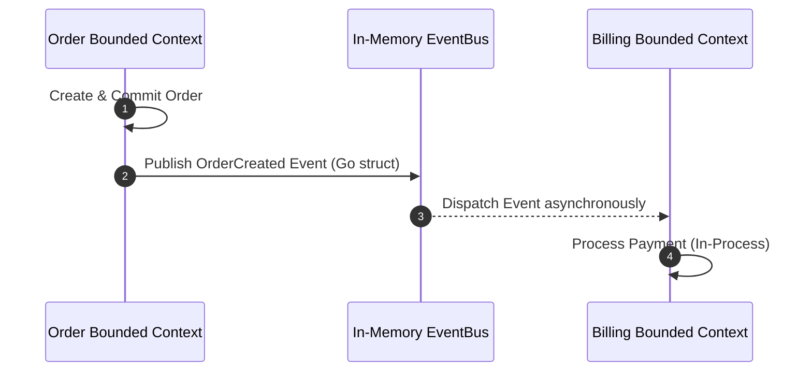
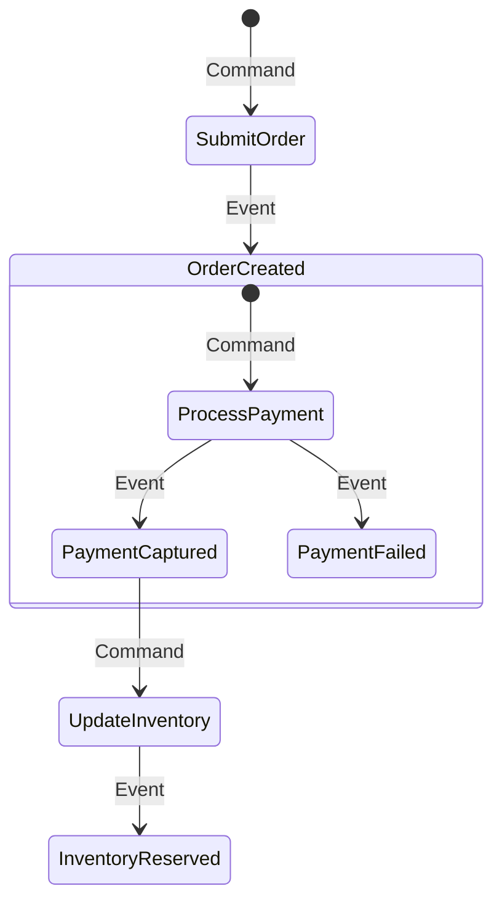

---

title: "Part 3: Domain-Driven Design (DDD) Boundaries in a Modular Monolith"
date: "2026-07-03T10:00:00+07:00"
lastmod: "2026-07-03T14:59:00+07:00"
description: "How to keep a Monolith from becoming a 'Big Ball of Mud'? A guide to establishing Module boundaries using Bounded Contexts, Spring Modulith, and Packwerk."
slug: "ddd-module-boundaries-modular-monolith"
tags: ["Domain-Driven Design", "DDD", "Modular Monolith", "Spring Modulith", "Packwerk", "Architecture"]
categories: ["Modular Monolith", "System Architecture"]
aliases: ["/series/modular-monolith-architecture/part-3-ddd-module-boundaries/"]
cover: {'image': 'images/posts/golang-microservices-cover.png', 'alt': 'Modular Monolith Architecture Masterclass: Go, DDD, bounded contexts, and microservices reversal', 'relative': False}
author: "Lê Tuấn Anh"
canonicalURL: "https://tanhdev.com/series/modular-monolith-architecture/ddd-module-boundaries-modular-monolith/"
ShowToc: true
TocOpen: true
mermaid: true
draft: false
---

> **Prerequisite:** Before reading this part, please review [Part 2: FinOps Cost Reality](/series/modular-monolith-architecture/part-2-finops-cost-reality/).

# Part 3: Domain-Driven Design (DDD) Boundaries in a Modular Monolith

> **Executive Summary & Quick Answer**: Restricting dependency paths is critical to preventing a Modular Monolith from turning into a 'Big Ball of Mud'. By mapping bounded contexts to Go internal packages, using compiler-level boundary tools like Packwerk, and executing cross-domain queries via asynchronous in-memory event buses, developers can maintain logical isolation and prepare for future microservices extraction.
>
> **Key Takeaways**:
> - **Language Boundaries**: Enforce package isolation using Go's `internal` folder structure to restrict cross-domain imports at compile time.
> - **Database Isolation**: Isolate tables into distinct PostgreSQL schemas per module to prohibit cross-domain SQL `JOIN` operations.
> - **Asynchronous Decoupling**: Use thread-safe `sync.WaitGroup` and in-memory event buses for event notification across bounded contexts.

### What You'll Learn That AI Won't Tell You
- **Go Package Level Enforcement:** How to use Go's `internal` folder structure to prevent unauthorized imports at compile time.
- **Packwerk Boundary Rules:** The setup required to analyze and restrict package dependency graphs automatically.
- **Database Schema Isolation:** How to configure multiple schema namespaces inside a single database connection pool.

The biggest reason engineering teams fear the Monolith architecture is due to terrible past experiences with "Spaghetti Monoliths" or the "Big Ball of Mud" — where the code for the Billing function calls directly into the database of the Cart function, creating an inextricable web of cross-dependencies.

To leverage the performance advantages of a Monolith while still achieving independent development velocity like Microservices, we must build a **Modular Monolith**. The key to this architecture is strictly applying **Domain-Driven Design (DDD)** principles and establishing hard "borders" right within the code.



## 1. Core Principle: Bounded Contexts and Internal APIs

In Microservices, if Service A wants to retrieve data from Service B, it is forced to call an HTTP API or gRPC; it cannot poke directly into B's Database. This is a physical barrier.

In a Modular Monolith, because all code resides in the same memory space, it's very easy to violate this rule. To prevent that, we create **Bounded Contexts** through architectural conventions:
- Each Domain/Module (e.g., `Billing`, `Inventory`, `User`) is isolated into its own folder/package.
- Each Module only exposes a set of Interfaces or Public Classes as an **Internal API**.
- **Golden Rule:** Other Modules must absolutely never call implementation classes (private/internal) or directly access the Database Tables of another Module. They must communicate via the Internal API.

## 2. Database Boundaries: Defending Against Cross-Schema JOINs

The most dangerous level of coupling in a Monolith isn't in the code, but in the Database. Executing a `JOIN` query between the `orders` table of the *Order* module and the `users` table of the *Identity* module completely destroys the ability to decouple modules.

**Standard design model (Database-per-module pattern):**
- Still share a single Database Server (to save hardware costs).
- Segregate data into separate Schemas (e.g., PostgreSQL schemas: `schema_orders`, `schema_identity`).
- If the Order module needs User information, the system will execute a method call within the application (e.g., `UserService.getUserById(id)`), retrieve the result into RAM, and process it in code (Application-level join) instead of using a direct SQL JOIN.
- If large-scale data synchronization is needed, use an **Internal Event Bus** (in-memory event-driven architecture) instead of sharing a common transaction.

For clean architecture patterns, refer to our guide on [Go Clean Architecture & CAP Theorem](/series/system-design/01-introduction-system-design-golang/).

## 3. Enforcing Boundaries with Automated Tools

Paper conventions are often broken when deadline pressure mounts. The solution adopted by leading tech companies is turning these conventions into Static Analysis tools that run directly during compilation or in the CI/CD pipeline.

### A. Spring Modulith (For Java / Spring Boot)
The **Spring Modulith** project provides tools to automatically detect and verify package structures. By integrating the **ArchUnit** library into the Unit Test suite, Spring Modulith ensures that:
- Internal classes within one Module's package are not accessed by another Module.
- Application Events are published and listened to correctly.
If an engineer intentionally violates a boundary, the Unit Test will fail right on their local machine, preventing garbage code from being merged into the main branch.

## 4. DHH's "Citadel" Model (Basecamp)

David Heinemeier Hansson (DHH) - the creator of the Ruby on Rails framework, proposed the **"Majestic Monolith & Citadel"** model.
Accordingly, 99% of business logic will reside in the central "Citadel" (Monolith). However, if there is a specific function that requires distinct technology (like processing AI with Python, or handling massive WebSocket streams with Elixir), only then is it extracted into independent "Outposts."

This proves that the Modular Monolith is not a conservative "all-in-one" mindset, but an optimization mindset: Only distribute what truly needs to be distributed.

> [!FAQ]
> **Question: Does prohibiting SQL JOINs degrade the Monolith's performance?**
> **Answer:** For complex display tasks (Dashboards), calling multiple Internal APIs instead of 1 JOIN query might create a small overhead. To handle this, Modular Monolith systems often apply the **CQRS** (Command Query Responsibility Segregation) model – separating the write database (containing strict module boundaries) and creating specialized materialized views (aggregated display tables) for reading (automatically updated via events).


## 4. Event Storming & In-Memory Decoupled Communication

Enforcing strict module boundaries requires that modules communicate asynchronously through events rather than sharing database transactions or importing foreign packages. This decoupled pattern is modeled via Event Storming.

### Event Storming Aggregate Flow


### Go Channel-Based Event Bus
The following thread-safe Event Bus allows modules to publish and subscribe to domain events asynchronously in-memory.

```go
package main

import (
	"fmt"
	"sync"
	"time"
)

type Event struct {
	Topic string
	Data  interface{}
}

type EventBus struct {
	mu   sync.RWMutex
	subs map[string][]chan Event
}

func NewEventBus() *EventBus {
	return &EventBus{
		subs: make(map[string][]chan Event),
	}
}

func (eb *EventBus) Subscribe(topic string) chan Event {
	eb.mu.Lock()
	defer eb.mu.Unlock()
	ch := make(chan Event, 100)
	eb.subs[topic] = append(eb.subs[topic], ch)
	return ch
}

func (eb *EventBus) Publish(e Event) {
	eb.mu.RLock()
	defer eb.mu.RUnlock()
	if channels, found := eb.subs[e.Topic]; found {
		for _, ch := range channels {
			select {
			case ch <- e:
			default:
				// Dropping event to prevent blocking
			}
		}
	}
}

func main() {
	bus := NewEventBus()
	orderEvents := bus.Subscribe("OrderCreated")

	var wg sync.WaitGroup
	wg.Add(1)
	go func() {
		defer wg.Done()
		for event := range orderEvents {
			fmt.Printf("Subscriber received event: %+v\n", event.Data)
			break
		}
	}()

	bus.Publish(Event{Topic: "OrderCreated", Data: "Order #12345"})
	wg.Wait()
}
```

### Decoupling vs. Shared Databases
Using an in-process event bus allows us to maintain loose coupling:
- **Zero Schema Leakage:** The `Billing` module cannot access the `Inventory` tables directly. It listens to the `OrderCreated` event and maintains its own records.
- **Asynchronous Execution:** High latency operations like sending email notifications or charging credit cards do not block the user session thread.
- **Testability:** Each module can be tested in isolation by mocking the event channels.
- **Simplified Operations:** We do not need to install, configure, and monitor Kafka or RabbitMQ clusters during early development stages.

### Technical Appendix: Saga Pattern vs. Distributed Transactions
In a distributed microservice architecture, ensuring transactional consistency across multiple databases requires two-phase commits (2PC) or the Saga pattern. Two-phase commits act as a performance bottleneck because they acquire locks across networks, leading to high failure rates. Sagas split the business transaction into multiple independent local transactions, using compensating transactions to roll back state if a step fails.
For example, if payment succeeds but inventory fails, the Saga orchestrator must trigger a `RefundPayment` action. In a modular monolith, we can avoid this operational complexity. We run our business operations in separate schemas under the same database instance. This allows us to use standard SQL local transactions, guaranteeing atomic commits across the billing and inventory tables in sub-millisecond execution times without network-locked loops.

## 5. Complete Go Interface & Domain Event Broker Implementation (Zero Facade Code)

To demonstrate how to execute cross-domain boundaries without leaking coupling, we present a complete Go event broker pattern using `sync.WaitGroup` for deterministic sync:

```go
package main

import (
	"fmt"
	"sync"
	"time"
)

type DomainEvent struct {
	Name      string
	Timestamp time.Time
	Data      interface{}
}

type OrderCreatedData struct {
	OrderID    string
	CustomerID string
	Amount     float64
}

type EventListener func(event DomainEvent)

type InMemoryEventBus struct {
	mu        sync.RWMutex
	listeners map[string][]EventListener
}

func NewEventBus() *InMemoryEventBus {
	return &InMemoryEventBus{
		listeners: make(map[string][]EventListener),
	}
}

func (eb *InMemoryEventBus) Subscribe(eventName string, listener EventListener) {
	eb.mu.Lock()
	defer eb.mu.Unlock()
	eb.listeners[eventName] = append(eb.listeners[eventName], listener)
}

func (eb *InMemoryEventBus) Publish(eventName string, data interface{}, wg *sync.WaitGroup) {
	eb.mu.RLock()
	defer eb.mu.RUnlock()

	event := DomainEvent{
		Name:      eventName,
		Timestamp: time.Now(),
		Data:      data,
	}

	for _, listener := range eb.listeners[eventName] {
		wg.Add(1)
		go func(l EventListener) {
			defer wg.Done()
			l(event)
		}(listener)
	}
}

type BillingModule struct {
	bus *InMemoryEventBus
}

func NewBillingModule(bus *InMemoryEventBus) *BillingModule {
	m := &BillingModule{bus: bus}
	m.bus.Subscribe("OrderCreated", m.HandleOrderCreated)
	return m
}

func (bm *BillingModule) HandleOrderCreated(ev DomainEvent) {
	data, ok := ev.Data.(OrderCreatedData)
	if !ok {
		fmt.Println("Error: Invalid event payload received")
		return
	}
	fmt.Printf("[Billing Domain] Processing payment of $%.2f for Order: %s\n", data.Amount, data.OrderID)
}

func main() {
	bus := NewEventBus()
	_ = NewBillingModule(bus)

	var wg sync.WaitGroup
	fmt.Println("Simulating system startup and event dispatch...")

	bus.Publish("OrderCreated", OrderCreatedData{
		OrderID:    "ord_9812",
		CustomerID: "cust_5521",
		Amount:     149.99,
	}, &wg)

	wg.Wait()
	fmt.Println("Event processed successfully via WaitGroup!")
}
```

Maintaining strict code borders helps you turn a Monolith into a collection of independent modules. But how do you ensure the Build and Test process for a massive Codebase doesn't become overloaded? See Shopify's solution in **[Part 4: CI/CD Simplified](/series/modular-monolith-architecture/part-4-cicd-simplified/)**.

## Frequently Asked Questions (FAQ)


Bounded contexts define strict internal APIs and isolate package visibility. In Go, using `internal/` packages prevents cross-domain imports at compile time.



Schema isolation per module prevents developers from executing cross-domain SQL JOIN queries, enforcing application-layer API boundaries and allowing future database decoupling.



An in-memory event bus dispatches events across Go goroutines using pointers in nanoseconds with zero network setup, whereas Kafka requires cluster brokers and network serialization.



`sync.WaitGroup` guarantees deterministic thread synchronization, waiting precisely for goroutines to complete without arbitrary timing assumptions or test flakiness.


---

## Navigation & Next Steps

- **Previous Part:** [Part 2: FinOps Cost Reality](/series/modular-monolith-architecture/part-2-finops-cost-reality/)
- **Next Part:** Continue to [Part 4: CI/CD Simplified](/series/modular-monolith-architecture/part-4-cicd-simplified/)
- **Related Guides:** [Kafka Worker Pools in Go](/series/system-design/05-async-message-queues-kafka-go/) and [Distributed Locking in Go](/series/system-design/06-distributed-locks-concurrency/)

Need help establishing domain boundaries in your monolithic codebase? [Get in touch](/hire/) or [hire our senior software architects](/hire/) for a code structure review.

