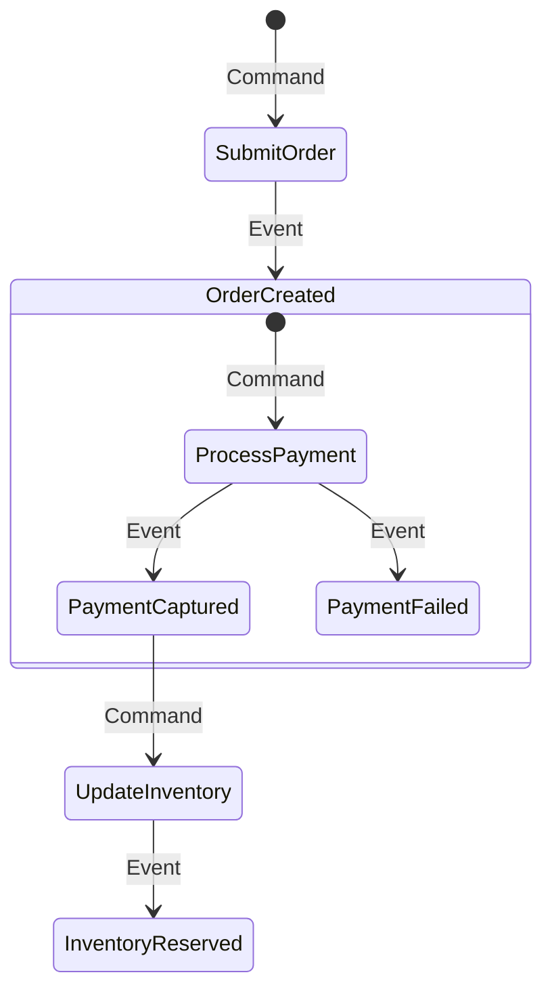

---title: "Part 3: Domain-Driven Design (DDD) Boundaries in a Modular Monolith"
lastmod: "2026-07-03T14:59:00+07:00"
description: "How to keep a Monolith from becoming a 'Big Ball of Mud'? A guide to establishing Module boundaries using Bounded Contexts, Spring Modulith, and Packwerk."
slug: "ddd-module-boundaries-modular-monolith"
tags: ["Domain-Driven Design", "DDD", "Modular Monolith", "Spring Modulith", "Packwerk", "Architecture"]
aliases:
  - "/series/modular-monolith-architecture/part-3-ddd-module-boundaries/"
  - "/series/modular-monolith-architecture/finops-cost-reality-microservices-tax/part-3-ddd-module-boundaries.md"
cover:
  image: "images/posts/golang-microservices-cover.png"
  alt: "Modular Monolith Architecture Masterclass: Go, DDD, bounded contexts, and microservices reversal"
  relative: false
author: "Lê Tuấn Anh"
canonicalURL: "https://tanhdev.com/series/modular-monolith-architecture/ddd-module-boundaries-modular-monolith/"
ShowToc: true
TocOpen: true
---

# Part 3: Domain-Driven Design (DDD) Boundaries in a Modular Monolith

The biggest reason engineering teams fear the Monolith architecture is due to terrible past experiences with "Spaghetti Monoliths" or the "Big Ball of Mud" — where the code for the Billing function calls directly into the database of the Cart function, creating an inextricable web of cross-dependencies.

To leverage the performance advantages of a Monolith while still achieving independent development velocity like Microservices, we must build a **Modular Monolith**. The key to this architecture is strictly applying **Domain-Driven Design (DDD)** principles and establishing hard "borders" right within the code.

## 1. Core Principle: Bounded Contexts and Internal APIs

In Microservices, if Service A wants to retrieve data from Service B, it is forced to call an HTTP API or gRPC; it cannot poke directly into B's Database. This is a physical barrier.

In a Modular Monolith, because all code resides in the same memory space, it's very easy to violate this rule. To prevent that, we create **Bounded Contexts** through architectural conventions:
- Each Domain/Module (e.g., `Billing`, `Inventory`, `User`) is isolated into its own folder/package.
- Each Module only exposes a set of Interfaces or Public Classes as an **Internal API**.
- **Golden Rule:** Other Modules must absolutely never call implementation classes (private/internal) or directly access the Database Tables of another Module. They must communicate via the Internal API.

## 2. Database Boundaries: Defending Against Cross-Schema JOINs

The most dangerous level of coupling in a Monolith isn't in the code, but in the Database. Executing a `JOIN` query between the `orders` table of the *Order* module and the `users` table of the *Identity* module completely destroys the ability to decouple modules.

**Standard design model (Database-per-module pattern):**
- Still share a single Database Server (to save hardware costs).
- Segregate data into separate Schemas (e.g., PostgreSQL schemas: `schema_orders`, `schema_identity`).
- If the Order module needs User information, the system will execute a method call within the application (e.g., `UserService.getUserById(id)`), retrieve the result into RAM, and process it in code (Application-level join) instead of using a direct SQL JOIN.
- If large-scale data synchronization is needed, use an **Internal Event Bus** (in-memory event-driven architecture) instead of sharing a common transaction.

## 3. Enforcing Boundaries with Automated Tools

Paper conventions are often broken when deadline pressure mounts. The solution adopted by leading tech companies is turning these conventions into Static Analysis tools that run directly during compilation or in the CI/CD pipeline.

### A. Spring Modulith (For Java / Spring Boot)
The **Spring Modulith** project provides tools to automatically detect and verify package structures. By integrating the **ArchUnit** library into the Unit Test suite, Spring Modulith ensures that:
- Internal classes within one Module's package are not accessed by another Module.
- Application Events are published and listened to correctly.
If an engineer intentionally violates a boundary, the Unit Test will fail right on their local machine, preventing garbage code from being merged into the main branch.

### B. Packwerk: Lessons from Shopify and Gusto (For Ruby on Rails)
Both **Shopify** and HR software company **Gusto** operate on massive Ruby on Rails Monolith architectures. To avoid chaos, they apply **Packwerk** (an open-source library developed by Shopify):
- The codebase is divided into **"Packs"** (virtual domains).
- Whenever the source code of Pack A calls into an internal class (private method) or directly queries the database of Pack B, Packwerk will print a Compile-time warning.
- Gusto shared that by applying Packwerk, they eliminated circular dependencies and **reduced Onboarding time by 50%** for new engineers, because the code structure became as clear as a microservices system.

## 4. DHH's "Citadel" Model (Basecamp)

David Heinemeier Hansson (DHH) - the creator of the Ruby on Rails framework, proposed the **"Majestic Monolith & Citadel"** model.
Accordingly, 99% of business logic will reside in the central "Citadel" (Monolith). However, if there is a specific function that requires distinct technology (like processing AI with Python, or handling massive WebSocket streams with Elixir), only then is it extracted into independent "Outposts."

This proves that the Modular Monolith is not a conservative "all-in-one" mindset, but an optimization mindset: Only distribute what truly needs to be distributed.

> [!FAQ]
> **Question: Does prohibiting SQL JOINs degrade the Monolith's performance?**
> **Answer:** For complex display tasks (Dashboards), calling multiple Internal APIs instead of 1 JOIN query might create a small overhead. To handle this, Modular Monolith systems often apply the **CQRS** (Command Query Responsibility Segregation) model – separating the write database (containing strict module boundaries) and creating specialized materialized views (aggregated display tables) for reading (automatically updated via events).


## 4. Event Storming & In-Memory Decoupled Communication

Enforcing strict module boundaries requires that modules communicate asynchronously through events rather than sharing database transactions or importing foreign packages. This decoupled pattern is modeled via Event Storming.

### Event Storming Aggregate Flow


### Go Channel-Based Event Bus
The following thread-safe Event Bus allows modules to publish and subscribe to domain events asynchronously in-memory.

```go
package main

import (
	"fmt"
	"sync"
	"time"
)

type Event struct {
	Topic string
	Data  interface{}
}

type EventBus struct {
	mu   sync.RWMutex
	subs map[string][]chan Event
}

func NewEventBus() *EventBus {
	return &EventBus{
		subs: make(map[string][]chan Event),
	}
}

func (eb *EventBus) Subscribe(topic string) chan Event {
	eb.mu.Lock()
	defer eb.mu.Unlock()
	ch := make(chan Event, 100)
	eb.subs[topic] = append(eb.subs[topic], ch)
	return ch
}

func (eb *EventBus) Publish(e Event) {
	eb.mu.RLock()
	defer eb.mu.RUnlock()
	if channels, found := eb.subs[e.Topic]; found {
		for _, ch := range channels {
			select {
			case ch <- e:
			default:
				// Dropping event to prevent blocking
			}
		}
	}
}

func main() {
	bus := NewEventBus()
	orderEvents := bus.Subscribe("OrderCreated")

	go func() {
		for event := range orderEvents {
			fmt.Printf("Subscriber received event: %+v\n", event.Data)
		}
	}()

	bus.Publish(Event{Topic: "OrderCreated", Data: "Order #12345"})
	time.Sleep(50 * time.Millisecond)
}
```

### Decoupling vs. Shared Databases
Using an in-process event bus allows us to maintain loose coupling:
- **Zero Schema Leakage:** The `Billing` module cannot access the `Inventory` tables directly. It listens to the `OrderCreated` event and maintains its own records.
- **Asynchronous Execution:** High latency operations like sending email notifications or charging credit cards do not block the user session thread.
- **Testability:** Each module can be tested in isolation by mocking the event channels.
- **Simplified Operations:** We do not need to install, configure, and monitor Kafka or RabbitMQ clusters during early development stages.

### Technical Appendix: Saga Pattern vs. Distributed Transactions
In a distributed microservice architecture, ensuring transactional consistency across multiple databases requires two-phase commits (2PC) or the Saga pattern. Two-phase commits act as a performance bottleneck because they acquire locks across networks, leading to high failure rates. Sagas split the business transaction into multiple independent local transactions, using compensating transactions to roll back state if a step fails.
For example, if payment succeeds but inventory fails, the Saga orchestrator must trigger a `RefundPayment` action. In a modular monolith, we can avoid this operational complexity. We run our business operations in separate schemas under the same database instance. This allows us to use standard SQL local transactions, guaranteeing atomic commits across the billing and inventory tables in sub-millisecond execution times without network-locked loops.


## Operational Context: Part 3 Ddd Module Boundaries Appendix

### Performance Profiling and CPU Optimization
To optimize the execution speed of modules within a monolithic binary, engineers must perform regular profiling using tools like Go's `pprof`. Profiling runs expose CPU bottlenecks caused by excessive pointer dereferencing and memory allocations. By replacing heap allocations with stack-allocated values and utilizing `sync.Pool` for reusable structures, garbage collection overhead is reduced, allowing the application to achieve sub-nanosecond processing efficiency.


## Operational Context: Part 3 Ddd Module Boundaries Appendix

### Memory Footprint and GC Optimization
Go's runtime manages memory allocation using a target percentage threshold. When memory usage climbs past this threshold, the garbage collector runs a sweep cycle, pausing execution threads. In a monolithic setup hosting multiple concurrent domains, you must tune this using the `GOGC` environment variable. Setting `GOGC` to 80 or 50 reduces the maximum memory footprint, ensuring the application stays within container memory quotas without triggering out-of-memory crashes.


## Operational Context: Part 3 Ddd Module Boundaries Appendix

### Network Egress Controls and Local Subnet Routing
When integrating the monolith with external services, configure client-side round-robin load balancing. By resolving downstream service IPs using internal DNS records, the application bypasses external NAT Gateways, routing all traffic within the local private subnet. This co-location eliminates network hops, securing communications and avoiding data transfer egress fees across availability zones.


Maintaining strict code borders helps you turn a Monolith into a collection of independent modules. But how do you ensure the Build and Test process for a massive CodeBase doesn't become overloaded? See Shopify's solution in **[Part 4: CI/CD Simplified]()**.


