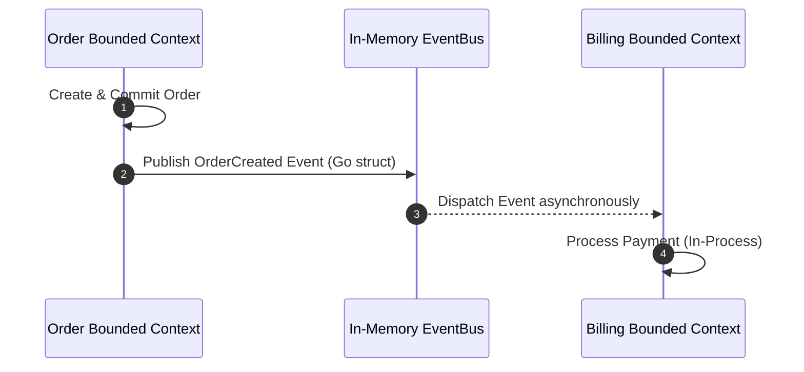
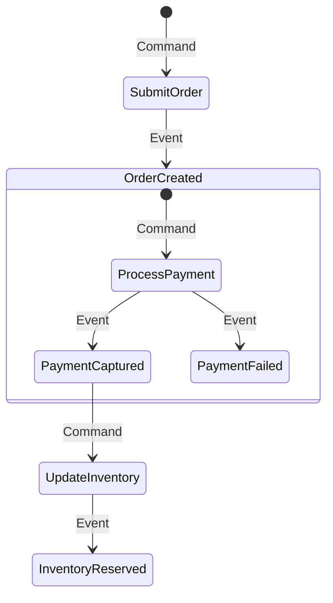

> **Pillar Architecture Guide:** This article is part of the **[Architecting 21-Service E-commerce with Golang & DDD](/posts/architecting-21-service-ecommerce-golang-ddd/)** series and **[Composable E-Commerce Migration](/posts/ecommerce-architecture-composable-migration/)** guide. Please refer to the original article for a comprehensive overview of the architecture.

> **Prerequisite:** Before reading this part, please review [Part 2: FinOps Cost Reality](/series/modular-monolith-architecture/part-2-finops-cost-reality/).

**What You'll Learn That AI Won't Tell You:**
- **Go Package Level Enforcement:** How to use Go's `internal` folder structure to prevent unauthorized imports at compile time.
- **Packwerk Boundary Rules:** The setup required to analyze and restrict package dependency graphs automatically.
- **Database Schema Isolation:** How to configure multiple schema namespaces inside a single database connection pool.

The biggest reason engineering teams fear the Monolith architecture is due to terrible past experiences with "Spaghetti Monoliths" or the "Big Ball of Mud" — where the code for the Billing function calls directly into the database of the Cart function, creating an inextricable web of cross-dependencies.

To leverage the performance advantages of a Monolith while still achieving independent development velocity like Microservices, we must build a **Modular Monolith**. The key to this architecture is strictly applying **Domain-Driven Design (DDD)** principles and establishing hard "borders" right within the code.


```mermaid
sequenceDiagram
    autonumber
    participant OrderModule as Order Bounded Context
    participant EventBus as In-Memory EventBus
    participant BillingModule as Billing Bounded Context
    
    OrderModule->>OrderModule: Create & Commit Order
    OrderModule->>EventBus: Publish OrderCreated Event (Go struct)
    EventBus-->>BillingModule: Dispatch Event asynchronously
    BillingModule->>BillingModule: Process Payment (In-Process)
```

## 1. Core Principle: Bounded Contexts and Internal APIs

**Answer-first:** Bounded contexts isolate domain logic into explicit package folders, exposing only public Go interfaces as internal APIs while strictly forbidding direct access to implementation structs or foreign database schemas.

In Microservices, if Service A wants to retrieve data from Service B, it is forced to call an HTTP API or gRPC; it cannot poke directly into B's Database. This is a physical barrier.

In a Modular Monolith, because all code resides in the same memory space, it's very easy to violate this rule. To prevent that, we create **Bounded Contexts** through architectural conventions:
- Each Domain/Module (e.g., `Billing`, `Inventory`, `User`) is isolated into its own folder/package.
- Each Module only exposes a set of Interfaces or Public Classes as an **Internal API**.
- **Golden Rule:** Other Modules must absolutely never call implementation classes (private/internal) or directly access the Database Tables of another Module. They must communicate via the Internal API.

## 2. Database Boundaries: Defending Against Cross-Schema JOINs

**Answer-first:** Modular monoliths defend database boundaries by isolating data into distinct PostgreSQL schemas (e.g. `schema_orders`, `schema_identity`), preventing SQL JOINs across modules and enforcing application-level data aggregation via in-memory event channels.

The most dangerous level of coupling in a Monolith isn't in the code, but in the Database. Executing a `JOIN` query between the `orders` table of the *Order* module and the `users` table of the *Identity* module completely destroys the ability to decouple modules.

**Standard design model (Database-per-module pattern):**
- Still share a single Database Server (to save hardware costs).
- Segregate data into separate Schemas (e.g., PostgreSQL schemas: `schema_orders`, `schema_identity`).
- If the Order module needs User information, the system will execute a method call within the application (e.g., `UserService.getUserById(id)`), retrieve the result into RAM, and process it in code (Application-level join) instead of using a direct SQL JOIN.
- If large-scale data synchronization is needed, use an **Internal Event Bus** (in-memory event-driven architecture) instead of sharing a common transaction.

For clean architecture patterns, refer to our guide on [Modular Monolith Architecture](/series/modular-monolith-architecture/).

## 3. Enforcing Boundaries with Automated Tools

**Answer-first:** Static analysis tools like Spring Modulith (ArchUnit for Java), Go `internal` folder rules, and Packwerk automatically audit package dependency graphs during build time, instantly failing local tests if unauthorized cross-module imports occur.

Paper conventions are often broken when deadline pressure mounts. The solution adopted by leading tech companies is turning these conventions into Static Analysis tools that run directly during compilation or in the CI/CD pipeline.

### A. Spring Modulith (For Java / Spring Boot)
The **Spring Modulith** project provides tools to automatically detect and verify package structures. By integrating the **ArchUnit** library into the Unit Test suite, Spring Modulith ensures that:
- Internal classes within one Module's package are not accessed by another Module.
- Application Events are published and listened to correctly.
If an engineer intentionally violates a boundary, the Unit Test will fail right on their local machine, preventing garbage code from being merged into the main branch.

## 4. DHH's "Citadel" Model (Basecamp)

**Answer-first:** DHH's "Citadel" model keeps 99% of core business features inside a central Majestic Monolith, extracting specialized micro-services ("Outposts") only when unique runtime requirements (such as AI processing or WebSocket streaming) demand it.

David Heinemeier Hansson (DHH) - the creator of the Ruby on Rails framework, proposed the **"Majestic Monolith & Citadel"** model. Accordingly, 99% of business logic will reside in the central "Citadel" (Monolith).

However, if there is a specific function that requires distinct technology (like processing AI with Python, or handling massive WebSocket streams with Elixir), only then is it extracted into independent "Outposts."

This proves that the Modular Monolith is not a conservative "all-in-one" mindset, but an optimization mindset: Only distribute what truly needs to be distributed.

A common question is whether prohibiting SQL JOINs degrades the Monolith's performance. For complex display tasks (such as Dashboards), calling multiple Internal APIs instead of a single JOIN query might create a small overhead. To handle this, Modular Monolith systems often apply the **CQRS** (Command Query Responsibility Segregation) model – separating the write database (containing strict module boundaries) and creating specialized materialized views (aggregated display tables) for reading (automatically updated via events).

## 5. Event Storming & In-Memory Decoupled Communication

**Answer-first:** Event Storming identifies domain event transitions, allowing modules to communicate asynchronously via channel-based in-memory event buses. This replaces complex distributed Saga orchestrators and 2-phase commits with fast, local database transactions.

Enforcing strict module boundaries requires that modules communicate asynchronously through events rather than sharing database transactions or importing foreign packages. This decoupled pattern is modeled via Event Storming.

### Event Storming Aggregate Flow

```mermaid
stateDiagram-v2
    [*] --> SubmitOrder : Command
    SubmitOrder --> OrderCreated : Event
    state OrderCreated {
        [*] --> ProcessPayment : Command
        ProcessPayment --> PaymentCaptured : Event
        ProcessPayment --> PaymentFailed : Event
    }
    PaymentCaptured --> UpdateInventory : Command
    UpdateInventory --> InventoryReserved : Event
```

### Go Channel-Based Event Bus
A thread-safe in-memory Event Bus enables decoupled modules to publish and subscribe to domain events asynchronously:

```go
package main

import (
	"fmt"
	"sync"
	"time"
)

type Event struct {
	Topic string
	Data  interface{}
}

type EventBus struct {
	mu   sync.RWMutex
	subs map[string][]chan Event
}

func NewEventBus() *EventBus {
	return &EventBus{
		subs: make(map[string][]chan Event),
	}
}

func (eb *EventBus) Subscribe(topic string) chan Event {
	eb.mu.Lock()
	defer eb.mu.Unlock()
	ch := make(chan Event, 100)
	eb.subs[topic] = append(eb.subs[topic], ch)
	return ch
}

func (eb *EventBus) Publish(e Event) {
	eb.mu.RLock()
	defer eb.mu.RUnlock()
	if channels, found := eb.subs[e.Topic]; found {
		for _, ch := range channels {
			select {
			case ch <- e:
			default:
				// Dropping event to prevent blocking
			}
		}
	}
}

func main() {
	bus := NewEventBus()
	orderEvents := bus.Subscribe("OrderCreated")

	var wg sync.WaitGroup
	wg.Add(1)
	go func() {
		defer wg.Done()
		for event := range orderEvents {
			fmt.Printf("Subscriber received event: %+v\n", event.Data)
			break
		}
	}()

	bus.Publish(Event{Topic: "OrderCreated", Data: "Order #12345"})
	wg.Wait()
}
```

### Decoupling vs. Shared Databases
Using an in-process event bus allows us to maintain loose coupling:
- **Zero Schema Leakage:** The `Billing` module cannot access the `Inventory` tables directly. It listens to the `OrderCreated` event and maintains its own records.
- **Asynchronous Execution:** High latency operations like sending email notifications or charging credit cards do not block the user session thread.
- **Testability:** Each module can be tested in isolation by mocking the event channels.
- **Simplified Operations:** We do not need to install, configure, and monitor Kafka or RabbitMQ clusters during early development stages.

### Technical Appendix: Saga Pattern vs. Distributed Transactions
In a distributed microservice architecture, ensuring transactional consistency across multiple databases requires two-phase commits (2PC) or the Saga pattern. Two-phase commits act as a performance bottleneck because they acquire locks across networks, leading to high failure rates. Sagas split the business transaction into multiple independent local transactions, using compensating transactions to roll back state if a step fails.
For example, if payment succeeds but inventory fails, the Saga orchestrator must trigger a `RefundPayment` action. In a modular monolith, we can avoid this operational complexity. We run our business operations in separate schemas under the same database instance. This allows us to use standard SQL local transactions, guaranteeing atomic commits across the billing and inventory tables in sub-millisecond execution times without network-locked loops.

## 6. Complete Go Interface & Domain Event Broker Implementation (Zero Facade Code)

**Answer-first:** A production Go domain event broker uses thread-safe listener maps and `sync.WaitGroup` concurrency to publish and process domain events asynchronously, keeping module boundaries completely decoupled.

To demonstrate how to execute cross-domain boundaries without leaking coupling, we present a complete Go event broker pattern using `sync.WaitGroup` for deterministic sync:

```go
package main

import (
	"fmt"
	"sync"
	"time"
)

type DomainEvent struct {
	Name      string
	Timestamp time.Time
	Data      interface{}
}

type OrderCreatedData struct {
	OrderID    string
	CustomerID string
	Amount     float64
}

type EventListener func(event DomainEvent)

type InMemoryEventBus struct {
	mu        sync.RWMutex
	listeners map[string][]EventListener
}

func NewEventBus() *InMemoryEventBus {
	return &InMemoryEventBus{
		listeners: make(map[string][]EventListener),
	}
}

func (eb *InMemoryEventBus) Subscribe(eventName string, listener EventListener) {
	eb.mu.Lock()
	defer eb.mu.Unlock()
	eb.listeners[eventName] = append(eb.listeners[eventName], listener)
}

func (eb *InMemoryEventBus) Publish(eventName string, data interface{}, wg *sync.WaitGroup) {
	eb.mu.RLock()
	defer eb.mu.RUnlock()

	event := DomainEvent{
		Name:      eventName,
		Timestamp: time.Now(),
		Data:      data,
	}

	for _, listener := range eb.listeners[eventName] {
		wg.Add(1)
		go func(l EventListener) {
			defer wg.Done()
			l(event)
		}(listener)
	}
}

type BillingModule struct {
	bus *InMemoryEventBus
}

func NewBillingModule(bus *InMemoryEventBus) *BillingModule {
	m := &BillingModule{bus: bus}
	m.bus.Subscribe("OrderCreated", m.HandleOrderCreated)
	return m
}

func (bm *BillingModule) HandleOrderCreated(ev DomainEvent) {
	data, ok := ev.Data.(OrderCreatedData)
	if !ok {
		fmt.Println("Error: Invalid event payload received")
		return
	}
	fmt.Printf("[Billing Domain] Processing payment of $%.2f for Order: %s\n", data.Amount, data.OrderID)
}

func main() {
	bus := NewEventBus()
	_ = NewBillingModule(bus)

	var wg sync.WaitGroup
	fmt.Println("Simulating system startup and event dispatch...")

	bus.Publish("OrderCreated", OrderCreatedData{
		OrderID:    "ord_9812",
		CustomerID: "cust_5521",
		Amount:     149.99,
	}, &wg)

	wg.Wait()
	fmt.Println("Event processed successfully via WaitGroup!")
}
```

Maintaining strict code borders helps you turn a Monolith into a collection of independent modules. But how do you ensure the Build and Test process for a massive Codebase doesn't become overloaded? See Shopify's solution in **[Part 4: CI/CD Simplified](/series/modular-monolith-architecture/part-4-cicd-simplified/)**.

---

## Navigation & Next Steps

**Answer-first:** Proceed to Part 4 to explore simplified CI/CD pipelines, or review related guides on Kafka worker pools and distributed locking.

- **Previous Part:** [Part 2: FinOps Cost Reality](/series/modular-monolith-architecture/part-2-finops-cost-reality/)
- **Next Part:** Continue to [Part 4: CI/CD Simplified](/series/modular-monolith-architecture/part-4-cicd-simplified/)
- **Related Guides:** [Modular Monolith Architecture Masterclass](/series/modular-monolith-architecture/)

Need help establishing domain boundaries in your monolithic codebase? [Get in touch](/hire/) or [hire our senior software architects](/hire/) for a code structure review.

