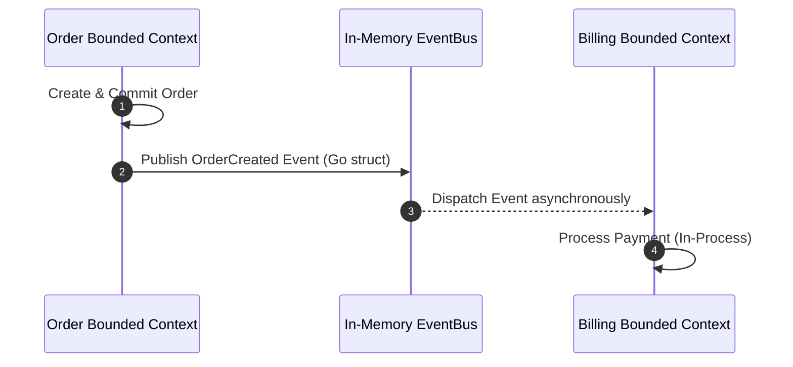
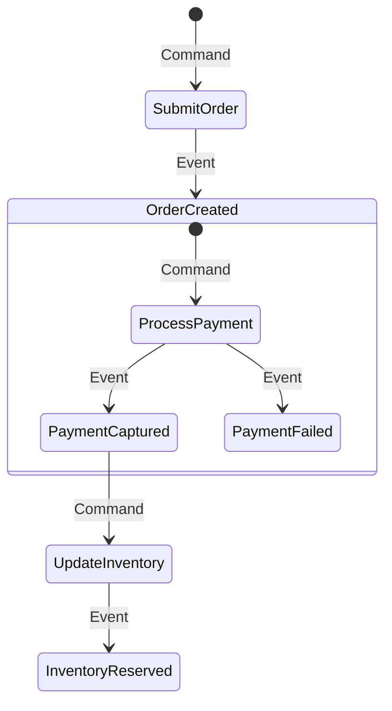

> **Answer-First:** A Modular Monolith prevents code degradation ("Big Ball of Mud") by applying Domain-Driven Design (DDD) Bounded Contexts, isolating database schema namespaces (e.g. `billing.payments`, `inventory.stock`), enforcing compile-time import boundaries via Go `internal` packages and `arch-go`, and using an in-memory transactional outbox pattern for asynchronous event communication.

> **Pillar Architecture Guide:** This article is part of the **[Architecting 21-Service E-commerce with Golang & DDD](/posts/architecting-21-service-ecommerce-golang-ddd/)** series and **[Composable E-Commerce Migration](/posts/ecommerce-architecture-composable-migration/)** guide. Please refer to the original article for a detailed overview of the architecture.

> **Prerequisite:** Before reading this part, please review [Part 2: FinOps Cost Reality](/series/modular-monolith-architecture/part-2-finops-cost-reality/).

**What You'll Learn That AI Won't Tell You:**
- **Go Package & Arch-Go Enforcement:** How to use Go's `internal` folder structure and `arch-go` static rules to block illegal cross-module imports at compile time.
- **Aggregate Roots & Anti-Corruption Layers (ACL):** How to encapsulate domain logic and translate external DTOs without leaking module internals.
- **Database Schema Isolation (`billing.payments`, `inventory.stock`):** How PostgreSQL schema permissions restrict SQL JOINs across modules within a shared database instance.
- **In-Memory Transactional Outbox:** How to achieve reliable event publishing without network overhead or Kafka infrastructure.

The biggest reason engineering teams fear the Monolith architecture is due to past experiences with "Spaghetti Monoliths" or the "Big Ball of Mud" — where the code for the Billing function calls directly into the database of the Cart function, creating an inextricable web of cross-dependencies.

To leverage the performance advantages of a Monolith while still achieving independent development velocity like Microservices, we must build a **Modular Monolith**. The key to this architecture is strictly applying **Domain-Driven Design (DDD)** principles and establishing hard "borders" right within the application codebase.

The sequence diagram below illustrates how domain events decouple bounded contexts through an in-memory event bus, enabling asynchronous order processing without direct module cross-imports:


```mermaid
sequenceDiagram
    autonumber
    participant OrderModule as Order Bounded Context
    participant EventBus as In-Memory EventBus
    participant BillingModule as Billing Bounded Context
    
    OrderModule->>OrderModule: Create & Commit Order
    OrderModule->>EventBus: Publish OrderCreated Event (Go struct)
    EventBus-->>BillingModule: Dispatch Event asynchronously
    BillingModule->>BillingModule: Process Payment (In-Process)
```

## 1. Core Principle: Bounded Contexts, Aggregate Roots & Anti-Corruption Layers

**Answer-first:** Bounded contexts isolate domain logic into explicit package folders, encapsulating state mutation within Aggregate Roots and exposing public Go interfaces as internal APIs, while using Anti-Corruption Layers (ACL) to translate external domain entities without model coupling.

In Microservices, if Service A wants to retrieve data from Service B, it is forced to call an HTTP API or gRPC; it cannot poke directly into B's Database. This creates a physical boundary. In a Modular Monolith, because all code resides in the same memory space, developer discipline alone is insufficient to prevent coupling.

To establish hard borders within a single binary, we combine three DDD invariants:

1. **Aggregate Roots as Mutation Boundaries:** All entity updates must execute through an Aggregate Root (e.g., `OrderAggregate`). External modules cannot manipulate child entities (e.g., `OrderItem`) directly, preserving business invariants.
2. **Internal API Interfaces:** Modules expose explicit Go interfaces (`OrderService`, `BillingService`) in public root packages, hiding internal domain implementation details inside unexported packages.
3. **Anti-Corruption Layer (ACL):** When module A consumes events or data from module B, an ACL translates external DTOs into domain-native value objects, preventing schema changes in module B from breaking module A's domain model.

### Go Anti-Corruption Layer (ACL) Pattern Example

The Go implementation below illustrates an Anti-Corruption Layer adapter that translates raw external order DTOs into clean, domain-native payment value objects. This structural isolation guarantees that upstream schema revisions in the Order module do not break downstream domain invariants within the Billing module.

```go
package billing

// External OrderDTO emitted by the Order module
type ExternalOrderDTO struct {
	OrderID   string
	RawAmount int64 // Stored in cents
	Currency  string
}

// PaymentValueObject is Billing's internal clean domain representation
type PaymentValueObject struct {
	ID       string
	Total    float64
	Currency string
}

// OrderACLAdapter translates foreign module DTOs into clean Billing domain models
type OrderACLAdapter struct{}

func (a *OrderACLAdapter) ToPaymentVO(dto ExternalOrderDTO) (PaymentValueObject, error) {
	return PaymentValueObject{
		ID:       dto.OrderID,
		Total:    float64(dto.RawAmount) / 100.0,
		Currency: dto.Currency,
	}, nil
}
```

## 2. Database Boundaries: PostgreSQL Schema Isolation & Transactional Outbox

**Answer-first:** Modular monoliths enforce database boundaries by segregating data into isolated PostgreSQL schemas (`billing.payments`, `inventory.stock`), revoking cross-schema SQL JOIN permissions, and persisting events via an in-memory Transactional Outbox pattern to guarantee event delivery.

The most dangerous coupling in a Monolith occurs at the database tier. Executing SQL `JOIN` queries between `orders.order_items` and `billing.payments` completely destroys module autonomy and blocks future database split-outs.

### PostgreSQL Schema Privilege Isolation
Instead of running separate database servers, a modular monolith uses PostgreSQL schema namespaces within a single database instance:

```sql
-- Create isolated domain schemas
CREATE SCHEMA billing;
CREATE SCHEMA inventory;

-- Restrict cross-schema access at PostgreSQL role level
CREATE ROLE inventory_user WITH LOGIN PASSWORD 'secret';
GRANT USAGE ON SCHEMA inventory TO inventory_user;
REVOKE ALL ON SCHEMA billing FROM inventory_user;
```

If the `Order` module requires `Inventory` details, it calls an exported Go interface method (`InventoryService.GetStock()`), aggregating results in application RAM rather than running a cross-schema SQL JOIN.

### In-Memory Transactional Outbox Pattern
Pure in-memory Go channels risk losing domain events during unexpected application crashes or server restarts. To guarantee at-least-once event delivery across module boundaries, we implement an **In-Memory Transactional Outbox pattern**:

1. **Atomic Local Transaction:** During order creation, the `Order` aggregate writes the order record to `orders.orders` and the domain event to `orders.outbox` within a single PostgreSQL database transaction (`BEGIN ... COMMIT`).
2. **In-Process Poller / Dispatcher:** A background goroutine polls `orders.outbox` (or listens to PostgreSQL `LISTEN/NOTIFY`) and dispatches pending events into the in-memory Event Bus.
3. **Acknowledgment & Cleanup:** Once subscriber modules process the event successfully, the outbox record status is marked as `processed`.

## 3. Enforcing Boundaries with Automated Static Analysis (`arch-go` & Packwerk)

**Answer-first:** Compile-time boundaries are enforced using Go `internal` directory rules, `arch-go` static rules, Spring Modulith (ArchUnit), and Packwerk to analyze package import graphs during builds, instantly failing tests if unauthorized cross-module imports occur.

Paper conventions degrade under tight deadlines. Leading engineering teams turn boundary conventions into hard compiler checks and automated static analysis tools integrated into local unit test suites and CI pipelines.

### A. Go `internal` Folder & `arch-go` Rule Enforcement
Go enforces directory-level package visibility natively: any package placed inside an `internal/` directory can only be imported by packages sharing the same parent directory tree.

To enforce fine-grained architectural rules across domain packages, we integrate **`arch-go`**:

```yaml
# arch-go.yml static architectural rules definition
version: "1"
dependencies:
  - package: "github.com/myrepo/internal/billing/..."
    forbidden:
      - "github.com/myrepo/internal/inventory/impl/..."
      - "github.com/myrepo/internal/orders/impl/..."
  - package: "github.com/myrepo/internal/..."
    forbidden:
      - "github.com/myrepo/internal/*/impl/..."
```

Running `arch-go` during `go test ./...` scans the Abstract Syntax Tree (AST) import graph and fails the build immediately if an engineer attempts to import private implementation packages across bounded contexts.

### B. Spring Modulith & Ruby Packwerk
- **Spring Modulith (Java):** Leverages **ArchUnit** to verify package boundaries and event listener declarations during unit test runs.
- **Packwerk (Ruby/Rails):** Shopify's static analysis tool that enforces module boundaries by declaring explicit package dependency manifests (`package.yml`) and reporting unauthorized cross-pack references.

## 4. DHH's "Citadel" Model (Basecamp)

**Answer-first:** DHH's "Citadel" model keeps 99% of core business features inside a central Majestic Monolith, extracting specialized micro-services ("Outposts") only when unique runtime requirements (such as AI processing or WebSocket streaming) demand it.

David Heinemeier Hansson (DHH) - the creator of the Ruby on Rails framework, proposed the **"Majestic Monolith & Citadel"** model. Accordingly, 99% of business logic will reside in the central "Citadel" (Monolith).

However, if there is a specific function that requires distinct technology (like processing AI with Python, or handling massive WebSocket streams with Elixir), only then is it extracted into independent "Outposts."

This proves that the Modular Monolith is not a conservative "all-in-one" mindset, but an optimization mindset: Only distribute what truly needs to be distributed.

A common question is whether prohibiting SQL JOINs degrades the Monolith's performance. For complex display tasks (such as Dashboards), calling multiple Internal APIs instead of a single JOIN query might create a small overhead. To handle this, Modular Monolith systems often apply the **CQRS** (Command Query Responsibility Segregation) model – separating the write database (containing strict module boundaries) and creating specialized materialized views (aggregated display tables) for reading (automatically updated via events).

## 5. Event Storming & In-Memory Decoupled Communication

**Answer-first:** Event Storming identifies domain event transitions, allowing modules to communicate asynchronously via channel-based in-memory event buses. This replaces complex distributed Saga orchestrators and 2-phase commits with fast, local database transactions.

Enforcing strict module boundaries requires that modules communicate asynchronously through events rather than sharing database transactions or importing foreign packages. This decoupled pattern is modeled via Event Storming.

The state diagram below depicts the Event Storming aggregate lifecycle, tracing an order from initial command submission through payment capture and inventory reservation events:


```mermaid
stateDiagram-v2
    [*] --> SubmitOrder : Command
    SubmitOrder --> OrderCreated : Event
    state OrderCreated {
        [*] --> ProcessPayment : Command
        ProcessPayment --> PaymentCaptured : Event
        ProcessPayment --> PaymentFailed : Event
    }
    PaymentCaptured --> UpdateInventory : Command
    UpdateInventory --> InventoryReserved : Event
```

### Go Channel-Based Event Bus
The following Go code demonstrates a thread-safe, channel-based event bus that enables decoupled modules to publish and subscribe to domain events asynchronously without external message brokers:

```go
package main

import (
	"fmt"
	"sync"
	"time"
)

type Event struct {
	Topic string
	Data  interface{}
}

type EventBus struct {
	mu   sync.RWMutex
	subs map[string][]chan Event
}

func NewEventBus() *EventBus {
	return &EventBus{
		subs: make(map[string][]chan Event),
	}
}

func (eb *EventBus) Subscribe(topic string) chan Event {
	eb.mu.Lock()
	defer eb.mu.Unlock()
	ch := make(chan Event, 100)
	eb.subs[topic] = append(eb.subs[topic], ch)
	return ch
}

func (eb *EventBus) Publish(e Event) {
	eb.mu.RLock()
	defer eb.mu.RUnlock()
	if channels, found := eb.subs[e.Topic]; found {
		for _, ch := range channels {
			select {
			case ch <- e:
			default:
				// Dropping event to prevent blocking
			}
		}
	}
}

func main() {
	bus := NewEventBus()
	orderEvents := bus.Subscribe("OrderCreated")

	var wg sync.WaitGroup
	wg.Add(1)
	go func() {
		defer wg.Done()
		for event := range orderEvents {
			fmt.Printf("Subscriber received event: %+v\n", event.Data)
			break
		}
	}()

	bus.Publish(Event{Topic: "OrderCreated", Data: "Order #12345"})
	wg.Wait()
}
```

### Decoupling vs. Shared Databases
Using an in-process event bus allows us to maintain loose coupling:
- **Zero Schema Leakage:** The `Billing` module cannot access the `Inventory` tables directly. It listens to the `OrderCreated` event and maintains its own records.
- **Asynchronous Execution:** High latency operations like sending email notifications or charging credit cards do not block the user session thread.
- **Testability:** Each module can be tested in isolation by mocking the event channels.
- **Simplified Operations:** We do not need to install, configure, and monitor Kafka or RabbitMQ clusters during early development stages.

### Technical Appendix: Saga Pattern vs. Distributed Transactions
In a distributed microservice architecture, ensuring transactional consistency across multiple databases requires two-phase commits (2PC) or the Saga pattern. Two-phase commits act as a performance bottleneck because they acquire locks across networks, leading to high failure rates. Sagas split the business transaction into multiple independent local transactions, using compensating transactions to roll back state if a step fails.
For example, if payment succeeds but inventory fails, the Saga orchestrator must trigger a `RefundPayment` action. In a modular monolith, we can avoid this operational complexity. We run our business operations in separate schemas under the same database instance. This allows us to use standard SQL local transactions, guaranteeing atomic commits across the billing and inventory tables in sub-millisecond execution times without network-locked loops.

## 6. Complete Go Interface & Domain Event Broker Implementation (Zero Facade Code)

**Answer-first:** A production Go domain event broker uses thread-safe listener maps and `sync.WaitGroup` concurrency to publish and process domain events asynchronously, keeping module boundaries completely decoupled.

To demonstrate how to execute cross-domain boundaries without leaking coupling, we present a complete Go event broker pattern using `sync.WaitGroup` for deterministic sync:

```go
package main

import (
	"fmt"
	"sync"
	"time"
)

type DomainEvent struct {
	Name      string
	Timestamp time.Time
	Data      interface{}
}

type OrderCreatedData struct {
	OrderID    string
	CustomerID string
	Amount     float64
}

type EventListener func(event DomainEvent)

type InMemoryEventBus struct {
	mu        sync.RWMutex
	listeners map[string][]EventListener
}

func NewEventBus() *InMemoryEventBus {
	return &InMemoryEventBus{
		listeners: make(map[string][]EventListener),
	}
}

func (eb *InMemoryEventBus) Subscribe(eventName string, listener EventListener) {
	eb.mu.Lock()
	defer eb.mu.Unlock()
	eb.listeners[eventName] = append(eb.listeners[eventName], listener)
}

func (eb *InMemoryEventBus) Publish(eventName string, data interface{}, wg *sync.WaitGroup) {
	eb.mu.RLock()
	defer eb.mu.RUnlock()

	event := DomainEvent{
		Name:      eventName,
		Timestamp: time.Now(),
		Data:      data,
	}

	for _, listener := range eb.listeners[eventName] {
		wg.Add(1)
		go func(l EventListener) {
			defer wg.Done()
			l(event)
		}(listener)
	}
}

type BillingModule struct {
	bus *InMemoryEventBus
}

func NewBillingModule(bus *InMemoryEventBus) *BillingModule {
	m := &BillingModule{bus: bus}
	m.bus.Subscribe("OrderCreated", m.HandleOrderCreated)
	return m
}

func (bm *BillingModule) HandleOrderCreated(ev DomainEvent) {
	data, ok := ev.Data.(OrderCreatedData)
	if !ok {
		fmt.Println("Error: Invalid event payload received")
		return
	}
	fmt.Printf("[Billing Domain] Processing payment of $%.2f for Order: %s\n", data.Amount, data.OrderID)
}

func main() {
	bus := NewEventBus()
	_ = NewBillingModule(bus)

	var wg sync.WaitGroup
	fmt.Println("Simulating system startup and event dispatch...")

	bus.Publish("OrderCreated", OrderCreatedData{
		OrderID:    "ord_9812",
		CustomerID: "cust_5521",
		Amount:     149.99,
	}, &wg)

	wg.Wait()
	fmt.Println("Event processed successfully via WaitGroup!")
}
```

Maintaining strict code borders helps you turn a Monolith into a collection of independent modules. But how do you ensure the Build and Test process for a massive Codebase doesn't become overloaded? See Shopify's solution in **[Part 4: CI/CD Simplified](/series/modular-monolith-architecture/part-4-cicd-simplified/)**.

---

## Frequently Asked Questions (FAQ)

**Answer-first:** This FAQ addresses key questions regarding Aggregate Roots, PostgreSQL schema isolation, Anti-Corruption Layers, and static boundary enforcement in Modular Monoliths.


Aggregate Roots act as the sole entry point for modifying entities within a Bounded Context, ensuring that external modules cannot alter internal entity state directly. By restricting mutation access to root methods, business invariants and validation rules remain strictly encapsulated.



PostgreSQL schema isolation (`billing.payments`, `inventory.stock`) creates hard data boundaries without the operational expense and hardware overhead of managing multiple database servers. This architecture prevents illegal cross-schema SQL JOINs while allowing local atomic database transactions when necessary.



An Anti-Corruption Layer (ACL) translates data structures between differing module bounded contexts or legacy interfaces into clean internal domain objects. This adapter pattern ensures that domain models remain unpolluted by external schema changes or foreign data representations.



While Go `internal` directory rules enforce package visibility at compile time, `arch-go` allows teams to define granular architectural policy rules across public interfaces. It automatically scans dependency AST graphs during local testing and CI runs, failing builds if unauthorized cross-module imports occur.


---

## Navigation & Next Steps

**Answer-first:** Proceed to Part 4 to explore simplified CI/CD pipelines, or review related guides on monorepo build caching and deployment automation.

- **Previous Part:** [Part 2: FinOps Cost Reality](/series/modular-monolith-architecture/part-2-finops-cost-reality/)
- **Next Part:** Continue to [Part 4: CI/CD Simplified](/series/modular-monolith-architecture/part-4-cicd-simplified/)
- **Related Guides:** [Modular Monolith Architecture Guide](/series/modular-monolith-architecture/)

Need help establishing domain boundaries in your monolithic codebase? [Get in touch](/hire/) or [hire our senior software architects](/hire/) for a code structure review.

