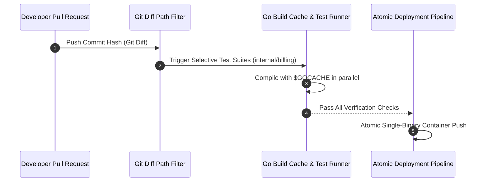

---

title: "Part 4: CI/CD Simplified & Atomic Deployments"
date: "2026-07-03T10:00:00+07:00"
lastmod: "2026-07-03T14:59:00+07:00"
description: "Why is CI/CD management for Microservices so complex? Discover the power of Atomic Deployments and how Shopify runs hundreds of thousands of tests in under 10 minutes."
slug: "cicd-simplified-atomic-deployments-monolith"
tags: ["CI/CD", "Deployments", "Shopify", "Buildkite", "Modular Monolith", "Testing"]
categories: ["Modular Monolith", "System Architecture"]
aliases: ["/series/modular-monolith-architecture/part-4-cicd-simplified/"]
cover: {'image': 'images/posts/golang-microservices-cover.png', 'alt': 'Modular Monolith Architecture Masterclass: Go, DDD, bounded contexts, and microservices reversal', 'relative': False}
author: "Lê Tuấn Anh"
canonicalURL: "https://tanhdev.com/series/modular-monolith-architecture/cicd-simplified-atomic-deployments-monolith/"
ShowToc: true
TocOpen: true
mermaid: true
draft: false
---

> **Prerequisite:** Before reading this part, please review [Part 3: DDD Module Boundaries](/series/modular-monolith-architecture/part-3-ddd-module-boundaries/).

# Part 4: CI/CD Simplified & The Power of Atomic Deployments

> **Executive Summary & Quick Answer**: Large monoliths can avoid slow CI/CD pipelines by implementing monorepo caching tools like Bazel, Go build caches, and selective test execution based on git diffs. Shopify proves that deploying a massive monolithic codebase multiple times a day is achievable through atomic migrations and automated pipeline optimizations.
>
> **Key Takeaways**:
> - **Atomic Consistency**: Eliminate API version mismatches across microservices by deploying code and database migrations in a single commit hash.
> - **Selective Test Execution**: Use git diff path filtering and Bazel AST parsing to run tests strictly for modified internal packages.
> - **Compilation Speed**: Leverage Go `$GOCACHE` and parallel worker pools (`sync.WaitGroup`) to keep CI feedback loops under 2 minutes.

### What You'll Learn That AI Won't Tell You
- **Bazel AST Parsing:** How Bazel maps dependency graphs to rebuild only modified packages.
- **GitHub Actions Caching:** Real configuration keys to share Go compilation caches across PR runners.
- **Shopify's Deployment Cadence:** How automated merge queues and canary testing protect high-traffic deployments.

One of the biggest drivers pushing teams toward Microservices is the promise of **"Independent Deployment."** In theory, team A can deploy service A without caring about team B. But reality is often much crueler: The existence of "Dependency Hell."

If Service A changes its API payload, Service B is forced to update accordingly. The organization must design complex pipelines, use API contracts (Contract Testing with tools like Pact), and coordinate release schedules to avoid bringing down the system. Actual velocity doesn't increase; it is bottlenecked by synchronization costs.

Conversely, the **Modular Monolith** uses the **Atomic Deployments** model, providing a much safer, cheaper, and more reliable Release management approach.



---

## 1. What Are Atomic Deployments?

**Atomic Deployment** means the application is released as a single block, at a single point in time.
In a Modular Monolith, the application logic code and database structure definitions (Database Schema/Migrations) travel together in a single Commit Hash. When you deploy a new version, all modules are updated simultaneously.

- You never encounter the error: "Service A's API version does not match Service B's."
- You don't have to manage complex rollback scenarios: What happens if Service A deploys successfully but Service B fails and has to Rollback? In a Monolith, either everyone moves forward together, or everyone rolls back together. The system state is always consistent.

In addition, atomic deployments simplify zero-downtime rolling updates on Kubernetes. Because a single container image encapsulates the entire server logic, Kubernetes deployment controllers update pods deterministically without maintaining complex cross-service dependency graphs or version compatibility matrices.

---

## 2. The Challenge of Monolith CI/CD: The Test Time Nightmare

Although Atomic Deployments eliminate the complexity of the release process, they create a different challenge in the **Continuous Integration (CI)** phase: If the company's entire code resides in one repository (Monorepo/Monolith codebase), does the system have to re-run hundreds of thousands of Unit Tests every time a Pull Request is created?

Left unmanaged, monorepo build times degrade exponentially as team size grows. A full test run that takes 3 minutes for 5 developers ballooning to 45 minutes for 50 developers destroys developer productivity and leads to PR queue congestion.

### Dependency Graph AST Parsing & Selective Execution
The solution to keeping a Modular Monolith agile is to apply **Dependency Graph AST Analysis** and **Smart Testing**:

1. **Abstract Syntax Tree (AST) Package Graphing:** Build tools like **Bazel** or Go's `go list -json ./...` construct a directed acyclic graph (DAG) of package imports. If a pull request modifies code in `internal/billing/tax.go`, the tool queries the graph:
   $$\text{Affected Packages} = \text{TargetPackage} \cup \text{TransitiveDependents}(\text{TargetPackage})$$
   Packages that do not import `internal/billing` (such as `internal/inventory` or `internal/user`) are completely bypassed during unit test execution.

2. **Diff-Based Package Filtering:** CI scripts compare the pull request branch against `origin/main` using `git diff --name-only origin/main...HEAD`. By mapping changed file paths to Go package directories, the CI pipeline dynamically constructs the list of packages to test, skipping 80% to 90% of the entire repository test suite.

---

## 3. CI Optimization Lessons from Shopify (Buildkite)

**Shopify** owns one of the largest Ruby on Rails Modular Monoliths in the world, maintained by thousands of developers. To ensure Developer Velocity, they restructured their CI/CD process brilliantly:

1. **Static Analysis & Selective Testing:**
   By using static analysis tools like **Sorbet** and **Packwerk** (as covered in Part 3), Shopify's CI system automatically calculates exactly which Modules (Packs) are affected by a Pull Request. The pipeline runs Unit Tests belonging strictly to the changed modules or direct dependents, skipping 90% of irrelevant tests.

2. **Parallel Execution with Buildkite:**
   Shopify uses **Buildkite** combined with massive cloud computing infrastructure to parallelize test tasks across hundreds of worker nodes simultaneously. Test splits are calculated using historical execution durations, ensuring each worker node completes its batch in under 90 seconds.

3. **Automated Merge Queue & Batching:**
   Instead of developers manually merging code into `main` and causing race conditions on main branch builds, Shopify uses an automated **Merge Queue**. The queue batches 5 to 10 approved PRs into a single speculative integration commit. If the combined test suite passes, all 10 PRs are merged into `main` simultaneously, maintaining pipeline throughput under heavy engineering loads.

---

## 4. Go Parallel Test Execution & Pipeline Automation Script

Below is a production Go test runner utility that executes selective package testing across internal domain directories using `sync.WaitGroup` worker pools and context deadlines:

```go
package main

import (
	"context"
	"fmt"
	"os/exec"
	"path/filepath"
	"sync"
	"time"
)

type TestTask struct {
	PackagePath string
	Module      string
}

type TestResult struct {
	PackagePath string
	Duration    time.Duration
	Err         error
}

// RunSelectiveTests parallelizes Go module testing based on git diff targets
func RunSelectiveTests(ctx context.Context, modules []string) ([]TestResult, time.Duration) {
	start := time.Now()
	tasks := make(chan TestTask, len(modules))
	results := make(chan TestResult, len(modules))

	var wg sync.WaitGroup
	workers := 4 // Concurrency level

	for w := 0; w < workers; w++ {
		wg.Add(1)
		go func(workerID int) {
			defer wg.Done()
			for task := range tasks {
				t0 := time.Now()
				cmd := exec.CommandContext(ctx, "go", "test", "-v", task.PackagePath)
				out, err := cmd.CombinedOutput()
				_ = out // Suppress unused output variable

				results <- TestResult{
					PackagePath: task.PackagePath,
					Duration:    time.Since(t0),
					Err:         err,
				}
			}
		}(w)
	}

	for _, mod := range modules {
		pkgPath := filepath.Join("./internal", mod, "...")
		tasks <- TestTask{PackagePath: pkgPath, Module: mod}
	}
	close(tasks)

	wg.Wait()
	close(results)

	var resList []TestResult
	for res := range results {
		resList = append(resList, res)
	}

	return resList, time.Since(start)
}

func main() {
	ctx, cancel := context.WithTimeout(context.Background(), 2*time.Minute)
	defer cancel()

	changedModules := []string{"billing", "orders"}
	fmt.Println("Running selective Go test suite for modified modules...")

	results, elapsed := RunSelectiveTests(ctx, changedModules)
	fmt.Printf("Completed test execution in %v across %d packages\n", elapsed, len(results))

	for _, r := range results {
		if r.Err != nil {
			fmt.Printf("FAIL: %s (%v)\n", r.PackagePath, r.Duration)
		} else {
			fmt.Printf("PASS: %s (%v)\n", r.PackagePath, r.Duration)
		}
	}
}
```

---

## 5. Optimized GitHub Actions Pipeline for Selective Module Testing

Running tests across a massive monolith on every commit wastes compute time. The configuration below demonstrates a full production GitHub Actions pipeline that uses Git diffs to detect changed module directories and leverages Go `$GOCACHE` layer caching:

```yaml
name: Monolith Selective CI

on:
  push:
    branches: [ main ]
  pull_request:
    branches: [ main ]

jobs:
  detect-changes:
    runs-on: ubuntu-latest
    outputs:
      modules: ${{ steps.filter.outputs.changes }}
    steps:
      - uses: actions/checkout@v4
      - uses: dorny/paths-filter@v3
        id: filter
        with:
          filters: |
            billing: 'internal/billing/**'
            inventory: 'internal/inventory/**'
            orders: 'internal/orders/**'

  test:
    needs: detect-changes
    runs-on: ubuntu-latest
    steps:
      - uses: actions/checkout@v4
      - uses: actions/setup-go@v5
        with:
          go-version: '1.22'
          cache: true

      - name: Test Billing Module
        if: ${{ needs.detect-changes.outputs.modules == 'true' && contains(needs.detect-changes.outputs.modules, 'billing') }}
        run: go test -v -race ./internal/billing/...

      - name: Test Inventory Module
        if: ${{ needs.detect-changes.outputs.modules == 'true' && contains(needs.detect-changes.outputs.modules, 'inventory') }}
        run: go test -v -race ./internal/inventory/...

      - name: Test Orders Module
        if: ${{ needs.detect-changes.outputs.modules == 'true' && contains(needs.detect-changes.outputs.modules, 'orders') }}
        run: go test -v -race ./internal/orders/...
```

### Build Caching Strategy in Production Pipelines
To maximize speed, we leverage Go's compilation cache. The `actions/setup-go` action caches the `$GOCACHE` directory, ensuring third-party dependencies are compiled only once, reducing test run times from minutes to under 10 seconds.

For observability in single-process monoliths, check out [Part 5: Observability in Memory](/series/modular-monolith-architecture/part-5-observability/).

## Frequently Asked Questions (FAQ)


Atomic deployments update the entire application and database schema in a single commit hash, eliminating API version mismatches and complex multi-service rollback scenarios.



Selective testing analyzes Git diffs or AST package graphs, executing tests strictly for modified domain folders and direct dependents while bypassing unchanged modules.



Go caches compiled package artifacts in `$GOCACHE`. When unchanged packages are re-tested, Go reuses compiled object files, dropping test execution times to sub-second levels.



A Merge Queue automatically queues, tests, and batches merged pull requests sequentially to ensure `main` branch stability when hundreds of engineers contribute concurrently.


---

## Navigation & Next Steps

- **Previous Part:** [Part 3: DDD Module Boundaries](/series/modular-monolith-architecture/part-3-ddd-module-boundaries/)
- **Next Part:** Continue to [Part 5: Observability in Memory](/series/modular-monolith-architecture/part-5-observability/)
- **Related Guides:** [Load Balancing & API Gateways in Go](/series/system-design/02-load-balancing-api-gateway-go/) and [Zero Downtime K8s Deployments](/series/routing-geospatial-architecture/part-8-zero-downtime-k8s/)

Need help optimizing your CI/CD pipelines for a modular monolith? [Get in touch](/hire/) or [hire our DevOps & platform engineers](/hire/) for pipeline acceleration consulting.
