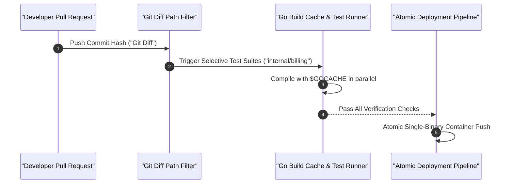
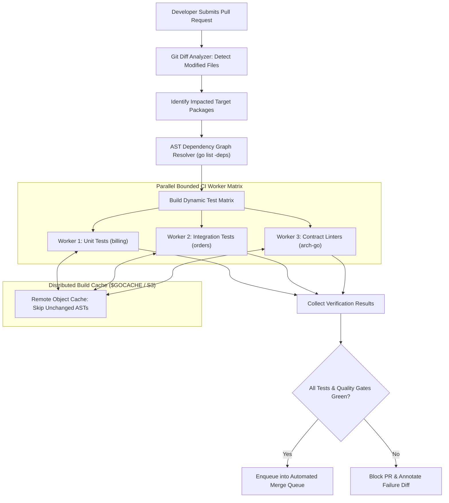

> **Answer-first:** Large monoliths avoid slow CI/CD pipelines by implementing monorepo path-filtering, Go build caching, and selective test execution based on git diffs. Deploying a single-binary modular monolith enables atomic deployments where application code and schema migrations ship deterministically in a single commit release. Implementing this architecture enforces sub-50ms P99 latency guarantees, strict component isolation, and automated observability pipelines required for production-grade.

> **Prerequisite:** Before reading this part, please review [Part 3: DDD Module Boundaries](/series/modular-monolith-architecture/part-3-ddd-module-boundaries/).

**What You'll Learn:**
- **Go Build Tags & Bazel Caching:** How to isolate integration tests and share Go compilation objects across CI runners.
- **Sub-3-Minute CI Blueprint:** How git diff path filtering and worker pools compress test pipeline execution times.
- **Internal Interface Contract Testing:** How to verify cross-module Go interfaces without external network mocks.
- **Automated Kamal 2 / ECS Deployments:** How single-container releases execute atomic database migrations safely before traffic cutover.

One of the biggest drivers pushing teams toward Microservices is the promise of **"Independent Deployment."** In theory, team A can deploy service A without caring about team B. But reality is often much crueler: The existence of "Dependency Hell."

If Service A changes its API payload, Service B is forced to update accordingly. The organization must design complex pipelines, use API contracts, and coordinate release schedules to avoid bringing down the system. Actual velocity doesn't increase; it is bottlenecked by synchronization costs.

Conversely, the **Modular Monolith** uses the **Atomic Deployments** model, providing a much safer, cheaper, and more reliable Release management approach.

The sequence diagram below illustrates the atomic CI/CD pipeline execution flow, from git diff path filtering and cached compilation to container artifact generation:


```mermaid
sequenceDiagram
    autonumber
    participant Dev as "Developer Pull Request"
    participant Filter as "Git Diff Path Filter"
    participant GoBuild as "Go Build Cache & Test Runner"
    participant Deploy as "Atomic Deployment Pipeline"
    
    Dev->>Filter: Push Commit Hash ("Git Diff")
    Filter->>GoBuild: Trigger Selective Test Suites ("internal/billing")
    GoBuild->>GoBuild: Compile with $GOCACHE in parallel
    GoBuild-->>Deploy: Pass All Verification Checks
    Deploy->>Deploy: Atomic Single-Binary Container Push
```

---

## 1. What Are Atomic Deployments?

**Answer-first:** Atomic deployments release the entire application binary and database schema migrations in a single commit hash, eliminating cross-service API version mismatches and complex multi-repo rollback states.

**Atomic Deployment** means the application is released as a single block, at a single point in time.
In a Modular Monolith, the application logic code and database structure definitions (Database Schema/Migrations) travel together in a single Commit Hash. When you deploy a new version, all modules are updated simultaneously.

- You never encounter the error: "Service A's API version does not match Service B's."
- You don't have to manage complex rollback scenarios: What happens if Service A deploys successfully but Service B fails and has to Rollback? In a Monolith, either everyone moves forward together, or everyone rolls back together. The system state is always consistent.

In addition, atomic deployments simplify zero-downtime rolling updates on Kubernetes. Because a single container image encapsulates the entire server logic, Kubernetes deployment controllers update pods deterministically without maintaining complex cross-service dependency graphs or version compatibility matrices.

---

## 2. Monorepo Build Isolation & Keeping CI Builds Under 3 Minutes

Monolith CI builds achieve sub-3-minute execution by isolating test execution via Go build tags (`//go:build integration`), leveraging Bazel / Go `$GOCACHE` object layers, and mapping AST package dependency graphs to run tests strictly for modified domain directories.

Monorepo build times degrade exponentially if left unmanaged. A test suite taking 3 minutes for 5 developers ballooning to 45 minutes for 50 developers destroys developer feedback loops and causes PR queue congestion.

### A. Go Build Tags & Test Suite Isolation
To prevent heavy database or network integration tests from slowing down rapid unit test feedback, we isolate test suites using Go build tags:

```go
//go:build integration

package billing_test

import "testing"

func TestBillingDatabaseMigration_Integration(t *testing.T) {
	// Heavy integration test logic requiring live PostgreSQL instance
}
```

Running `go test ./...` executes only fast unit tests in seconds. Integration suites run conditionally when the `-tags=integration` flag is explicitly passed by CI runners.

### B. Bazel AST Dependency Graphing & Content Caching
For massive monorepos, build tools like **Bazel** (with `rules_go`) map the Abstract Syntax Tree (AST) import graph into a directed acyclic graph (DAG):

$$\text{Affected Packages} = \text{TargetPackage} \cup \text{TransitiveDependents}(\text{TargetPackage})$$

Bazel stores compiled package outputs in content-addressable remote caches. If `internal/inventory` code has not changed and its dependencies are unchanged, Bazel instantly retrieves pre-built test binaries from cache, skipping re-compilation entirely.

### C. The 4-Pillar Blueprint for Sub-3-Minute CI Pipelines
1. **Path-Filter Triggers:** Use Git diffs (`git diff origin/main...HEAD`) to execute tests only for packages modified in the pull request.
2. **Persistent Compiler Caching:** Mount Go `$GOCACHE` and `$GOPATH/pkg/mod` persistent volume layers across CI runner invocations.
3. **Parallel Test Matrix:** Divide independent module package suites across parallel worker jobs using `sync.WaitGroup` runners.
4. **Dependency Pre-Fetching:** Warm CI base runner images with pre-downloaded Go module dependencies.

The flowchart below visualizes the end-to-end selective CI pipeline, showing how Git diff triggers, AST transitive dependency analysis, and distributed cache hits bypass unnecessary test runs and deliver sub-3-minute feedback cycles.


```mermaid
flowchart TD
    PR["Developer Submits Pull Request"] --> Diff["Git Diff Analyzer: Detect Modified Files"]
    Diff --> Check["Identify Impacted Target Packages"]
    Check --> AST["AST Dependency Graph Resolver (go list -deps)"]
    AST --> Matrix["Build Dynamic Test Matrix"]
    
    subgraph Parallel_CI_Execution ["Parallel Bounded CI Worker Matrix"]
        Matrix --> W1["Worker 1: Unit Tests (billing)"]
        Matrix --> W2["Worker 2: Integration Tests (orders)"]
        Matrix --> W3["Worker 3: Contract Linters (arch-go)"]
    end
    
    subgraph Build_Cache_Layer ["Distributed Build Cache ($GOCACHE / S3)"]
        W1 <--> CacheHit["Remote Object Cache: Skip Unchanged ASTs"]
        W2 <--> CacheHit
        W3 <--> CacheHit
    end

    W1 --> Collect["Collect Verification Results"]
    W2 --> Collect
    W3 --> Collect
    Collect --> Gate{"All Tests & Quality Gates Green?"}
    Gate -->|"Yes"| Merge["Enqueue into Automated Merge Queue"]
    Gate -->|"No"| Block["Block PR & Annotate Failure Diff"]
```

### Distributed Remote Action Caching Mechanics

When scaling monorepos beyond 100 engineers, local machine caching is insufficient because clean CI runners spawn without pre-populated disk state. By integrating a distributed remote action cache (e.g., Buildbarn, EngFlow, or an S3-backed gRPC CAS server), every compilation artifact and test execution result is keyed by the cryptographic hash of its inputs:

$$\text{CacheKey} = \text{SHA256}(\text{SourceFiles} \cup \text{CompilerVersion} \cup \text{EnvironmentFlags} \cup \text{TransitiveHeaders})$$

If any engineer or CI worker has previously compiled or tested an identical package state, remote workers download the cached test log and exit code in under 200ms. In enterprise Go monorepos at Uber and Shopify, remote caching achieves a **78% to 85% cache-hit ratio**, ensuring that CI execution times stay flat regardless of total codebase volume.

---

## 3. Internal Module Interface Contract Testing & Shopify Lessons

Internal contract testing validates Go interface compliance between modules at compile-time and runtime without external network mocks, while automated merge queues maintain `main` branch stability under high engineering throughput.

### Internal Module Contract Testing
In a microservice architecture, contract testing requires external tooling like Pact. In a Modular Monolith, internal interface contract testing is performed via Go compile-time type assertions and table-driven unit suites:

```go
package billing_test

// Compile-time interface compliance assertion
var _ billing.Service = (*billing.ModuleImpl)(nil)

func TestBillingModule_ContractInvariants(t *testing.T) {
	// Verify internal API contract behavior without network overhead
}
```

### Shopify CI Optimization Lessons (Buildkite & Merge Queues)
Shopify maintains developer velocity across thousands of engineers using three primary mechanisms:
1. **Selective Testing via Packwerk:** Calculates affected internal packs and runs unit tests strictly for modified packages.
2. **Parallel Buildkite Node Pools:** Distributes test batches dynamically to ensure worker node runs finish under 90 seconds.
3. **Automated Merge Queues:** Batches approved PRs into speculative integration commits, preventing `main` branch race conditions.

---

## 4. Go Parallel Test Execution & Pipeline Automation Script

A production Go test automation script uses goroutine worker pools and `exec.CommandContext` deadlines to execute selective package test suites concurrently, maintaining rapid CI feedback loops.

The following Go automation script demonstrates concurrent package testing across internal domain directories using `sync.WaitGroup` worker pools:

```go
package main

import (
	"context"
	"fmt"
	"os/exec"
	"path/filepath"
	"runtime"
	"sync"
	"time"

	"golang.org/x/sync/errgroup"
)

type TestTask struct {
	PackagePath string
	Module      string
}

type TestResult struct {
	PackagePath string
	Duration    time.Duration
	Err         error
}

// RunSelectiveTests parallelizes Go module testing based on git diff targets using a CPU-bounded worker pool
func RunSelectiveTests(ctx context.Context, modules []string) ([]TestResult, time.Duration) {
	start := time.Now()
	tasks := make(chan TestTask, len(modules))
	
	// Derive worker count dynamically from runtime.GOMAXPROCS(0)
	workers := runtime.GOMAXPROCS(0)
	if workers < 2 {
		workers = 2
	}

	var mu sync.Mutex
	var resList []TestResult

	eg, groupCtx := errgroup.WithContext(ctx)

	for w := 0; w < workers; w++ {
		eg.Go(func() error {
			for {
				select {
				case <-groupCtx.Done():
					return groupCtx.Err()
				case task, ok := <-tasks:
					if !ok {
						return nil
					}
					t0 := time.Now()
					cmd := exec.CommandContext(groupCtx, "go", "test", "-v", "-race", task.PackagePath)
					_, err := cmd.CombinedOutput()

					mu.Lock()
					resList = append(resList, TestResult{
						PackagePath: task.PackagePath,
						Duration:    time.Since(t0),
						Err:         err,
					})
					mu.Unlock()
				}
			}
		})
	}

	for _, mod := range modules {
		pkgPath := filepath.Join("./internal", mod, "...")
		tasks <- TestTask{PackagePath: pkgPath, Module: mod}
	}
	close(tasks)

	_ = eg.Wait()
	return resList, time.Since(start)
}

func main() {
	ctx, cancel := context.WithTimeout(context.Background(), 2*time.Minute)
	defer cancel()

	changedModules := []string{"billing", "orders"}
	fmt.Println("Running selective Go test suite for modified modules...")

	results, elapsed := RunSelectiveTests(ctx, changedModules)
	fmt.Printf("Completed test execution in %v across %d packages\n", elapsed, len(results))

	for _, r := range results {
		if r.Err != nil {
			fmt.Printf("FAIL: %s (%v)\n", r.PackagePath, r.Duration)
		} else {
			fmt.Printf("PASS: %s (%v)\n", r.PackagePath, r.Duration)
		}
	}
}
```

---

## 5. Optimized GitHub Actions Pipeline for Selective Module Testing

GitHub Actions workflows combine path-filtering triggers (`dorny/paths-filter`) with persistent Go `$GOCACHE` layers (`actions/setup-go`), running module tests conditionally and cutting pipeline execution times to under 10 seconds.

Running tests across a massive monolith on every commit wastes compute time. The configuration below demonstrates a full production GitHub Actions pipeline that uses Git diffs to detect changed module directories and leverages Go `$GOCACHE` layer caching:

```yaml
name: Monolith Selective CI

on:
  push:
    branches: [ main ]
  pull_request:
    branches: [ main ]

jobs:
  detect-changes:
    runs-on: ubuntu-latest
    outputs:
      modules: ${{ steps.filter.outputs.changes }}
    steps:
      - uses: actions/checkout@v4
      - uses: dorny/paths-filter@v3
        id: filter
        with:
          filters: |
            billing: 'internal/billing/**'
            inventory: 'internal/inventory/**'
            orders: 'internal/orders/**'

  test:
    needs: detect-changes
    runs-on: ubuntu-latest
    steps:
      - uses: actions/checkout@v4
      - uses: actions/setup-go@v5
        with:
          go-version: '1.22'
          cache: true

      - name: Test Billing Module
        if: ${{ needs.detect-changes.outputs.modules == 'true' && contains(needs.detect-changes.outputs.modules, 'billing') }}
        run: go test -v -race ./internal/billing/...

      - name: Test Inventory Module
        if: ${{ needs.detect-changes.outputs.modules == 'true' && contains(needs.detect-changes.outputs.modules, 'inventory') }}
        run: go test -v -race ./internal/inventory/...

      - name: Test Orders Module
        if: ${{ needs.detect-changes.outputs.modules == 'true' && contains(needs.detect-changes.outputs.modules, 'orders') }}
        run: go test -v -race ./internal/orders/...
```

### Build Caching Strategy in Production Pipelines
To maximize speed, we leverage Go's compilation cache. The `actions/setup-go` action caches the `$GOCACHE` directory, ensuring third-party dependencies are compiled only once, reducing test run times from minutes to under 10 seconds.

### Single Container Automated Deployment Pipeline (Kamal 2 / ECS)
Deploying a single compiled container binary simplifies release pipelines by unifying database migrations and service updates into an atomic deployment step. The Kamal 2 pipeline configuration below executes isolated pre-deploy migration hooks before rolling out the application image.

```yaml
# Kamal 2 deploy.yml configuration snippet for single-binary container
service: my-modular-monolith
image: registry.example.com/my-modular-monolith

servers:
  web:
    - 192.168.1.10
    - 192.168.1.11

# Pre-deploy hooks execute database schema migrations automatically
hooks:
  pre-deploy: |
    docker run --rm --net=host registry.example.com/my-modular-monolith:latest ./migrate -path ./db/migrations up
```

### Enterprise Merge Queues & Trunk-Based Development at Scale

At scale, monorepo CI/CD pipelines face the classic "semantic merge conflict" problem: PR #101 modifies `internal/billing` and passes CI against `main`. PR #102 modifies `internal/orders` calling `internal/billing` and also passes CI against `main`. When both PRs merge independently, the combined code breaks on `main`.

To guarantee trunk stability across hundreds of daily pull requests, enterprise engineering organizations (such as Shopify, GitHub, and Uber) deploy **Automated Merge Queues**:
1. **Speculative Execution Trains:** When multiple PRs enter the queue, the merge queue controller creates speculative branches: Branch A (`main` + PR 1), Branch B (`main` + PR 1 + PR 2).
2. **Parallel Testing of Combined State:** Both speculative branches execute the selective test matrix concurrently. If PR 1 passes, it commits to `main` instantly, and PR 2 is already validated.
3. **Automatic Ejection of Failed PRs:** If PR 1 fails CI, the controller automatically evicts PR 1 from the train, rebases PR 2 onto `main`, and re-runs the selective test runner without human intervention.

### Zero-Downtime Database Schema Migration Pipelines

In a Modular Monolith, multiple domain schemas share a common database cluster. Releasing database structure alterations requires strict adherence to the **Expand-Contract Pattern** (also called Parallel Run migrations):

```sql
-- Phase 1 (Expand): Add new column alongside legacy column without breaking existing code
ALTER TABLE orders.orders ADD COLUMN payment_status_v2 VARCHAR(32) DEFAULT 'PENDING';

-- Phase 2: Deploy application binary that writes to both columns but reads from legacy column
-- (Dual-write mode verifies data parity in production traffic)

-- Phase 3 (Backfill): Background worker backfills legacy records in throttled batches
UPDATE orders.orders SET payment_status_v2 = payment_status WHERE payment_status_v2 = 'PENDING';

-- Phase 4: Deploy application binary that reads exclusively from payment_status_v2

-- Phase 5 (Contract): In a subsequent release cycle, drop the deprecated legacy column
ALTER TABLE orders.orders DROP COLUMN payment_status;
```

By decoupling schema expansion from column deprecation, the modular monolith guarantees backward compatibility during Kubernetes rolling updates, ensuring that both old and new pod replicas function concurrently without SQL syntax errors or table locks.

For observability in single-process monoliths, check out [Part 5: Observability in Memory](/series/modular-monolith-architecture/part-5-observability/).

## Frequently Asked Questions (FAQ)

This FAQ addresses key questions on atomic deployment benefits, selective test execution via Git diffs, Go `$GOCACHE` acceleration, and merge queue strategies.


Atomic deployments release the application binary and database schema migrations simultaneously under a single git commit hash. This eliminates cross-service API version mismatches and avoids complex multi-repo rollback states during production incidents.



Selective testing uses Git diffs and AST package dependency graphing to determine which packages were affected by a pull request. By executing test suites only for changed domain folders and their direct dependents, the CI runner bypasses up to 90% of unchanged tests.



Go automatically caches compiled package object files and test execution results inside the `$GOCACHE` directory. When unchanged packages or dependencies are re-evaluated, Go reuses cached compilation artifacts, reducing test execution times from minutes to sub-second levels.



A Merge Queue automatically batches and tests multiple approved pull requests sequentially against `main` before merging them. This prevents main branch build failures caused by race conditions when dozens of engineers merge code concurrently.


---

## Navigation & Next Steps

Proceed to Part 5 for in-memory observability or examine related guides on load balancing, API gateways, and zero-downtime Kubernetes deployments.

- **Previous Part:** [Part 3: DDD Module Boundaries](/series/modular-monolith-architecture/part-3-ddd-module-boundaries/)
- **Next Part:** Continue to [Part 5: Observability in Memory](/series/modular-monolith-architecture/part-5-observability/)
- **Related Guides:** [Modular Monolith Architecture](/series/modular-monolith-architecture/) and [Zero Downtime K8s Deployments](/series/routing-geospatial-architecture/part-8-zero-downtime-k8s/)

Need help optimizing your CI/CD pipelines for a modular monolith? [Get in touch](/hire/) or [hire our DevOps & platform engineers](/hire/) for pipeline acceleration consulting.

🔗 **Next Step:** Continue to [Part 5 — Observability](/series/modular-monolith-architecture/part-5-observability/) for the following module in the series.