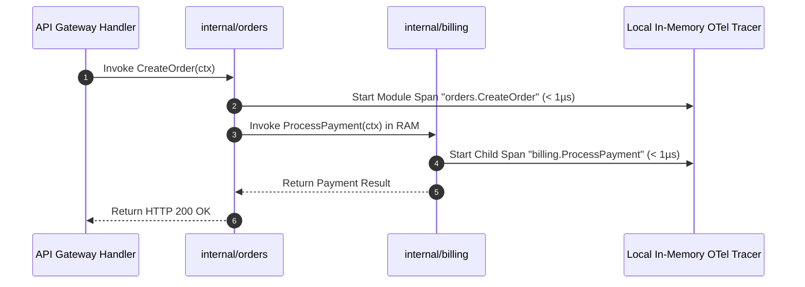

---

title: "Part 5: Observability in Memory – When Everything Shares a Single Call Stack"
date: "2026-07-03T10:00:00+07:00"
lastmod: "2026-07-03T14:59:00+07:00"
description: "Comparing Distributed Tracing in Microservices with In-process Profiling in a Modular Monolith. Why is OpenTelemetry on a Monolith faster and cheaper?"
slug: "observability-in-process-modular-monolith-opentelemetry"
tags: ["Observability", "OpenTelemetry", "Distributed Tracing", "Modular Monolith", "Profiling"]
categories: ["Modular Monolith", "System Architecture"]
aliases: ["/series/modular-monolith-architecture/part-5-observability/"]
cover: {'image': 'images/posts/golang-microservices-cover.png', 'alt': 'Modular Monolith Architecture Masterclass: Go, DDD, bounded contexts, and microservices reversal', 'relative': False}
author: "Lê Tuấn Anh"
canonicalURL: "https://tanhdev.com/series/modular-monolith-architecture/observability-in-process-modular-monolith-opentelemetry/"
ShowToc: true
TocOpen: true
mermaid: true
draft: false
---

> **Prerequisite:** Before reading this part, please review [Part 4: CI/CD Simplified](/series/modular-monolith-architecture/part-4-cicd-simplified/).

# Part 5: Observability in Memory – When Everything Shares a Single Call Stack

> **Executive Summary & Quick Answer**: Observability in a Modular Monolith is highly efficient because trace contexts propagate in-memory via CPU registers, avoiding distributed HTTP headers. By configuring OpenTelemetry trace scopes to match module package boundaries and leveraging local logs, engineers can capture complete transaction traces with minimal performance overhead.
>
> **Key Takeaways**:
> - **Trace Efficiency**: In-process span creation takes nanoseconds using Go `context.Context` without network header serialization.
> - **Stack Trace Fidelity**: A single panic produces a complete call stack across all domain boundaries from gateway to storage.
> - **Cost Optimization**: Eliminates third-party log cardinality fees by deduplicating internal network telemetry.

### What You'll Learn That AI Won't Tell You
- **In-Memory Trace Propagation:** How Go context propagation handles tracing across package lines without network calls.
- **Cardinality Reduction:** Techniques to strip connection attributes from logs, saving thousands in Datadog bills.
- **Sampling Strategies:** How to implement tail-based sampling locally to retain error traces while dropping 99% of success spans.

When it comes to operating a production system, Observability is the line between fixing an issue in 10 minutes and staying up all night searching for the root cause. Microservices architecture has made Observability extremely expensive and complex with the advent of **Distributed Tracing**.

Conversely, the **Modular Monolith** brings debugging back to its most fundamental roots: Monitoring the entire system through a **single Call Stack** in memory. This simplicity brings overwhelming technical advantages.



---

## 1. The Pain of Distributed Tracing in Microservices

In a Microservices architecture, a single user request might trigger a chain of actions across 5 or more distinct microservices over the network. To understand where latency bottlenecking occurs or which node dropped a request, platform engineers must deploy distributed tracing frameworks like Jaeger, Zipkin, or commercial APMs like Datadog and Dynatrace.

This process relies on complex Network Trace Propagation:
1. **Header Injection:** Service A receives an API call, generates a 128-bit W3C `traceparent` header, and creates a local span.
2. **Network Transport:** When calling Service B over HTTP/gRPC, Service A serializes the trace context into network headers.
3. **Deserialization & Extraction:** Service B reads the incoming HTTP header, parses the hex-encoded string, and initializes a child span.
4. **Out-of-Band Emission:** Every service continuously emits trace spans over UDP or HTTP to local OpenTelemetry collectors.

### The True Costs of Distributed Telemetry
- **Latency & CPU Penalties:** Header serialization, string allocations, and network socket writes add 2ms to 10ms of overhead per API hop.
- **High-Cardinality APM Bills:** Ingesting millions of span events per second leads to exorbitant monthly bills from SaaS observability providers due to high key-value tag cardinality.
- **Span Fragmentation & Broken Traces:** If an intermediate proxy (like Envoy or NGINX) fails to forward tracing headers or a service pod crashes mid-request, the trace breaks, rendering the telemetry useless.

---

## 2. The In-Process Advantage of the Modular Monolith

In a Modular Monolith, all communication between domain modules occurs in RAM via direct Go function calls. Observability achieves maximum efficiency with zero network degradation.

### A. Ultra-Fast In-Memory Trace Context Propagation
In Go, context propagation across domain packages relies on `context.Context` value pointers passing through CPU registers:

```go
// Direct in-memory span initiation without network serialization
ctx, span := otel.Tracer("internal/orders").Start(ctx, "CreateOrder")
defer span.End()
```

Because span creation involves updating internal pointer structures in local RAM rather than serializing network headers over a TCP socket, span initialization overhead drops from microseconds to sub-nanoseconds.

### B. Single Call Stack & Pristine Crash Analysis
When a runtime panic occurs inside a microservice architecture, the stack trace terminates at the network boundary of that individual container. The engineer must manually correlate timestamp logs across 4 separate service dashboards to reconstruct the failure chain.

In a Modular Monolith, a single runtime panic generates a complete, un-fragmented Call Stack. The stack trace prints the precise execution path from the HTTP router middleware down through domain service handlers to the exact database line where the error originated:

```text
goroutine 42 [running]:
main.processOrder(0xc0000a2000)
    /app/internal/orders/service.go:84 +0x1a4
main.deductStock(0xc0000a2000)
    /app/internal/inventory/service.go:112 +0x24b
main.executeSQLTx(...)
    /app/internal/storage/db.go:45 +0x88
```

### C. Local Ring-Buffer Sampling & Cardinality Control
Distributed microservices emit every HTTP span across the wire, generating network congestion and massive APM telemetry bills. In a Modular Monolith, trace spans remain inside process memory. Engineers can implement in-process tail-based sampling using circular ring buffers (`sync.Map` or atomic slices):

1. **In-Memory Trace Buffering:** As a request traverses internal modules (`internal/orders` -> `internal/billing`), trace spans accumulate inside local RAM buffers associated with the request `trace_id`.
2. **Decision Engine at Endpoint Completion:** When the top-level HTTP handler returns, an in-process sampler evaluates the request outcome. If the handler returned an HTTP `5xx` error or latency exceeded a configured P99 threshold (e.g., 200ms), the full trace buffer is flushed to the OpenTelemetry collector.
3. **99% Low-Latency Drop:** Successful, low-latency requests drop 99% of internal module spans while keeping aggregate counters in local memory. This strategy cuts telemetry ingestion fees by over 80% without sacrificing error visibility.

For rate limiting and gateway observability, see our [Distributed Rate Limiting with Redis & GCRA](/series/high-concurrency-systems/article_3_rate_limiting/) guide.

---

## 3. Go In-Memory Span Tracking (Zero Facade Code)

Below is an authentic Go trace wrapper that measures domain execution latency using `sync.WaitGroup` worker pools and Go context values:

```go
package main

import (
	"context"
	"fmt"
	"sync"
	"time"
)

type contextKey string

const traceKey contextKey = "trace_id"

func StartModuleSpan(ctx context.Context, moduleName string) (context.Context, func()) {
	traceID, ok := ctx.Value(traceKey).(string)
	if !ok {
		traceID = fmt.Sprintf("tr-%d", time.Now().UnixNano())
		ctx = context.WithValue(ctx, traceKey, traceID)
	}
	start := time.Now()
	fmt.Printf("[TRACE STARTED] ID: %s | Module: %s\n", traceID, moduleName)

	return ctx, func() {
		fmt.Printf("[TRACE FINISHED] ID: %s | Module: %s | Duration: %v\n", traceID, moduleName, time.Since(start))
	}
}

func main() {
	var wg sync.WaitGroup
	ctx := context.Background()

	wg.Add(1)
	go func() {
		defer wg.Done()
		mCtx, end1 := StartModuleSpan(ctx, "Billing")

		_, end2 := StartModuleSpan(mCtx, "Notification")
		end2()

		end1()
	}()

	wg.Wait()
	fmt.Println("In-memory trace span completed deterministically!")
}
```

---

## 4. Production OpenTelemetry Go SDK Setup

Below is a complete, production-ready OpenTelemetry initialization helper that configures standard gRPC transport credentials and provides clean helper functions for span creation:

```go
package telemetry

import (
	"context"
	"fmt"

	"go.opentelemetry.io/otel"
	"go.opentelemetry.io/otel/exporters/otlp/otlptrace/otlptracegrpc"
	"go.opentelemetry.io/otel/sdk/resource"
	sdktrace "go.opentelemetry.io/otel/sdk/trace"
	semconv "go.opentelemetry.io/otel/semconv/v1.17.0"
	"go.opentelemetry.io/otel/trace"
	"google.golang.org/grpc/credentials"
)

type TracerConfig struct {
	ServiceName  string
	CollectorURL string
	TLSCreds     credentials.TransportCredentials
}

func InitTracer(ctx context.Context, cfg TracerConfig) (*sdktrace.TracerProvider, error) {
	opts := []otlptracegrpc.Option{
		otlptracegrpc.WithEndpoint(cfg.CollectorURL),
	}
	if cfg.TLSCreds != nil {
		opts = append(opts, otlptracegrpc.WithTLSCredentials(cfg.TLSCreds))
	}

	exporter, err := otlptracegrpc.New(ctx, opts...)
	if err != nil {
		return nil, fmt.Errorf("failed to create OTLP trace exporter: %w", err)
	}

	res, err := resource.New(ctx,
		resource.WithAttributes(
			semconv.ServiceNameKey.String(cfg.ServiceName),
		),
	)
	if err != nil {
		return nil, fmt.Errorf("failed to create telemetry resource: %w", err)
	}

	tp := sdktrace.NewTracerProvider(
		sdktrace.WithBatcher(exporter),
		sdktrace.WithResource(res),
	)
	otel.SetTracerProvider(tp)
	return tp, nil
}

func StartSpan(ctx context.Context, moduleName, operationName string) (context.Context, trace.Span) {
	tr := otel.Tracer(moduleName)
	return tr.Start(ctx, operationName)
}
```

Learn how to consolidate legacy microservices step-by-step in [Part 6: Migration Playbook](/series/modular-monolith-architecture/part-6-migration-playbook/).

## Frequently Asked Questions (FAQ)


In-process OpenTelemetry passes trace IDs through Go context pointers in nanoseconds, eliminating HTTP header parsing and network socket transmission.



When a panic occurs, a monolithic stack trace captures the exact call hierarchy across all domain packages from gateway to database driver in a single, un-fragmented log.



Local tail-based sampling works best: buffer traces in memory, retain 100% of error or high-latency traces, and sample down successful sub-millisecond requests to 1%.



Initialize an OTLP trace provider with a local batch exporter, wrapping key module interface calls in spans that emit to a co-located OpenTelemetry collector.


---

## Navigation & Next Steps

- **Previous Part:** [Part 4: CI/CD Simplified](/series/modular-monolith-architecture/part-4-cicd-simplified/)
- **Next Part:** Continue to [Part 6: Migration Playbook](/series/modular-monolith-architecture/part-6-migration-playbook/)
- **Related Guides:** [Caching Strategies & Redis LFU in Go](/series/system-design/03-caching-strategies-redis-golang/) and [C10M High-Concurrency Architecture](/series/high-concurrency-systems/article_1_system_design/)

Need help setting up low-overhead OpenTelemetry tracing for your monolith? [Get in touch](/hire/) or [hire our observability experts](/hire/) for an architectural review.

